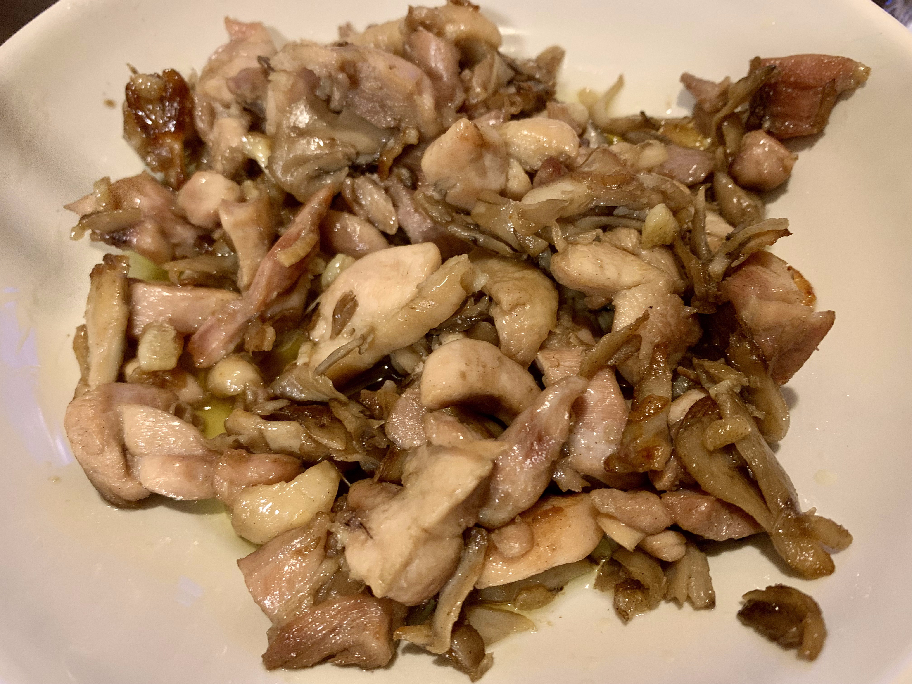

# メタデータ
- title=料理日記：バターガーリックチキン
- description=月に一回くらい料理をすることがあるので、記録を残しておきます。今回はバターガーリックチキンを作りました。
- date=2024年5月6日（月）
- update=2024年5月6日（月）
- math=false
- tag=cooking

## はじめに
月に一回くらい料理をすることがあるので、記録を残しておきます。
今回はバターガーリックチキンを作りました。

https://www.kurashiru.com/recipes/19ead1e7-9f73-4784-9772-9058537f2594

クラシル：バター香るガリバタチキンステーキ

## 料理の記録

クラシルのレシピを参考にして料理しました。
鶏もも肉を食べやすい大きさに切って、ニンニクも4片くらい刻んで、あとはマイタケを入れました。
味付けは塩コショウです。
中火で炒めて、油は一旦クッキングペーパーでふき取って、最後にマーガリン（バターの代わりに）を入れて完成です。
美味しかったです。

完成図

## おわりに
レシピがあれば何とかなりますね。
