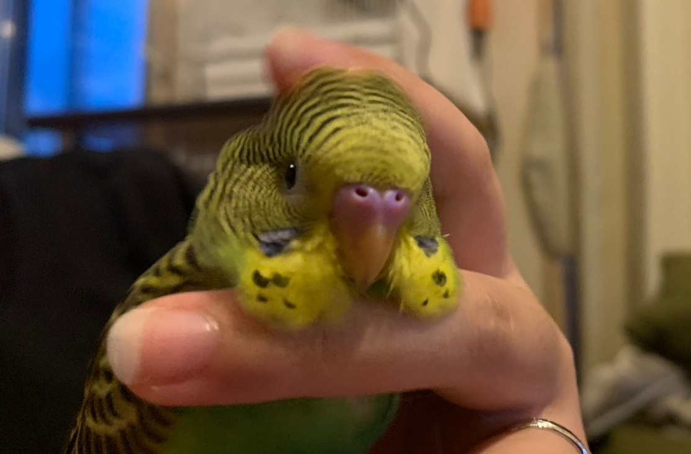
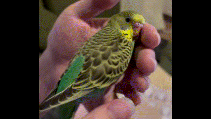
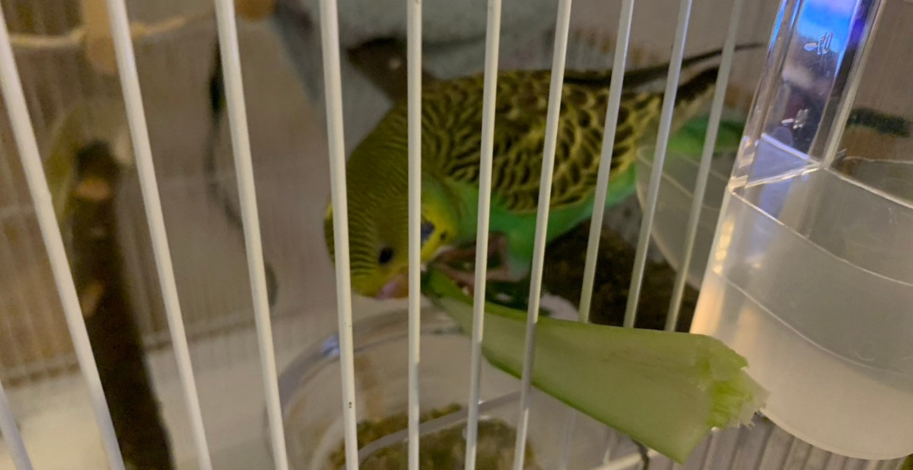
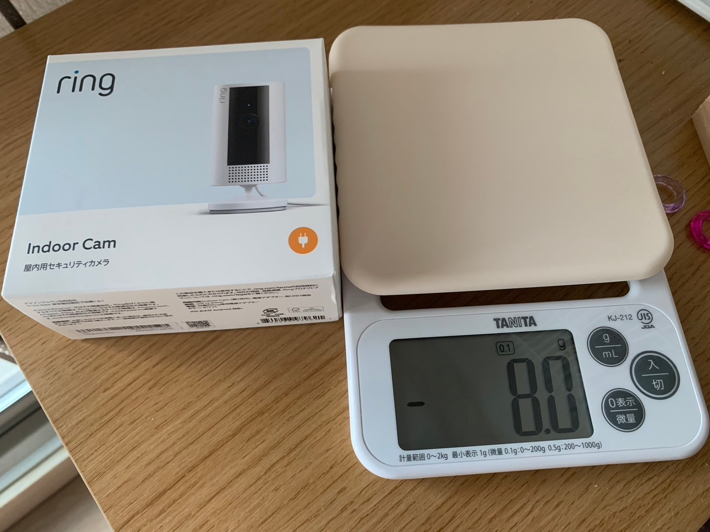
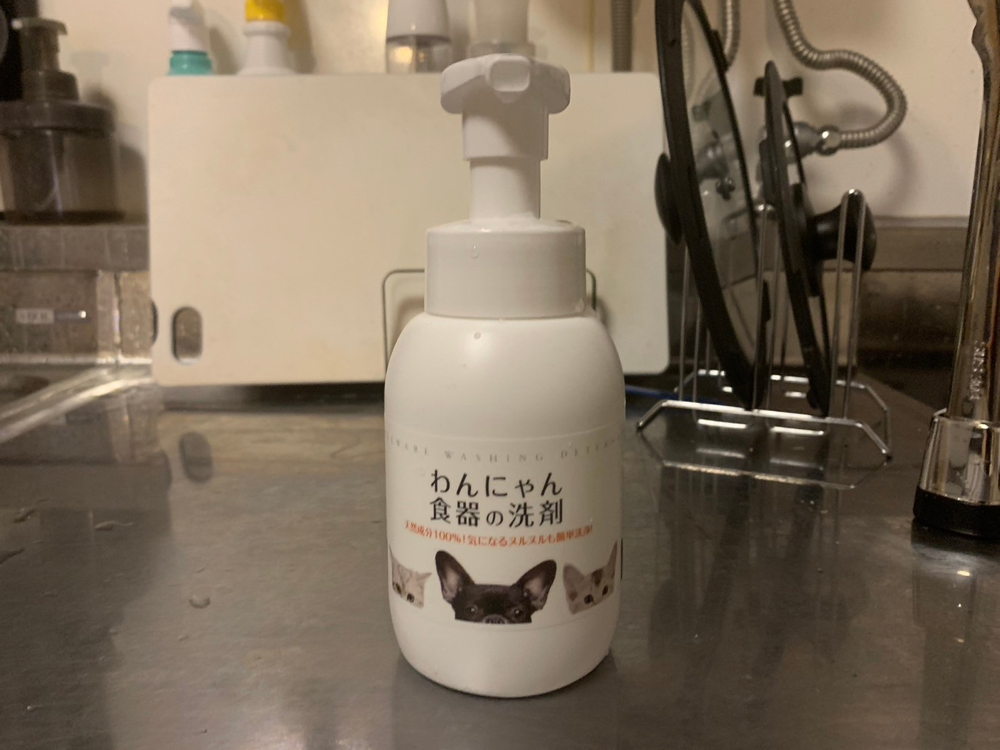
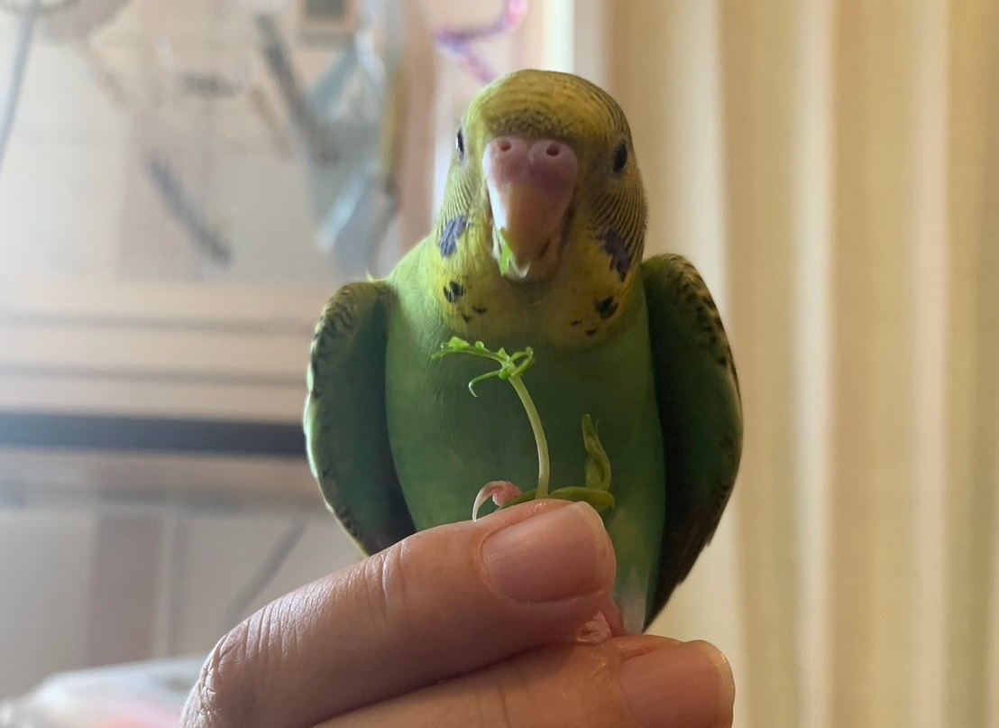
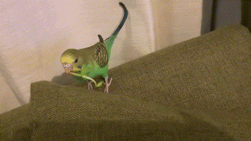
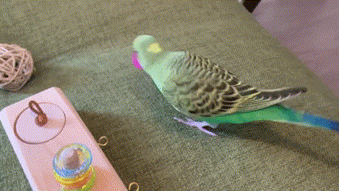

# メタデータ
- title=セキセイインコ「れもん」の日記5 : 3週間経って順調に成長している模様
- description=2024年7月21日（日）までのセキセイインコ「れもん」の様子を記録しておきます。
- date=2024年7月21日（日）
- update=2024年7月21日（日）
- math=false
- tag=lemon

## はじめに
セキセイインコのれもんが我が家にやってきてから3週間が経ちました。
私たち2人と1羽の生活も落ち着いてきて、れもんも元気に過ごしてくれています。
今週は私の友人や両親がれもんに会いに来てくれました。
れもんは怖気づくことなく飛び回ったり、
リラックスして撫でられたりしていたので人見知りとかはなさそうで安心しました。
ということで、今週もれもんの様子を記録しておこうと思います。

れもんのカッコいい立ち姿

## 前回の日記
https://yusukekato.jp/html/2024/0716.html

セキセイインコ「れもん」の日記4 : 鳥フェス千葉2024に行ってきました！

## 注意点
私たちはセキセイインコを初めて飼うため飼育方法に誤りがあるかもしれません。
これからセキセイインコを飼うという方はこのブログの情報を鵜呑みにせず、参考程度に読んでいただけますと幸いです。
いかなる場合でも責任は負えませんのでご了承ください。

## 撫でられるれもん
3週間経って我が家にも慣れてきたのか、れもんはリラックスして撫でられるようになってきました。
とても気持ちよさそうに撫でられてくれるので私たちも嬉しい限りです。
無理やり撫でようとするともちろん怒りますが、基本的にはいつでも撫でさせてくれることもありがたいです。

手のひらに寄り添うれもん↓

手のひらに寄り添うれもん

手に挟まれるれもん↓

挟まれるれもん

掴まれるれもん↓

掴まれるれもん

急に真顔のれもん↓

真顔のれもん

にゅっとするれもん↓

にゅっと前に出るれもん

スリスリしてくれるれもん↓

スリスリするれもん

## チンゲン菜を食べるれもん
ペレットを吐き出し、あわ玉ばっかり食べているれもんですが、
チンゲン菜は気に入ってくれたのかバクバク食べていました。
かなり美味しいらしいです。
野菜の栄養をしっかり摂取していてとても偉いですね。

チンゲン菜を食べるれもん

## 鳥籠の中から睨むれもん
れもんは常に鳥籠から出たがっており、1時間以上放鳥した後でもすぐに鳥籠から出せと訴えてきます。
時には鳥籠の中から睨んできます。
かなり大物になる予感がします。

鳥籠の中から睨むれもん

## 今週購入した物
今週は0.1g単位で計測できる体重計と、
インターネット経由で外出時でもれもんの様子を確認できる監視カメラを購入しました。

購入した体重計とカメラ

体重はこれまで1g単位で計測していましたが、
さすがに0.1g単位で計測できたほうが何かと便利なので新しくタニタの体重計を購入しました。
カメラはAmazonのプライムデーで購入した「Ring」です。
このセキュリティカメラはスマホアプリからカメラ映像をリアルタイムに視聴できます。
また、音声のやり取りもできるので外にいてもれもんの声を聞くことも可能です。

カメラを設置した様子↓

設置したカメラ

また、それに加えて動物用の食器用洗剤も購入しました。
普通の洗剤よりは割高ですがれもんが安全に暮らせるなら良いと思います。

動物用の食器用洗剤

## スマホが大好きなれもん
れもんは人間が使っているスマホが大好きで、よく乗っています。
スマホは乗るのにちょうどよく、画面が動くのもおもしろいようです。
画面を突っついて操作して遊ぶことも少しずつ覚えてきています。

スマホに乗るれもん

## 豆苗を食べるれもん
れもんは野菜も食べるようになってきていて、豆苗もパクパク食べます。

豆苗を食べるれもん↓

豆苗を食べるれもん

手の上でも豆苗を食べるれもん↓

手の上でも豆苗を食べるれもん

豆苗をパクパク食べるれもん↓

豆苗を食べるれもんのGIF

豆苗を運ぶれもん↓

豆苗を運ぶれもん

## れもんの体重
毎日れもんの体重を計測しています。
れもんの体重はそれなりに増減していますが、大きな変化はなさそうです。
下記にれもんの体重のグラフを載せておきます。

れもんの体重のグラフ

## れもんの鳥籠の室温
SwitchBotsの温度計はアプリで温度のグラフを表示できます。
このグラフを見ると温度センサ付きヒーターによって鳥籠内の室温がギザギザしている様子が確認できます。
とても便利なのでおすすめです。

れもんの鳥籠の室温のグラフ

## おもちゃで遊ぶれもん
れもんはおもちゃでも元気に遊べるようになってきました。
一番難しそうな輪投げが一番のお気に入りのようです。
楽しんでくれているようなのでおもちゃを買っておいて良かったです。

輪投げの輪っかを取るれもん↓

輪投げの輪っかを取るれもん

輪投げの輪っかをくわえるれもん↓

輪投げの輪っかをくわえるれもん

輪投げの輪っかを運ぶれもん↓

輪投げの輪っかを運ぶれもん

## おわりに
今週もれもんは元気に過ごしてくれていました。
私たち以外の人間にも怖気づくことなく人見知りしないで遊ぶこともできていて、
れもんはかなり優秀なインコだと思われます。
これからも健やかに成長して大きくなってほしいと切に願っています。
それでは、また。

ロケットスタートのれもん

## 次回の日記
2024年8月1日の日記です。

https://yusukekato.jp/html/2024/0801.html

セキセイインコ「れもん」の日記6 : 新宿ことり博に行ってきました！

