# メタデータ
- title=セキセイインコ「れもん」の日記8 : 病院へ挑戦！
- description=2024年8月10日（土）までのセキセイインコ「れもん」の様子を記録しておきます。
- date=2024年8月10日（土）
- update=2024年8月10日（土）
- math=false
- tag=lemon

## はじめに
仕事も夏季休暇に入ってれもんと過ごせる時間が増えて嬉しい限りです。
みなさまはいかがお過ごしでしょうか。
暑い日々が続きますが、体調にはくれぐれもお気をつけくださいませ。
我が家は初めての動物病院へと行ってきました。
れもんの健康診断と爪切りが目的です。
電車に乗る必要があるくらいには距離がありましたが、何事もなく無事に帰ってこれて安堵しています。
ということで今週は初めて病院に行ったことを中心に、れもんの出来事をまとめていこうと思います。

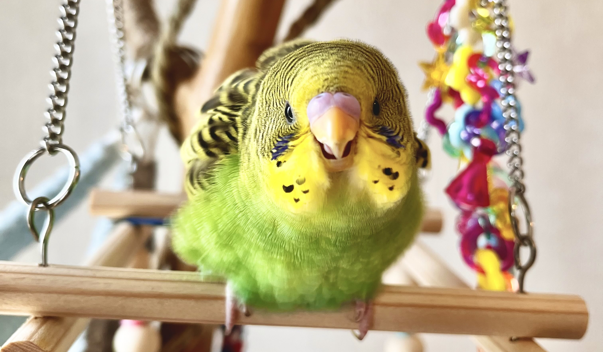

輝く太陽のれもん

## 前回の日記
2024年8月4日の日記です。

https://yusukekato.jp/html/2024/0804.html

セキセイインコ「れもん」の日記7 : 外出用ゲージにチャレンジ！

## 注意点
私たちはセキセイインコを初めて飼うため飼育方法に誤りがあるかもしれません。
これからセキセイインコを飼うという方はこのブログの情報を鵜呑みにせず、参考程度に読んでいただけますと幸いです。
いかなる場合でも責任は負えませんのでご了承ください。

## 初めての動物病院

### 病院へ行こう
れもんも生後二ヶ月を過ぎて、そろそろ定期健診を受けたほうがいいだろうということになりました。
また、爪も伸びてきたので検診と一緒に切ってもらっちゃおうという算段です。
あらかじめ受診の予約はしていたので後は頑張って病院まで向かうだけです。
とはいえ、れもんはほぼ初めての外出なので気張ってもらう必要があります。

### 準備
まずは外出用の鳥籠に入ってもらいます。
あらかじめ慣れてもらったりはしましたが、そこそこ緊張していそうです。
いつも遊んでいるおもちゃを一緒に入れてあげました。
あまりストレスにならなければよいのですが。

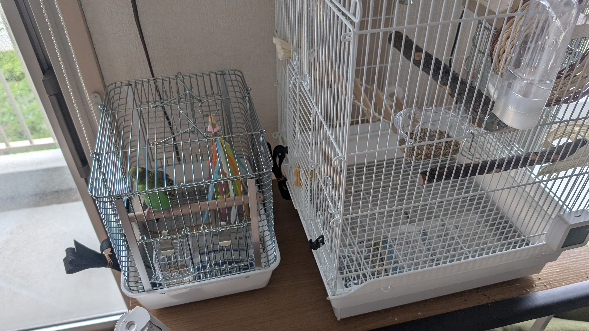

鳥籠に入ったれもん

鳥籠は底板が外れたりしないようにベルトで固定しました。
また、大きな洗濯ネットで鳥籠を囲って万が一にでもれもんが逃げ出さないように注意します。

準備万端の鳥籠

### 病院への道のり
病院までは電車と徒歩で30分から40分ほどかかりました。
真夏なので鳥籠は大きなバッグの中に入れつつ、上からタオルをかけて直射日光を遮りました。
また、保冷剤を持っていって温度調節もできるようにしました。
温度計も忘れずに持っていきました。

外出中のれもん

### 健康診断+爪切り
病院も先生も文句なく素晴らしかったです。
れもんも検査に耐えて頑張ってくれました。
休みということもあって少し待ち時間はありましたが、
受付もスムーズで、診察も的確でした。
こちらの質問にも真摯に答えていただけて嬉しい限りでした。
また、爪切りやそのうの検査も慣れた手つきで素早くやっていただけて、
れもんへの負担も最小限にとどめてもらえてとても助かりました。
病院の先生いわく、れもんは毛並みも良く、優しい心の持ち主らしいです。

### 診察メモ
- 体重は40gを越えなければ大丈夫
- 成鳥になる頃に35gくらいに落ち着くはず
- フンとそのうの検査では現状問題なし
- 綿毛のような毛が抜ける時に体力を使って風邪みたいになりがち
- 風邪のときにくしゃみが出たり、フンが水っぽくなりがち
- 栄養状態は良さそう
- オスっぽい
- ペレットは少しずつ慣れてもらうしかない
- 粉末状のカルシウムをごはんにかけるのも良い
- 定期健診は3～6ヶ月ごとを目安に
- 爪切りだけでも病院に来てよい
- 爪は家でも切れるがれもんから嫌われる可能性がある
- 止まり木は太すぎても細すぎてもよくない
- 足で6割くらい掴める程度の太さがちょうど良い

## 今週のれもん

### 野菜を食べるれもん
少しずつ野菜も食べられるようになってきました。
れもんも色々な味を覚えて大人になっていくんですね。

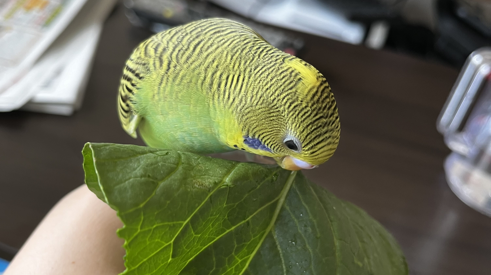

野菜を食べるれもん

野菜を食べて満足気なれもん↓

野菜を食べて満足気なれもん

野菜を食べている様子↓

野菜を食べるれもん

### スマホに乗るれもん
れもんはいまだにスマホが好きでいつも乗っています。

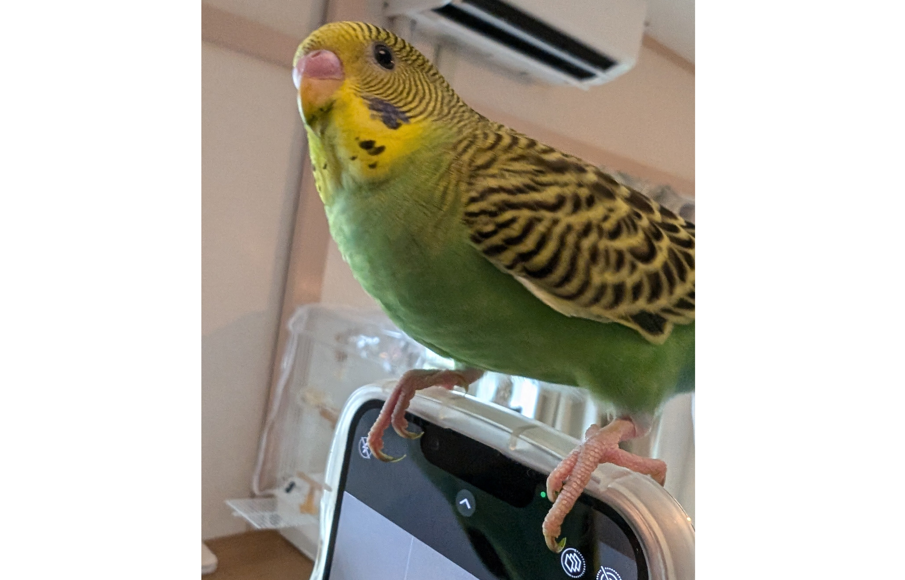

スマホに乗るれもん

### 遊具で遊ぶれもん
放鳥時は慣れ親しんだ遊具でいつも遊んでいます。

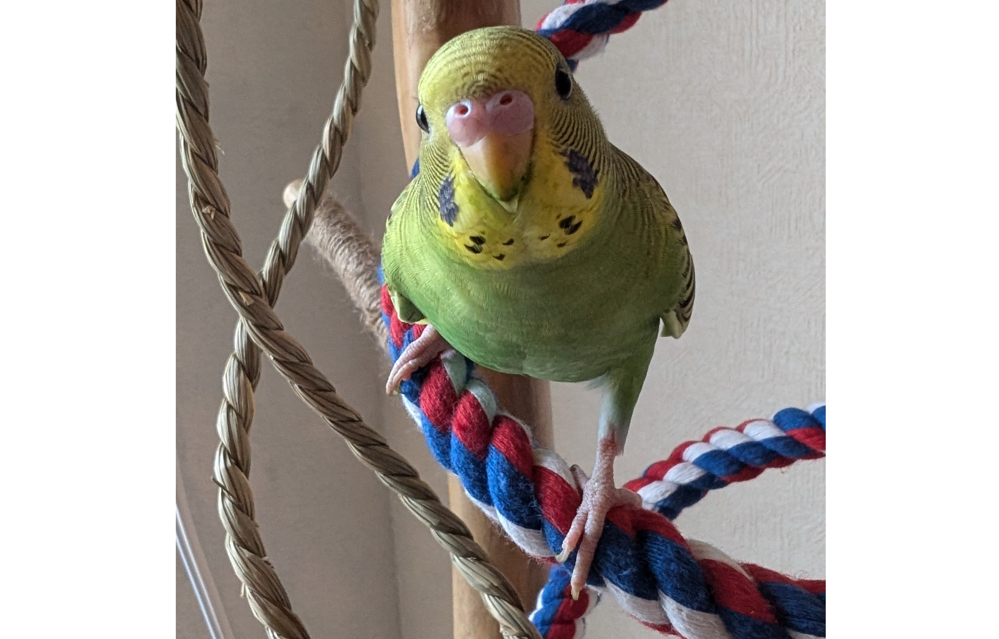

こちらを見るれもん

こちらを見て首をかしげるれもん↓

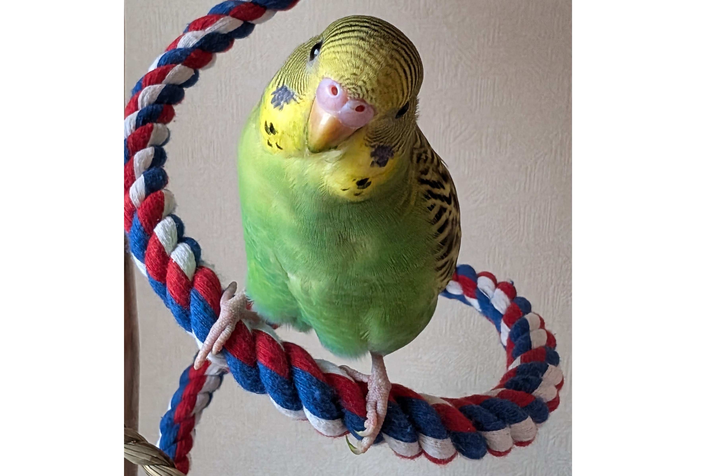

こちらを見て首をかしげるれもん

半目のれもん↓

半目のれもん

あざといれもん↓

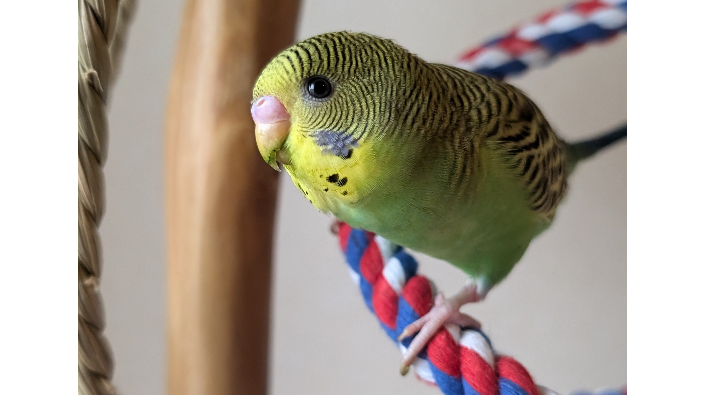

あざといれもん

縄にも掴まるれもん↓

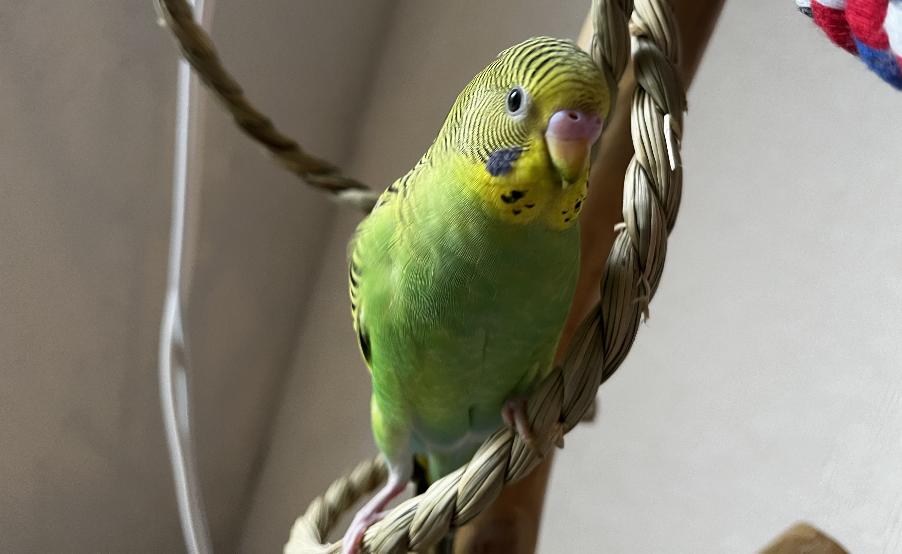

縄にも掴まるれもん

### 肩乗りれもん
肩に乗るのも相変わらず大好きです。

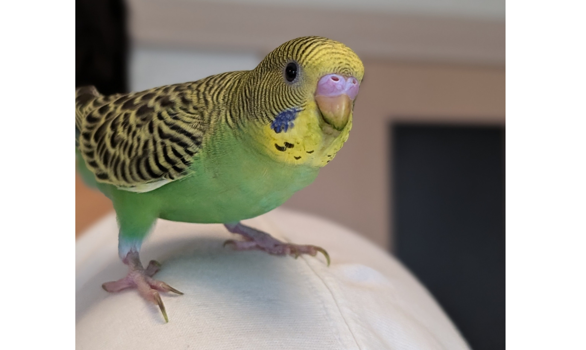

肩乗りれもん

### 手乗りれもん
手にはいつも乗ってきます。

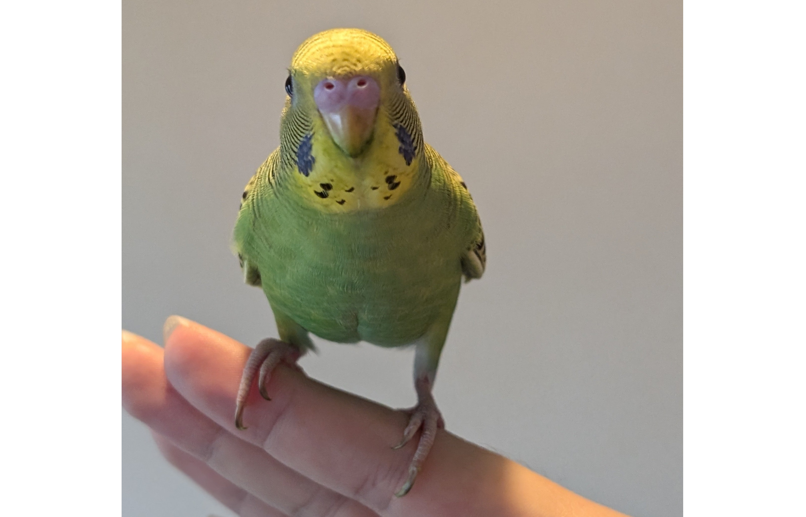

手乗りれもん

### 毛づくろいれもん
れもんは毛づくろいの姿さえ様になっています。

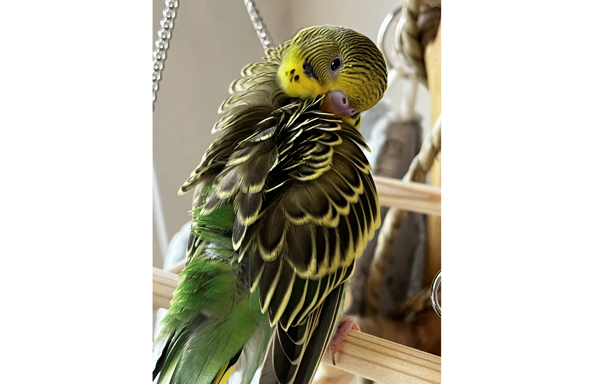

毛づくろいれもん

### 迫真れもん
噛みつく迫真のれもん。

迫真れもん

### サカナクションとれもん
れもんは音楽が好きなようでサカナクションの曲に合わせて歌うこともあります。

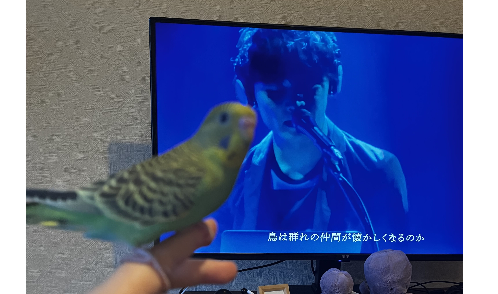

歌うれもん

## おわりに
今週もれもんは元気に過ごしてくれました。
病院も問題なく受診できて良かったです。
れもんにとっては病院は嫌な場所になってしまうかもしれませんが、
れもんの命を救ってくれる場所ではあるので頑張って通ってほしいですね。
れもんがずっと元気で幸せに生きられることを祈っています。
それでは、また。

