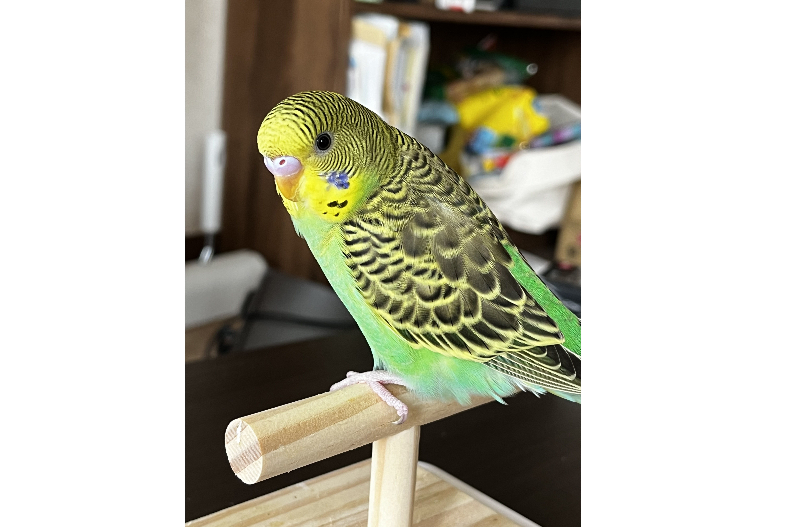
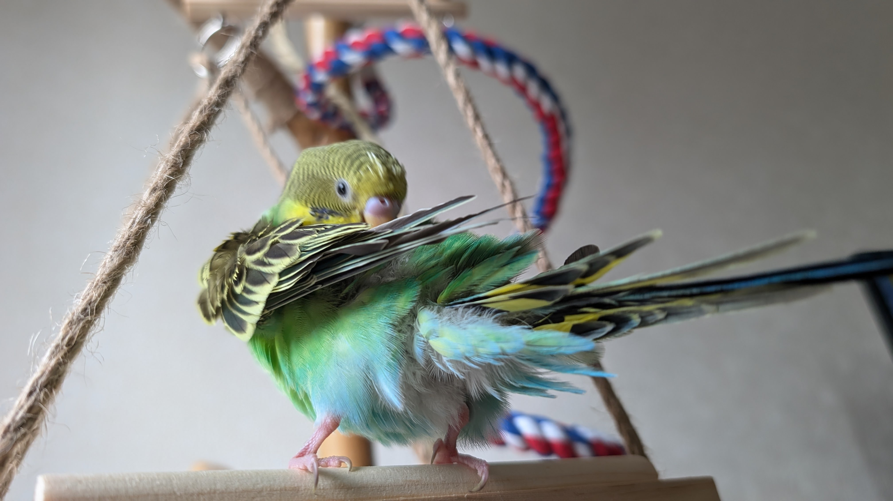

# メタデータ
- title=セキセイインコ「れもん」の日記9 : 換羽期のれもん
- description=2024年8月23日（金）までのセキセイインコ「れもん」の様子を記録しておきます。
- date=2024年8月23日（金）
- update=2024年8月23日（金）
- math=false
- tag=lemon

## はじめに
二週間ぶりのれもんの日記です。
れもんは生後3ヶ月を迎えました。
直近では特に大きなイベントなどはありませんでしたが、
れもんは相変わらずスクスク成長しております。
今回はそんなれもんの成長の記録を残しておこうと思います。
二週間分のれもんをお楽しみいただけましたら幸いでございます。

野菜を食べるれもん

## 前回の日記
2024年8月10日の日記です。

https://yusukekato.jp/html/2024/0810.html

セキセイインコ「れもん」の日記8 : 病院へ挑戦！

## 注意点
私たちはセキセイインコを初めて飼うため飼育方法に誤りがあるかもしれません。
これからセキセイインコを飼うという方はこのブログの情報を鵜呑みにせず、参考程度に読んでいただけますと幸いです。
いかなる場合でも責任は負えませんのでご了承ください。

## 鳥のイベントで購入したグッズ
鳥のイベントで購入させていただいたp-jet やべともこさんのセキセイインコのTシャツが届きました。
トートバッグとあわせてとても素敵な仕上がりとなっていて嬉しい限りです。
デザインがれもんに似ていることもありがたいです。

https://x.com/YbTomoko

p-jet やべともこさんのXアカウント

セキセイインコグッズ

## 床を歩くれもん
れもんは普段飛び回ることが多いのですが、最近は床に降りることも多くなってきていて活動の幅を着々と広げています。
フローリングも楽しんでいただけて何よりでございます。

床を歩くれもん

床で遊ぶれもん↓

床で遊ぶれもん

ティッシュ遊びも健在です。
結局はティッシュが一番楽しいとのこと（れもん談）↓

ティッシュでも遊ぶれもん

## 揺れるれもん
縄に掴まって揺れるのが楽しいらしく結構遊んでいます。
たまに木や遊具にぶつかりそうになることがあってヒヤヒヤしますが、
れもんは特に気にしていないようです。
強い子に育ってくれて嬉しいですね。

揺れるれもん

## 体重を測るれもん
体重計測も手慣れてきました。
一番重い時は40g弱くらいありましたが、
今は38gくらいに落ち着いてきました。
病院の先生いわく、大人になると35g程度に落ち着くらしいです。

体重を測るれもん

体重計に乗る姿も様になっています↓

体重計に乗るれもん

振り向くれもん↓

振り向くれもん

## 逆さまのれもん

逆さまになることも怖くないようです。
我が家に来た頃は止まり木に掴まっても動くことはあまりできなかった気がしますが、
最近は綱渡りをしたり、逆さまになったり、縄や輪っかをよじのぼったり、何でもできるようになってきました。
成長速度が恐ろしいですね。

逆さまのれもん

## お友達が増えたれもん
新しくお友達が増えました。れもんも多少は興味があるようです。
れもんは独りぼっちで寂しいのか、
それとも一人の方が気楽でいいのか、
あまり表情からは気持ちが読めません。
とりあえずお友達とは仲良くしてほしいですね。

お友達が増えたれもん

お友達に乗り上げることもあります↓

お友達に乗り上げるれもん

お友達を追いかけて遊んでいます↓

お友達を追いかけるれもん

## 新しい遊具で遊ぶれもん
れもんは新しい遊具にも興味津々です。

新しい遊具で遊ぶれもん

輪っかの遊具も購入しました↓

輪っかの遊具で遊ぶれもん

もちろんスマホにもまだまだ乗ります↓

スマホに乗るれもん

## 上から覗き込むれもん
上かられもんが覗き込んでいます。

覗き込みれもん

## 換羽期でツクツクが出てきたれもん
毛が生え変わる時には写真のようにツクツク（筆毛）ができるようです。
この筆毛の中で新しい毛が生えてくるとのことで調べてみてびっくりしました。
毛の生え変わりも奥が深いようです。
鳥についてもまだまだ知らないことが多いですね。

筆毛のれもん

## ダイナミックれもん
いい感じに写真が撮れました。

ダイナミック写真1↓

ダイナミック写真1

ダイナミック写真2↓

ダイナミック写真2

ダイナミック写真3↓

ダイナミック写真3

## おわりに
先週と今週もれもんは元気に過ごしてくれました。
まだまだ子供ではありますが、どんどん大人になっていく様は見ていて感慨深いものでもあります。
この調子で怪我や病気に苦しむことなく大きくなっていってほしいですね。
まだまだ生後3ヶ月、されどもう3ヶ月、大人の階段を上るれもんを引き続き応援していこうと思います。
皆様もよろしければぜひ応援してあげてください。
れもんも喜んでくれると思います。
それでは、また。

## 次回の日記
2024年8月31日の日記です。

https://yusukekato.jp/html/2024/0831.html

セキセイインコ「れもん」の日記10 : 生後100日のれもん、ついに喋る
