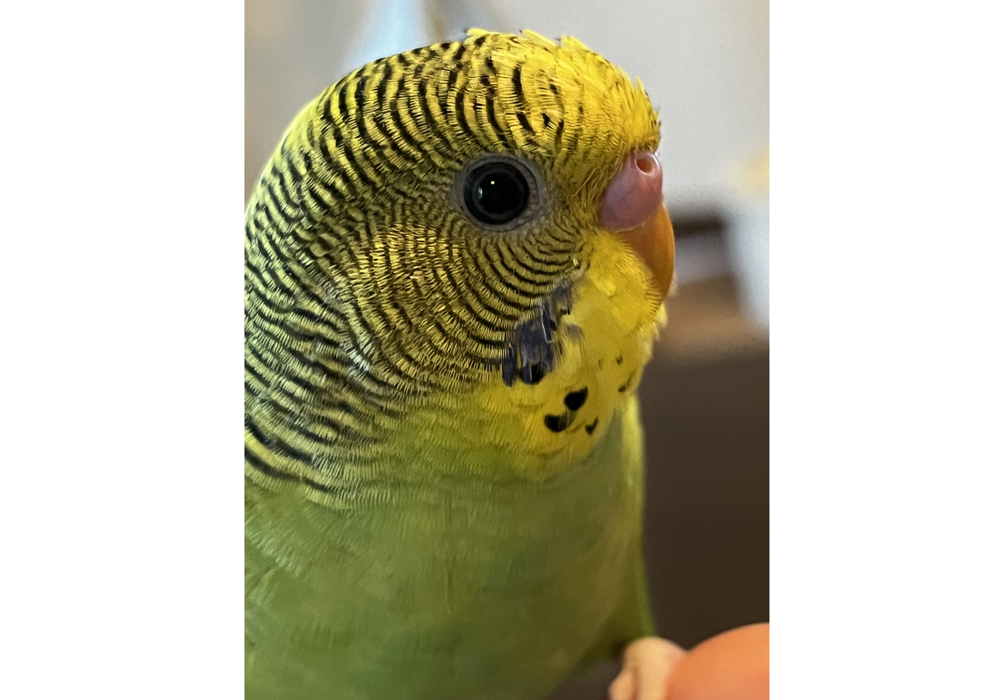
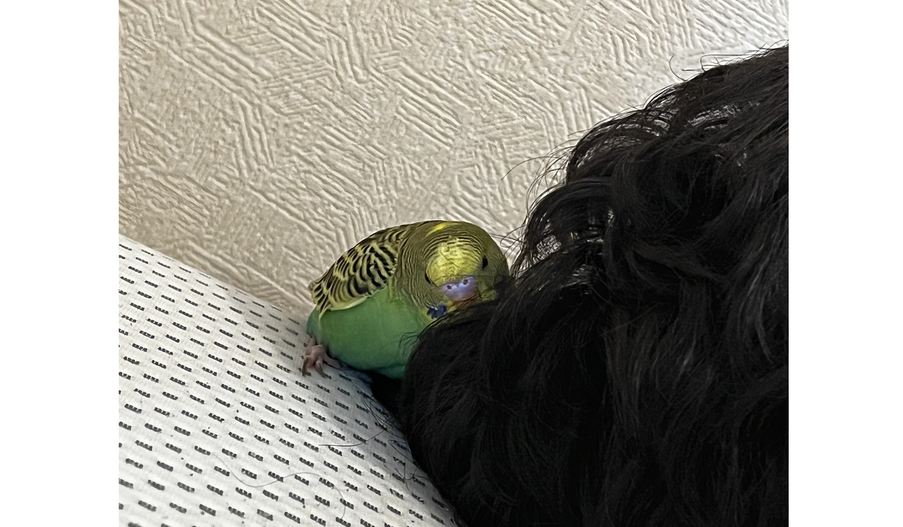
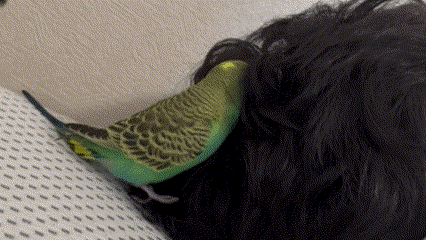
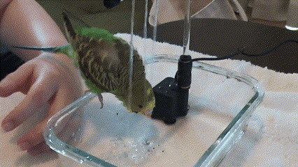
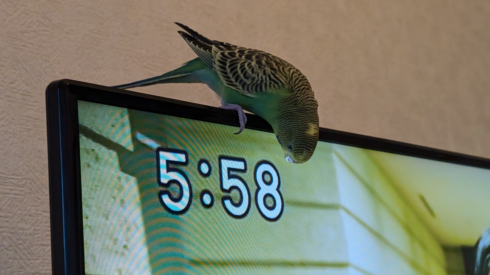
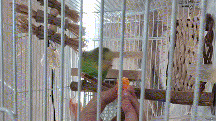
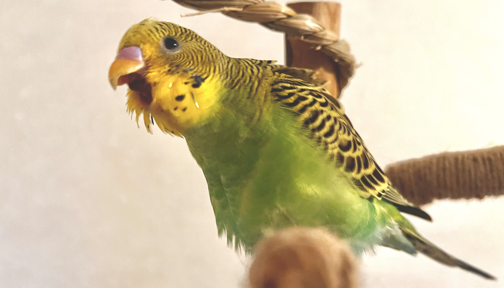
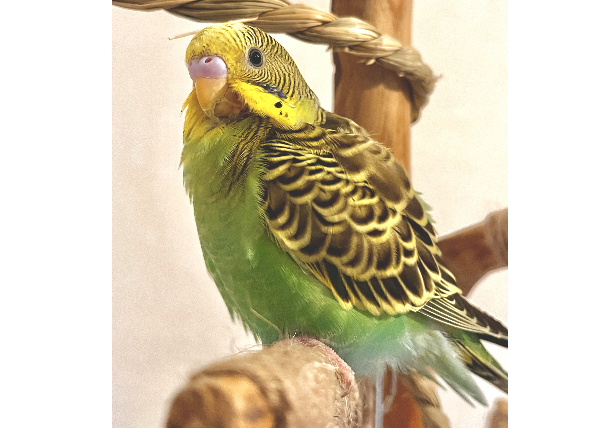

# メタデータ
- title=セキセイインコ「れもん」の日記10 : 生後100日のれもん、ついに喋る
- description=2024年8月31日（土）までのセキセイインコ「れもん」の様子を記録しておきます。
- date=2024年8月31日（土）
- update=2024年8月31日（土）
- math=false
- tag=lemon

## はじめに
セキセイインコのれもんは生後100日を迎えました。
この世に誕生して100日も生きることができてとても偉いと思います。
それだけでももちろん偉いのですが、どうやられもんはそれだけでは飽き足らず喋る力も手に入れたようです。

これまでもずっと何やら、ムニャムニャ、ゴロゴロ、言ってはいましたが、
ついに人間の言葉のような音を発するようになってきました。
成長のとどまるところを知らないれもんに私たちは恐れ慄いております。
ということで今回もれもんの成長の記録を残していこうと思います。

つぶらな瞳のれもん

## 前回の日記
2024年8月23日の日記です。

https://yusukekato.jp/html/2024/0823.html

セキセイインコ「れもん」の日記9 : 換羽期のれもん

## 注意点
私たちはセキセイインコを初めて飼うため飼育方法に誤りがあるかもしれません。
これからセキセイインコを飼うという方はこのブログの情報を鵜呑みにせず、参考程度に読んでいただけますと幸いです。
いかなる場合でも責任は負えませんのでご了承ください。

## 言葉を発したれもん

### 初めての言葉
れもんが「れもんちゃん」っぽい言葉を発した瞬間の撮影に成功しました。
最初に聞いた時は何と言ったのか分かりませんでしたが、
改めて動画で確認してみると、確かに「れもんちゃん」と言っている気がします。
皆様にはどのように聞こえるでしょうか。

※注意：動画を再生すると音が出ます！

<video src="../../images/2024/20240831_1.mp4" controls="true" width="600"></video>

「れもんちゃん」と喋ったれもん

### れもんの発声練習
毎日発声練習も怠っていません。
ずっとムニャムニャゴロゴロ言ってました。

※注意：動画を再生すると音が出ます！

<video src="../../images/2024/20240831_2.mp4" controls="true" width="600"></video>

ムニャムニャゴロゴロ言ってるれもん

### 下品な言葉も覚えてみたれもん
「れもんちゃん」に続いてどのような言葉を発してくれるのかワクワクしていた私たちでしたが、れもんはその期待を裏切ることなく素敵な言葉を覚えてくれたようです。純真で清らかな心の持ち主ならばきっと、世界の深淵に迫るその素敵な言葉を聞き取ることができることでしょう（おそらく「うんちがでた、ブッ！」と言っています……）。

※注意：動画を再生すると音が出ます！

<video src="../../images/2024/20240831_3.mp4" controls="true" width="600"></video>

下品な言葉も覚えてみたれもん

## 人間の髪で遊ぶれもん
最近飼い主が頭にパーマをかけてみたところ、ボリュームのある柔らかい髪の毛を気に入ってくれたのか遊ぶようになってくれました。
これまでも頭に乗ることは日常的によくあることでしたが、
ここまで髪の毛に潜ったり、体を擦り付けたりするのは初めてです。

髪の毛を突っついてみるれもん↓

髪の毛を突っついてみるれもん

髪の毛に体を擦り付けるれもん↓

髪の毛に体を擦り付けるれもん

髪の毛に潜ってみるれもん↓

髪の毛に潜ってみるれもん

## 水浴びシャワーで遊ぶれもん
れもんの生後100日を記念して水浴び用のシャワーを購入しました。
れもんは水浴び自体は好きなようで、
これまでも水道の水（シャワーで出るタイプ）を浴びたりしていました。
まだあまりしっかりは新しいシャワーで水浴びできていませんが、おそらくれもんも喜んでくれていると思います。

購入した水浴びシャワー（IWKさんのかんたんどこでもミニシャワー）↓

購入した水浴びシャワー（IWKさんのかんたんどこでもミニシャワー）

れもんの高速水浴びの様子↓

れもんの高速水浴びの様子

## テレビに夢中なれもん
れもんがテレビの上に止まることはこれまでほとんどなかったのですが、
ついにテレビの存在に気がついたようで、
テレビの上で遊ぶ姿が激写されました。
その日は「これまで以上にテレビ大好きバードになってしまうかも！」とか思っていましたが、
どうやらその翌日以降はもうテレビには乗っていなさそうです。

テレビに乗るれもん↓

テレビに夢中なれもん

## 初めてみかんを食べるれもん
「れもんに果物を食べさせてみよう週間」ということでみかんをあげてみたところ、チビチビ食べて踊っていました。
美味しいと思っているのかどうかは分かりませんが、
とりあえず興味はありそうです。

みかんを食べるれもん↓

みかんを食べるれもん

両親からマスカットをもらったのでれもんにもお裾分けしましたが、こちらは食べませんでした。
食べ物だと認識できていないかもしれません。
マスカットは私たちで美味しくいただきました。感謝です。

マスカットに興味がないれもん↓

マスカットに興味がないれもん

## 咆哮するれもん
その姿はまるで恐竜。

咆哮するれもん↓

咆哮するれもん

そしてスッとするれもん↓

そしてスッとするれもん

## おわりに
8月ももう最終日となりました。
暑い日はまだまだ続きそうですし、台風も怖いですが、
とりあえず今週もれもんは元気よく過ごしてくれました。
これからもどんどん大きく成長して立派なインコとして人生を謳歌してほしいです。
生後100日おめでとう、れもん。
飼い主は風邪をひいて熱が出たりしましたが、
れもんは病気になることなく元気で健やかに生活を送れることを願っています。
それでは、また。

れもんの後ろ姿

## 次回の日記
2024年9月7日の日記です。

https://yusukekato.jp/html/2024/0907.html

インコ仲間「れもん&ぽぽ」の日記11 : ズグロシロハラインコのぽぽ、我が家へ
