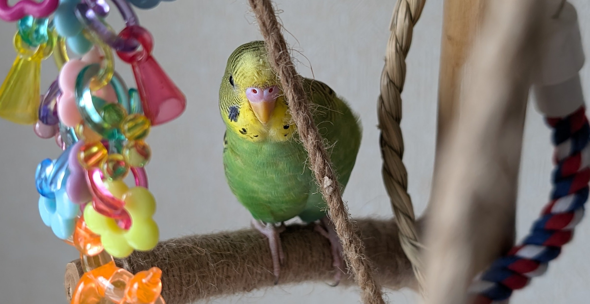
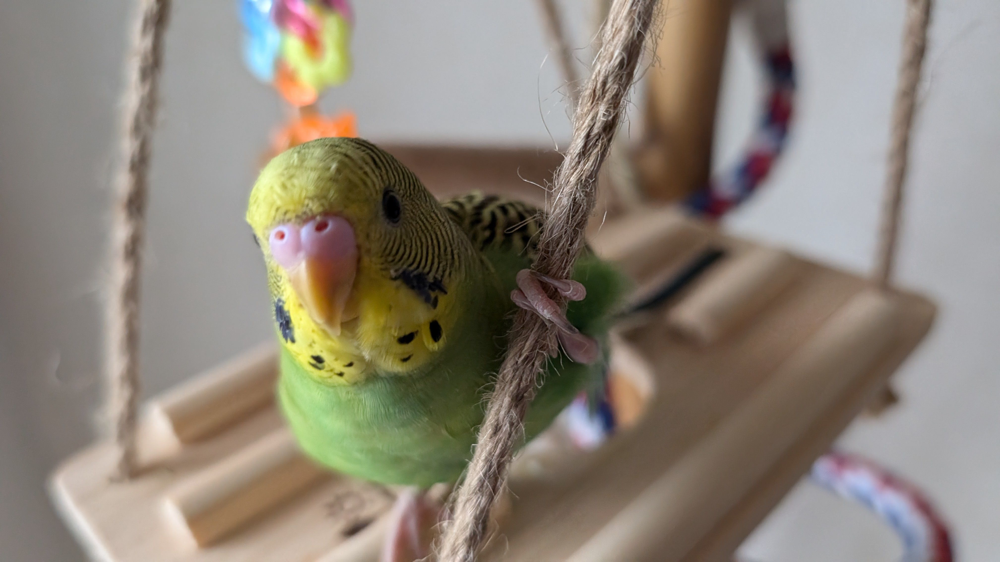
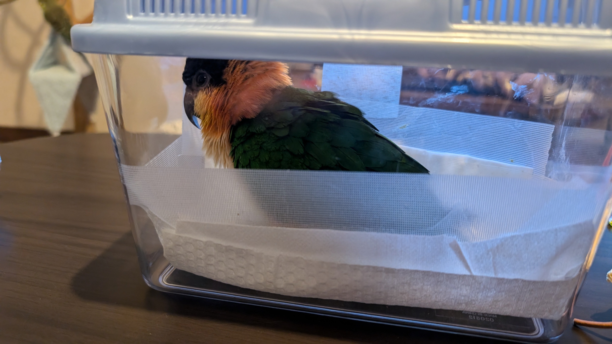
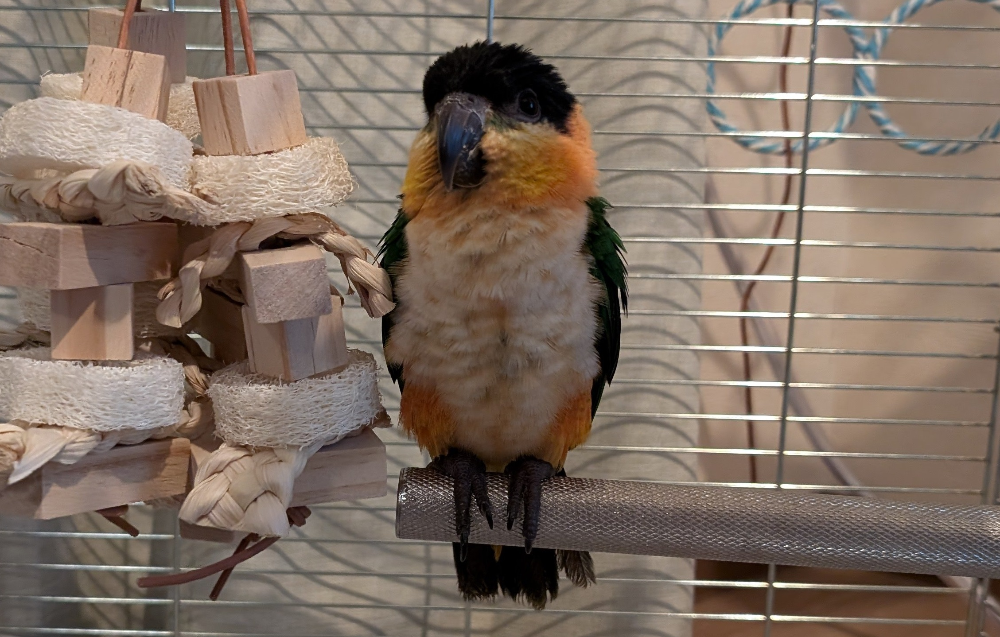
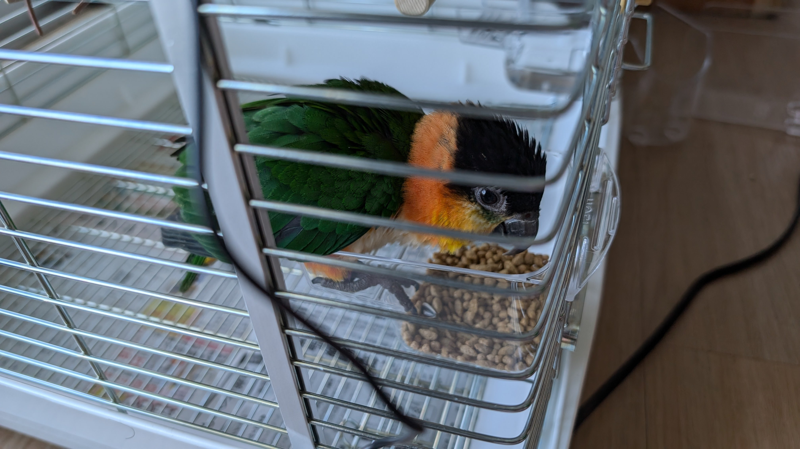
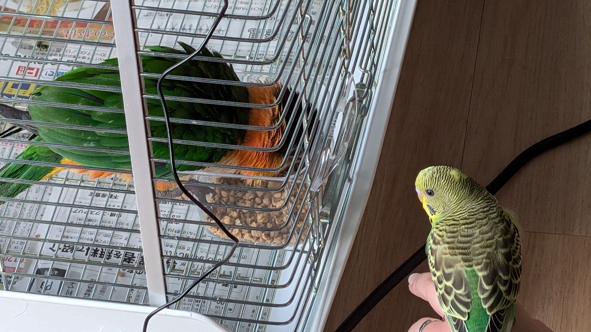
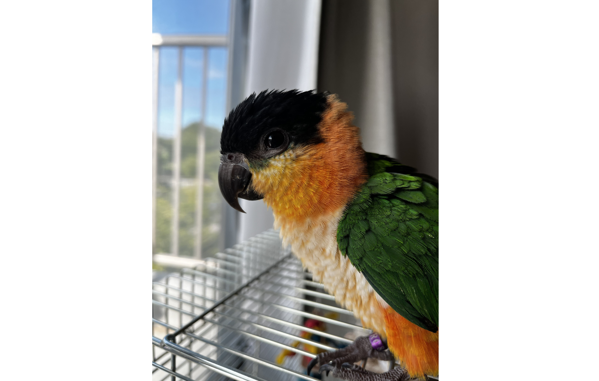
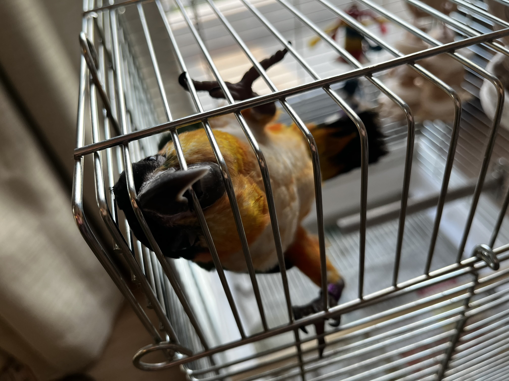
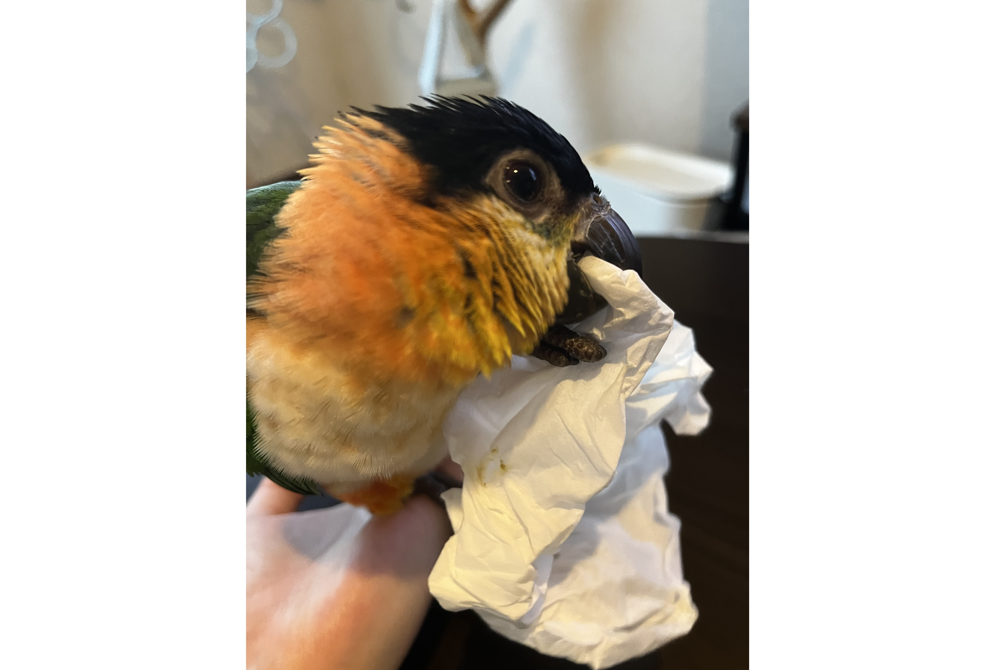

# メタデータ
- title=インコ仲間「れもん&ぽぽ」の日記11 : ズグロシロハラインコのぽぽ、我が家へ
- description=2024年9月7日（土）までのセキセイインコ「れもん」とズグロシロハラインコ「ぽぽ」の様子を記録しておきます。
- date=2024年9月7日（土）
- update=2024年9月7日（土）
- math=false
- tag=lemon

## はじめに
2024年9月4日、我が家に新しい家族であるズグロシロハラインコの「ぽぽ」がやってきました。
ぽぽは2024年の春頃生まれの女の子で、現在は生後約半年です。
セキセイインコの「れもん」はまだ生後3ヶ月ちょっとなので、年齢的にはぽぽのほうが上ですが、
我が家では先に住んでいたほうが先輩なので、れもんが兄or姉（まだ性別不明）ということになります。
ということで、これからの日記ではれもんとぽぽの様子を記録していこうと思いますので、よろしくお願いいたします。

朝から元気なれもん

## 前回の日記
2024年8月31日の日記です。

https://yusukekato.jp/html/2024/0831.html

セキセイインコ「れもん」の日記10 : 生後100日のれもん、ついに喋る

## 注意点
私たちは鳥を初めて飼うため飼育方法に誤りがあるかもしれません。
これからセキセイインコやズグロシロハラインコなどを飼うという方はこのブログの情報を鵜呑みにせず、参考程度に読んでいただけますと幸いです。
いかなる場合でも責任は負えませんのでご了承ください。

## 遠くから睨むれもん
れもんは私たち人間とも元気に戯れてくれますが、
我が家のアスレチック（大きな止まり木と遊具）で一人で遊ぶのも大好きです。
私たちはそんな遊ぶ姿を撮影したいのですが、
れもんはカメラを向けられると遊んでいる途中でも遠くから睨んできます。
そしてすぐにスマホ目掛けて飛んできます。
昔からずっとスマホが大好きというか、
スマホに対する思い入れがとても強いようです。

遠くから睨むれもん

穴から覗いてくれることもあります↓

穴から覗くれもん

ずんぐりむっくりしながら睨むれもん↓

ずんぐりむっくりしながら睨むれもん

## 朝から元気なれもん
機嫌が良い時はスマホの撮影にも応じてくれる場合があります。
特に朝は絶好のシャッターチャンスであり、
れもんから寄って来てくれることもあります。
そういう時はすかさず写真を撮りましょう。
れもんはスマホに乗るのが好きなので、
刹那のシャッターチャンスを逃すと次はありません。

朝から元気なれもん

## 鏡に興味津々なれもん
れもんのゲージの中に鏡のおもちゃを取り付けてあげました。
本物の鏡というわけではなく、鏡っぽいシートみたいなやつのおもちゃです。
れもんはそのおもちゃに写る何者かを突っついて遊んでいます。
まだそれが自分だとは気が付いていない様子です。

鏡に興味津々なれもん

## 野菜が大好きなれもん
野菜の葉を毎日むしゃむしゃ食べています。
とても健康的で良いと思います。
私も見習いたいですね。

野菜を食べるれもん

## 我が家にやってきたぽぽ
2024年9月4日に我が家へお迎えしたズグロシロハラインコの「ぽぽ」です。
生後半年の女の子です。
この日記では初登場となります。
「鳥のいるカフェ千駄木店」さんでぽぽと触れ合わせていただいて、その落ち着いた姿と愛嬌のある表情、理知的な瞳に惹かれてお迎えを決定しました。

我が家にきたばかりのぽぽ

我が家にやってきたぽぽはこんな感じです。
お店でもぽぽは大人しくて人間の手の上で寝ている様子だったのですが、
もしかしたら大人しい性格というよりも環境の変化によって体調が悪くなっているのではないかという疑惑が出てきました。
我が家に来たばかりで緊張やストレスで具合が悪いだけで、数日したら元気になる可能性もありますが、とりあえず不安を払拭するため、早めに病院の予約を取りました。
何事もないことを祈っております。
お店の方に聞いてみたところ、ぽぽは普段から大人しい様子だったとのことで、
単純に大人しい性格の可能性ももちろんあります。

我が家にやってきたぽぽ

ぽぽがいつも食べていたペレットをお店で購入してあげてみたところ、パクパク食べていました。
食欲がないというわけではなさそうです。
ぽぽはペレットを水でふやかして食べる習性があるようで、うんちもかなり水っぽくて、それは少し心配です。

ペレットを食べるれもん

## れもんとぽぽの出会い
いきなり対面させるわけにはいかないので遠くかられもんにぽぽを見せてみました。
れもんは新しく来た新入りに興味があるようです。
ただぽぽのほうは鳥がたくさんいる環境で育ったためか、
れもんの存在をそこまで気にしていないようです。

ぽぽを見つめるれもん

ぽぽの食事を眺めるれもん↓

ぽぽの食事を眺めるれもん

ゲージから外に出たぽぽの様子↓

ゲージから外に出たぽぽ

外の風景を眺めるぽぽ↓

外の風景を眺めるぽぽ

ぽぽに興味津々なれもんと特に気に留めていないぽぽ↓

ぽぽに興味津々なれもんと特に気に留めていないぽぽ

ゲージの中では元気に動き回ることも多いです↓

ゲージの中では元気なぽぽ

## やっぱりティッシュが好きなぽぽ
れもんはどんなおもちゃよりも結局ティッシュが好きだったのでぽぽはどうかなと思っていたのですが、
現状ぽぽはおもちゃで遊ぶことはなく唯一ティッシュだけ気に入ったようです。
やはりインコという生き物はティッシュが大好きなのでしょうか。
謎は深まるばかりです。

ティッシュで遊ぶぽぽ

## れもんとぽぽの対面
少しだけれもんとぽぽを対面させてみました。
ぽぽはかなり大人しくて、
れもんに対してもそこまでアクションを起こしませんでした。
それに対してれもんは新入りのぽぽが気になるらしく、
ぽぽのくちばしを突っついたり毛づくろいをしたりしていました。
ぽぽは若干嫌そうだったので、まだ一緒に過ごすのは早そうです。

れもんとぽぽの対面

## おわりに
今週ズグロシロハラインコの「ぽぽ」が我が家にやってきました。
れもんはぽぽに興味津々の様子ですが、
ぽぽはまだあまり元気ではないようで少し心配しています。
とりあえずは病院にいって問題がないか確認してもらおうと思います。
何事もないことを祈っています。
これからはれもんとぽぽと私たち4人（4匹）で仲良く暮らしていこうと思いますので、
今後とも何卒よろしくお願いいたします。

れもんのおしり

## 次回の日記
2024年9月21日の日記です。

https://yusukekato.jp/html/2024/0921.html

我が家のインコ「れもん&ぽぽ&ぐぐ」の日記12 : ぽぽが亡くなりました、そしてぐぐがやってきました
