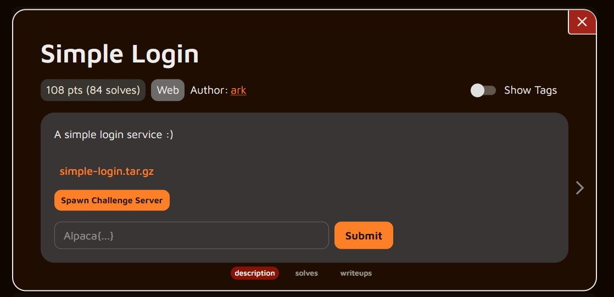
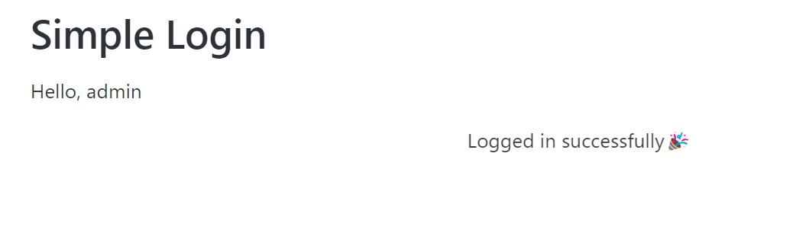

# メタデータ
- title=AlpacaHackで始めるCTF入門4：AlpacaHack Round 2 - Simple Loginに挑戦
- description=個人戦CTFを開催するプラットフォーム「AlpacaHack」を通じてCTFに入門してみようと思います。今回はAlpacaHack Round 2に参加しました。
- date=2024年9月8日（日）
- update=2024年9月8日（日）
- math=false
- tag=alpacahack

## はじめに

### はじめに
リアルタイムではないですが、AlpacaHack Round 2の問題に挑戦してみます。
今回は最初の問題の「Simple Login」を解いてみます。
ジャンルとしては「Web」とのことです。
CTFの問題はまだ数問しか解いたことがないので初心者も初心者ですが、
調べながらやっていこうと思います。

https://alpacahack.com/ctfs/round-2

AlpacaHack Round 2のトップページ

### AlpacaHack
AlpacaHackへのリンクはこちら

https://alpacahack.com/

AlpacaHackのサイトへのリンク

### 私のCTF環境
- Windows 11/WSL2
- Ubuntu 22.04 LTS

## 前回の記事
2024年8月19日の記事です。

https://yusukekato.jp/html/2024/0819.html

AlpacaHackで始めるCTF入門3：初めてのCTFに参加

## Simple Login

### 問題を確認
問題はこんな感じです。
ログイン処理があるウェブサイトが題材のようです。
これまでCTFに参加してこなかったのでCTFの普通というものが分かっていないですが、基本的にはCTFでは問題文的なものはないっぽいです（もちろん問題文があるコンテストもあるとは思います）。
flagを回収するというルールは変わらないので問題文は必要ないのかもしれません。



問題情報

### 問題用サーバにアクセスしてみる

「simple-login.tar.gz」をクリックすると問題のデータをダウンロードできます。
「.tar.gz」は圧縮ファイルなので展開します。
中身を確認するとウェブサイトのトップページとログインページのHTMLファイル、サーバ側の処理のPythonスクリプト、データベースのファイルが存在しています。

次に「Spawn Challenge Server」ボタンをクリックして問題用サーバを起動します。
とりあえずアクセスしてみるとログイン画面が表示されます。
データベースのファイルを読んでみるとユーザ名が`admin`でパスワードが`pass`のユーザデータがあるっぽいので入力してみます
（`hacker`というユーザもいる）。

```
INSERT INTO users (username, password) VALUES ('admin', 'pass');
INSERT INTO users (username, password) VALUES ('hacker', '1337');
```

ログイン画面↓


ログイン画面

ログインできるとこのような表示になります↓



ログインできた

### flagの場所を確認
データベースのファイルを読んでみると「flag」が挿入されている箇所が見つかるので、おそらくデータベースからflagを奪取できれば良いのだろうと分かります。

```
INSERT INTO flag (value) VALUES ('Alpaca{REDACTED}');
```

### flagを奪取する方針
ウェブ上での動作は確認できたのでサーバ側の処理も確認します。
Pythonスクリプトを読んでみるとログインページにPOSTされた時に、
データベースからユーザ情報を照合しているようです。
つまりここでSQLインジェクションを行える可能性があります。

該当箇所は下記の一行です。ここではPOSTされた時の`username`と`password`を使ってデータベースでユーザ情報を照合しているようです。
処理としては`users`というテーブルの中に`username`と`password`が一致するデータがあるかどうか調べています。

```
f"SELECT * FROM users WHERE username = '{username}' AND password = '{password}'"
```

ここの処理で何とかして`flag`テーブルからflagの文字列を奪取したいです。

### POSTしてみる
下記のPythonスクリプトをログインページへPOSTすると`200`が返ってきて、ログイン後のトップページのHTMLも取得できます。

```py
import requests
response = requests.post("http://<Server-Address>/login", data={'username': 'admin', 'password': 'pass'})
print(response.status_code)
print(response.text)
```

### SQLインジェクションの試み
SQLへの操作を行う一文では`username`と`password`をそのまま入れ込んでいるので、ここでいい感じにSQLインジェクションを行いたいです。
ChatGPTにSQLインジェクションについて質問したところ、シングルクウォートを`username`か`password`に入れて予期せぬ操作を行うのが基本らしいです。
ただし、app.pyではシングルクウォートが入らないようにif文で予防しているのでそのままでは無理そうです。とはいえ`\'`でシングルクウォートをエスケープはできそうです。

`username`に`\`を入力するとエラーが出ます↓

```
500
Error: (1064, "You have an error in your SQL syntax; check the manual that corresponds to your MySQL server version for the right syntax to use near ''' at line 1")
```

ChatGPTが`OR 1=1`と書けば条件が常に`true`になると教えてくれたので、POSTするデータを下記のように変更したところ、無事ログインできました。

```
data={'username': '\\', 'password': 'OR 1=1 #'}
```

あとはflagのテーブルからflagの文字列を取得すれば良さそうですが、SQLの知識が無くて現状flagは取得できていません。
SQLインジェクションについては何となく理解できたので、
続きは他の方のwrite upなどを参考にしてみようと思います。

## おわりに
今回はAlpacaHack Round 2の問題「Simple login」に挑戦してみました。
結果的には解けていませんが、SQLインジェクションについて理解が深まったので良かったです。
またAlpacaHackには挑戦していきたいと思います。
おもしろかったです！
それでは、また。

## 次回の記事
2024年10月13日の記事です。

https://yusukekato.jp/html/2024/1013.html

AlpacaHackで始めるCTF入門5：AlpacaHack Round 3 - qrimeに挑戦
