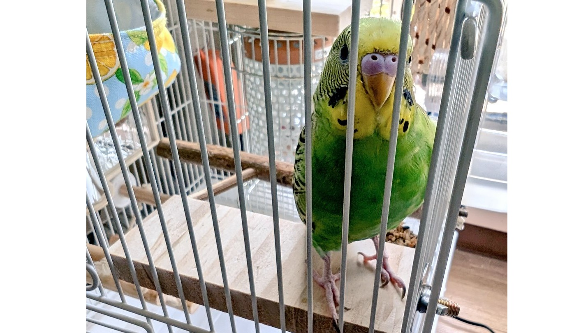
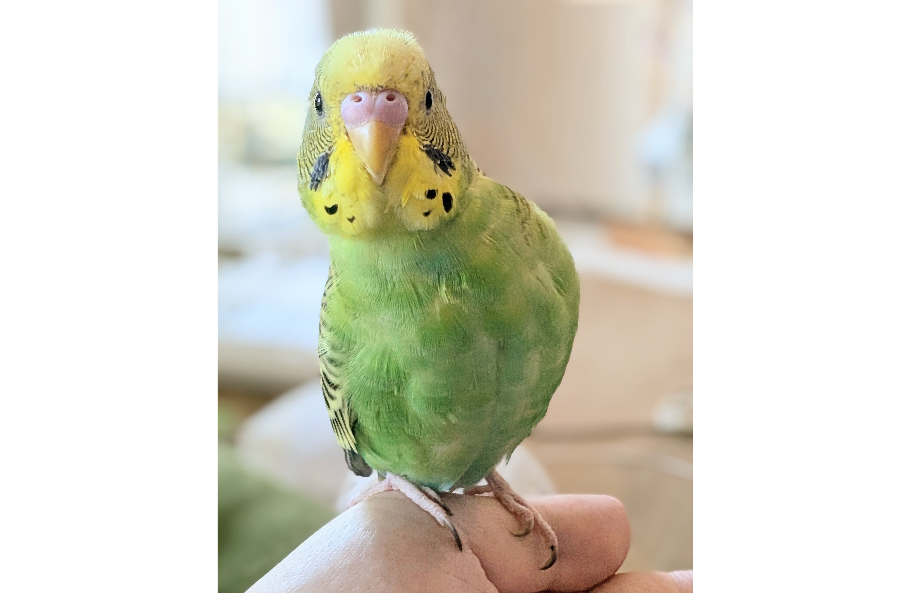
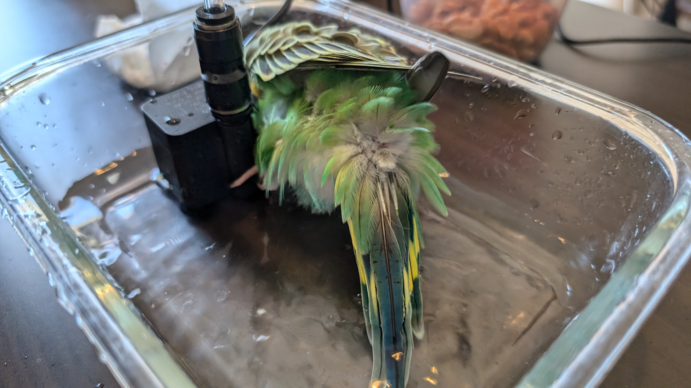
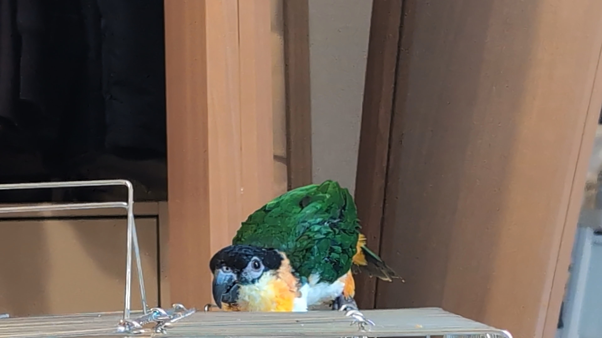
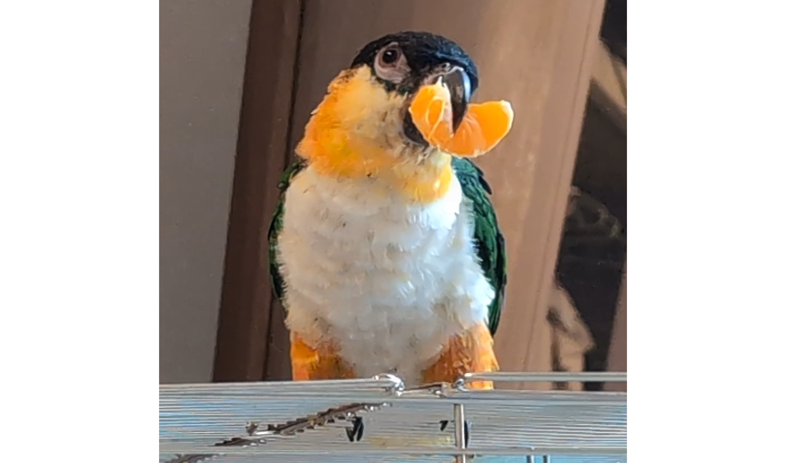
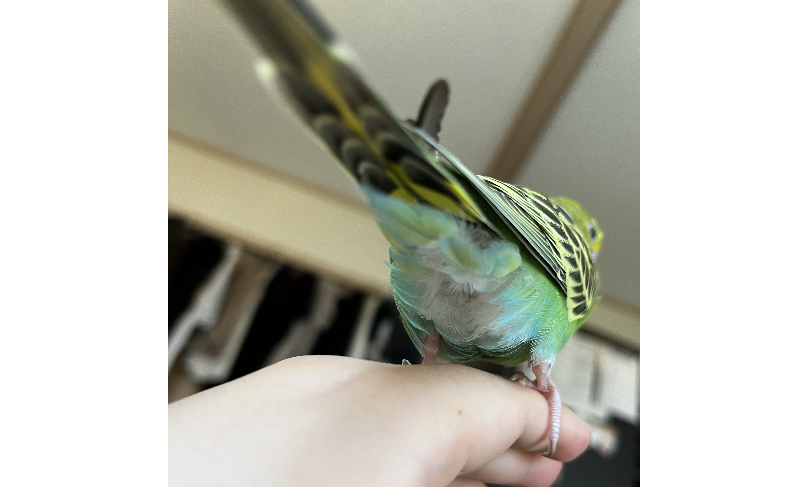

# メタデータ
- title=我が家のインコ「れもん&ぽぽ&ぐぐ」の日記12 : ぽぽが亡くなりました、そしてぐぐがやってきました
- description=2024年9月21日（土）までのセキセイインコ「れもん」とズグロシロハラインコ「ぽぽ」「ぐぐ」の様子を記録しておきます。
- date=2024年9月21日（土）
- update=2024年9月21日（土）
- math=false
- tag=lemon

## はじめに
先日我が家に迎えたばかりのズグロシロハラインコ「ぽぽ」が亡くなりました。
ぽぽはまだ生後半年の子でこれから人生を歩んでいくはずでした。
とても悲しくて、やるせないです。
動物病院で死後の検査をしていただいたところ、
肝臓が弱っていた可能性があるとのことでした。
現在は火葬を済ませてぽぽの骨壺は我が家にあります。
ぽぽが安らかに眠れることを祈っています。
そして虹の橋でぽぽが幸せに暮らしてくれていることを願っています。

ゲージから外に出たぽぽ

## 前回の日記
2024年9月7日の日記です。

https://yusukekato.jp/html/2024/0907.html

インコ仲間「れもん&ぽぽ」の日記11 : ズグロシロハラインコのぽぽ、我が家へ

## 注意点
私たちは鳥を初めて飼うため飼育方法に誤りがあるかもしれません。
これからセキセイインコやズグロシロハラインコなどを飼うという方はこのブログの情報を鵜呑みにせず、参考程度に読んでいただけますと幸いです。
いかなる場合でも責任は負えませんのでご了承ください。

## ぽぽの死後について
かかりつけの動物病院に連絡したところ、
死後の検査も対応しているとのことだったので、
ぽぽの身体を預けてきました。
病院に預けるまでは、
ぽぽの身体はタオルを敷いた箱に保冷剤を入れて、
そのまま冷蔵庫の野菜室に保管しました（箱は念のためビニール袋に入れました）。
病院の先生にうかがったところ、保管方法として正しいとのことでした。

## ぽぽの死後の検査について
鳥の死後の検査には3種類の方法があるそうです。
一つ目は動物病院内での解剖検査で、これは基本的には胸を開いて臓器などに異常がないか目視で確認するそうです。
この検査はだいたい一日で終わります。
二つ目は大学での検査で、身体の一部（おそらくほんの少し）を大学に送って研究の一環として検査を行ってもらいます。
鳥の病気についてはまだまだ分かっていないことが多いそうで、そういった研究のために大学は検体を募集しているようです。
大学での検査ではより細かく調べてもらえますが、結果が返ってくるまでに3週間から1ヶ月程度かかるとのことです。
三つ目は研究機関での検査で、どういった病気を持っていたかを検査してもらえるそうです。
だたし、研究機関での検査は、たとえばAという感染症のための検査、Bという感染症のための検査、Cという感染症のための検査というように、
一つずつ病気を調べていくためしっかり検査を行おうとすると費用が高額になる場合があるそうです。
ぽぽは動物病院内での検査と大学での検査を行いました。
ぽぽの身体は預けた翌日に戻って来て、その次の日に火葬しました。

## ぽぽの火葬
ペットの火葬を行っている葬儀場でぽぽを火葬していただきました。
綺麗な揺り籠と花といつも食べていたペレットに包まれてぽぽは旅立ちました。
ぽぽの骨壺は我が家にあります。
ぽぽが虹の橋で穏やかに暮らせていることを願っています。

## 今週のれもん
セキセイインコのれもんは今日も元気です。
窓にぶつかって肺を少し怪我をして薬生活になって、
一週間ほど放鳥が禁止でストレスも凄そうでしたが、
今は順調に回復しつつ、元気に遊びまわっております。
最近はかなり喋るようにもなりました。

撫でられるれもん↓

撫でられるれもん

しゃちほこれもん↓

しゃちほこれもん

おしとやかれもん↓

おしとやかれもん

平たい板を気に入ったれもん↓

平たい板を気に入ったれもん

おすましれもん↓

おすましれもん

水遊びが下手なれもん↓

水遊びが下手なれもん

## 我が家にやってきたぐぐ
ぽぽが亡くなってしまってもちろん悲しくはありますが、
やはり長生きな鳥を我が家に迎え入れたい気持ちがあり、
ペットショップの方々や病院の方々とも相談して、
今回ぽぽと同じくズグロシロハラインコの「ぐぐ」をお迎えしました。
ぐぐはもう一歳を超えていて病気もなく食欲旺盛な元気のある男の子とです。
ただかなり臆病な性格でペットショップでも鳥籠の隅でジッとしていました。
今は我が家にも慣れてきてくれたのか「ぬべー」としております。

ぬべーとしているぐぐ↓

ぬべーとしているぐぐ

食欲旺盛なぐぐ↓

食欲旺盛なぐぐ

## 外出用リュック2つ
病院など外出する機会がどんどん増えそうなので（あるいは災害時など）、
インコたちの外出用リュックを買いそろえました。
左側の灰色のリュックは小さい鳥籠がそのまま入る大きさです。
右側の黒っぽいリュックは止まり木がついていてそのままインコを入れることができます。
どちらも便利です。

外出用リュック2つ

## おわりに
これからもれもんとぽぽとぐぐと私たち二人で仲良く暮らしていこうと思います。
楽しいことばかりではもちろんありませんが、
とりあえずは元気に穏やかに生活を続けられたらと思います。
そしていつかまたぽぽに再会できたら嬉しいですね。
それでは、また。

今日のおしり↓

今日のおしり
