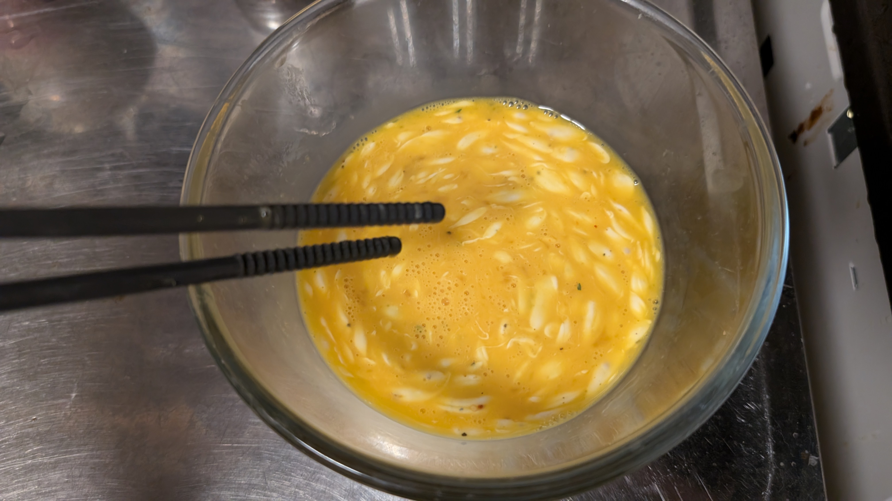
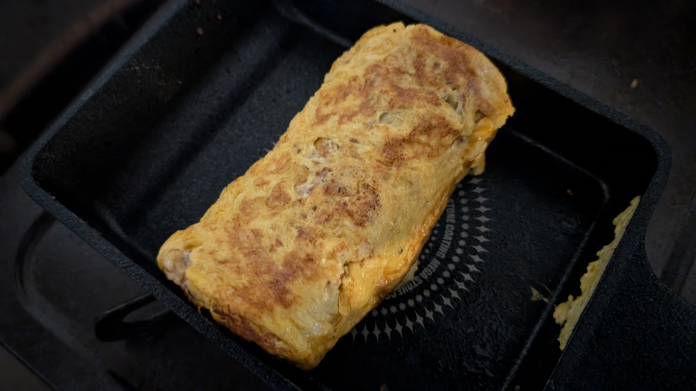

# メタデータ
- title=料理日記：卵焼き
- description=またしても料理をしたので記録を残しておきます。今回は卵焼きです。
- date=2024年9月22日（日）
- update=2024年9月22日（日）
- math=false
- tag=cooking

## はじめに
最近卵焼きを作ったので記録に残しておきます。

卵焼き

## 卵焼きの作成手順
参考↓

https://www.sirogohan.com/recipe/atuyaki/

基本の卵焼き（厚焼き玉子）のレシピ/作り方

### 必要なもの
- 卵
- 油
- 塩
- 砂糖
- マヨネーズ
- ほりにし
- 卵焼きフライパン

### やること
卵、塩、砂糖、マヨネーズ、ほりにしを混ぜる。

混ぜた状態

フライパンに薄く引いて焼いて巻くを2回か3回繰り返す。

焼いた状態

### 完成例
こちらが完成した卵焼きです。

完成した卵焼き

## おわりに
卵焼きを作りました。
今回は焦げなくて良かったです。
美味しかったのでさらに良かったです。
それでは、また。
