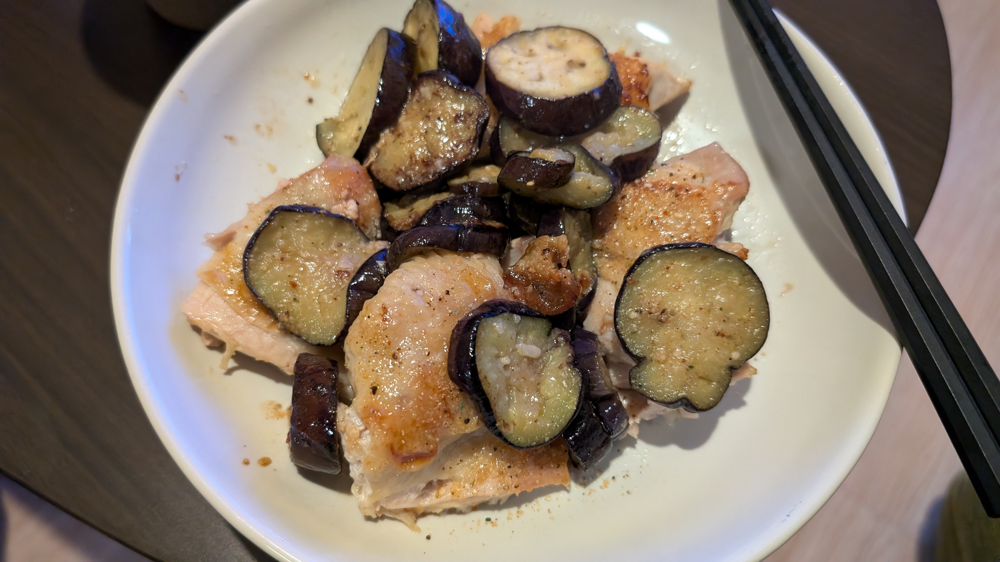
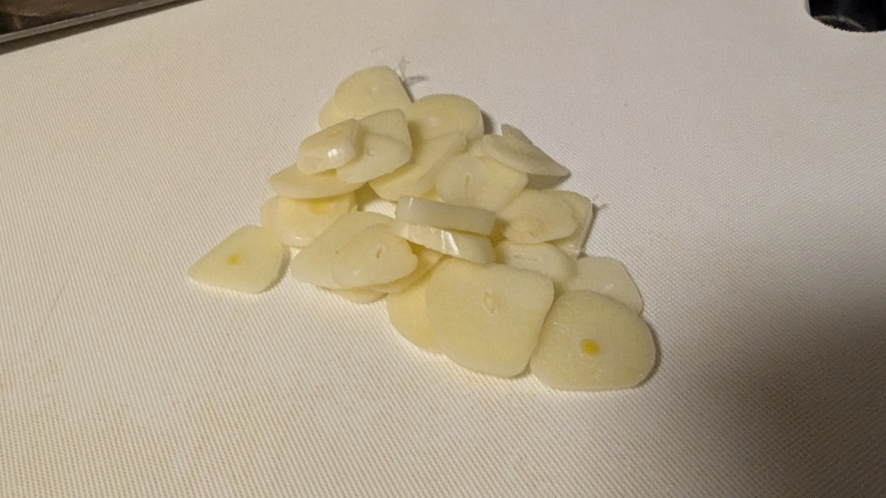
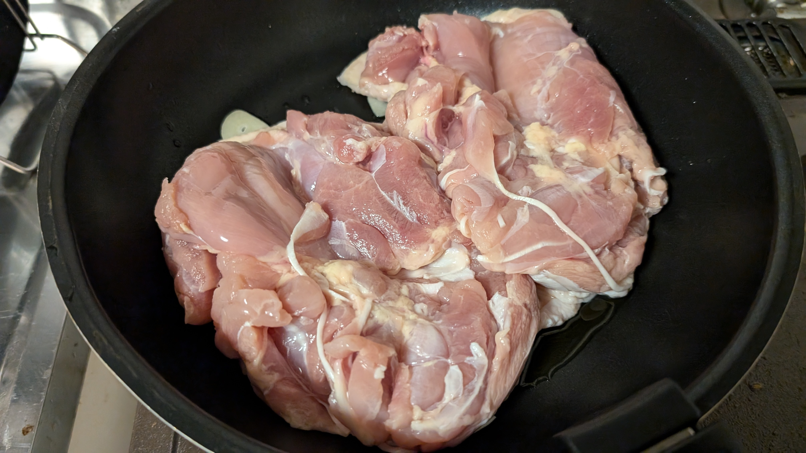
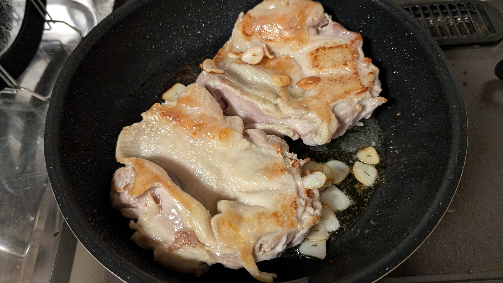
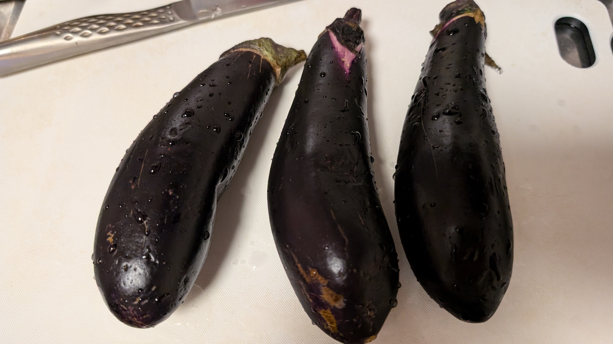

# メタデータ
- title=料理日記：鶏肉とナスのほりにし炒め
- description=またしても料理をしたので記録を残しておきます。今回は鶏肉とナスのほりにし炒めです。
- date=2024年9月23日（月）
- update=2024年9月23日（月）
- math=false
- tag=cooking

## はじめに
最近鶏肉とナスのほりにし炒めを作ったので記録に残しておきます。

鶏肉とナスのほりにし炒め

## 鶏肉の照り焼きの作成手順

### 必要なもの
- 鶏肉2枚
- ナス
- ニンニク3片くらい
- ほりにし
- オリーブオイル
- フライパン

### やること
ニンニクを切る。

切ったニンニク

フライパンにオリーブオイルをひいてニンニクを入れて、その上に皮を下にして鶏肉を置きます。

フライパンの様子

いい感じに焼きます。

焼けた様子

ナスも切って一緒に炒めます。
味付けにほりにしもかけましょう。

ナス

### 完成例
こちらが完成した鶏肉とナスのほりにし炒めです。

鶏肉とナスのほりにし炒め

## おわりに
鶏肉とナスのほりにし炒めを作りました。
美味しかったです。
それでは、また。
