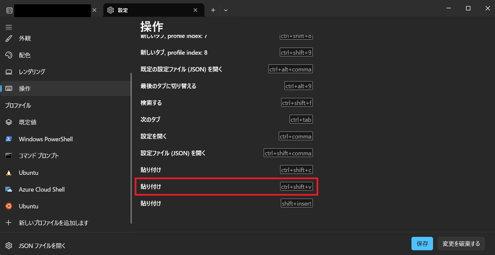

# メタデータ
- title=WSL2上のUbuntuのVimで矩形選択するための設定
- description=WSL2上のUbuntuのVimで矩形選択するための設定方法を紹介します。
- date=2024年9月24日（火）
- update=2024年9月24日（火）
- math=false
- tag=others

## はじめに
WSL2上のUbuntuでVimを使用する際に矩形選択ができなかったので設定を変更しました。

## 環境
- Windows 11
- WSL2/Ubuntu 22.04 LTS

## 矩形選択ができない問題
VimではCtrl+Vで矩形選択できますが、WSL2だとCtrl+Vはデフォルトで「貼り付け」に割り当てられています。
そのため、設定の変更が必要です。

## 設定方法
WSL2の設定を開いて（Ctrl+,で開けます）、
下記画像のように「操作」のタブから「貼り付け」の設定を変更します。
デフォルトだと「Ctrl+V」に設定されているので、
「Ctrl+Shift+V」に変更します。

設定変更

## おわりに
Vimで矩形選択するための設定方法を紹介しました。
