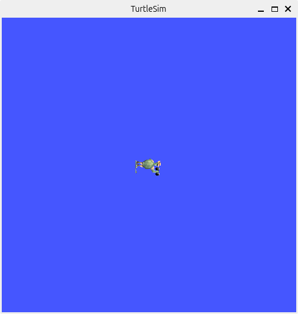
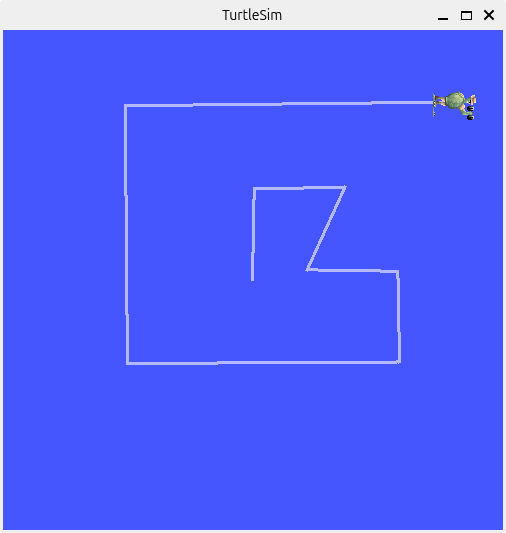

# メタデータ
- title=ROS 2 Jazzy公式チュートリアル01: ROS 2 Jazzyのインストールから動作確認まで
- description=ROS 2 Jazzy公式チュートリアル01としてROS 2 JazzyのインストールからTurtlesimの動作確認まで行います。
- date=2024年9月26日（木）
- update=2024年9月26日（木）
- math=false
- tag=ros2

## はじめに
### はじめに
ROS 2 Jazzyの公式ドキュメントに沿ってインストール作業から`turtlesim`の動作確認まで行います。
開発環境としてUbuntu 24.04 LTSがインストールされたPCを用意しています。
公式ドキュメントは下記のリンクからアクセスできます。

https://docs.ros.org/en/jazzy/Tutorials.html

ROS 2 Jazzy公式チュートリアル

### 過去の記事
ROS 2 Humbleの記事は下記のリンクからアクセスできます。

https://yusukekato.jp/html/2023/0910.html

ROS 2 Humble公式チュートリアル 01: 環境構築からturtlesim まで

### 用意するもの
- Ubuntu 24.04 LTSがインストールされたPC

## ROS 2 Jazzyのインストール
まずはROS 2 Jazzyをインストールします。
有志の方（Tiryohさん）のインストールスクリプトを使うと簡単にインストールできるので、
ありがたく使用させていただきます。

インストールスクリプトをダウンロード（clone）します。

```sh
sudo apt install git
git clone https://github.com/Tiryoh/ros2_setup_scripts_ubuntu.git
```

インストールスクリプトを実行します。

```sh
cd ros2_setup_scripts_ubuntu
./ros2-jazzy-desktop-main.sh 
```

インストールが完了したらsourceコマンドでROS 2 Jazzyの設定を読み込みます。
この設定を読み込む作業はターミナルを起動するたびに必要となります。

```sh
source /opt/ros/jazzy/setup.bash 
```

下記のように`~/.bashrc`に書き込んでおくと毎回sourceコマンドを実行しなくて済むので便利です。

```sh
echo "source /opt/ros/jazzy/setup.bash" >> ~/.bashrc
```

以上でインストールは完了です。

## turtlesimで動作確認
ROS 2 Jazzyの動作確認を行います。
動作確認には定番のパッケージである`turtlesim`を使用します。

`turtlesim`をインストールします（すでにインストール済みの場合もあります）。

```sh
sudo apt update
sudo apt install ros-jazzy-turtlesim
```

次のコマンドで`turtlesim`を起動します。

```sh
ros2 run turtlesim turtlesim_node
```

下図のように青いウインドウに亀が表示されていたら成功です。



turtlesim

次のコマンドでキーボード入力で亀を操作します。

```sh
ros2 run turtlesim turtle_teleop_key
```

矢印キーで亀を移動できます。
Fキーまわりのキー（RやG、V、Dなど）を押すと亀が回転します。



turtlesimを動かした様子

以上でROS 2 Jazzyの動作確認は完了です。

## おわりに
ROS 2 Jazzyのインストールから動作確認まで行いました。
ここまでの作業は、これまでのROS 2とは特に変わりはないと思います。
公式チュートリアルはかなり充実していて素晴らしいので、
今後も余裕があれば公式チュートリアルの続きを進めていこうと思います。
引き続きよろしくお願いいたします。
それでは、また。
