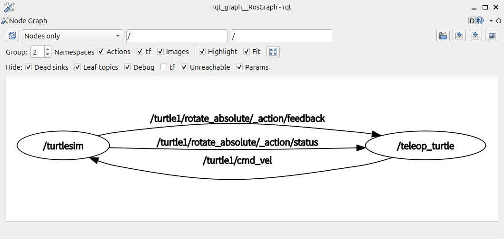

# メタデータ
- title=ROS 2 Jazzy公式チュートリアル02: ROS 2のノードとトピックについて
- description=ROS 2 Jazzy公式チュートリアル02としてROS 2のノードとトピックを紹介します。
- date=2024年9月27日（金）
- update=2024年9月27日（金）
- math=false
- tag=ros2

## はじめに
### はじめに
ROS 2 Jazzyの公式ドキュメントに沿ってチュートリアルを進めています。
今回はROS 2のノードとトピックを紹介します。
公式ドキュメントは下記のリンクからアクセスできます。

https://docs.ros.org/en/jazzy/Tutorials.html

ROS 2 Jazzy公式チュートリアル

### 前回の記事
2024年9月26日の記事です。

https://yusukekato.jp/html/2024/0926.html

ROS 2 Jazzy公式チュートリアル01: ROS 2 Jazzyのインストールから動作確認まで

### 用意するもの
- Ubuntu 24.04 LTSがインストールされたPC
- ROS 2 Jazzyインストール済み

## ROS 2の基本
ROS 2ではノードごとにそれぞれ動作しており、ノード同士がデータを送受信できます。
各ノード間の通信方法はTopic、Service、Actionの3つがあります。
トピックはPublisherからSubscriberへデータを垂れ流しする通信、
サービスとアクションはクライアントがサーバへリクエストを送ると、
サーバがクライアントへ処理結果のデータを返す通信です。

https://docs.ros.org/en/jazzy/Tutorials/Beginner-CLI-Tools/Understanding-ROS2-Nodes/Understanding-ROS2-Nodes.html

公式ドキュメントより画像を引用↓


ノードと通信

## ros2 pkgコマンド
`ros2 pkg`コマンドを使うとパッケージ情報を確認できます。
たとえば下記のようにコマンドを実行すると`turtlesim`パッケージの実行ファイルの一覧が確認できます。

```sh
ros2 pkg executables turtlesim
```

出力内容↓

```sh
turtlesim draw_square
turtlesim mimic
turtlesim turtle_teleop_key
turtlesim turtlesim_node
```

今回は`turtlesim_node`と`turtle_teleop_key`を実行します。

## turtlesimを起動
前回と同様に`turtlesim`を起動します。

１つ目のターミナルで実行↓
```sh
ros2 run turtlesim turtlesim_node
```

キーボード入力で亀を操作するノードも起動します。

２つ目のターミナルで実行↓
```sh
ros2 run turtlesim turtle_teleop_key
```

## ros2 nodeコマンド
`ros2 node`コマンドを使うとノードの情報を確認できます。
たとえば下記のようにコマンドを実行すると起動しているノードの一覧を確認できます。

```sh
ros2 node list
```

ノード一覧↓
```sh
/teleop_turtle
/turtlesim
```

また、`ros2 node info`を実行すると各ノードの詳しい情報が確認できます。

```sh
ros2 node info /turtlesim
```

出力内容↓
```sh
/turtlesim
  Subscribers:
    /parameter_events: rcl_interfaces/msg/ParameterEvent
    /turtle1/cmd_vel: geometry_msgs/msg/Twist
  Publishers:
    /parameter_events: rcl_interfaces/msg/ParameterEvent
    /rosout: rcl_interfaces/msg/Log
    /turtle1/color_sensor: turtlesim/msg/Color
    /turtle1/pose: turtlesim/msg/Pose
  Service Servers:
    /clear: std_srvs/srv/Empty
    /kill: turtlesim/srv/Kill
    /reset: std_srvs/srv/Empty
    /spawn: turtlesim/srv/Spawn
    /turtle1/set_pen: turtlesim/srv/SetPen
    /turtle1/teleport_absolute: turtlesim/srv/TeleportAbsolute
    /turtle1/teleport_relative: turtlesim/srv/TeleportRelative
    /turtlesim/describe_parameters: rcl_interfaces/srv/DescribeParameters
    /turtlesim/get_parameter_types: rcl_interfaces/srv/GetParameterTypes
    /turtlesim/get_parameters: rcl_interfaces/srv/GetParameters
    /turtlesim/get_type_description: type_description_interfaces/srv/GetTypeDescription
    /turtlesim/list_parameters: rcl_interfaces/srv/ListParameters
    /turtlesim/set_parameters: rcl_interfaces/srv/SetParameters
    /turtlesim/set_parameters_atomically: rcl_interfaces/srv/SetParametersAtomically
  Service Clients:

  Action Servers:
    /turtle1/rotate_absolute: turtlesim/action/RotateAbsolute
  Action Clients:
```

この出力内容を見ると`turtlesim`ノードがどのような通信を行っているか確認できます。

## rqt_graph
`RQt`というROS 2の情報を可視化ツールを使用してみます。
今回は`rqt_graph`コマンドを実行します。

```sh
rqt_graph
```

`turtlesim`と`teleop_turtle`間の通信が可視化されます↓



rqt_graph

## ros2 topicコマンド
`ros2 topic`コマンドを使うとトピックの情報を確認できます。
たとえば下記のようにコマンドを実行するとトピックの一覧が確認できます。

```sh
ros2 topic list
```

トピックの一覧↓
```sh
/parameter_events
/rosout
/turtle1/cmd_vel
/turtle1/color_sensor
/turtle1/pose
```

`-t`を付けると各トピックのメッセージの型も確認できます。
```sh
ros2 topic list -t
```

メッセージの型を確認↓
```sh
/parameter_events [rcl_interfaces/msg/ParameterEvent]
/rosout [rcl_interfaces/msg/Log]
/turtle1/cmd_vel [geometry_msgs/msg/Twist]
/turtle1/color_sensor [turtlesim/msg/Color]
/turtle1/pose [turtlesim/msg/Pose]
```

`ros2 topic echo`を使うと各トピックで配信（Publish）されているデータを確認できます。
```sh
ros2 topic echo /turtle1/cmd_vel
```

亀をキーボード入力で前進させた時の`/cmd_vel`トピックは下記の通りです。
ちなみに`cmd_vel`は速度指令のことで、`linear`が並進速度、
`angular`が角速度です。
下記の速度指令はX軸方向に2.0[m/s]で進むことを表しています。
```sh
linear:
  x: 2.0
  y: 0.0
  z: 0.0
angular:
  x: 0.0
  y: 0.0
  z: 0.0
```

`ros2 topic pub`を使うとコマンドからトピックを配信できます。
下記のコマンドを実行するとキーボード入力をしなくても亀を動かすことができます。
ちなみに`-once`を付けると一度だけ配信されます。
つまり`-once`を削除すると速度指令トピックを配信し続けることになります。
```sh
ros2 topic pub --once /turtle1/cmd_vel geometry_msgs/msg/Twist "{linear: {x: 2.0, y: 0.0, z: 0.0}, angular: {x: 0.0, y: 0.0, z: 1.8}}"
```

## おわりに
ROS 2の公式チュートリアルを進めました。
今回はROS 2のノードとトピック通信について簡単に紹介しました。
今後も少しずつ進めていこうと思います。
それでは、また。
