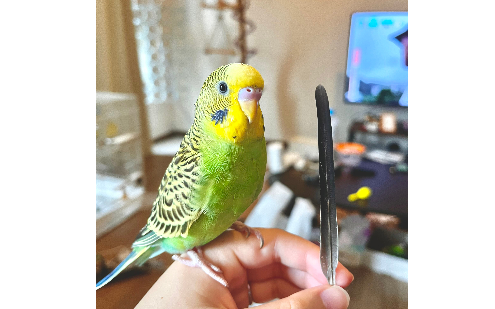
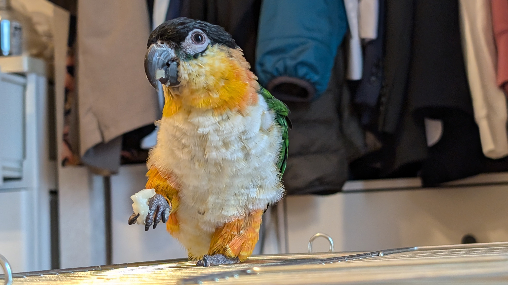
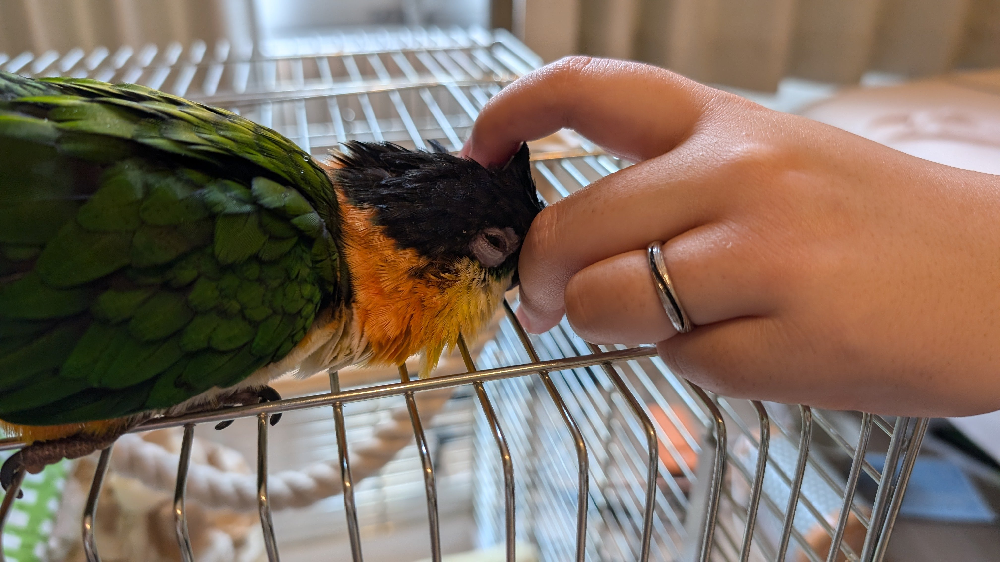
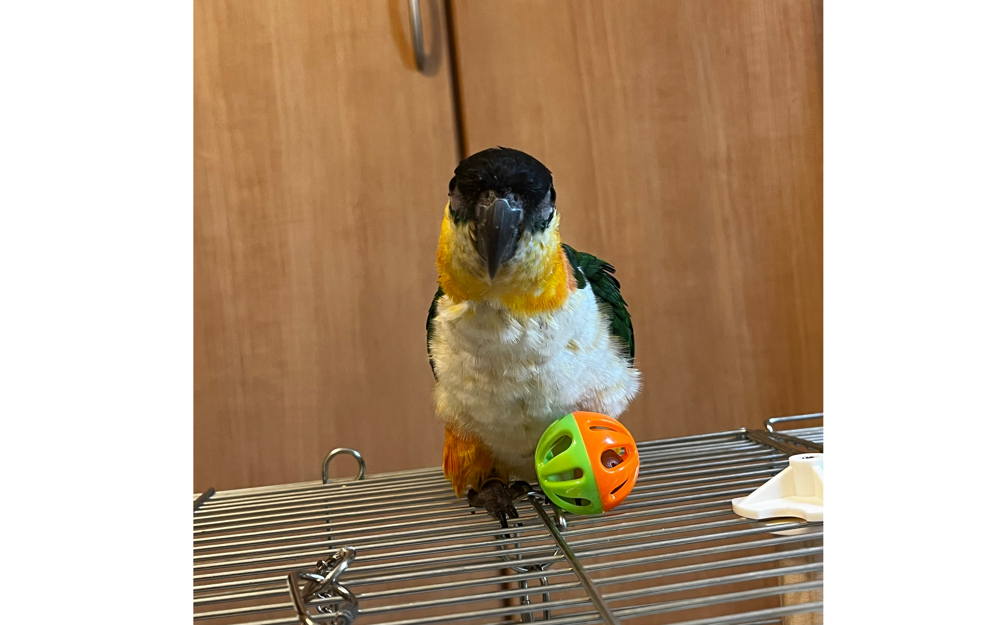

# メタデータ
- title=我が家のインコ「れもん&ぽぽ&ぐぐ」の日記13 : 生後4ヶ月を迎えたれもんと我が家に慣れてきたぐぐ
- description=2024年9月28日（土）までのセキセイインコ「れもん」とズグロシロハラインコ「ぽぽ」「ぐぐ」の様子を記録しておきます。
- date=2024年9月28日（土）
- update=2024年9月28日（土）
- math=false
- tag=lemon

## はじめに
今週もれもんとぐぐは元気に育っています。
れもんは怪我をしたばかりなので放鳥も少しずつですが、
元気に飛び回っているので大丈夫そうです。
ただ反抗期に入ったのか噛んだり一人で過ごしたがったりしています。
ぐぐも少しずつ我が家に慣れてきてよく鳴くようになりました。
臆病な性格であまり部屋を歩き回るみたいなことはまだできていませんが、
ケージの中やケージの上では活発に動いています。

## 前回の日記
2024年9月21日の日記です。

https://yusukekato.jp/html/2024/0921.html

我が家のインコ「れもん&ぽぽ&ぐぐ」の日記12 : ぽぽが亡くなりました、そしてぐぐがやってきました

## 注意点
私たちは鳥を初めて飼うため飼育方法に誤りがあるかもしれません。
これからセキセイインコやズグロシロハラインコなどを飼うという方はこのブログの情報を鵜呑みにせず、参考程度に読んでいただけますと幸いです。
いかなる場合でも責任は負えませんのでご了承ください。

## 今週のれもん
れもんも元気そうに過ごしています。
反抗期で人間の手を噛むことも増えてきました。
ストレスや睡眠不足などで反抗的になっているわけではないとは思っていますが少し心配です。

大きな尾羽が抜けたれもん↓

大きな尾羽が抜けたれもん

ベルが好きすぎて頭を突っ込むれもん↓

ベルに頭を突っ込むれもん

## 今週のぐぐ
ぐぐはりんごを美味しそうに食べます。
ペットショップでもりんごを食べていたそうで、昔から好物のようです。

りんごを食べるぐぐ

隙間から覗くぐぐ↓

隙間から覗くぐぐ

私たち人間にも慣れてきて撫でさせてくれるようにもなりました。
換羽期で筆毛がたくさんあって、それを取ってあげると気持ちよさそうにしています。
あまり筆毛を触ると良くない場合もあるとのことなので慎重に触っています。

撫でられるぐぐ

ボールのおもちゃで遊ぶぐぐ↓

ボールのおもちゃで遊ぶぐぐ

## おわりに
今週もれもんとぐぐは元気に過ごしています。
この調子で元気に幸せに一緒に暮らしていけたら嬉しいですね。
今回の日記は少し短いですが、今後も写真はたくさん残していけたらと思います。
ぽぽも向こうで楽しく遊んでいることを祈っています。
それでは、また。

むっくりれもん
