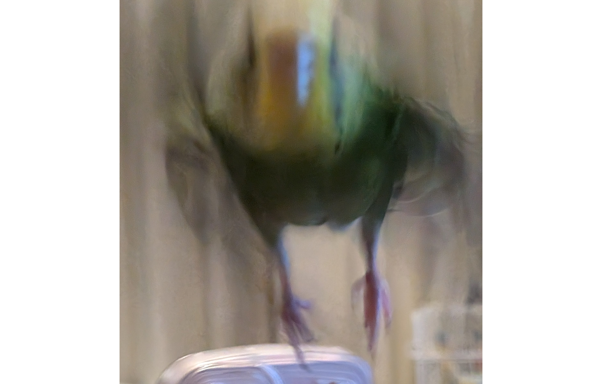
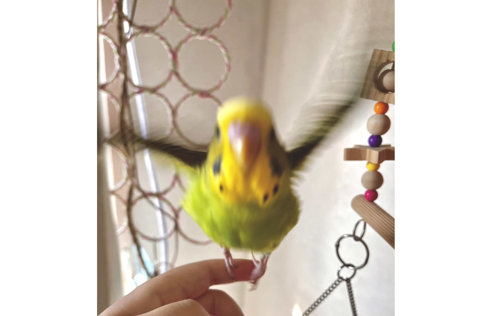
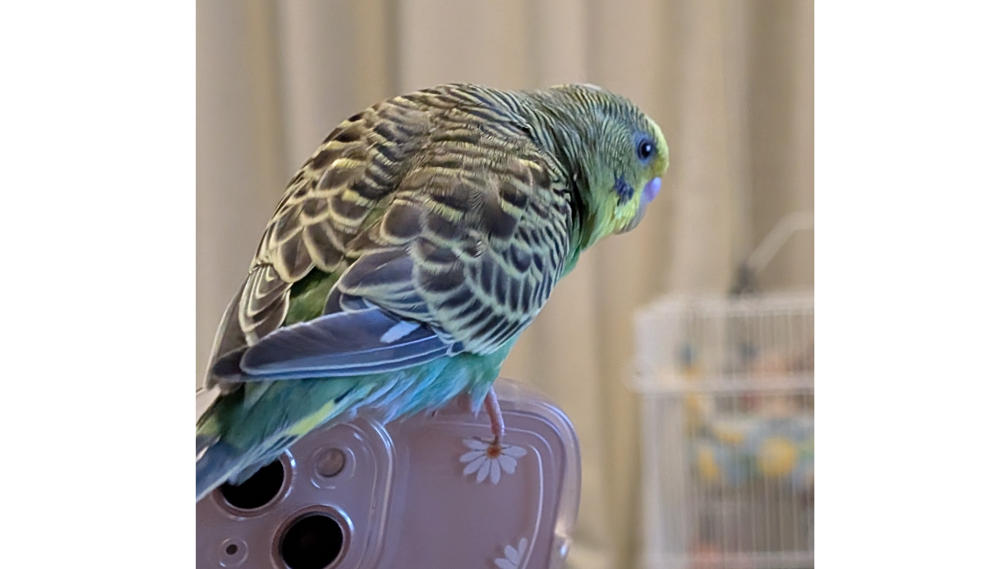
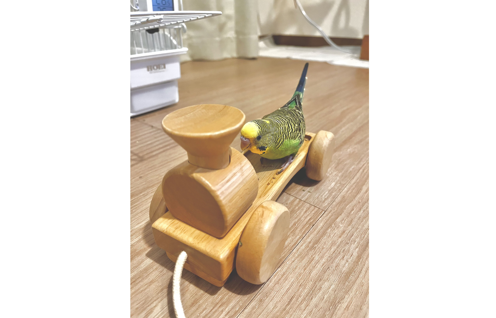
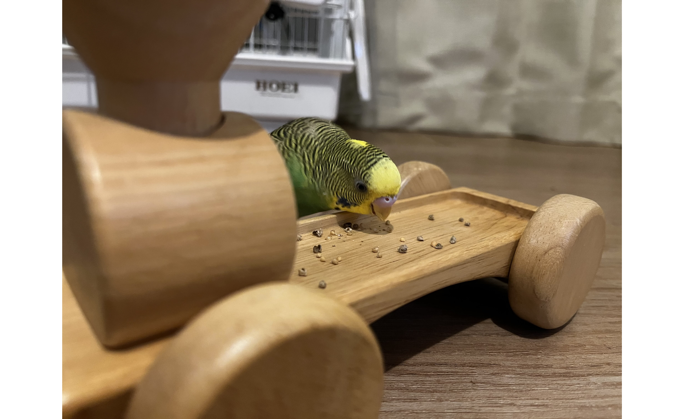
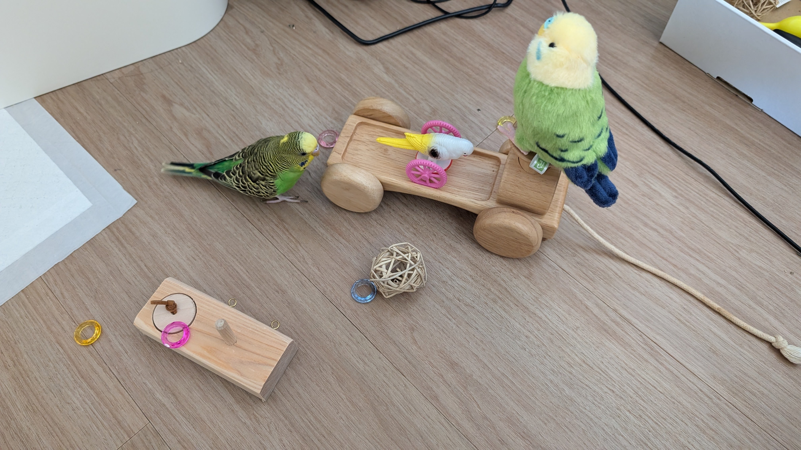
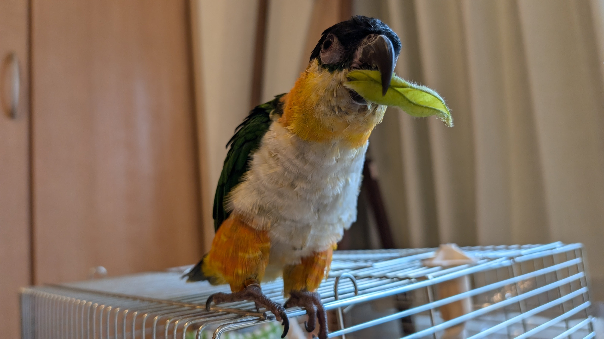

# メタデータ
- title=我が家のインコ「れもん&ぽぽ&ぐぐ」の日記14 : 大人に近づくれもんと遊ぶ余裕が出てきたぐぐ
- description=2024年10月12日（土）までのセキセイインコ「れもん」とズグロシロハラインコ「ぽぽ」「ぐぐ」の様子を記録しておきます。
- date=2024年10月12日（土）
- update=2024年10月12日（土）
- math=false
- tag=lemon

## はじめに
先週は私が体調を崩して書けなかったので2週間ぶりの日記となります。
セキセイインコのれもんとズグロシロハラインコのぐぐは元気に過ごしております。
れもんは相変わらず自由に一人で遊んだり、人間を弄んだり、好き勝手に遊び回っています。
ぐぐはようやく我が家に慣れてきたのか、遊ぶ余裕も出てきて、鳥籠の中で暴れ回ったり、鳥籠の外でも活発に動いたりできるようになってきました。
今週はそんなれもんとぐぐの様子をお届けします。

ようこそれもん

## 前回の日記
2024年9月28日の日記です。

https://yusukekato.jp/html/2024/0928.html

我が家のインコ「れもん&ぽぽ&ぐぐ」の日記13 : 生後4ヶ月を迎えたれもんと我が家に慣れてきたぐぐ

## 注意点
私たちは鳥を初めて飼うため飼育方法に誤りがあるかもしれません。
これからセキセイインコやズグロシロハラインコなどを飼うという方はこのブログの情報を鵜呑みにせず、参考程度に読んでいただけますと幸いです。
いかなる場合でも責任は負えませんのでご了承ください。

## 今週のれもん
### ごはん大好きれもん
れもんはごはんが大好きなので、ごはんを用意するとすぐに寄ってきます。

ごはん大好きれもん

### 残像のれもん
れもんは素早いので残像の時も多いです。

残像のれもん

ふつうに撮っても残像↓

ふつうに撮っても残像

やっぱり残像↓

やっぱり残像のれもん

飛ぶときもやっぱり残像↓

飛ぶときもやっぱり残像

### 後ろ姿もカッコいいれもん
背中で語るタイプかもしれません。

背中で語るれもん

### アクリルゲージに興味津々なれもん
ぐぐのために購入したアクリルゲージに興味津々なれもんです。
れもんも欲しいのかもしれません。

アクリルゲージに興味津々なれもん

アクリルゲージ越しのれもんとぐぐの邂逅↓

アクリルゲージ越しのれもんとぐぐの邂逅

### 近づいてくるれもん
れもんはカメラに気が付くと近づいてきます。

カメラに気が付いたれもん

ドスドス歩いてきたれもん↓

ドスドス歩いてきたれもん

カメラを睨むれもん↓

カメラを睨むれもん

### 新しいおもちゃで遊ぶれもん
お祭りのフリーマーケットで購入した赤ちゃん用のおもちゃをれもんにあげました。

新しいおもちゃで遊ぶれもん

れもんは何にでも興味を持って遊んでくれます。

むしゃむしゃれもん

お友達とも遊ぶれもん↓

お友達とも遊ぶれもん

和気あいあい↓

和気あいあいのれもん

## 今週のぐぐ

### 枝豆の皮で遊ぶぐぐ
ぐぐに枝豆をあげたところ、豆は食べずに皮で遊んでいました。
ちなみに枝豆は生であげてはダメで、味付けをせずに茹でたものをあげています。

枝豆の皮で遊ぶぐぐ

### アクリルゲージを購入
ぐぐの室温管理と防音対策のためにアクリルゲージを購入しました。

アクリルゲージ

### 鳥籠の上のぐぐ
ぐぐはずっと鳥籠の中で生活していたのか、鳥籠の外に出しても鳥籠の上でずっと過ごしています。

鳥籠の上のぐぐ

### 床に挑戦するぐぐ
ぐぐは鳥籠の外に出ても、鳥籠の上でしか行動していなかったのですが、床に置いた段ボールの上にも出てくるようになりました。

段ボールの上のぐぐ

ついに床にも降り立ったぐぐです。そこそこビビっていますが、歩いていました。

床の上のぐぐ

### おもちゃでも遊ぶぐぐ
おもちゃのフタで遊ぶぐぐです。

おもちゃのフタで遊ぶぐぐ

### 吠えるぐぐ
本当はあくびですが、写真だとガオーと吠えているようにも見えます。

吠えるぐぐ

### 撫でなれるぐぐ
撫でなれるのはやっぱり好きなようです。

撫でなれるぐぐ

## ぽぽの検査結果
先日亡くなったぽぽを大学で検査してもらっていたのですが、その検査結果について病院から教えていただきました。
検査で分かったこととして、肝臓や脾臓などの消化器系の内臓に細菌がいて炎症を起こしていたり、慢性的な胃腸炎にかかっていたりして、食べ物を十分に消化できていない可能性があったとのことです。
そのため、栄養がとれなくて身体が衰弱して体重も減っていっていたと考えられるそうです。

## おわりに
今週もれもんとぐぐは元気に過ごしていました。
私は体調を崩してしまいましたが、れもんとぐぐを見習って早く元気になりたいと思います。
れもんは大人になるまでまだもう少し時間がかかりますが、病気や怪我などに気をつけながら健やかに成長してほしいですね。
ぐぐももっと我が家に慣れていって余裕を持って過ごしてほしいですね。
そしてぽぽも虹の橋で幸せに暮らしてくれていると嬉しいですね。
いつかまたみんなで会えることを願っています。
それでは、また。

撫でなれるぐぐ
