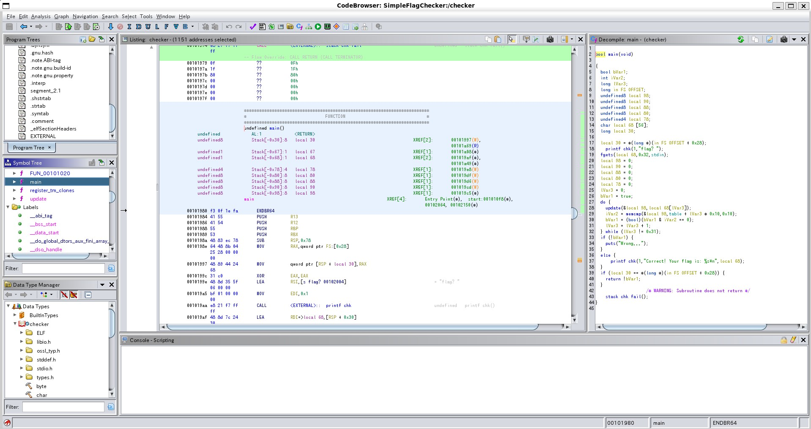

# メタデータ
- title=AlpacaHackで始めるCTF入門6：AlpacaHack Round 4 - Simple Flag Checkerに挑戦
- description=個人戦CTFを開催するプラットフォーム「AlpacaHack」を通じてCTFに入門してみようと思います。今回はAlpacaHack Round 4に挑戦します。
- date=2024年10月14日（月）
- update=2024年10月14日（月）
- math=false
- tag=alpacahack

## はじめに

### 概要
今日は祝日なので遅ればせながらAlpacaHack Round 4の問題に挑戦してみます。
今回は最初の問題の「Simple Flag Checker」を解いてみます。
ジャンルとしては「Rev」とのことです。
いわゆるリバースエンジニアリングの問題でバイナリのファイルが与えられるので、
そのファイルを解析してflagを取得するような問題っぽいです。
バイナリとかアセンブラとかよく分かっていないのでいつも通りChatGPTに助けてもらいながらやっていこうと思います。

https://alpacahack.com/ctfs/round-4

AlpacaHack Round 4のトップページ

### AlpacaHack
AlpacaHackへのリンクはこちら

https://alpacahack.com/

AlpacaHackのサイトへのリンク

### 私のCTF環境
- Windows 11/WSL2
- Ubuntu 22.04 LTS
- Ghidra

## 前回の記事
2024年10月13日の記事です。

https://yusukekato.jp/html/2024/1013.html

AlpacaHackで始めるCTF入門5：AlpacaHack Round 3 - qrimeに挑戦

## 問題内容
問題ページを開くと`checker`というファイルをダウンロードできます。
おそらくこのファイルが何かしらの言語で書かれたソフトのソースコードをコンパイルしてできた実行ファイル（バイナリ）みたいなものだと思います。
つまり、このバイナリの実行ファイルをソースコードに戻せたらflagが取得できそうです。

## checkerを調べてみる
まずは`file`コマンドで`checker`ファイルの形式を確認してみます。

```sh
$ file checker
checker: ELF 64-bit LSB pie executable, x86-64, version 1 (SYSV), dynamically linked, interpreter /lib64/ld-linux-x86-64.so.2, BuildID[sha1]=c2dd390ecbb794a78e20db0151832e9dd5c6359d, for GNU/Linux 3.2.0, not stripped
```

ChatGPTに聞いたところ一般的なバイナリファイルらしいです。また、`not stripped`だと関数名や変数名の情報が残っていて解析しやすいっぽいです。

次に`strings`コマンドで中身を確認してみます。

```sh
$ strings checker
/lib64/ld-linux-x86-64.so.2
mgUa
__cxa_finalize
fgets
__printf_chk
__libc_start_main
puts
memcmp
stdin
...
```

`fgets`や`stdin`があるのでC/C++言語っぽいです。

`nm`コマンドでシンボルを確認してみます。

```sh
$ nm checker
0000000000003da8 d _DYNAMIC
0000000000003f98 d _GLOBAL_OFFSET_TABLE_
0000000000002000 R _IO_stdin_used
                 w _ITM_deregisterTMCloneTable
                 w _ITM_registerTMCloneTable
0000000000002184 r __FRAME_END__
0000000000002030 r __GNU_EH_FRAME_HDR
0000000000004330 D __TMC_END__
000000000000038c r __abi_tag
0000000000004330 B __bss_start
                 w __cxa_finalize@GLIBC_2.2.5
0000000000004000 D __data_start
0000000000001180 t __do_global_dtors_aux
0000000000003da0 d __do_global_dtors_aux_fini_array_entry
0000000000004008 D __dso_handle
0000000000003d98 d __frame_dummy_init_array_entry
                 w __gmon_start__
                 U __libc_start_main@GLIBC_2.34
                 U __printf_chk@GLIBC_2.3.4
                 U __stack_chk_fail@GLIBC_2.4
0000000000004330 D _edata
0000000000004340 B _end
0000000000001a9c T _fini
0000000000001000 T _init
00000000000010e0 T _start
0000000000004338 b completed.0
0000000000004000 W data_start
0000000000001110 t deregister_tm_clones
                 U fgets@GLIBC_2.2.5
00000000000011c0 t frame_dummy
0000000000001980 T main
                 U memcmp@GLIBC_2.2.5
                 U puts@GLIBC_2.2.5
0000000000001140 t register_tm_clones
0000000000004330 B stdin@GLIBC_2.2.5
0000000000004020 D table
00000000000011d0 T update
```

`objdump`コマンドでシンボルも確認してみます。

```sh
$ objdump -t checker

checker:     ファイル形式 elf64-x86-64

SYMBOL TABLE:
0000000000000000 l    df *ABS*  0000000000000000              Scrt1.o
000000000000038c l     O .note.ABI-tag  0000000000000020              __abi_tag
0000000000000000 l    df *ABS*  0000000000000000              crtstuff.c
0000000000001110 l     F .text  0000000000000000              deregister_tm_clones
0000000000001140 l     F .text  0000000000000000              register_tm_clones
0000000000001180 l     F .text  0000000000000000              __do_global_dtors_aux
0000000000004338 l     O .bss   0000000000000001              completed.0
0000000000003da0 l     O .fini_array    0000000000000000              __do_global_dtors_aux_fini_array_entry
00000000000011c0 l     F .text  0000000000000000              frame_dummy
0000000000003d98 l     O .init_array    0000000000000000              __frame_dummy_init_array_entry
0000000000000000 l    df *ABS*  0000000000000000              main.c
0000000000000000 l    df *ABS*  0000000000000000              crtstuff.c
0000000000002184 l     O .eh_frame      0000000000000000              __FRAME_END__
0000000000000000 l    df *ABS*  0000000000000000
0000000000003da8 l     O .dynamic       0000000000000000              _DYNAMIC
0000000000002030 l       .eh_frame_hdr  0000000000000000              __GNU_EH_FRAME_HDR
0000000000003f98 l     O .got   0000000000000000              _GLOBAL_OFFSET_TABLE_
00000000000011d0 g     F .text  00000000000007a9              update
0000000000000000       F *UND*  0000000000000000              __libc_start_main@GLIBC_2.34
0000000000000000  w      *UND*  0000000000000000              _ITM_deregisterTMCloneTable
0000000000004000  w      .data  0000000000000000              data_start
0000000000000000       F *UND*  0000000000000000              puts@GLIBC_2.2.5
0000000000004330 g     O .bss   0000000000000008              stdin@GLIBC_2.2.5
0000000000004330 g       .data  0000000000000000              _edata
0000000000001a9c g     F .fini  0000000000000000              .hidden _fini
0000000000000000       F *UND*  0000000000000000              __stack_chk_fail@GLIBC_2.4
0000000000000000       F *UND*  0000000000000000              memcmp@GLIBC_2.2.5
0000000000000000       F *UND*  0000000000000000              fgets@GLIBC_2.2.5
0000000000004020 g     O .data  0000000000000310              table
0000000000004000 g       .data  0000000000000000              __data_start
0000000000000000  w      *UND*  0000000000000000              __gmon_start__
0000000000004008 g     O .data  0000000000000000              .hidden __dso_handle
0000000000002000 g     O .rodata        0000000000000004              _IO_stdin_used
0000000000004340 g       .bss   0000000000000000              _end
00000000000010e0 g     F .text  0000000000000026              _start
0000000000004330 g       .bss   0000000000000000              __bss_start
0000000000001980 g     F .text  000000000000011c              main
0000000000000000       F *UND*  0000000000000000              __printf_chk@GLIBC_2.3.4
0000000000004330 g     O .data  0000000000000000              .hidden __TMC_END__
0000000000000000  w      *UND*  0000000000000000              _ITM_registerTMCloneTable
0000000000000000  w    F *UND*  0000000000000000              __cxa_finalize@GLIBC_2.2.5
0000000000001000 g     F .init  0000000000000000              .hidden _init
```

正直よく分かりませんが、デバッグの時に使えるっぽいです。

## checkerを実行してみる
実行してみるとflagを尋ねられるので、おそらく入力したflagの正誤判定をしてくれるっぽいです。
flagを正誤判定できるということは`checker`ファイルの中にflagがあると思われます。

```sh
$ sudo chmod +x checker
$ ./checker
flag?
```

## gdbコマンドを使ってみる
一応`gdb`コマンドを使ってみましたが、よく分かりませんでした。

```sh
$ sudo apt install gdb
$ gdb checker
```

## Ghidraを使ってみる
解析ソフトの`Ghidra`を使ってみます。
下記の記事を参考にインストールしました。

https://qiita.com/motimotipurinn/items/4ed66dce780a886d2f32

Qiita - WSLでGhidra環境構築

使い方は下記の記事を参考にしました。

https://qiita.com/icestdy/items/86b597d118e4801453d5

Qiita - CTFとは？Ghidraを使ったreversing入門

Ghidra実行時の様子↓



main関数の解析結果はこうなりました。

```c
bool main(void)

{
  bool bVar1;
  int iVar2;
  long lVar3;
  long in_FS_OFFSET;
  undefined8 local_98;
  undefined8 local_90;
  undefined8 local_88;
  undefined8 local_80;
  undefined4 local_78;
  char local_68 [56];
  long local_30;
  
  local_30 = *(long *)(in_FS_OFFSET + 0x28);
  __printf_chk(1,"flag? ");
  fgets(local_68,0x32,stdin);
  local_98 = 0;
  local_90 = 0;
  local_88 = 0;
  local_80 = 0;
  local_78 = 0;
  lVar3 = 0;
  bVar1 = true;
  do {
    update(&local_98,local_68[lVar3]);
    iVar2 = memcmp(&local_98,table + lVar3 * 0x10,0x10);
    bVar1 = (bool)(bVar1 & iVar2 == 0);
    lVar3 = lVar3 + 1;
  } while (lVar3 != 0x31);
  if (!bVar1) {
    puts("Wrong...");
  }
  else {
    __printf_chk(1,"Correct! Your flag is: %s\n",local_68);
  }
  if (local_30 == *(long *)(in_FS_OFFSET + 0x28)) {
    return !bVar1;
  }
                    /* WARNING: Subroutine does not return */
  __stack_chk_fail();
}
```

`local_68`がユーザが入力したflag、`local_98`が正解のflagっぽいです。
update関数が怪しそうですが、読んでみても何が何やらという感じです。
`local_98(param_1)`（アドレス値？）を追っていけばよいのかどうか。

```
void update(undefined8 *param_1,byte param_2)

{
  int *piVar1;
  byte bVar2;
  uint uVar3;
  uint uVar4;
  uint *puVar5;
  uint *puVar6;
  uint uVar7;
  uint uVar8;
  uint uVar9;
  uint uVar10;
  byte bVar11;
  uint uVar12;
  uint uVar13;
  long in_FS_OFFSET;
  undefined auVar14 [16];
  uint local_78;
  uint uStack_74;
  uint uStack_70;
  uint uStack_6c;
  uint local_68 [4];
  uint local_58;
  uint uStack_54;
  uint uStack_50;
  uint uStack_4c;
  uint local_48;
  long local_40;
  
  local_40 = *(long *)(in_FS_OFFSET + 0x28);
  puVar6 = local_68;
  local_68[0] = (uint)*param_1;
  local_68[1] = (uint)((ulong)*param_1 >> 0x20);
  local_68[2] = (uint)param_1[1];
  local_68[3] = (uint)((ulong)param_1[1] >> 0x20);
  uVar8 = local_68[3] * 8 | (int)local_68[3] >> 0x1d;
  uVar8 = (((local_68[2] << 0x1d | (int)local_68[2] >> 3) ^ uVar8) &
           (local_68[1] << 0x17 | (int)local_68[1] >> 9) ^ uVar8) +
          ((int)local_68[0] >> 0x1b | local_68[0] << 5);
  uVar9 = (int)uVar8 >> 0x1d | uVar8 * 8;
  uVar3 = ((((int)local_68[3] >> 3 | local_68[3] << 0x1d) ^ uVar9) &
           ((int)local_68[2] >> 9 | local_68[2] << 0x17) ^ uVar9) +
          (local_68[1] << 5 | (int)local_68[1] >> 0x1b);
  uVar9 = (int)uVar3 >> 0x1d | uVar3 * 8;
  uVar7 = ((((int)uVar8 >> 3 | uVar8 * 0x20000000) ^ uVar9) &
           ((int)local_68[3] >> 9 | local_68[3] << 0x17) ^ uVar9) +
          (local_68[2] << 5 | (int)local_68[2] >> 0x1b);
  uVar9 = (int)uVar7 >> 0x1d | uVar7 * 8;
  uVar9 = ((((int)uVar3 >> 3 | uVar3 * 0x20000000) ^ uVar9) & ((int)uVar8 >> 9 | uVar8 * 0x800000) ^
          uVar9) + (local_68[3] << 5 | (int)local_68[3] >> 0x1b);
  uVar10 = (int)uVar9 >> 0x1d | uVar9 * 8;
  bVar11 = param_2 >> 4;
  uVar4 = -0x35014542 << bVar11 | 0xcafebabeU >> 0x20 - bVar11;
  uVar4 = ((-0x11e0d12 << (8 - bVar11 & 0x1f) | 0xfee1f2eeU >> (bVar11 + 0x18 & 0x1f)) &
           ((-0x21524111 << (param_2 & 0xf) | 0xdeadbeefU >> 0x20 - (param_2 & 0xf)) ^ uVar4) ^
          uVar4) + (uint)param_2 * 0x3b800001;
  local_68[0] = local_68[0] ^ uVar4;
  local_68[1] = local_68[1] ^ uVar4;
  local_68[2] = local_68[2] ^ uVar4;
  local_68[3] = local_68[3] ^ uVar4;
  local_48 = ((int)uVar8 >> 0x1b | uVar8 * 0x20) +
             ((uVar3 * 0x800000 | (int)uVar3 >> 9) &
              ((uVar7 * 0x20000000 | (int)uVar7 >> 3) ^ uVar10) ^ uVar10) ^ uVar4;
  local_58 = uVar4 ^ uVar8;
  uStack_54 = uVar4 ^ uVar3;
  uStack_50 = uVar4 ^ uVar7;
  uStack_4c = uVar4 ^ uVar9;
  auVar14 = pmaddwd(CONCAT412(local_68[3],CONCAT48(local_68[2],CONCAT44(local_68[1],local_68[0]))),
                    CONCAT412(uVar4 ^ uVar9,
                              CONCAT48(uVar4 ^ uVar7,CONCAT44(uVar4 ^ uVar3,uVar4 ^ uVar8))));
  uStack_6c = SUB164(auVar14 >> 0x60,0);
  local_78 = SUB164(auVar14,0);
  uStack_74 = SUB164(auVar14 >> 0x20,0);
  uStack_70 = SUB164(auVar14 >> 0x40,0);
  puVar5 = puVar6;
  uVar8 = 0;
  do {
    while( true ) {
      uVar9 = *puVar5;
      uVar13 = uVar9 & 3;
      bVar11 = (byte)((int)uVar9 >> 2) & 7;
      uVar4 = (uVar8 + 4) % 9;
      uVar7 = uVar8 + 1;
      uVar3 = local_68[(int)(uVar7 % 9)];
      uVar10 = (uVar3 * 2 | (int)uVar3 >> 0x1f) ^ local_68[(int)uVar4];
      uVar12 = (int)uVar3 >> (-bVar11 & 0x1f) | uVar3 << bVar11;
      bVar2 = (byte)((int)uVar9 >> 5);
      bVar11 = -bVar2;
      if (uVar13 == 2) {
        uVar9 = uVar9 + (((uVar3 ^ uStack_70) << (bVar2 & 0x1f) |
                         (int)(uVar3 ^ uStack_70) >> (bVar11 & 0x1f)) ^ uVar10 ^ uVar12);
      }
      else if (uVar13 == 3) {
        uVar9 = uVar9 + ((~((uVar3 ^ uStack_6c) << (bVar2 & 0x1f) |
                           (int)(uVar3 ^ uStack_6c) >> (bVar11 & 0x1f)) | uVar10) ^ uVar12);
      }
      else if (uVar13 == 1) {
        uVar9 = uVar9 + (((int)(uVar3 ^ uStack_74) >> (bVar11 & 0x1f) |
                         (uVar3 ^ uStack_74) << (bVar2 & 0x1f)) & (uVar10 ^ uVar12) ^ uVar12);
      }
      else {
        uVar3 = (uVar3 ^ local_78) << (bVar2 & 0x1f) | (int)(uVar3 ^ local_78) >> (bVar11 & 0x1f);
        uVar9 = uVar9 + ((uVar12 ^ uVar3) & uVar10 ^ uVar3);
      }
      *puVar5 = uVar9;
      uVar9 = local_68[(int)uVar4];
      uVar4 = (uVar8 + 3) % 9;
      uVar3 = local_68[(int)uVar4];
      uVar13 = uVar3 & 3;
      bVar11 = (byte)((int)uVar3 >> 2) & 7;
      uVar12 = (int)uVar9 >> (-bVar11 & 0x1f) | uVar9 << bVar11;
      bVar2 = (byte)((int)uVar3 >> 5);
      bVar11 = -bVar2;
      if (uVar13 == 2) {
        uVar3 = uVar3 + (((uVar9 ^ uStack_70) << (bVar2 & 0x1f) |
                         (int)(uVar9 ^ uStack_70) >> (bVar11 & 0x1f)) ^ uVar10 ^ uVar12);
      }
      else if (uVar13 == 3) {
        uVar3 = uVar3 + ((~((uVar9 ^ uStack_6c) << (bVar2 & 0x1f) |
                           (int)(uVar9 ^ uStack_6c) >> (bVar11 & 0x1f)) | uVar10) ^ uVar12);
      }
      else if (uVar13 == 1) {
        uVar3 = uVar3 + (((int)(uVar9 ^ uStack_74) >> (bVar11 & 0x1f) |
                         (uVar9 ^ uStack_74) << (bVar2 & 0x1f)) & (uVar10 ^ uVar12) ^ uVar12);
      }
      else {
        uVar9 = (uVar9 ^ local_78) << (bVar2 & 0x1f) | (int)(uVar9 ^ local_78) >> (bVar11 & 0x1f);
        uVar3 = uVar3 + ((uVar12 ^ uVar9) & uVar10 ^ uVar9);
      }
      local_68[(int)uVar4] = uVar3;
      uVar4 = (uVar8 + 6) % 9;
      uVar9 = local_68[(int)uVar4];
      uVar13 = uVar9 & 3;
      bVar11 = (byte)((int)uVar9 >> 2) & 7;
      uVar3 = local_68[(int)((uVar8 + 7) % 9)];
      uVar12 = (int)uVar3 >> (-bVar11 & 0x1f) | uVar3 << bVar11;
      bVar11 = (byte)((int)uVar9 >> 5);
      bVar2 = 0x20 - bVar11;
      uVar8 = uVar7;
      if (uVar13 != 2) break;
      uVar9 = uVar9 + (((uVar3 ^ uStack_70) << (bVar11 & 0x1f) |
                       (int)(uVar3 ^ uStack_70) >> (bVar2 & 0x1f)) ^ uVar10 ^ uVar12);
LAB_001015c0:
      local_68[(int)uVar4] = uVar9;
      puVar5 = puVar5 + 1;
      if (uVar7 == 9) goto LAB_001016e0;
    }
    if (uVar13 == 3) {
      uVar9 = uVar9 + ((~((uVar3 ^ uStack_6c) << (bVar11 & 0x1f) |
                         (int)(uVar3 ^ uStack_6c) >> (bVar2 & 0x1f)) | uVar10) ^ uVar12);
      goto LAB_001015c0;
    }
    if (uVar13 != 1) {
      uVar3 = (uVar3 ^ local_78) << (bVar11 & 0x1f) | (int)(uVar3 ^ local_78) >> (bVar2 & 0x1f);
      uVar9 = uVar9 + ((uVar12 ^ uVar3) & uVar10 ^ uVar3);
      goto LAB_001015c0;
    }
    puVar5 = puVar5 + 1;
    local_68[(int)uVar4] =
         uVar9 + (((uVar3 ^ uStack_74) << (bVar11 & 0x1f) |
                  (int)(uVar3 ^ uStack_74) >> (bVar2 & 0x1f)) & (uVar10 ^ uVar12) ^ uVar12);
  } while (uVar7 != 9);
LAB_001016e0:
  uVar8 = 0;
  do {
    uVar9 = *puVar6;
    uVar3 = uVar8 + 1;
    piVar1 = (int *)((long)param_1 + (ulong)(uVar8 & 3) * 4);
    *piVar1 = *piVar1 + ((local_68[(int)((uVar8 + 2) % 9)] ^ local_68[(int)((uVar8 + 5) % 9)]) &
                         uVar9 ^ local_68[(int)((uVar8 + 5) % 9)]);
    uVar4 = (uVar9 ^ local_68[(int)((uVar8 + 8) % 9)]) & local_68[(int)((uVar8 + 3) % 9)] ^
            local_68[(int)((uVar8 + 8) % 9)];
    puVar5 = (uint *)((long)param_1 + (ulong)(uVar3 & 3) * 4);
    *puVar5 = *puVar5 ^ ((int)uVar4 >> 0x19 | uVar4 << 7);
    puVar6 = puVar6 + 1;
    uVar4 = local_68[(int)((uVar8 + 6) % 9)] ^ local_68[(int)(uVar3 % 9)] ^ uVar9;
    piVar1 = (int *)((long)param_1 + (ulong)(uVar8 + 2 & 3) * 4);
    *piVar1 = *piVar1 + ((int)uVar4 >> 0x13 | uVar4 << 0xd);
    uVar9 = (~local_68[(int)((uVar8 + 7) % 9)] | uVar9) ^ local_68[(int)((uVar8 + 4) % 9)];
    puVar5 = (uint *)((long)param_1 + (ulong)(uVar8 + 3 & 3) * 4);
    *puVar5 = *puVar5 ^ ((int)uVar9 >> 9 | uVar9 << 0x17);
    uVar8 = uVar3;
  } while (uVar3 != 9);
  if (local_40 == *(long *)(in_FS_OFFSET + 0x28)) {
    return;
  }
                    /* WARNING: Subroutine does not return */
  __stack_chk_fail();
}
```

今日はこのへんにしておきます。
他の方のwriteupを読んで勉強させていただきます。

## おわりに
今日もAlpacaHackに挑戦させていただきました。
これまでに触れたことのない分野を勉強できるのでとても楽しいです。
また、ChatGPTがあればとっかかりは掴めるのでとても助かっています。
これからもAlpacaHackを通じてCTFを楽しんでいたけたら嬉しいなと思います。
それでは、また。

## 次回の記事
2024年12月9日の記事です。

https://yusukekato.jp/html/2024/1209.html

AlpacaHackで始めるCTF入門7：AlpacaHack Round 5 - XorshiftStreamに挑戦