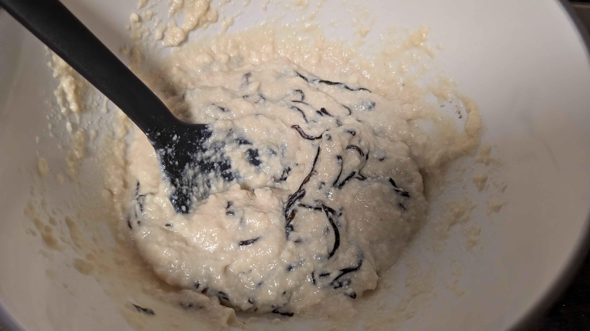
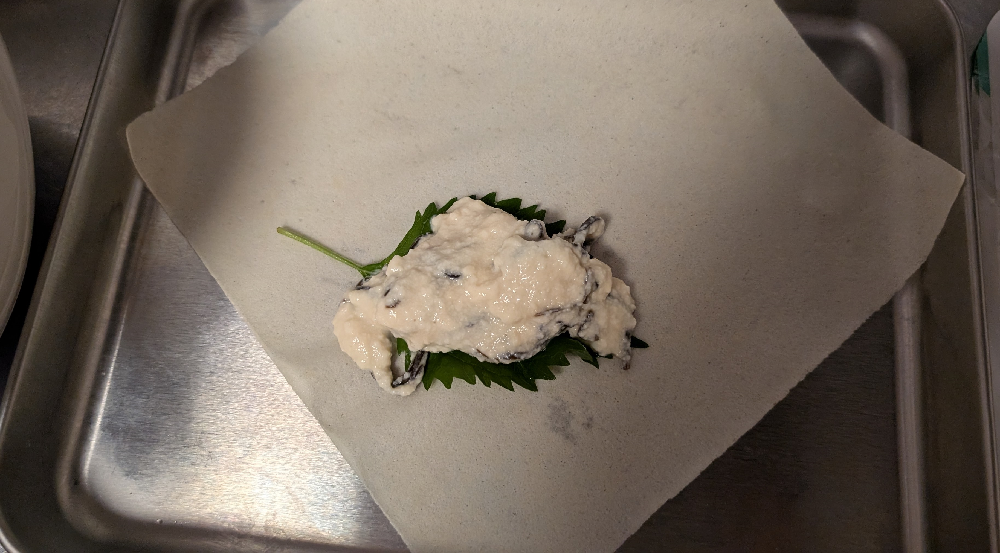

# メタデータ
- title=料理日記：豆腐春巻き
- description=またしても料理をしたので記録を残しておきます。今回は豆腐春巻きです。
- date=2024年10月15日（火）
- update=2024年10月15日（火）
- math=false
- tag=cooking

## はじめに
豆腐の春巻きを作ったので記録に残しておきます。

豆腐春巻き

## 豆腐春巻きの作成手順
参考にしたレシピはこちらです。

https://esse-online.jp/articles/-/28238

参考 - 豆腐を具にした「春巻き」。パリとろ食感が楽しめる＜長谷川あかりさんレシピ＞

### 必要なもの
- 豆腐
- 塩昆布
- 片栗粉
- 塩
- 大葉
- 小麦粉（水で溶く）
- 油
- キッチンペーパー
- フライパン
- 皿

### やること
豆腐と塩昆布、片栗粉、塩を混ぜます。

豆腐をぐちゃぐちゃにまぜる

春巻きの皮で具材を巻きます。

具材を巻く

巻いた状態↓

巻いた様子

フライパンで揚げ焼きします。
きつね色になるまで3分くらいです。

揚げ焼きの様子

揚げ終わったらキッチンペーパーで油をとりましょう。

### 完成例
こちらが完成した豆腐春巻きです。

豆腐春巻き

## おわりに
豆腐の春巻きを作成しました。
美味しかったです。
それでは、また。
