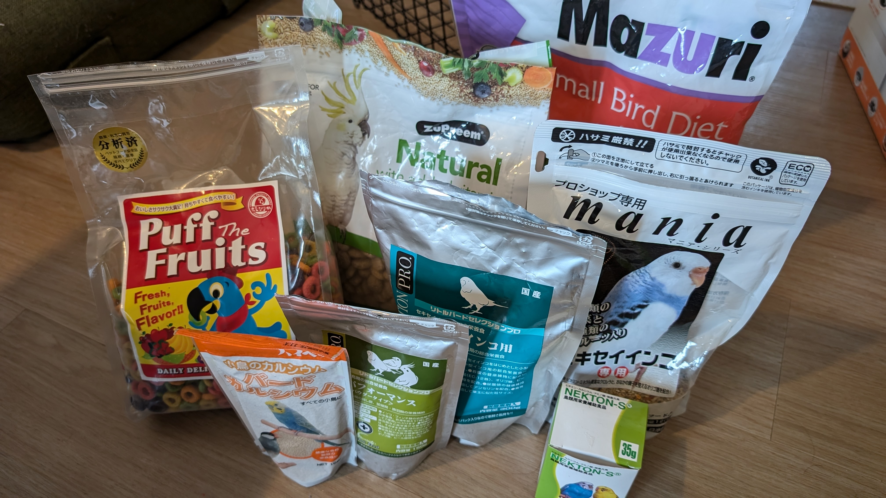
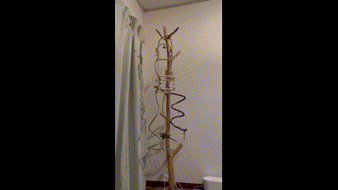
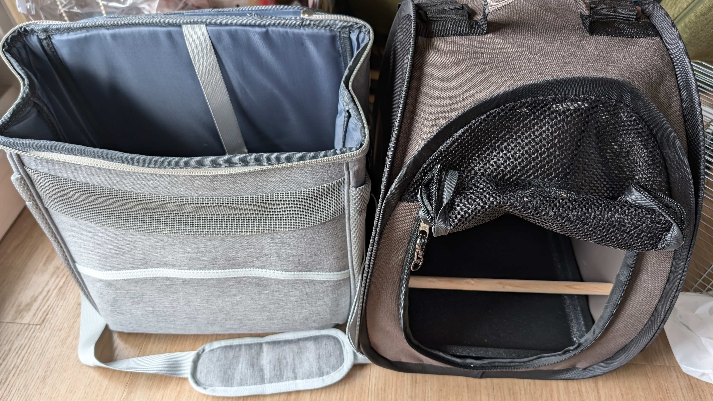
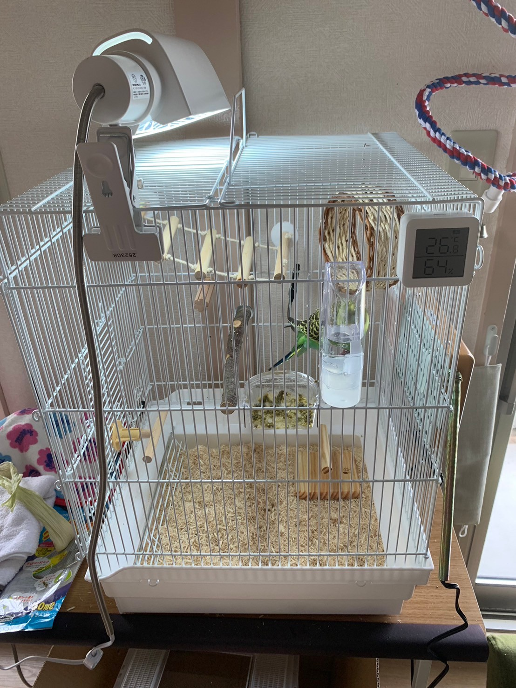

# メタデータ
- title=インコの飼い方と注意点（2024年版）
- description=2024年10月25日（金）時点での我が家におけるインコの飼い方についてのメモ書きです。
- date=2024年10月25日（金）
- update=2024年10月25日（金）
- math=false
- tag=lemon

## はじめに
我が家では現在、セキセイインコの「れもん」とズグロシロハラインコの「ぐぐ」を飼っています。
少し前まではズグロシロハラインコの「ぽぽ」もいました。
この記事では現状の我が家でのインコの飼育方法についてまとめようと思います。
ただし、必ずしもこの記事の情報が正しいわけではないため、参考程度に読んでいただけますと幸いです。
正確な情報については動物病院やペットショップ、書籍などでご確認をお願いいたします。

我が家のセキセイインコ「れもん」↓

れもん

我が家のズグロシロハラインコ「ぐぐ」↓

ぐぐ

## インコ日記の記事 
我が家のインコたちの日記も書いています。
下記のリンクが現在の最新記事です。

https://yusukekato.jp/html/2024/1012.html

我が家のインコ「れもん&ぽぽ&ぐぐ」の日記14 : 大人に近づくれもんと遊ぶ余裕が出てきたぐぐ

## 飼育環境の準備
まずはインコ（雛鳥ではない）の飼育に必要となる物を準備します。
雛鳥の場合は必要な物が異なりますのでご注意ください（雛鳥の飼育方法についてはペットショップで確認すると良いと思います）。

- インコが暮らすことになる鳥籠（インコの大きさに合ったもの）
- 動物病院へ連れていく時などの外出時用キャリーケージ（小さい鳥籠、キャリーケージを入れるリュックサックもあると便利）
- 鳥籠の扉が開かないようにするバックルなど（外出時にインコが勝手に扉を開けないように）
- 温度調整のためのヒーター（ワット数を要確認）
- 温度センサが付いたサーモスタット（自動温度調節器のこと、必須）
- 太陽光ライト（インコも日光に当たる必要あり）
- 温度計（湿度も計測できるとよい）
- 体重計（0.1g単位で計測できるとよい）
- シードやペレットなどのエサ（ちゃんと食べてくれる物を用意する）
- エサ入れ、水入れ（複数あると使い回せて便利）
- 止まり木（太さを要確認、複数あると良い）
- おやすみカバー（鳥籠を覆う布、寝る時にかけてあげる）
- ビニールカバー（鳥籠の覆う透明のビニール、日中かけてあげる）
- アクリルケージ（保温、防音対策などが可能）
- 鳥籠の中に取り付けるおもちゃ（インコは遊ぶのが好き。暇だとストレスになる）
- 鳥籠の底に敷く新聞紙やペットシート（フンを受け止める）
- ペット用ウェットティッシュ（鳥籠掃除に便利）

## 鳥籠の置き場所を確保
次に鳥籠を配置する場所を確認します。
日光やエアコンの風が直接当たらず、騒がしくない場所を選ぶと良いとのことです。
日中は多少音があってもよいと思いますが（インコもテレビの音などがあったほうが暇つぶしになる可能性もあります）、
インコが寝る時には静かな環境を作ってあげることが大切です。

我が家の鳥籠の様子はこんな感じです。
窓の近くではありますが、カーテンで直射日光を調整しています。
また、リビングなので多少騒がしくはなってしまいますが、
なるべく音を出さないように気をつけています。
ちなみに、我が家のれもんはテレビが好きなようですが、ぐぐは嫌いなようでダンボールで壁を作ってあげて見えないようにしています。

我が家の鳥籠の様子

## 動物病院を確認
インコを飼う前に、近所にある鳥を診てくれる動物病院を探しておきます。
通いやすくて評判の良い病院を選ぶと良いと思います。
犬や猫を診てくれる動物病院などよりも数が少ないため、あらかじめ確認しておくと安心です。
インコは少しの環境の変化で体調を崩すことも多いので、動物病院は必須だと思います。

## ペットショップからインコを迎え入れる
インコを取り扱っているペットショップへ足を運んで、迎え入れるインコを選びます。
元気で物怖じせず、人懐っこいインコを選ぶのが良いとされています（もちろん絶対ではありません）。
また、いつもの様子はどうか、ごはんをちゃんと食べているか、病気は大丈夫そうかも店員さんに確認すると良いと思います。
また、実際に手に乗せたり、触らせてもらったりして、インコの状態を確認することも重要です（店員さんが説明してくれると思います）。

我が家に来た日のれもん↓

我が家に来た日のれもん

## インコを我が家へ迎え入れる
インコを我が家へ連れてきたら鳥籠に入れてあげます
（窓やドアは閉めて、外へ逃げ出さないようにご注意ください。また、万が一のことを考えて部屋の中の危険な物も排除しておくと良いと思います）。
ごはんと水も忘れずにあげます。
最初は環境の変化でインコが緊張していると思うので、放鳥（鳥籠の外で遊ばせてあげること）はまだせずに休ませてあげると良いと思います。
まずは家や鳥籠に慣れてもらうことが重要です。

## ごはんについて
基本的には必要な栄養が入っているペレットが良いですが、ペレットを食べないインコもたくさんいるため、
まずはペットショップで食べていたごはんをそのままあげるのが良いとのことです。
ペレットではない場合は、足りない栄養を他の食べ物や水に溶かすなどして補う必要があります。
ちなみに、我が家のぐぐはペレットを食べてくれますが、れもんはシードばっかり食べています。
また、ごはんとは別にひまわりの種や粟穂などのおやつも用意して、何かのご褒美にあげると良いと思います。

我が家のごはん↓

我が家のごはん

## 鳥籠の温度調整
温度はヒーターを使って28度前後（26度～30度くらい）に調整します。
おやすみカバーやビニールカバーを使って鳥籠を覆うことで温度を調整しやすくします。
ちなみに、ヒーターは家の中の温度にプラスして鳥籠の温度を上昇させるため、
家の中はエアコンを使って人間が過ごしやすい温度に調整しておくと良いです。
ただし、ヒーターはかなり熱をもつのでインコが触れないように、ヒーターカバーなどを付けたり、鳥籠の外に付けたりする必要があります。

鳥籠の中にヒーターとヒーターカバーを取り付けた様子↓

鳥籠の中にヒーターとヒーターカバーを取り付けた様子

鳥籠外に取り付けたヒーターの様子↓

鳥籠外のヒーター

## インコの睡眠時間
インコの睡眠時は暗くして、静かにしてあげることが重要です。
インコは日の入りと共に寝て日の出と共に起きるとのことなので、午後7時くらいにはおやすみカバーをかけて寝させてあげて、
午前7時くらいには起こしてあげると良さそうです。
インコのだいたいの睡眠時間は10時間～12時間らしいです。

## 放鳥の注意点
インコは一日に30分～1時間程度は鳥籠の外で遊ばせてあげる必要があります（ずっと放鳥するのもよくないとのこと）。
ただし、放鳥時には危険がたくさんあるので注意が必要です。
下記に注意点を列挙します。

- インコから絶対に目を離さない
- インコを一人にしない
- 家の外へ逃げ出さないように窓を閉める
- 窓に衝突しないようにカーテンを閉める（インコは驚いた時、窓の外など明るい方向へ飛び出す習性があり、その時に窓に衝突する危険があるとのこと）
- 鏡にも衝突しないように鏡を隠す
- 巻き込まれると大変なので換気扇や扇風機などは絶対に停止させる
- 鍋やプライパン、コップなど水を張っているものにインコが落ちてしまう危険があるのでそれらを隠す
- 特に熱湯が入っている鍋などは危険
- インコは床を歩くこともあるので踏まないように注意する
- インコがスリッパや床に置いてある服など、見えないところに入ってしまう可能性があるので足で踏まないように注意する
- 人間の食べ物はインコには毒になる可能性が高いので隠す（インコが食べてはいけない物は要確認）
- 食べてはいけない物の例：チョコやコーヒーなどのカフェイン、ネギ、アボカド、ほうれん草、アルコールなど
- 家具の隙間に落ちてしまうこともあるのでそういう箇所も入れないようにする
- そのほか危険な物は排除しておく

放鳥時の様子↓

放鳥時の様子

## 動物病院へ連れていく
インコを我が家に迎え入れてから10日くらい以内に動物病院で診てもらうと良いとのことです。
見た目や触ってもらって健康かどうか、フンやそのう（喉）を診てもらって病気になっていないか、爪が伸びすぎていないか（伸びていたら切ってもらう）を確認してもらうのが目的です。

動物病院で聞いてみたところ、迎え入れてすぐに病院へ連れていくのはインコの体力的に厳しいかもしれないので、
家に来てから3日後から10日後くらいがちょうどよいとのことです。
二度目以降の来院は定期健診や定期的な爪切り、あとは突発的な体調不良の時に連れていくことになります。
何かしらインコに異常を感じたらすぐに動物病院へ連れていくことを検討する必要があります。
連れて行ったほうがいいのか迷った際はとりあえず動物病院へ電話します。

外出時は小さいキャリーケージにインコを入れて連れていきます。
もちろん外出時も温度調整や直射日光を避けることが必要です。
たとえばキャリーケージをペット専用のリュックサックに入れると温度調整がしやすくなります。

外出用のキャリーケージに入ったれもん↓

外出用のキャリーケージに入ったれもん

外出用のリュックサック↓

外出用のリュックサック

## 毎日やること
インコの飼育において毎日やることを列挙します。

- 毎日適量のごはんをあげる（インコの体重の10%が目安）
- 忘れずに水も交換する（栄養剤を溶かすなども有効）
- 体重を計測して記録する（できれば朝と夜。食事前と食事後で差が出る。急に体重が減ることもあるので注意）
- フンの状態をチェックする（健康なフンの状態を知っておく必要あり。フンの状態がいつもと違うと体調不良の疑いあり）
- 鳥籠を掃除する
- 適度に放鳥する
- インコの様子を確認する（元気か、体調が悪そうではないか。目をつぶっていたり、毛が膨らんでいたりすると体調不良の疑いあり）
- 何かしら異常を感じたらすぐに動物病院へ連れていく（対応が遅れると取り返しがつかないことになる可能性があります）
- 夜はしっかり睡眠時間を確保する

## 太陽光について
インコは太陽光に一日30分程度当たる必要があるとのことです。
ただし窓ガラス越しだと効果が薄いらしく、できれば直接当たったほうがよいです。
しかし、窓ガラスを開けるのはリスクが高く、曇りや雨の日もあるので、我が家では太陽光ライトを使用しています。
また、インコは熱中症にもなるので直射日光にずっと当たるのもよくないとのことです。

太陽光ライト使用時の様子↓

太陽光ライト

## インコの暇つぶし
インコは活動時間のほとんどを鳥籠で過ごすことになります。
鳥籠の中にインコの興味を引くおもちゃなどがないと暇な時間を過ごすことになり、ストレスがたまってしまいます。
人間が鳥籠の外から声をかけてあげたり、かまってあげたりすることも有効ですが、限度があると思います。
そのため、鳥籠の中に取り付けられるおもちゃを用意してあげると良いと思います。
ただし、ずっと同じおもちゃだとインコも飽きてしまうため、１週間程度ごとに交換してあげられると良いとのことです。

輪っかの遊具で遊ぶれもん↓

輪っかの遊具で遊ぶれもん

## 換羽期や発情期
インコが成長していくと換羽期や発情期を迎えることになります。
インコにとっては重要な期間で、体調にも大きく影響するので人間側が知識を持っておく必要があります。
換羽期や発情期に関しては動物病院で説明を聞いたり、書籍などから学ぶことができます。

## その他の注意点
- フライパンや鍋などの空焚きをしてしまうと有害な物質が出てしまうので絶対にしない
- アロマなど香りを発する物もインコにとって有害な可能性があるので注意する
- コンセントにフンや尿がかかるとショートする可能性があるので注意する
- インコが電源コードなどをかじって感電したり、火事に繋がる危険があるので注意する

## 書籍紹介
これまでに読んだ書籍についていくつか紹介します。
とりあえずインコの飼育本を一冊持っておくと安心だと思います。

- 青沼陽子『インコの飼い方・暮らし方』（成美堂出版）：インコの飼育方法全般の内容が一通り載っています
- 磯崎哲也『幸せなインコの育て方』（大泉書店）：インコの基礎知識と飼育方法について載っています
- BIRDSTORY『インコの飼い方図鑑』（朝日新聞出版）：イラストが豊富で読みやすくなっています
- 細田博昭『長生きする鳥の育てかた』（誠文堂新光社）：鳥を長生きさせる飼育方法について載っています
- 松本壯志『インコのきもち』（メイツ出版）：インコを飼育する中で気になること、知っておきたいことが載っています
- 海老沢和荘『鳥のお医者さんのためになるつぶやき集』（グラフィック社）：ためになる情報が載っています
- 小嶋篤史『コンパニオンバードの病気百科』（誠文堂新光社）：鳥の病気について詳しく載っています
- 真田直子『飼鳥のペレット読本』（TSUBASA）：ペレットについて詳しい情報が載っています

## おわりに
現状の我が家におけるインコの飼育方法についてまとめました。
これを読んでいただいた皆様の何かしらの参考になると嬉しいです。
また、繰り返しになりますが、この記事の情報が全て正しいとは限りませんので、正確な情報については動物病院やペットショップ、書籍などでご確認いただけますと幸いです。
それでは、また。
