# メタデータ
- title=我が家のインコ「れもん&ぽぽ&ぐぐ」の日記15 : 落花生、新聞紙、れもんとぐぐの邂逅
- description=2024年10月26日（土）までのセキセイインコ「れもん」とズグロシロハラインコ「ぽぽ」「ぐぐ」の様子を記録しておきます。
- date=2024年10月26日（土）
- update=2024年10月26日（土）
- math=false
- tag=lemon

## はじめに
今週もセキセイインコの「れもん」とズグロシロハラインコの「ぐぐ」は元気に暮らしています。
ぐぐは少しずつ我が家に慣れてきていて、自主的に遊べるようにもなってきました。
れもんはいつもどおり自由に遊んでいます。
この調子で仲良く元気に成長してほしいですね。
ということで、今回もれもんとぐぐの記録を残していきます。

キメ顔のぐぐ↓

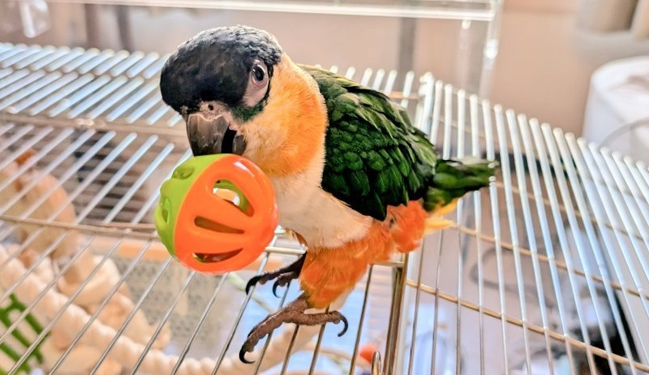

キメ顔のぐぐ

## 関連記事

### 前回の記事
2024年10月12日の日記です。

https://yusukekato.jp/html/2024/1012.html

我が家のインコ「れもん&ぽぽ&ぐぐ」の日記14 : 大人に近づくれもんと遊ぶ余裕が出てきたぐぐ

### 我が家におけるインコの飼育方法
2024年現在の我が家でのインコの飼育方法をまとめました。

https://yusukekato.jp/html/2024/1025.html

インコの飼い方と注意点（2024年版）

## 注意点
私たちは鳥を初めて飼うため飼育方法に誤りがあるかもしれません。
これからセキセイインコやズグロシロハラインコなどを飼うという方はこのブログの情報を鵜呑みにせず、参考程度に読んでいただけますと幸いです。
いかなる場合でも責任は負えませんのでご了承ください。

## 新しいぐぐのおもちゃ
ぐぐの鳥籠に輪っかのおもちゃを新しく取り付けてみました。
ぐぐも興味津々のようです。
最初は上に乗っかって遊ぶ感じでしたが、
少しずつ輪っかの中に入ろうとしてくれています。

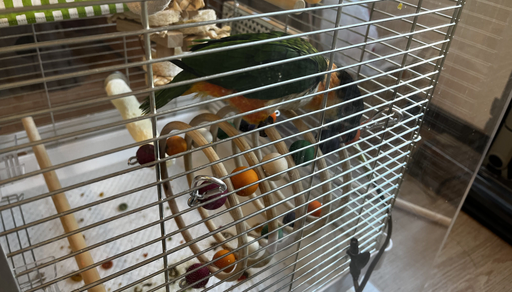

ぐぐの新しいおもちゃ

## テントに入るようになったぐぐ
ぐぐはテントの上に乗るのが好きだったのですが、
最近はちゃんとテントの中にも入るようになりました。
テントの中を通ったほうが移動が速いということにも気がついたようです。

テントに入ったぐぐ

## マスカットを食べるぐぐ
マスカットをもぐもぐ食べるぐぐです。
甘すぎるとあまり食べないのですが、
甘さ控えめだとガツガツ食べている印象です。

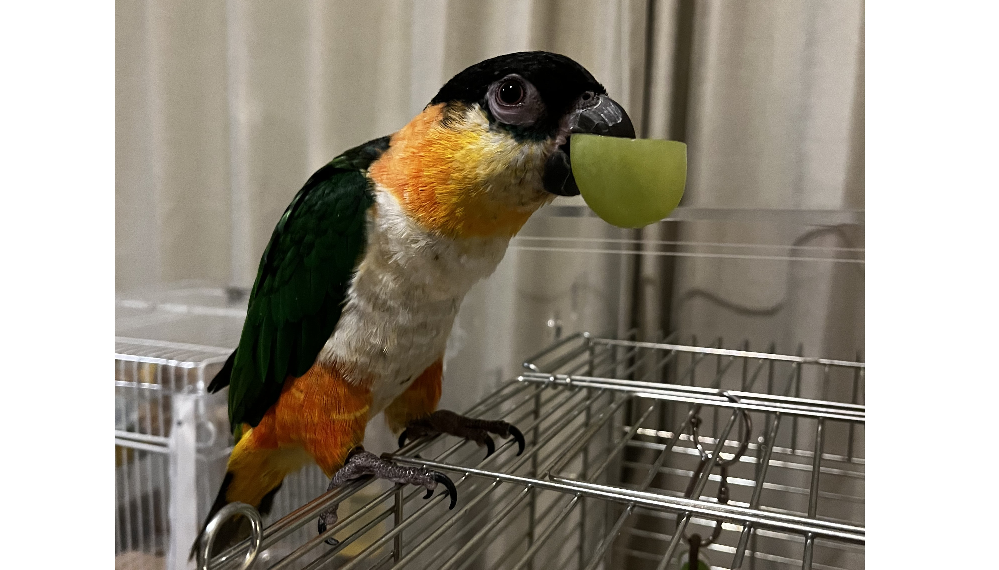

マスカットを食べるぐぐ

## 落花生も食べるぐぐ
ぐぐに落花生をあげてみたところ、
中身は捨てて殻をかじって遊んでいました。

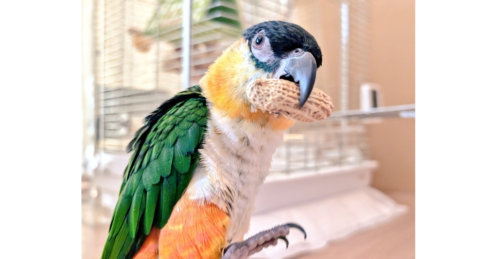

落花生をくわえるぐぐ

<video src="../../images/2024/20241026_1.mp4" controls="true" width="600"></video>

落花生を食べるぐぐ

## クッキーも食べるぐぐ
ぐぐに美味しそうなクッキーをあげてみたら、
嬉しそうにガジガジしていました。

クッキーを食べるぐぐ

## 体重計に乗れるようになったぐぐ
我が家での生活に慣れてきてくれたのか、
ぐぐも体重計に乗れるようになってきました。
現在はだいたい130g～135gくらいで安定しています。

体重計に乗るぐぐ↓

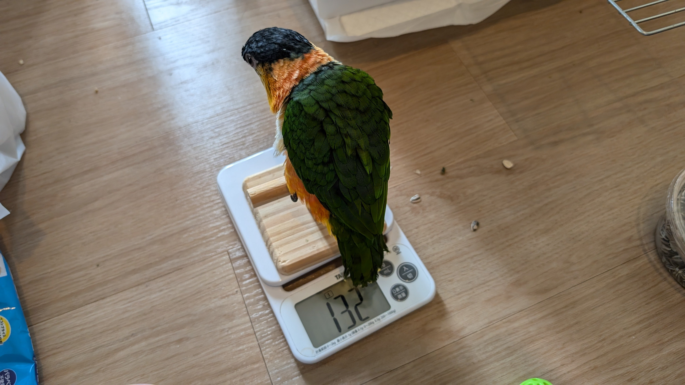

体重計に乗るぐぐを違う角度から↓

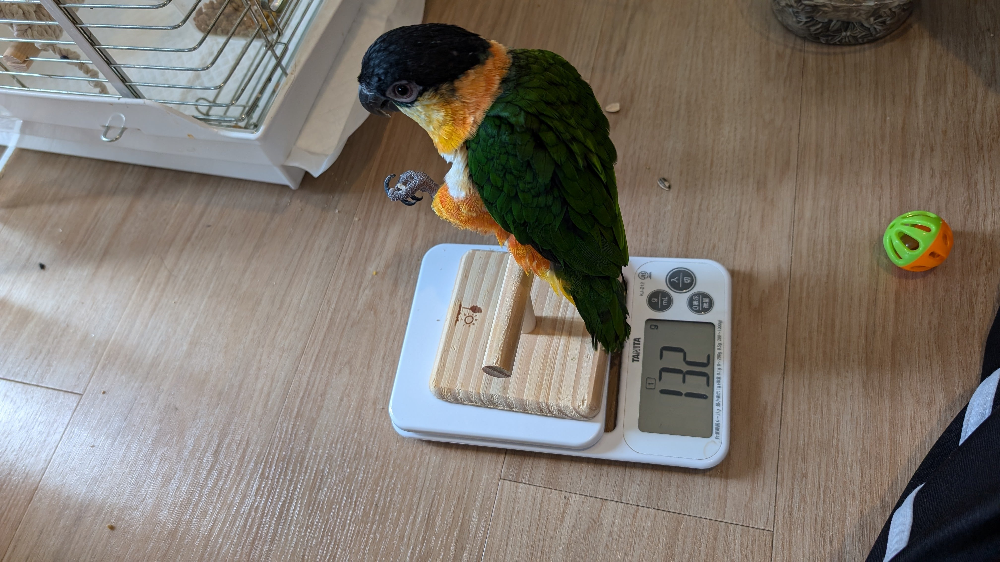

体重計に乗るぐぐ2

## おもちゃを壊してご満悦なぐぐ
木製のおもちゃを鳥籠に取り付けてあげていたのですが、
最近のぐぐはおもちゃでアクロバティックに遊んでいて、
その勢いでおもちゃを壊してしまいました。
ぐぐは楽しそうなので良かったです。
壊したおもちゃを見せてくれたりもします。

おもちゃを壊してご満悦なぐぐ

## 新聞が大好きなぐぐ
床で遊ぶようになったぐぐに新聞紙をあげたところ、
破いて遊んでいました。
新聞紙が大好きなようです。

新聞紙をかじるぐぐ↓

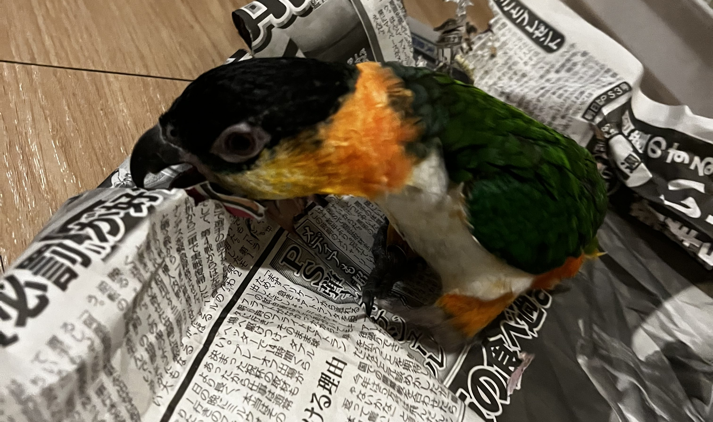

新聞紙をかじるぐぐ

新聞紙を鳥籠の上に引き上げるぐぐの動画↓

<video src="../../images/2024/20241026_3.mp4" controls="true" width="600"></video>

新聞紙を鳥籠の上に引き上げるぐぐの動画

## マラカスが大好きなぐぐ
ぐぐは音が鳴るおもちゃも好きなようでマラカスで遊んでくれています。

マラカスで遊ぶぐぐの動画↓

<video src="../../images/2024/20241026_2.mp4" controls="true" width="600"></video>

マラカスで遊ぶぐぐ

## 発情期かもなぐぐ
ぐぐは発情期なのか手を近づけると吐き戻しのような動きをします。

ぐぐの吐き戻し的動作の動画↓

<video src="../../images/2024/20241026_5.mp4" controls="true" width="600"></video>

発情期かもなぐぐ

## 鳥籠の中で遊ぶぐぐ
我が家に来たばかりの頃は鳥籠の中でもジッとしていることが多かったのですが、
最近はおもちゃで遊んだり、
鳥籠の上につり下がったりして、
楽しそうに過ごしてくれています。

ぐぐが鳥籠内で遊んでいる動画↓

<video src="../../images/2024/20241026_6.mp4" controls="true" width="600"></video>

ぐぐが鳥籠内で遊んでいる動画

## 貫禄のれもん
れもんは生後5ヶ月をむかえてどんどん大人になっていっています。
最近は貫禄も出てきて将来有望です。

睨むれもん↓

睨むれもん

大人な表情のれもん↓

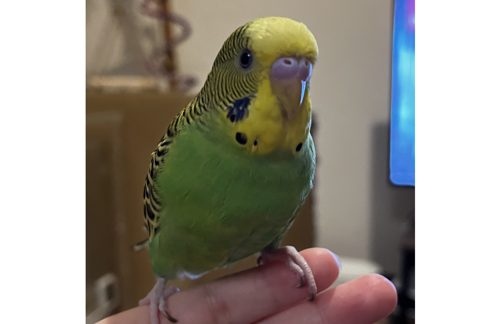

大人な表情のれもん

貫禄のれもん↓

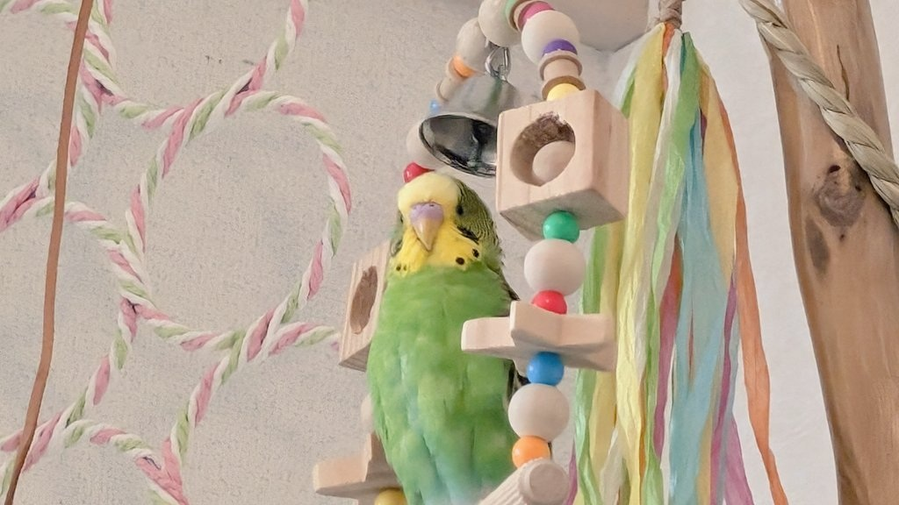

貫禄のれもん

## にょろにょろなれもん
なぜか身体がヘビのようにぐにゃぐにゃしているれもんです。

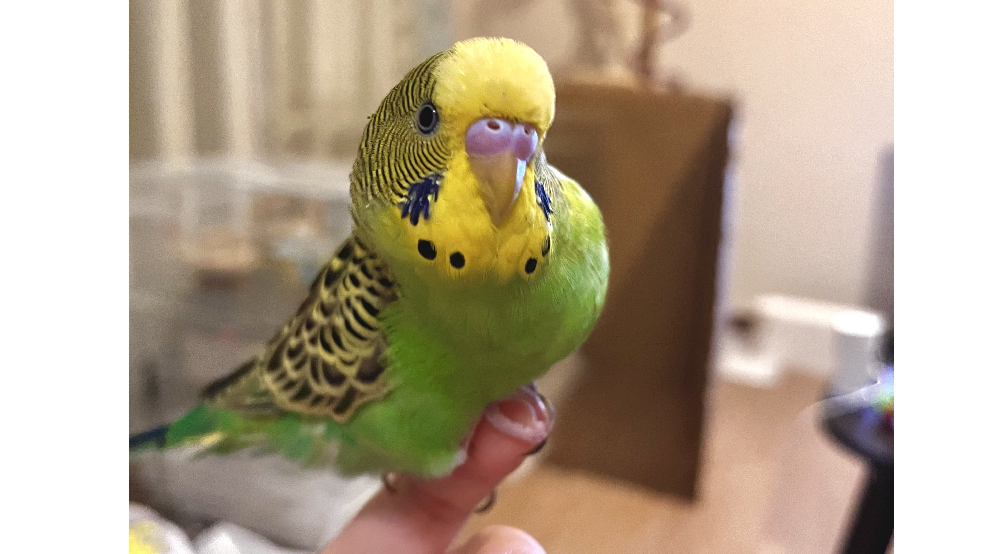

にょろにょろなれもん

## 「どしたの？れもん」と喋るれもん
れもんに「どうしたの？れもん」と声をかけていたからか、
れもんも「どしたの？れもん」と喋るようになりました。

喋るれもんの動画↓

<video src="../../images/2024/20241026_4.mp4" controls="true" width="600"></video>

喋るれもんの動画

## れもんとぐぐの邂逅
ぐぐが床を歩くようになってれもんと近づく場面も増えています。
れもんもぐぐもお互いに気にはなっているようです。

れもんとぐぐの邂逅↓

れもんとぐぐの邂逅

れもんとぐぐの邂逅2↓

れもんとぐぐの邂逅2

## おわりに
今週もれもんとぐぐは元気に過ごしていました。
れもんはどんどん大人になっていき、
ぐぐはどんどん我が家に慣れてきています。
このまま病気や怪我になることなく、
元気に成長してくれることを願っています。
それでは、また。

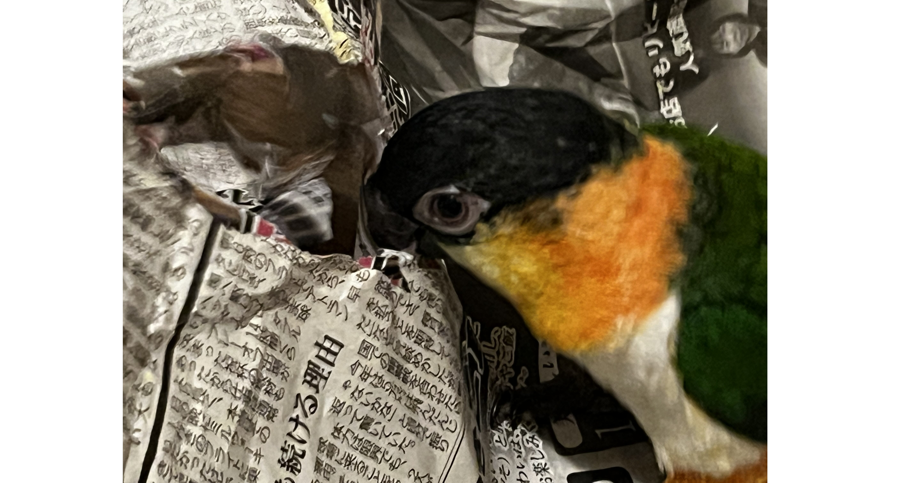

もっと新聞紙をかじるぐぐ