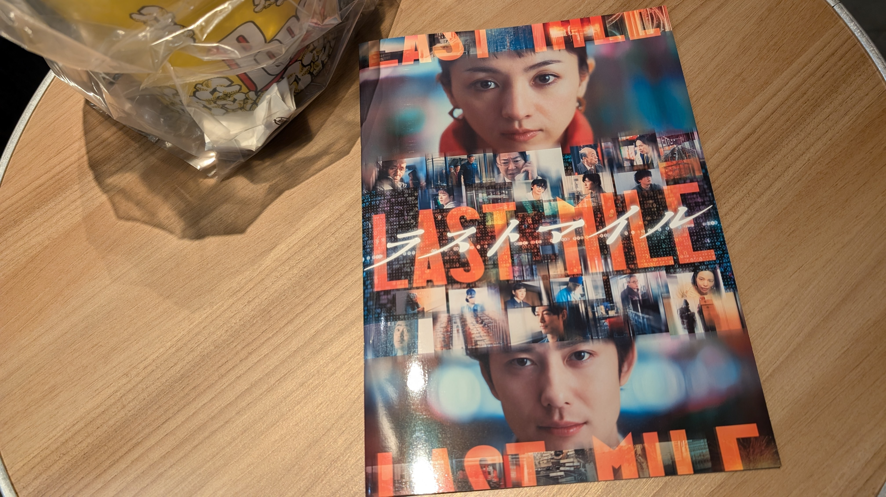

# メタデータ
- title=映画日記『ラストマイル』感想【ネタバレあり】
- description=月に1回程度は映画館に行って映画を観てブログに感想を書きたいという気持ちが表れの映画日記です。今回は『ラストマイル』を観てきました。
- date=2024年10月27日（日）
- update=2024年10月27日（日）
- math=false
- tag=movie

## はじめに
2024年8月23日に公開された映画『ラストマイル』を映画館で観てきました。
本作品の監督と脚本、プロデューサーは『アンナチュラル』や『MIU404』と同じく塚原あゆ子さんと野木亜紀子さん、そして新井順子さんです。
妻から『アンナチュラル』も『MIU404』もおすすめしてもらって観たことがあって、
本作品も妻からおすすめしてもらって一緒に観てきました。

塚原さんの作品は物語の構成がしっかりしていて、最初から最後までずっとおもしろい（楽しくもあり、興味深くもある）ので、
本作品も楽しみでした。
そして観終わった感想としてはめちゃくちゃおもしろかったです。
作品の完成度の高さに感動すらしています。
とてもおすすめなので、まだ観ていない方はぜひ観ていただきたいです。

この記事では『ラストマイル』の感想を雑にまとめていきます。

パンプレット買いました↓

パンプレット

### 公式サイト
下記が映画『ラストマイル』の公式サイトです。

https://last-mile-movie.jp/

ラストマイル公式サイト

### YouTube
YouTubeに投稿されている公式PVです。

https://www.youtube.com/embed/o1Yc-GM8GOk

## 注意
ネタバレがあります。

## 『ラストマイル』の感想【ネタバレあり】

### 作品の完成度が高い
まずは何よりも映画としての完成度が高いです。
ずっとおもしろいです。
冒頭では世界観を説明する部分は最小限にとどめて、
さっそく事件を発生させて物語に入り込めるようになっています。
伏線の張り方もさりげなく、そして綺麗に回収されます。
『アンナチュラル』や『MIU404』もかなりおもしろかったですが、
本作品ではさらに物語が洗練されているような印象を受けました。

### 犯人が表に出てこなくて凄い
本作品のように大きな事件が発生するような話の場合、
犯人がかなり重要な役割を持つわけですが、
本作品では犯人は本筋には登場しません。
もちろん犯人の存在は本作品に大きく影響しています。
しかし、作品の本筋では一度も登場せず、主人公の過去や、事件の真実の中でしか登場しません。
事件や犯人に大きく関わっている人物も病院で寝たきりであり、
同じく作品の本筋には絡んできません。
犯人というよりは、事件の謎と真実に焦点を当てるように作品を作っているように感じます。

### メインの登場人物が少なめで凄い
本作品の主な登場人物は、
主人公の舟渡エレナ、その相棒的な立ち位置の梨本孔、
会社の上層部の五十嵐、警察の二人、配送会社の方々くらいです。
先ほど書いたとおり犯人サイド側の二人は過去の話の中でしか登場しません。
メインの登場人物が少ない代わりに、
『アンナチュラル』や『MIU404』の登場人物たちが出てくるのと、
そして何より配達員や倉庫内で働く人たちが登場します。
どちらかというと配達する人や倉庫で働く人たちにも焦点を当てようとしているように感じました。

### 爆弾の表現が凄い
これは映画館だからというのもありますが、
爆弾の表現が凄いです。
このシーンで爆発するんだろうなと分かっていても、
めちゃくちゃビックリします。
爆弾の表現にもコンプラみたいなものがあるかもしれませんが、
しっかり爆弾の脅威が伝わるように表現されていると思います。
爆弾の爆発によって事件の大きさが直に伝わってきます。

### 倉庫の映像が凄い
本作品では世界的なショッピングサイトの物流倉庫が題材の一つとなっていますが、
その倉庫内の映像がしっかり作りこまれていると思います。
今時の物流倉庫という感じで、
大きな倉庫内で管理されている商品が、
ロボットによって回収・運搬されて、
長大なベルトコンベアを流れて運ばれていく様子が作品を通じて度々登場します。
物流倉庫の様子がすべてセットとして用意されているのか、
どこかしらはCGで表現しているのかは分かりませんが、
かなりクオリティの高い映像だったと思います。

### 社会問題も取り扱っていて凄い
本作品は物語としておもしろいだけではなく、
人類の物流問題や、人間の命よりも会社の利益が優先されることなど、
人類社会が抱えている問題についても提起しています。
たとえば、多くの人間が安く早く荷物を受け取れるという恩恵を受けるために、
荷物を配達するドライバーの方々が犠牲になっているというようなことが本作品では表現されています。
また、配達員の一人に元々は質の高い家電製品を作っていた方が登場しますが、
その方も質は低いけど大量生産されて安い他社の家電製品に負けて職を失った過去を持っていたりして切なくなります。

### 『アンナチュラル』と『MIU404』の人物たちもしっかり登場して凄い
主役級の方々がたくさん登場するので豪華さが凄いです。
『アンナチュラル』や『MIU404』も好きな作品なので、
それぞれの作品の人物たちが登場した時はテンションが上がりました。
ただ一つ気になるのは、
『アンナチュラル』や『MIU404』を知らずにこの作品を観た方は「なんかメインじゃないところでも俳優陣がものすごく豪華だなぁ～」みたいな感じるのでしょうか。
それとも本作品を観る方は当然のように『アンナチュラル』や『MIU404』を観ているのでしょうか。
気になります。

### パンプレットも買って良かった
基本的に映画を観たらパンフレットを買うようにしているのですが、
本作品のパンフレットも良かったです。
各俳優さんや監督、脚本、プロデューサーの方のメッセージが載っています。
パンフレットを読むと『アンナチュラル』や『MIU404』はすでに終わった過去の作品ではなく、
今もまさに生き続けている作品なのだと実感できます。

## おわりに
この映画日記では『ラストマイル』の感想について雑にまとめました。
特に日記としておもしろみはないかもしれませんが、
少しでも本作品の感想が伝わっていてれば嬉しいと思います。
とてもおもしろい作品でした。
またいつか見返せたらと思います。
それでは、また。
