# メタデータ
- title=我が家のインコ「れもん&ぽぽ&ぐぐ」の日記16 : れもんが本に掲載されたり、愛鳥祭に行ったりなど
- description=2024年11月17日（日）までのセキセイインコ「れもん」とズグロシロハラインコ「ぐぐ」の様子を記録しておきます。
- date=2024年11月17日（日）
- update=2024年11月17日（日）
- math=false
- tag=lemon

## はじめに
11月も半ばに入って2024年ももう後一ヶ月半になりました。
どんどん冬が近づいてきていて寒い日も多くなっていますが、
我が家の鳥たち、セキセイインコのれもんとズグロシロハラインコのぐぐは今日も元気に過ごしています。
インコは寒さに弱いとのことで暖房も鳥用ヒータもフル稼働です。
今回も我が家の鳥たちの様子を皆様にお届けしますので、よろしくお願いします。

れもんの残像↓

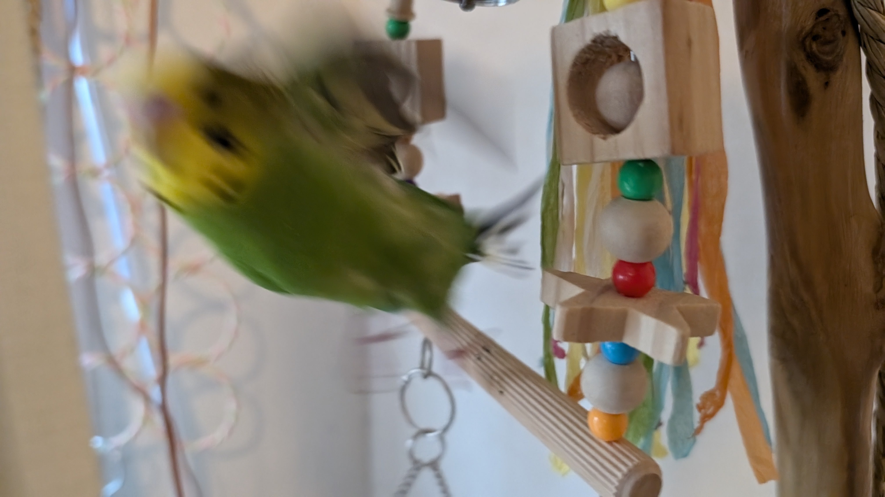

れもんの残像

## 関連記事

### 前回の日記
2024年10月26日の日記です。

https://yusukekato.jp/html/2024/1026.html

我が家のインコ「れもん&ぽぽ&ぐぐ」の日記15 : 落花生、新聞紙、れもんとぐぐの邂逅

### 我が家におけるインコの飼育方法
2024年現在の我が家でのインコの飼育方法をまとめました。

https://yusukekato.jp/html/2024/1025.html

インコの飼い方と注意点（2024年版）

## 注意点
私たちは鳥を初めて飼うため飼育方法に誤りがあるかもしれません。
これからセキセイインコやズグロシロハラインコなどを飼うという方はこのブログの情報を鵜呑みにせず、参考程度に読んでいただけますと幸いです。
いかなる場合でも責任は負えませんのでご了承ください。

## れもんが本に掲載された
れもんの写真が細川先生の『インコ・オウムの心を知る本』（緑書房）に掲載されました。
Twitterで細川先生が鳥の写真を募集していて、
妻が応募してみたところ、本当に掲載していただくことになりました。
ちゃんとした書籍にれもんが載っていて、遠い未来まで残るというのはとても嬉しいことですね。
ありがとうございます。

れもんと本

## 愛鳥祭に行ってきた
2024年11月16日～17日に埼玉県の大宮で開催された愛鳥祭に行ってきました。
鳥の保護活動をしている団体や鳥関連の企業の方々、
オリジナルの鳥グッズを作っている方々、
そして鳥好きな方々などがたくさん集まっていて、
とても楽しいイベントでした。
欲しかった物がたくさん買えたので大満足です。

会場の様子

HOEIさんのヒーターカバーです。二個目です。

HOEIさんのヒーターカバー

防災のための書籍も買えました。サインもいただけて嬉しい限りです。

鳥防災本

鳥がいても大丈夫な消臭スプレーを購入しました。
妻がずっと欲しがっていたので手に入って良かったです。

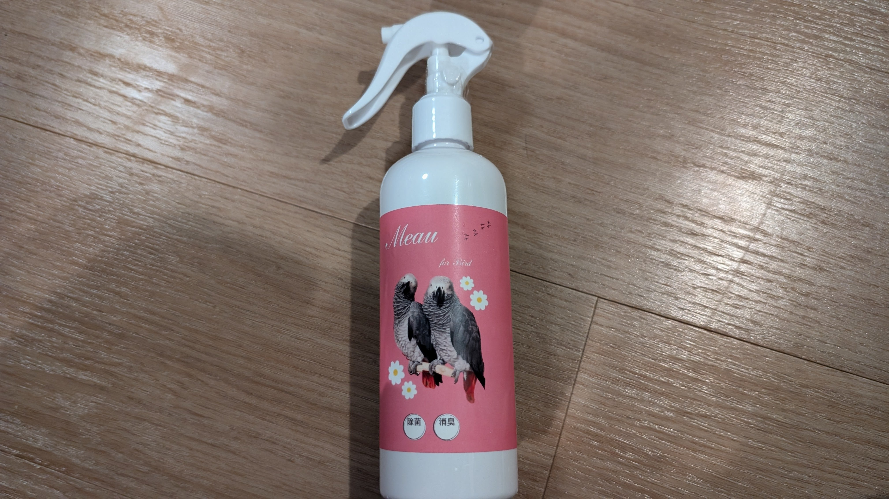

消臭スプレー

鳥たちのおもちゃをたくさん買いました。

鳥たちのおもちゃ

p-jetさんの鳥カレンダーです。
p-jetさんのTシャツやトートバックもお気に入りです。

p-jetさんの鳥カレンダー

他にも鳥の食べ物や栄養剤なども買いました。

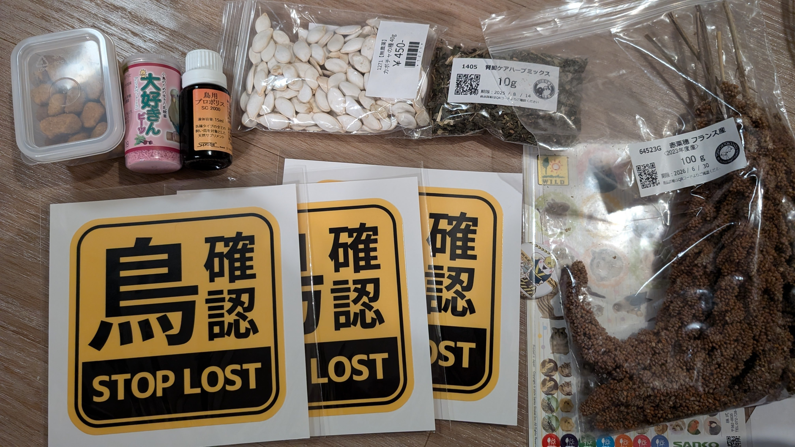

鳥の食べ物や栄養剤など

## 今週のれもん
今週もれもんは元気です。
鏡に吐き戻しをしてしまったりもありましたが、
とりあえずは元気に過ごしています。

振り向き美人↓

振り向き美人

襟の中のれもん↓

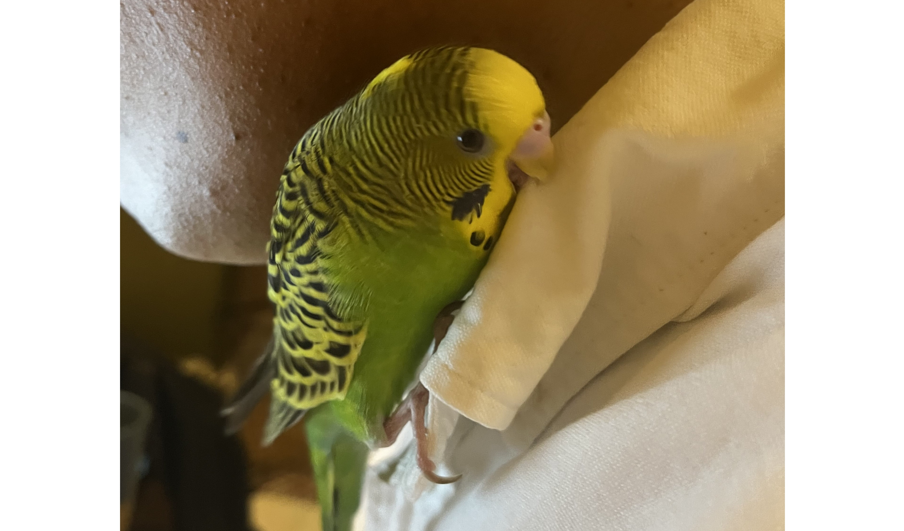

襟の中のれもん

ベルの中のれもん↓

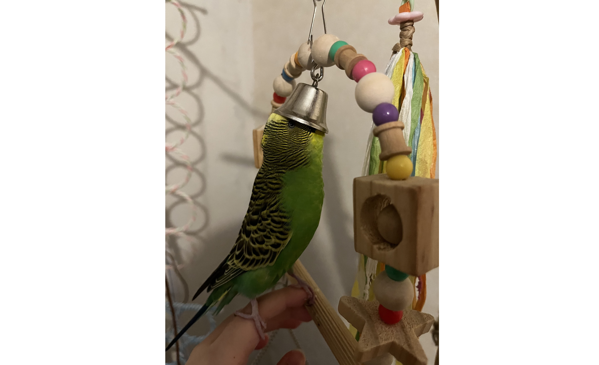

ベルの中のれもん

綺麗な心のれもん↓

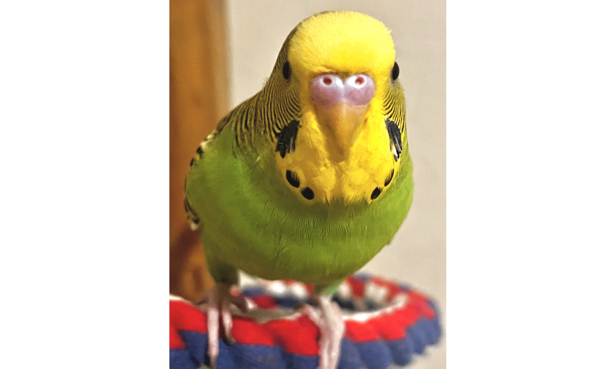

綺麗な心のれもん

自分から体重計に乗るれもん↓

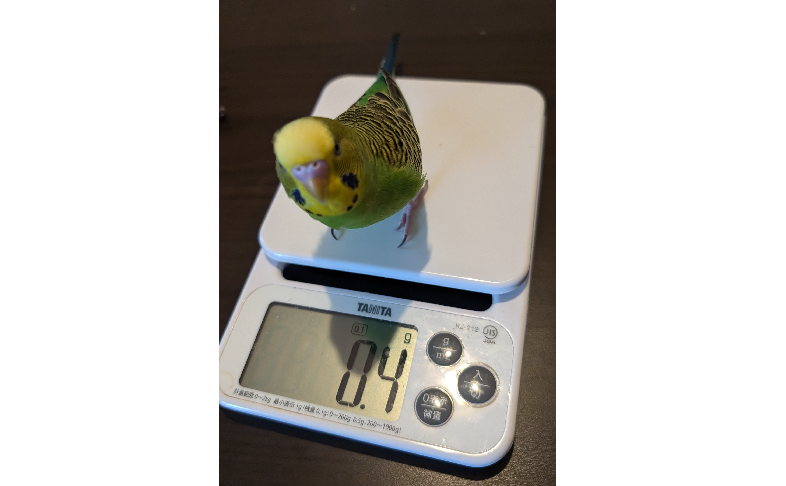

自分から体重計に乗るれもん

## 今週のぐぐ
ぐぐも毎日楽しく遊んでいます。
行動範囲もどんどん広くなっていて、隣の部屋までトコトコ歩いたりしています。

新しく買った輪っかのおもちゃで遊ぶようになったぐぐ↓

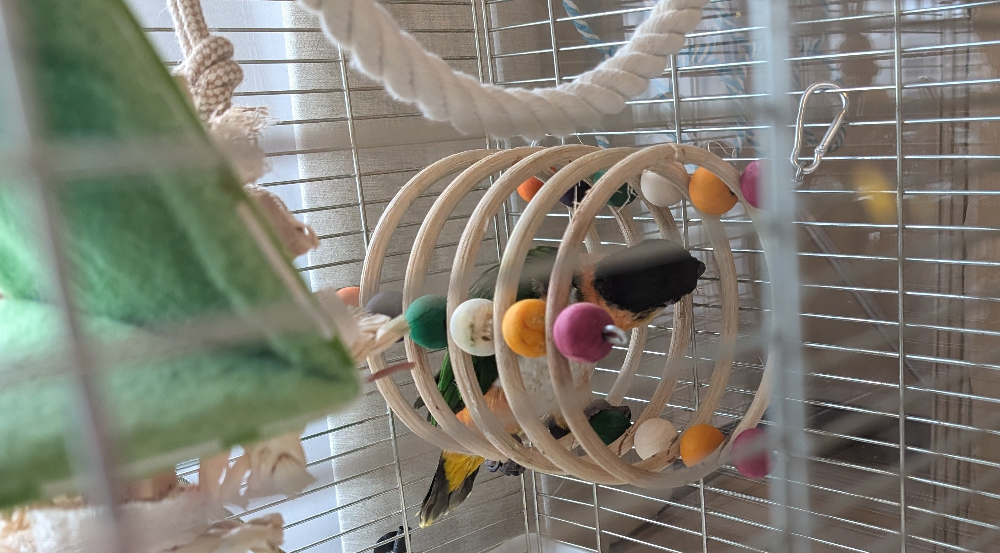

新しく買った輪っかのおもちゃで遊ぶようになったぐぐ

輪っかに慣れたぐぐ↓

輪っかに慣れたぐぐ

れもんのおもちゃでも遊ぶぐぐ↓

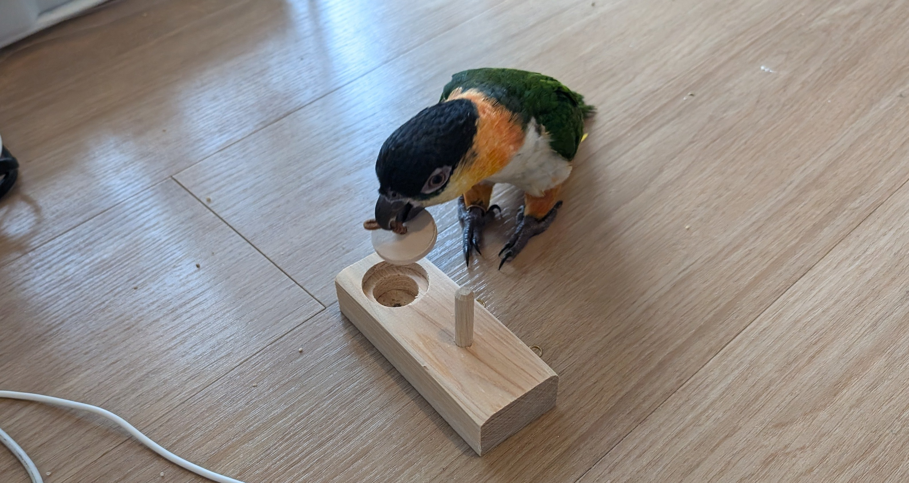

れもんのおもちゃでも遊ぶぐぐ

ぐぐの正面頭部↓

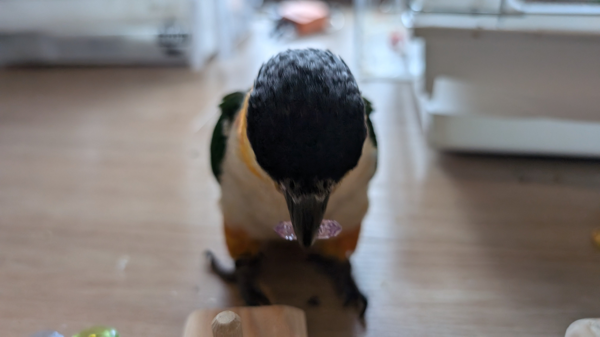

ぐぐの正面頭部

懸垂ぐぐ↓

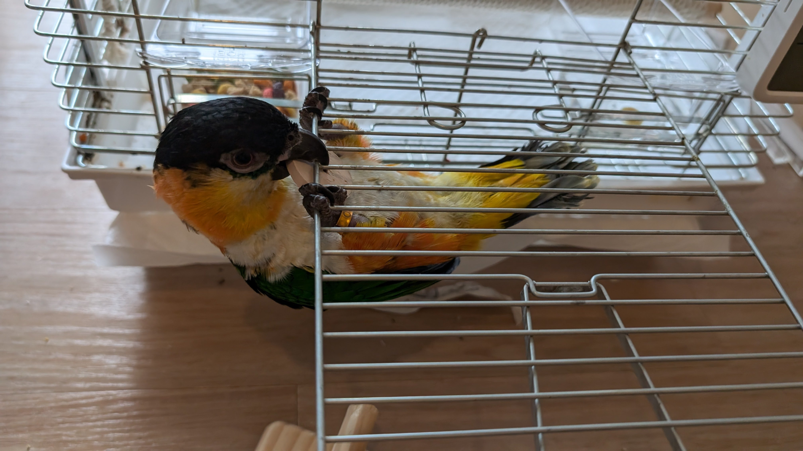

懸垂ぐぐ

撫でられるぐぐ↓

撫でられるぐぐ

れもんの遊具にも乗ってみるぐぐ↓

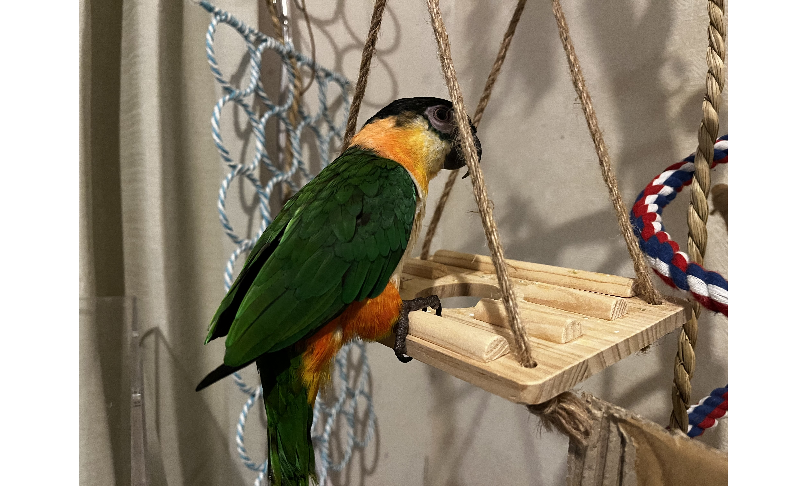

れもんの遊具にも乗ってみるぐぐ

おもちゃでゴロンゴロンしているぐぐ↓

おもちゃでゴロンゴロンしているぐぐ

## おわりに
今週も、れもんもぐぐも相変わらず元気に暮らしていました。
もうすぐでれもんは生後半年になるのでお祝いしたいですね。
半年というのはセキセイインコにとってはかなり大人なので、
れもんもかなり大人ということです。
鳥たちが怪我や病気で苦しむことなく、これからも成長してくれることを願っています。
それでは、また。

撫でられてゴロンゴロンしているぐぐ↓

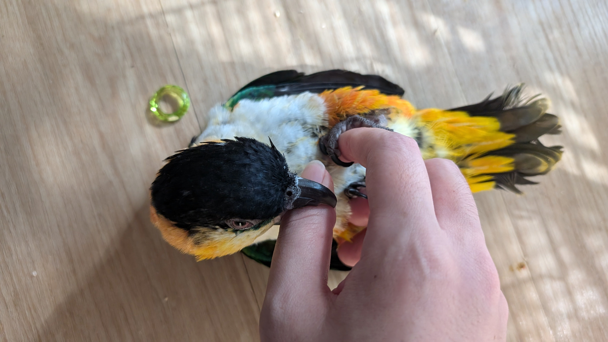

撫でられてゴロンゴロンしているぐぐ