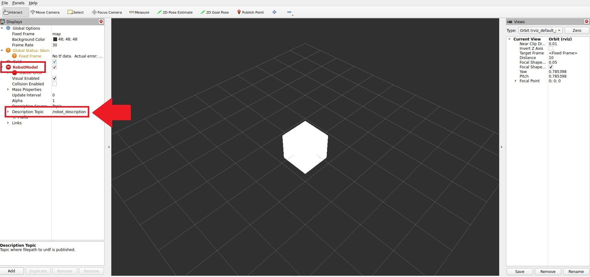
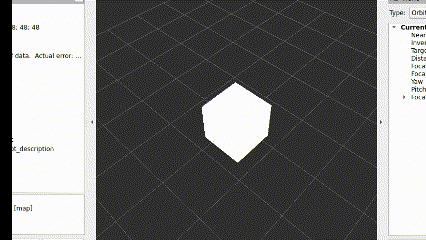

# メタデータ
- title=ROS 2シェル芸：URDF置換
- description=QiitaのROS 2 Advent Calendar 2024の18日目の記事として、URDFを置換するシェル芸を紹介します。
- date=2024年12月01日（日）
- update=2024年12月06日（金）
- math=false
- tag=ros2

## はじめに

### アドベントカレンダーについて

この記事はQiitaのROS 2 Advent Calendar 2024の18日目の記事です。
12月1日から12月25日まで毎日ROS 2に関係した記事が投稿されるはずなので、そのほかの記事については下記のリンクからカレンダーをご確認ください。

https://qiita.com/advent-calendar/2024/ros2

ROS 2 Advent Calendar 2024

### 記事の概要

この記事ではURDFを置換してRVizで表示して遊ぶシェル芸を紹介します。
やはりROS 2においてURDFは必要不可欠な要素ではありますが、
イマイチどうやっていじっていいのかよく分からないことも多々あります。
また、無理やりでもいいからURDFを書き換えたいというケースもあるかもしれません。
そこで今回はとりあえずURDFを書き換えてみて、後のことはそれから考えようというコンセプトでやっていきます。
ぜひお付き合いいただけると嬉しいです。

とはいえ本題に入る前に、まずはあらゆる読者を想定してそれぞれのキーワードを簡単に説明しておきます。

### ROS 2とは何か

ROSはRobot Operating Systemの略称で、ロボットを動かすためのミドルウェアです。
豊富なライブラリやツール、コミュニティなどが備わっていてとても便利だと思います。
詳しくは下記の公式ドキュメントをご覧ください。

https://docs.ros.org/en/jazzy/

ROS 2 Documentation

### シェル芸とは何か

シェルのワンライナーで様々なタスクをこなすことを指します。
詳しい定義や情報については下記のページをご覧ください。

https://b.ueda.tech/?page=01434

シェル芸のトップページ

### URDFとは何か

URDFはUnified Robot Description Formatの略称で、ロボットの情報を記述するためのXML形式のフォーマットのことです。主にROSで使われています。

https://wiki.ros.org/urdf

URDFのwikiページ

### 参考資料

下記が参考資料です。

https://qiita.com/yami_buta/items/2b514dc469f364be36ba

Qiita - ROS コマンドラインツール シェル芸

https://qiita.com/ykpages/items/07efa0d0d81e6d261747

Qiita - turtlesimの亀をなるべく簡単にたくさん出したい

https://qiita.com/ykpages/items/fd99751f176f3e3b5c27

Qiita - シェル芸で遊ぶROS 2

## URDFを置換してRVizで表示する

それではさっそく始めていこうと思います。

### 最低限のURDFを作成

まずは下記の内容をコピペしてcube.urdfを作成します。
不完全なURDFかもしれませんが、とりあえずはこれで遊べます。

```
<robot name="cube">
  <link name="cube_link">
    <visual>
      <geometry>
        <box size="1 1 1"/>
      </geometry>
    </visual>
  </link>
</robot>
```

### RVizでURDFを表示 

作成したcube.urdfをRVizで表示してみます。
robot_state_publisherにcube.urdfを渡すことで、robot_descriptionトピックとtfトピックを配信してくれます。

端末1で実行

```
ros2 run robot_state_publisher robot_state_publisher --ros-args -p robot_description:="$(cat cube.urdf)"
```

端末2で実行

```
rviz2
```

RVizが起動したら`Add`ボタンをクリックして`By display type`から`RobotModel`を追加します。その後、追加された`RobotModel`の`Description Topic`で`robot_description`を選択します。

下記の画像のように白い立方体が表示されたら成功です（tf関連でエラーが出ているかと思いますが無視します）。



RVizの様子

### 立方体をちょっと伸ばす

それでは本題のシェル芸によるURDFの置換です。
ここでは下記のコマンドを実行して立方体のX軸方向のサイズを1から2に置換します。

端末3で実行

```
ros2 topic echo --once /robot_description | sed 's/"/\\"/g' | awk 'NR==1' | sed "s/1/2/" | xargs -I@ ros2 topic pub --once /robot_description std_msgs/msg/String "@" --qos-durability transient_local
```

下記がコマンドの簡単な解説です。

- ros2 topic echo --once /robot_description: robot_descriptionトピックを一度だけ出力
- sed 's/"/\\"/g': URDFを正しくパースできるように、ダブルクウォートをエスケープして消えないようにする
- awk 'NR==1': 一行目だけを出力
- sed "s/1/2/": 最初の1（x軸方向のsize）を2に置換
- xargs -I@ ros2 topic pub --once /robot_description std_msgs/msg/String "@": 置換したURDFをrobot_descriptionトピックとして配信
- --qos-durability transient_local: QoSのオプション。パブリッシャ側で一時的にデータを保存してサブスクライバ側が受け取るタイミングを調整できるらしい（これをつけないとうまく動かなかった）

下記のGIF画像のように立方体が少し伸びたら成功です。



ちょっと伸びる様子

### 立方体をもっと伸ばす

次に応用として立方体をもっと伸ばしてみます。
先ほどの置換の処理を少し書き換えた下記のコマンドを実行します。

端末3で実行

```
ros2 topic echo --once /robot_description | sed 's/"/\\"/g' | awk 'NR==1' | awk '{for(i=1;i<=9;i++){sub(1,i);print $0;sub(i,1)}}' | xargs -I@ ros2 topic pub --once /robot_description std_msgs/msg/String "@" --qos-durability transient_local
```

置換の処理を下記のように書き換えました。
ここではawkのfor文でX軸方向のsizeを1から9まで順番に置換しています。

```
awk '{for(i=1;i<=9;i++){sub(1,i);print $0;sub(i,1)}}'
```

下記のGIF画像のように立方体がもっと伸びたら成功です。


RVizでもっと伸ばした様子

## 色の置換にも挑戦

最後に、立方体の色を置換することにも挑戦してみます。
しかしros2 topic pubだとうまくいかなかったので、
ros2 param setを使用します。

### URDFを作成

まずは下記のようなcube2.urdfを作成します。

```
<robot name="cube">
  <link name="base_link"/>
  <link name="cube_link">
    <visual>
      <geometry>
        <box size="1.0 1.0 1.0"/>
      </geometry>
      <material name="color">
        <color rgba="1.0 0.0 0.0 1.0"/>
      </material>
      <origin xyz="0.0 0.0 0.0" rpy="0.0 0.0 0.0"/>
    </visual>
  </link>
  <joint name="cube_joint" type="fixed">
    <parent link="base_link"/>
    <child  link="cube_link"/>
  </joint>
</robot>
```

### RVizでURDFを表示 

作成したcube2.urdfをRVizで表示します。
方法は先ほどの立方体を伸ばした時と同じです。

端末1で実行

```
ros2 run robot_state_publisher robot_state_publisher --ros-args -p robot_description:="$(cat cube2.urdf)"
```

端末2で実行

```
rviz2
```

立方体を伸ばした時と同じようにRViz上で設定を行って下記のように赤い立方体を表示できたら成功です。
ただし、`Fixed Frame`は`base_link`を指定します（エラーも消えるかと思います）。


RVizの様子

### 色を置換

ros2 param setの使い方は下記の通りです。

```
ros2 param set /robot_state_publisher robot_description "$(cat cube2.urdf)"
```

下記のコマンドを実行すると色の値が置換されます（シェル芸ではないかもです）。

```
for i in {9..0};do sed -i "s/rgba=\"[0-9]*.[0-9]*/rgba=\"0.$i/" cube2.urdf;ros2 param set /robot_state_publisher robot_description "$(cat cube2.urdf)";done
```

ここではcube2.urdfを直接置換しています。

下記のGIF画像のように立方体の色が変われば成功です。


色置換の様子

## おわりに

以上、URDFを置換してRVizで表示するシェル芸の紹介でした。
正しい行いかはさておき、URDFを書き換えたい際には何かしら参考になると嬉しい限りです。
まだまだURDFに限らずROS 2は分からないことだらけではありますが、
遊びながら学んでいけたらと思います。
ここまで読んでいただき誠にありがとうございました。
それでは、また。
