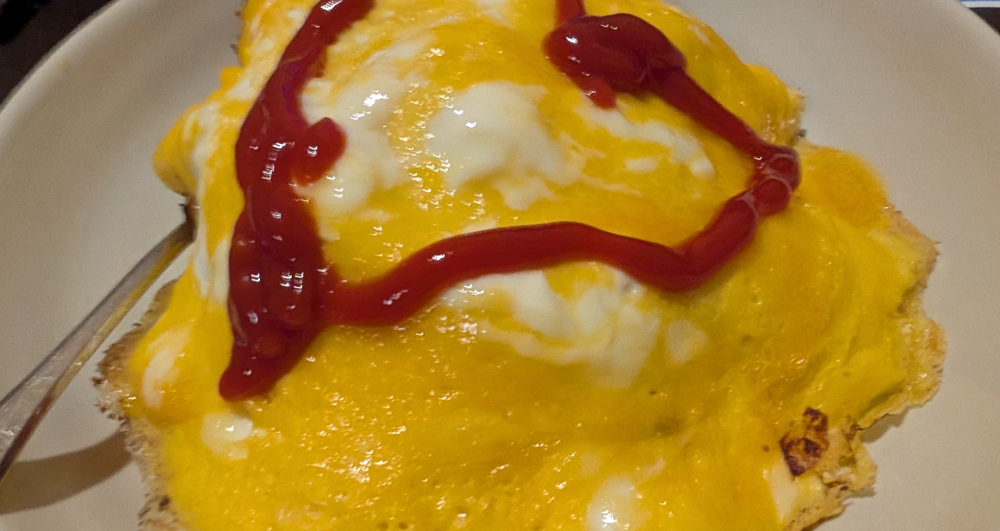
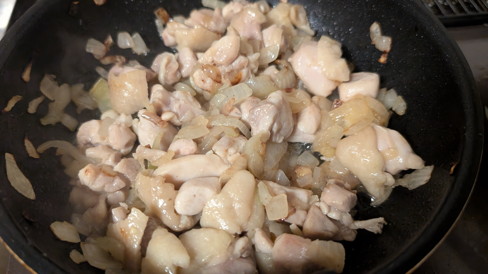
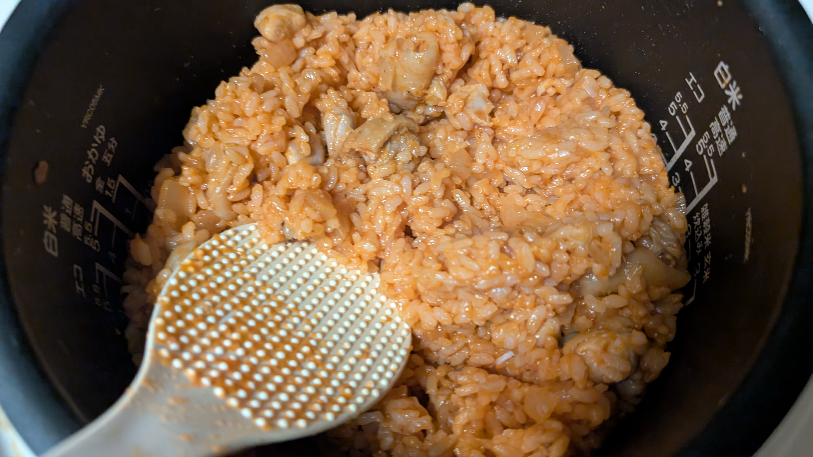

# メタデータ
- title=料理日記：オムライス
- description=たまに行う料理の記録を残しておきます。今回はオムライスです。
- date=2024年12月7日（土）
- update=2024年12月7日（土）
- math=false
- tag=cooking

## はじめに
オムライスを作ったので記録に残しておきます。

オムライス

## 豆腐春巻きの作成手順
妻の作成手順を参考。

### 必要なもの
- 炊いた米
- 鶏肉
- 玉ねぎ
- ケチャップ
- 卵
- 塩
- コンソメ
- 油
- フライパン
- 皿

### やること
鶏肉と玉ねぎをいい感じに切っていい感じに炒めます。

鶏肉と玉ねぎ

鶏肉と玉ねぎとケチャップとコンソメを炊いた米に混ぜてチキンライスを作成します。

チキンライス

卵2個に塩を入れてフライパンで熱します。

卵

チキンライスに卵を乗せたら完成です。

### 完成例
こちらが完成したオムライスです。

オムライス

## おわりに
今回はオムライスを作成しました。
美味しかったです。
それでは、また。
