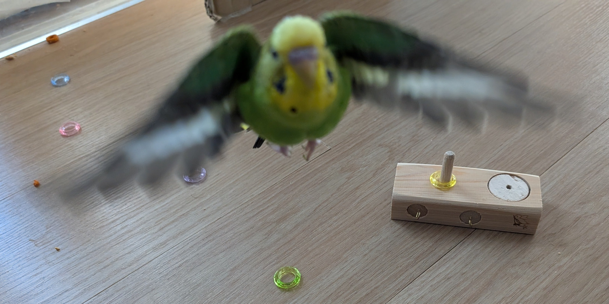
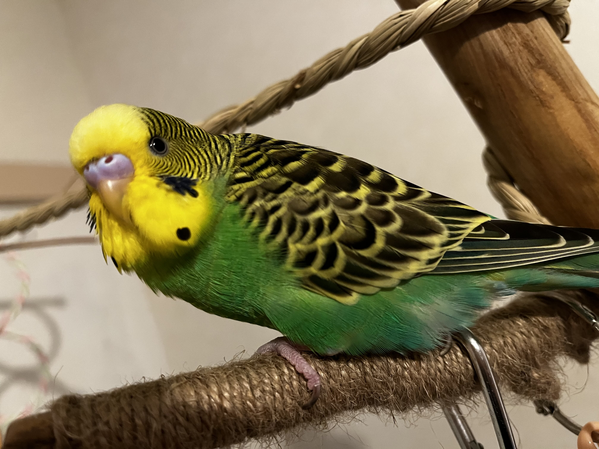
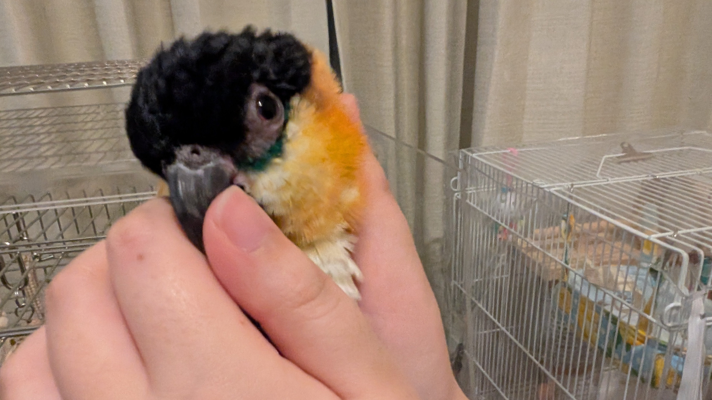
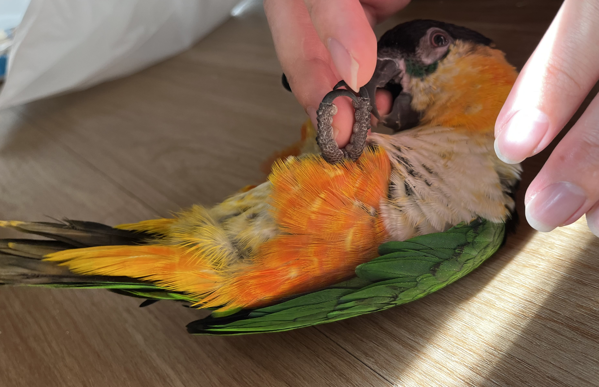
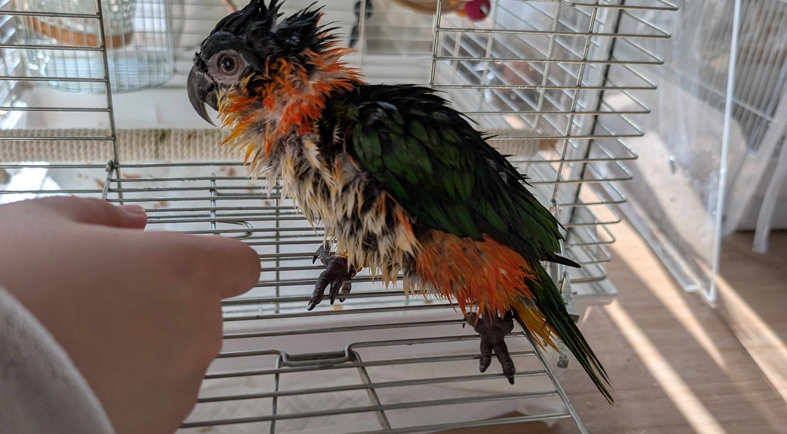
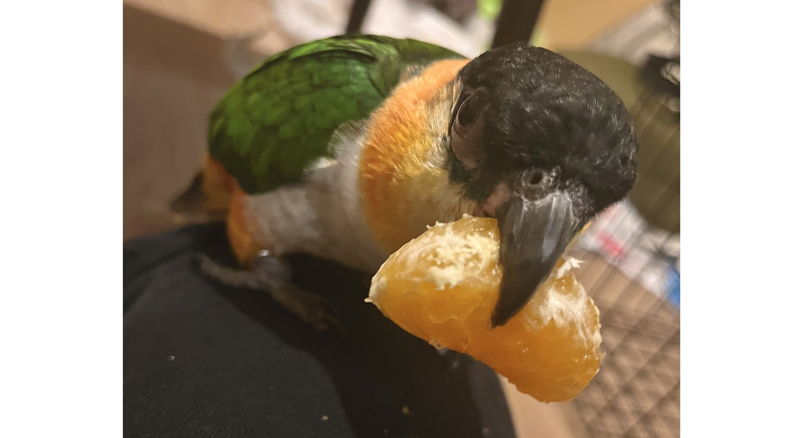
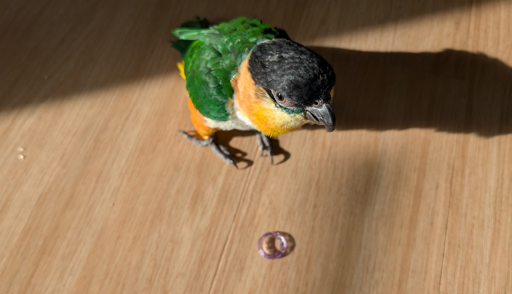

# メタデータ
- title=我が家のインコ「れもん&ぽぽ&ぐぐ」の日記17 : れもんもぐぐも平和な日々を送っています
- description=2024年12月8日（日）までのセキセイインコ「れもん」とズグロシロハラインコ「ぐぐ」の様子を記録しておきます。
- date=2024年12月8日（日）
- update=2024年12月8日（日）
- math=false
- tag=lemon

## はじめに
12月に入って2024年も残りわずかとなりました。
インコたちは寒さに弱いですが暖房器具をフル稼働させて、我が家のセキセイインコ「れもん」とズグロシロハラインコ「ぐぐ」も元気に過ごしています。
ぐぐは定期健診で頑張って病院に行きましたが、
特に悪いところが見つからなかったので嬉しい限りです。
今週もれもんとぐぐの記録を残していきます。

れもんの残像↓

れもんの残像

## 関連記事

### 前回の日記
2024年11月17日の日記です。

https://yusukekato.jp/html/2024/1117.html

我が家のインコ「れもん&ぽぽ&ぐぐ」の日記16 : れもんが本に掲載されたり、愛鳥祭に行ったりなど

### 我が家におけるインコの飼育方法
2024年現在の我が家でのインコの飼育方法をまとめました。

https://yusukekato.jp/html/2024/1025.html

インコの飼い方と注意点（2024年版）

## 注意点
私たちは鳥を初めて飼うため飼育方法に誤りがあるかもしれません。
これからセキセイインコやズグロシロハラインコなどを飼うという方はこのブログの情報を鵜呑みにせず、参考程度に読んでいただけますと幸いです。
いかなる場合でも責任は負えませんのでご了承ください。

## 今週のれもん
れもんは今週も楽しく遊んでくれています。
いつも同じおもちゃなので若干飽き始めている気もしますが、
楽しそうではあります。
定期的におもちゃは増やしていきたいですね。

おもちゃで遊ぶれもん

最近また換羽期が始まって筆毛が増えてきています。

筆毛のれもん

高い所のれもんです。
我が家に来たばかりの頃は体を触らせてくれましたが、
今となっては人間の指は噛むものと覚えてしまったようです。

高い所のれもん

おすましのれもん↓

おすましのれもん

貫禄のれもん↓

貫禄のれもん

床で遊ぶれもん↓

床で遊ぶれもん

## 今週のぐぐ
ぐぐはどんどん我が家に慣れてきていて、
人間の手に乗れるようにもなってきました。
鳥籠の中でも外でも元気に遊んでくれて何よりです。

腕に掴まるぐぐ

手に包まれるぐぐ↓

手に包まれるぐぐ

人間に持たれても大丈夫なぐぐ↓

人間に持たれても大丈夫なぐぐ

ひっくり返っても大丈夫なぐぐ↓

ひっくり返っても大丈夫なぐぐ

ぐぐは水遊びにも目覚めてきていて、
スプレーで水浴びをすると喜びます。

水遊びのぐぐ

ぐぐはみかんも大好きでよく食べます。
そのほかにもりんごもよく食べています。

みかんを食べるぐぐ

朝日の下で遊ぶぐぐ↓

朝日の下で遊ぶぐぐ

## おわりに
今週もれもんとぐぐは楽しく生活してくれています。
人間もインコたちもこの生活に慣れてきていて何でもないような日々が増えてきていると思います。
このまま人間もインコたちも病気や怪我に苦しむことなく日々を過ごせるように祈っております。
平和に生きていきたいですね。
それでは、また。

至近距離のぐぐ↓

至近距離のぐぐ