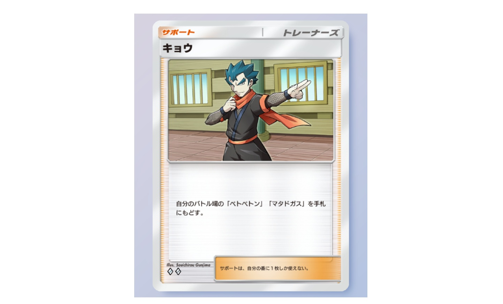
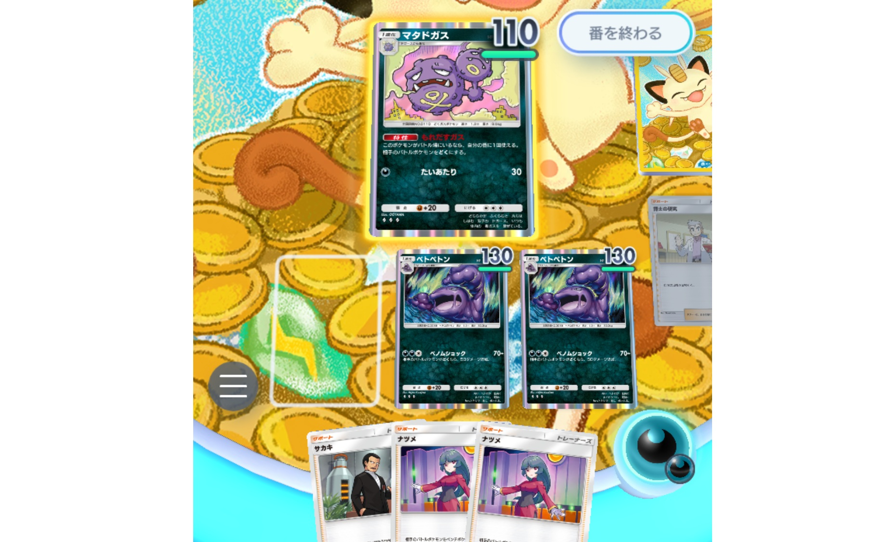

# メタデータ
- title=ポケポケブログ1：ベトベトン+マタドガスデッキをおすすめする
- description=ポケモントレーディングカードゲームポケット（ポケポケ）でベトベトン+マタドガス+キョウデッキが強いのでおすすめします。
- date=2024年12月16日（月）
- update=2024年12月22日（日）
- math=false
- tag=pokepoke

## はじめに

### 概要

ポケモントレーディングカードゲームポケット（以下、ポケポケ）で、
悪タイプのベトベトンとマタドガス、そしてサポートカードのキョウを組み合わせたデッキがそこそこ強いのでおすすめします。

ベトベトン

2024年12月17日に新しいパック「幻のいる島」が追加されて環境がまた変わってしまうかもしれませんが、何かしら参考にしていただけると嬉しいです。

### 公式サイト

下記がポケポケ公式サイトのリンクです。

https://www.pokemontcgpocket.com/ja/

ポケポケ公式サイト

## デッキレシピ
ベトベトン+マタドガス+キョウのデッキレシピです。

- ベトベター x2
- ベトベトン x2
- ドガース x2
- マタドガス x2
- キョウ x2
- 博士の研究 x2
- モンスターボール x2
- ナツメ x2
- きずぐすり x2
- サカキ x2

ベトベトンのベノムショックで相手を倒します。

ベトベトン

マタドガスは特性で相手を毒にできます。
また、エネルギー1つでワザが撃てるので強いです。

マタドガス

キョウでマタドガスを手札に戻して、ベトベトンとのコンボやHPを全回復します。

キョウ

## 直近20戦の成績
ベトベトン+マタドガス+キョウデッキの強さを計測するために、
バトル「だれかと」の「イベントマッチ」で20戦行いました。
イベントは「最強の遺伝子 エンブレムイベント1 SP」です。
もちろん上振れや下振れはあるので参考程度にご参照ください。

- 結果：20戦13勝7敗
- 【勝】草フシギバナex&ナッシーex
- 【勝】悪マタドガス&アーボック
- 【負】ピカチュウex&サンダーex
- 【勝】鋼メルメタル
- 【負】水スターミーex&フリーザex
- 【勝】炎リザードンex
- 【負】超ミューツーex
- 【勝】水スターミーex&フリーザex
- 【勝】超ミューツーex
- 【負】悪プクリンex&マタドガス
- 【負】龍カイリュー
- 【勝】闘サンドパン&オコリザル
- 【勝】超フーディンex
- 【勝】水スターミーex&フリーザex
- 【負】雷ピカチュウex
- 【負】鋼メルメタル
- 【勝】超ミューツーex
- 【勝】超ミューツーex
- 【勝】超ミューツーex
- 【勝】草フシギバナex

## このデッキの強みと弱み

### 強み
- マタドガスがエネルギー1つでワザを出せるし、特性で毒も与えられるので強い
- マタドガスで毒を与えて、キョウでマタドガスを手札に戻して、ベトベトンで120ダメージを出すというコンボがそこそこ簡単に繰り出せる
- マタドガスをキョウで手札に戻してまたすぐに出すということが簡単にできるので、実質HP全回復が行える
- リザードンexやフシギバナexのようなワザを出すまでに時間がかかるデッキが相手だと先手を取れて有利に戦える
- ミューツーexデッキにタイプ相性で有利が取れる
- 闘タイプが弱点だが、現状闘デッキがあまりいない
- 軽い手札事故は起こるが、めちゃくちゃ大変な事故が起こることはない

### 弱み
- スターミーexやピカチュウexのようなエネルギー2つで90ダメージ出してくる相手だと先手を取られて負けやすい
- ベトベトンがエネルギー3つ必要なのが厳しい
- たねポケモンがデッキに4枚しか入っていないのでカイリュウのりゅうせいぐんが刺さる
- 1ターン目にカスミでフリーザーexにエネルギー3つ付けられてふぶき撃たれたら負ける（これはどんなデッキでも負ける）
- 軽い手札事故はたまに起こる（たねポケモンが引けない、マタドガスが引けない、ベトベトンが引けないなど）

## 戦い方
基本的にはドガースをバトル場に出して、ベンチにベトベターを並べます。

ドガース前

進化後↓

進化後

コンボとしては、マタドガスで相手を毒にして、キョウを使ってマタドガスを手札に戻して、ベトベトンでベノムショックを撃ちます。
だいたいこれで勝てます。

## おわりに

ベトベトンとマタドガス、キョウのデッキを紹介しました。
そこそこ強いデッキだと思いますので、
皆様もぜひ使ってみてください。
それでは、また。

## 次回の記事：新環境でもベトベトンデッキが強い
新しいパック「幻のいる島」が出てもベトベトンデッキは強いです。

https://yusukekato.jp/html/2024/1222.html

ポケポケブログ2：「幻のいる島」環境でもベトベトンデッキが強いです