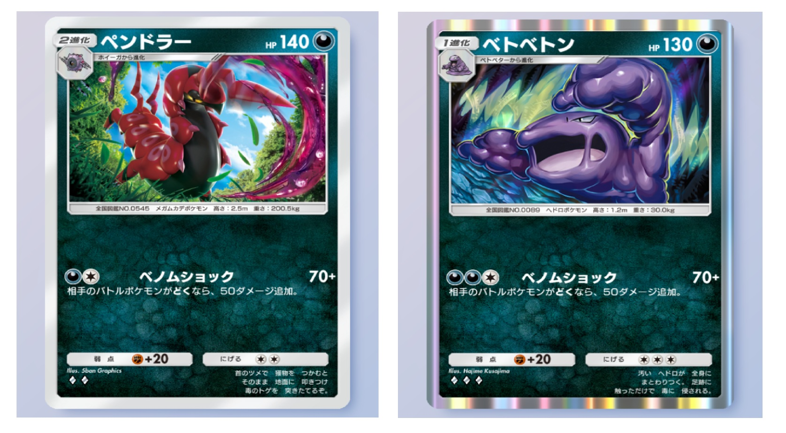

# メタデータ
- title=ポケポケブログ2：「幻のいる島」環境でもベトベトンデッキが強いです
- description=ポケモントレーディングカードゲームポケット（ポケポケ）で新しいパック「幻のいる島」が出ましたがまだまだベトベトンデッキが強いのでおすすめします。
- date=2024年12月22日（日）
- update=2024年12月22日（日）
- math=false
- tag=pokepoke

## はじめに

### 概要

ポケモントレーディングカードゲームポケット（以下、ポケポケ）においてベトベトン+マタドガスデッキを使っているのですが、
新しいパックである「幻のいる島」が登場して環境が変わっても、
まだまだこのデッキは強いのでおすすめします。

ベトベトン

### 前回の記事：ベトベトンデッキの紹介
前回、ベトベトンデッキを紹介したのでこちらもあわせてご覧ください。

https://yusukekato.jp/html/2024/1216.html

ポケポケブログ1：ベトベトン+マタドガスデッキをおすすめする

### 公式サイト

下記がポケポケ公式サイトのリンクです。

https://www.pokemontcgpocket.com/ja/

ポケポケ公式サイト

## デッキレシピ
ベトベトン+マタドガス+キョウのデッキレシピです。

- ベトベター x2
- ベトベトン x2
- ドガース x2
- マタドガス x2
- キョウ x2
- 博士の研究 x2
- モンスターボール x2
- ナツメ x2
- きずぐすり x2
- サカキ x2

基本的にはベトベトンのベノムショックで相手を倒すデッキです。

ベトベトン

マタドガスでも相手のHPを削ります。
特性で相手を毒にできたり、エネルギー1つでワザが撃てるので強いです。

マタドガス

キョウでマタドガスを手札に戻して、ベトベトンとのコンボやHPを全回復します。
キョウをベトベトンに使うことはほとんどないです。

キョウ

## 直近20戦の成績
ベトベトン+マタドガス+キョウデッキの強さを計測するために、
バトル「だれかと」の「イベントマッチ」で20戦行いました。
イベントは現在開催されている「幻のいる島 エンブレムイベント」（～2025/01/10）です。
もちろん上振れや下振れはあるので参考程度にご参照ください。

- 結果：20戦15勝5敗
- 【勝】セレビィex
- 【勝】セレビィex
- 【勝】ミューツーex&ミュウex
- 【負】ペンドラー
- 【勝】ピカチュウex
- 【負】キュウコン&ギャロップ
- 【勝】ミューツーex
- 【負】セレビィex
- 【勝】セレビィex
- 【負】スターミーex
- 【勝】ミューツーex&ミュウex
- 【勝】水デッキ？
- 【負】ギャラドスex
- 【勝】スターミーex&フリーザex
- 【勝】ピカチュウex&サンダーex
- 【勝】キュウコン&ギャロップ
- 【勝】超デッキ（フラージェス）
- 【勝】リザードンex
- 【勝】セレビィex
- 【勝】ピカチュウex&サンダーex

## 解説
幻のいる島のイベントバトルでは、ミューツーexデッキとセレビィexデッキがよく当たる印象です。

ベトベトンデッキはミューツーexに対してタイプ相性で有利が取れるので勝ちやすいです。
また、セレビィexはワザのダメージ量が運用素が強くて不安定で、
HPも少くベトベトンとマタドガスのコンボで一撃で倒せるので、
かなり戦いやすいです。

それ以外にはこれまで通りピカチュウexデッキとスターミーexデッキもよく当たります。
ピカチュウexとスターミーexはどちらもエネルギー2つで90ダメージが出せるので、普通に強いです。
マタドガスもベトベトンも2発で確定で倒されてしまうので、
うまく戦う必要があります。

よく使用する戦略としては、マタドガスでピカチュウexやスターミーexのHPを削りつつ、
ダメージを受けたらキョウで手札に戻してベンチのマタドガスと交換する戦い方です。
キョウを使うと実質HPを全回復できるのでかなり強い戦略になると思います。

## 新ポケモン「ペンドラー」
新パック「幻のいる島」においてペンドラーが登場しました。
ペンドラーは2進化で出すまでに時間がかかりますが、
それ以外はベトベトンより強いです。

ペンドラーの特徴は下記の通りです。

- 2進化ポケモン（ベトベトンは1進化）
- エネルギー2つでベノムショックが撃てる（ベトベトンは3つ）
- エネルギー2つで逃げられる（ベトベトンは3つ）
- HPが140（ベトベトンは130）

ペンドラー

一応ベトベトンはキョウで手札に戻せますが、
実際にバトルでベトベトンに対してキョウを使うタイミングはほとんどありません。
そのため、総合的にみるとペンドラーのほうが強い可能性があります。
このあたりも検証してみたいですね。

## おわりに

ベトベトンデッキを紹介しました。
新パック「幻のいる島」が出てもまだまだ強いので、
皆様もぜひ使ってみてください。
それでは、また。