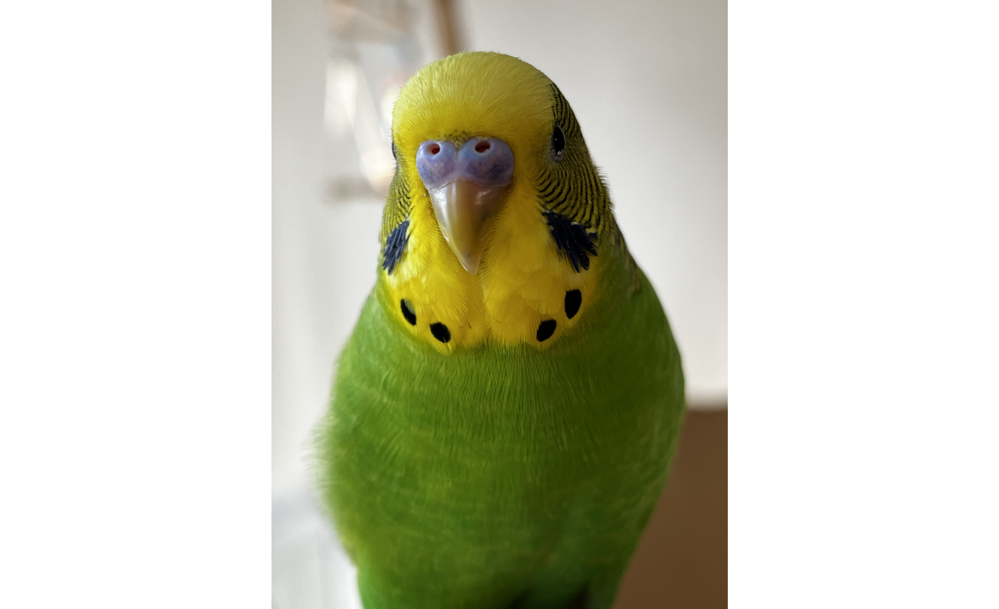
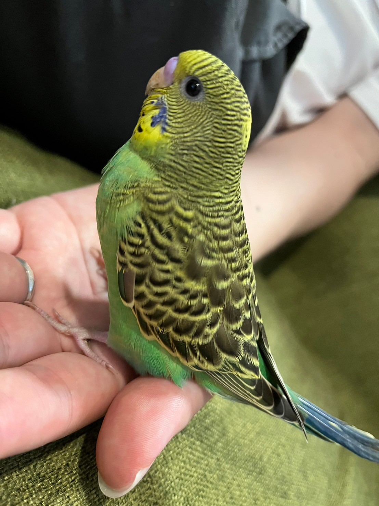
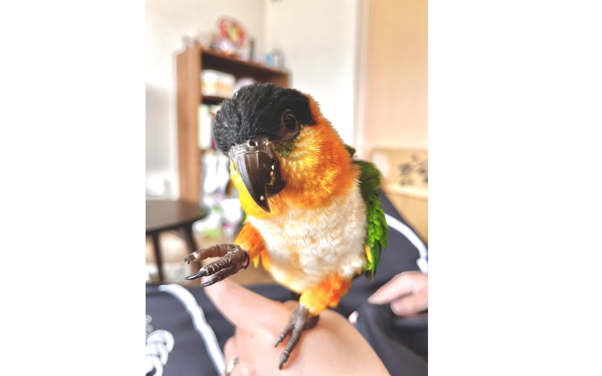
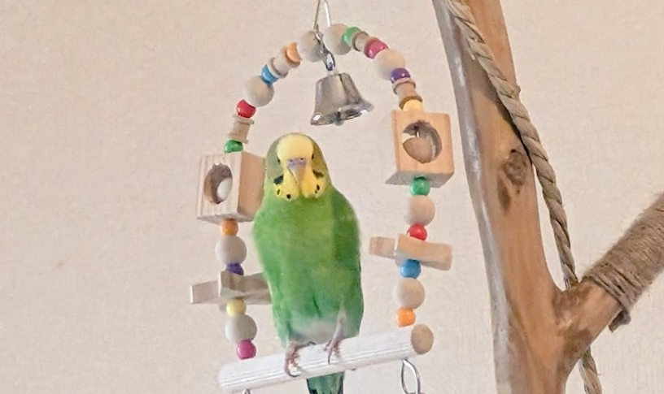
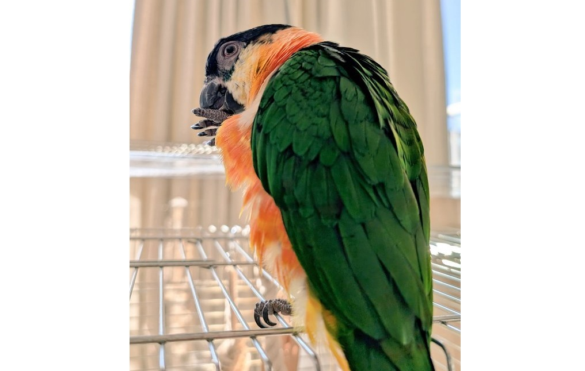
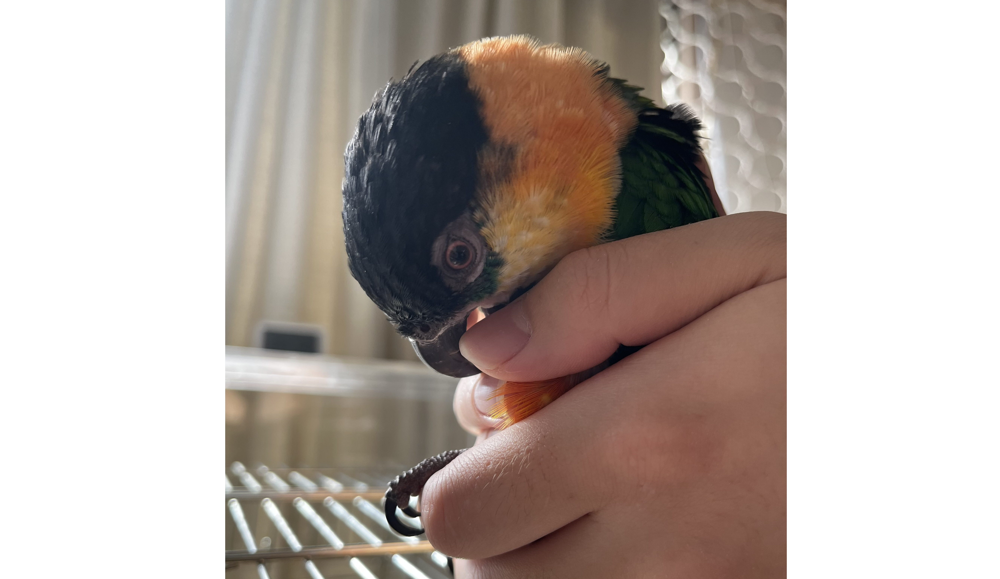

# メタデータ
- title=我が家のインコ「れもん&ぽぽ&ぐぐ」の日記18 : 2024年に感謝&2025年もよろしくお願いします
- description=2024年12月29日（日）までのセキセイインコ「れもん」とズグロシロハラインコ「ぐぐ」の様子を記録しておきます。
- date=2024年12月29日（日）
- update=2024年12月29日（日）
- math=false
- tag=lemon

## はじめに

2024年もそろそろ終わりを迎えて、新しい年が始まろうとしています。
皆様、今年もお世話になりました。
来年もよろしくお願いいたします。
2024年最後になりますが、
セキセイインコのれもんとズグロシロハラインコのぐぐの記録をまとめておこうと思います。

心清やかなれもん↓

心清やかなれもん

## 関連記事

### 前回の日記

2024年12月8日の日記です。

https://yusukekato.jp/html/2024/1208.html

我が家のインコ「れもん&ぽぽ&ぐぐ」の日記17 : れもんもぐぐも平和な日々を送っています

### 我が家におけるインコの飼育方法

2024年現在の我が家でのインコの飼育方法をまとめました。

https://yusukekato.jp/html/2024/1025.html

インコの飼い方と注意点（2024年版）

## 注意点
私たちは鳥を初めて飼うため飼育方法に誤りがあるかもしれません。
これからセキセイインコやズグロシロハラインコなどを飼うという方はこのブログの情報を鵜呑みにせず、参考程度に読んでいただけますと幸いです。
いかなる場合でも責任は負えませんのでご了承ください。

## れもんの成長

今年の最後の記録として、
半年前に我が家へやってきたばかりのれもんと、
現在のれもんの写真を見比べてみます。

れもんは我が家に来た頃はかなり子供っぽさがありました（生後一ヶ月くらい）。
現在は明らかに大人っぽさがあって成長を感じます。
また、一番特徴的な違いは目になるかと思います。
半年前のれもんの目は真っ黒ですが、
現在のれもんは目に白い輪っかが現れています（写真では見えづらいです。大人になると現れるものらしいです）。

内面的には、基本的には我が家に来た頃から今に至るまで好奇心旺盛な子供という感じは一貫しています。ただし、反抗期みたいになったり、ずる賢くなったりなど、人生経験をしっかり積んできている気もします。

半年前のれもん↓

半年前のれもん

現在のれもん↓

現在のれもん

## ぐぐの成長

ぐぐも我が家にやってきた三か月前と比べてみます。

ぐぐは我が家にやってきた時点で1歳を過ぎていたので見た目は特に変化はありません。
しかし、内面的には大きく変わってきています。
我が家に来た頃は自分の周りの全てにビビっていて鳥籠から出ることさえ難しかったのですが、
時間が経つごとに少しずつ鳥籠から出られるようになっていって、
鳥籠の上でおもちゃで遊んだり、人間と遊べるようにもなりました。
そして今では鳥籠から降りて床を歩くこともできます。

また、三か月前はれもんの存在にもビビっていて、
鳥籠の外のれもんが近づいてくるだけでも威嚇するような動きをしていましたが、
現在は特に気にせずにやり過ごせるようになっています。

ぐぐが我が家に慣れてくれて良かったです。

三か月前のぐぐ↓

三か月前のぐぐ

現在のぐぐ↓

現在のぐぐ

## 今週のれもんとぐぐ

今年の締めくくりとして今週のれもんとぐぐの写真を記録しておきます。

どっしりと構えているれもん↓

どっしりと構えているれもん↓

ぐぐの後ろ姿↓

ぐぐの後ろ姿

撫でさせてくれるぐぐ↓

撫でさせてくれるぐぐ

## おわりに

今年からインコを飼い始めて生活が大きく変わりました。
朝と夜にインコのお世話をする時間が増えて時間的な余裕は減りましたが、
その分おもしろい体験は増えたかと思います。
また、家族が増えたことで家族で同じ時間を共有する機会が増えてその点においてもインコを飼い始めて良かったと思います。
来年も家族みんなで楽しく暮らせることを願っています。
それでは、良いお年を。
そして来年もよろしくお願いいたします。

覗き込むれもん↓

覗き込むれもん

### 次回の日記

2025年1月26日の日記です。

https://yusukekato.jp/html/2025/0126.html

我が家のインコ「れもん&ぽぽ&ぐぐ」の日記19 : 鳥フェス浅草2025に行ってきました！