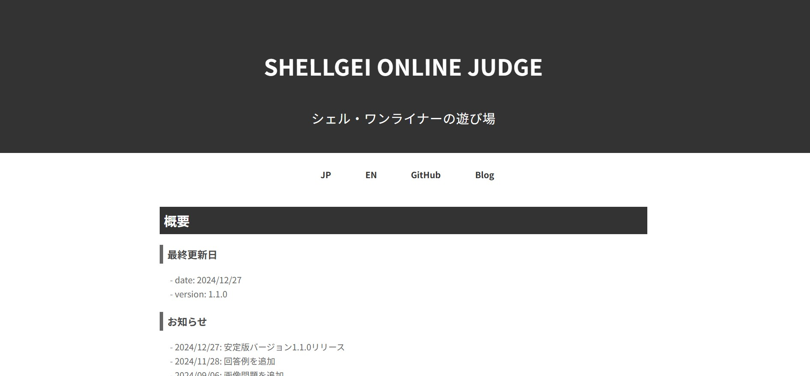
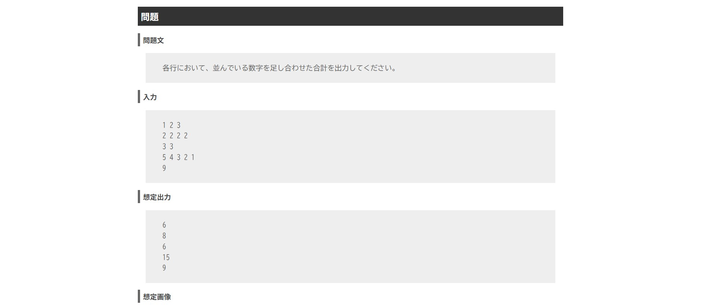
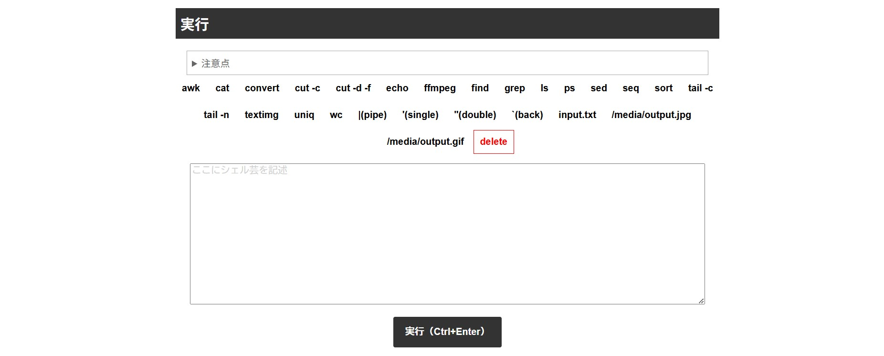
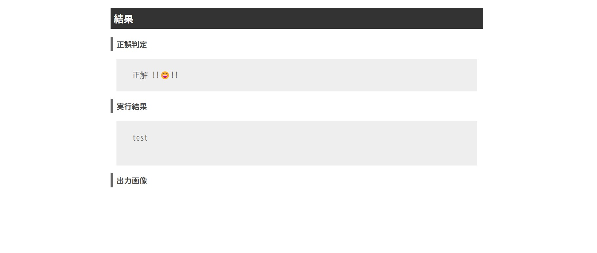
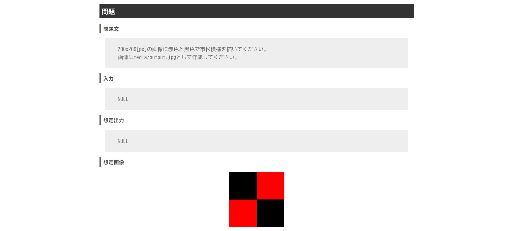
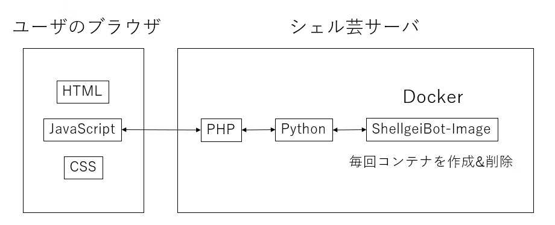

# メタデータ
- title=シェル芸オンラインジャッジの紹介
- description=シェル芸（シェルのワンライナー）で問題を解いて遊べる「シェル芸オンラインジャッジ」を紹介します。
- date=2025年1月2日（木）
- update=2025年1月2日（木）
- math=false
- tag=tech

## はじめに

### 本記事の概要

本記事では、シェル芸（シェルのワンライナー）で問題を解いて遊べる「シェル芸オンラインジャッジ」を紹介します。
シェル芸オンラインジャッジは、シェル芸用の問題の提供と、ユーザが実行したコマンドの出力結果の自動正誤判定を実施しています。

### シェル芸とは何か

シェル芸のトップページでシェル芸が定義されています。

シェル芸の定義↓

```
マウスも使わず、ソースコードも残さず、GUIツールを立ち上げる間もなく、あらゆる調査・計算・テキスト処理をCLI端末へのコマンド入力一撃で終わらすこと。あるいはそのときのコマンド入力のこと。
```

https://b.ueda.tech/?page=01434

引用元：シェル芸のトップページ

## シェル芸オン欄ジャッジについて

### シェル芸オンラインジャッジの特徴

- シェル芸で問題を解いて遊べる
- 自動で正誤判定できる
- パソコンでもスマホでも遊べる
- ソースコードをGitHubで公開
- 通常問題に加えて練習問題と画像問題もある
- すべての問題の回答例も掲載

### シェル芸オンラインジャッジの概要

下記のリンクからシェル芸オンラインジャッジにアクセスできます。

https://shellgei-online-judge.com/

シェル芸オンラインジャッジのリンク

このようなページが表示されます↓



シェル芸オンラインジャッジ

シェル芸オンラインジャッジのソースコードはGitHubで公開しています。

https://github.com/YusukeKato/ShellgeiOnlineJudge

GitHub：シェル芸オンラインジャッジ


## シェル芸オンラインジャッジの遊び方

まず問題を選択します。
通常問題に加えて、練習問題と画像問題もあります。
2025年1月2日現在では合計85問です。


問題選択

問題を選択して「決定」ボタンを押すと、
問題文と入力、想定出力が表示されます。
入力はシェル芸実行時に標準入力として渡されます。
シェル芸の出力結果は想定出力に従う必要があります。



問題情報

ユーザがシェル芸を入力して実行します。
コマンドボタンを押すとコマンドを入力できて便利です（特にスマホで）。



シェル芸入力

シェル芸の実行ボタンを押すと正誤判定が自動で行われます。
正解と表示されたらその問題はクリアです。
間違いの場合は不正解と表示されます。



正誤判定

下図のように画像問題も用意してあります。



画像問題

ちなみに、すべての問題の回答例も掲載しているのでぜひご参照ください。


回答例

### シェル芸オンラインジャッジの構成

シェル芸オンラインジャッジは下記の画像のように構成されています。
ユーザがブラウザでシェル芸を入力してサーバへ送信し、
サーバがDockerコンテナ内でそのシェル芸を実行して出力結果と正誤判定結果をユーザへ返します。



構成

## おわりに

本記事では、シェル芸で遊べるシェル芸オンラインジャッジを紹介しました。
今のところ正常に動いているのでぜひ遊んでみていただけると嬉しいです。
ちなみに今後も問題を追加したり、もっと使いやすくしたりなどアップデートしていく予定です。
それでは、また。