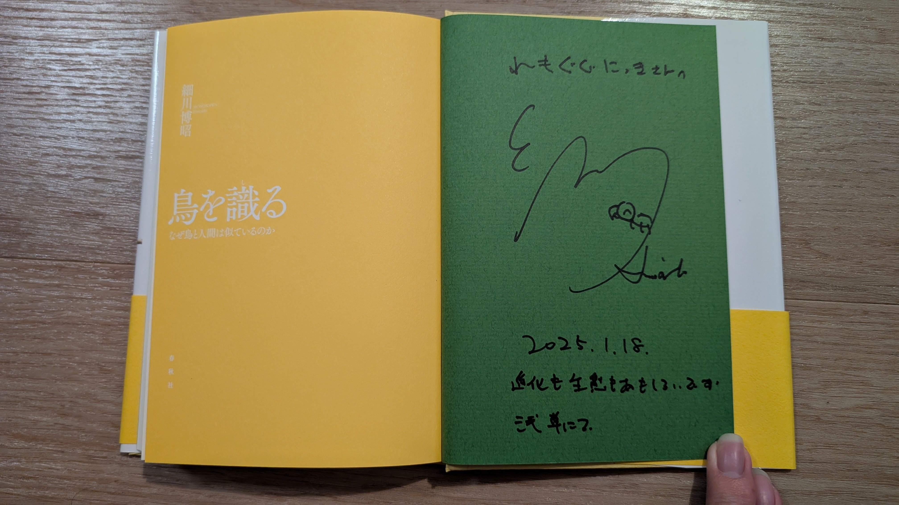
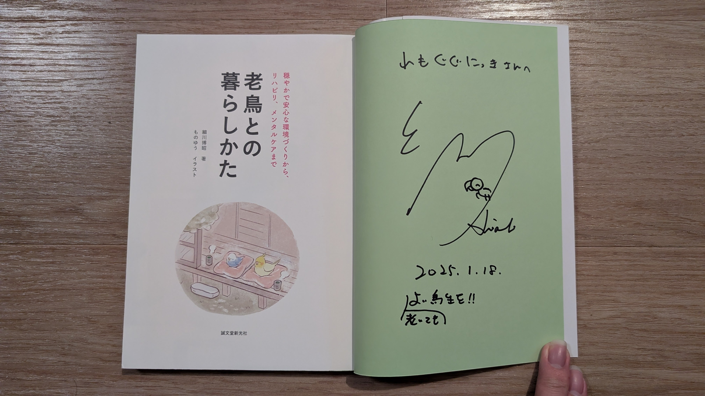
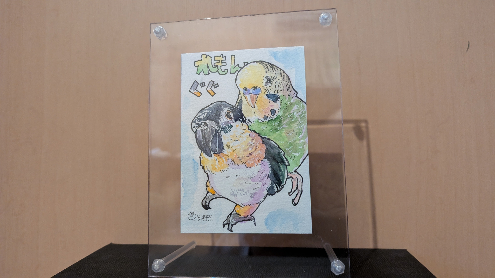
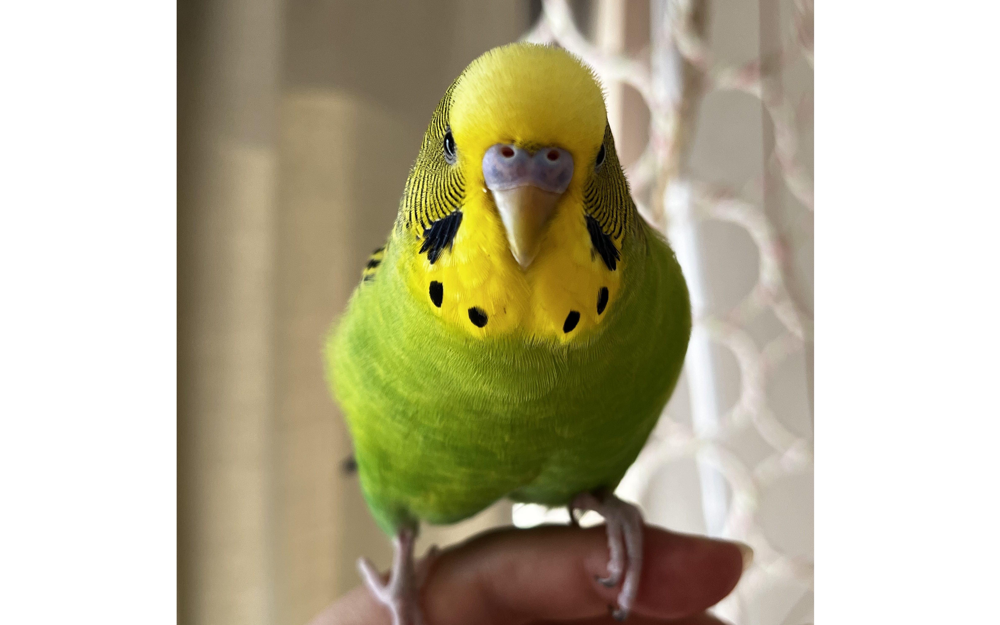
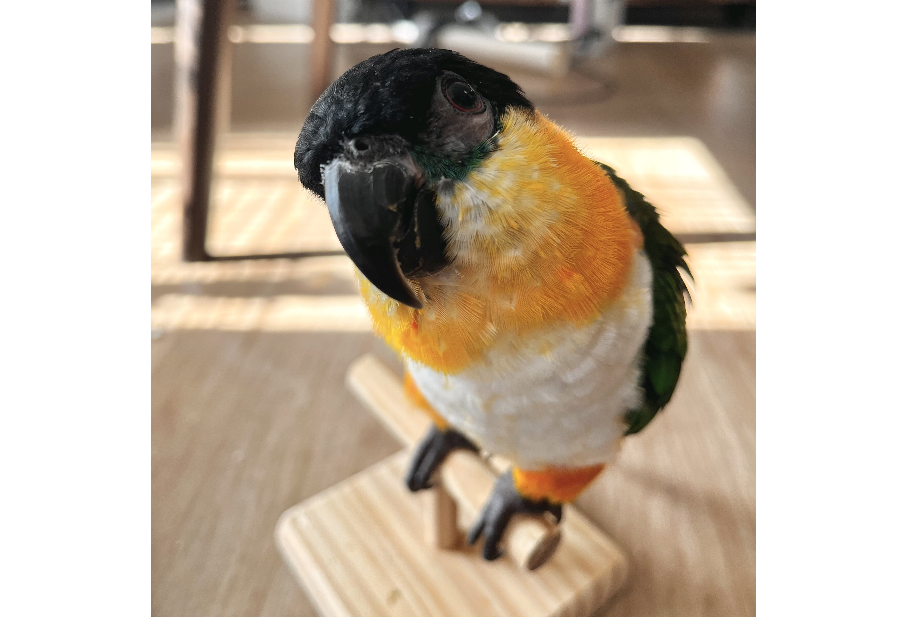

# メタデータ
- title=我が家のインコ「れもん&ぽぽ&ぐぐ」の日記19 : 鳥フェス浅草2025に行ってきました！
- description=2025年1月26日（日）までのセキセイインコ「れもん」とズグロシロハラインコ「ぐぐ」の様子を記録しておきます。
- date=2025年1月26日（日）
- update=2025年1月26日（日）
- math=false
- tag=lemon

## はじめに

2025年最初のインコ記事です。
1月18日に「鳥フェス浅草2025」に行ってきたので、
そこで購入した物などを紹介したいと思います。
また、今週のれもんとぐぐもあわせて記録しておきます。
今年もよろしくお願いいたします。

鳥フェス浅草2025の公式サイトです↓

https://kotoricafe.jp/torifes/671

ことりカフェ：鳥フェス浅草2025

## 関連記事

### 前回の日記

2024年12月29日の日記です。

https://yusukekato.jp/html/2024/1229.html

我が家のインコ「れもん&ぽぽ&ぐぐ」の日記18 : 2024年に感謝&2025年もよろしくお願いします

### 我が家におけるインコの飼育方法

2024年の我が家でのインコの飼育方法をまとめました。

https://yusukekato.jp/html/2024/1025.html

インコの飼い方と注意点（2024年版）

## 注意点
私たちは鳥を初めて飼うため飼育方法に誤りがあるかもしれません。
これからセキセイインコやズグロシロハラインコなどを飼うという方はこのブログの情報を鵜呑みにせず、参考程度に読んでいただけますと幸いです。
いかなる場合でも責任は負えませんのでご了承ください。

## 鳥フェス浅草2025

2025年1月18日と19日に開催された「鳥フェス浅草2025」に行ってきました。
とても大きな会場でたくさんの人で賑わっていて大盛り上がりでした。
様々な鳥関連のグッズもあって満足度が高いです。
また、浅草もとても活気のある街で観光地としても面白かったです。

購入した物です↓

購入物

細川先生にお会いできて購入した書籍にサインもいただけました！

（我が家のれもんの写真を掲載していただいた書籍にサインをいただこうと思ったのですが、
バタバタして家に忘れてしまいました。
またお会いできた時の楽しみにとっておきたいと思います）

『鳥を識る』↓

『鳥を識る』

『老鳥との暮らしかた』↓

『老鳥との暮らしかた』

水彩でフクロウの絵などを描いていらっしゃるそばがらさん（X ID: @sobagaranosoba）にれもんとぐぐの絵を描いていただきました！

とても素敵な絵です。さっそく飾りました。

鳥のイベントはとても楽しいので定期的に参加したいですね。

## 今週のれもんとぐぐ

2025年も鳥たちは比較的元気に過ごしています（たまに体調悪そうな時もあって心配もありますが、様子を見つつ楽しく暮らしています）。

今週のれもん↓

今週のれもん

今週のぐぐ↓

今週のぐぐ

## おわりに

2025年になったばかりですが、もうすぐ1月が終わってしまいますね。
どんどん時間が進んで何が何やら分からなくなっていく感覚もあります。
このブログで記録を残していろいろ忘れないように生きていけたらと思います。
今年もよろしくお願いいたします。
それでは、また。

流木に乗ったぐぐ↓

流木に乗ったぐぐ