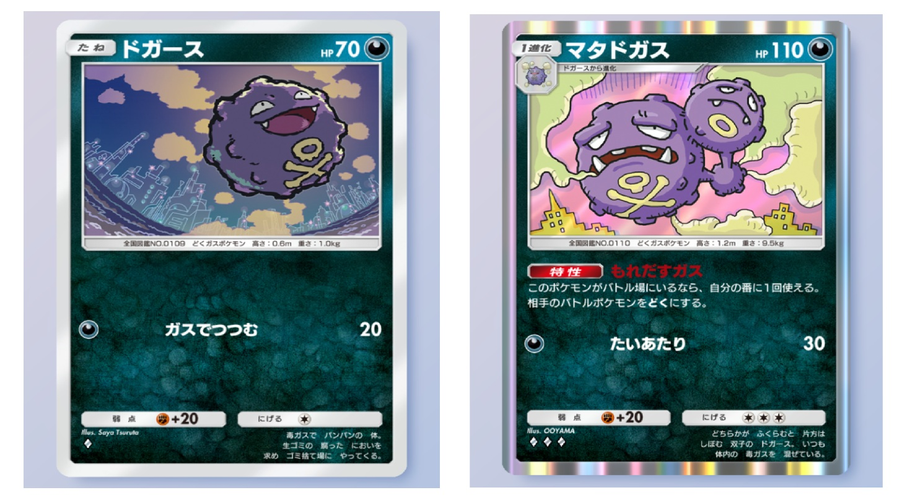
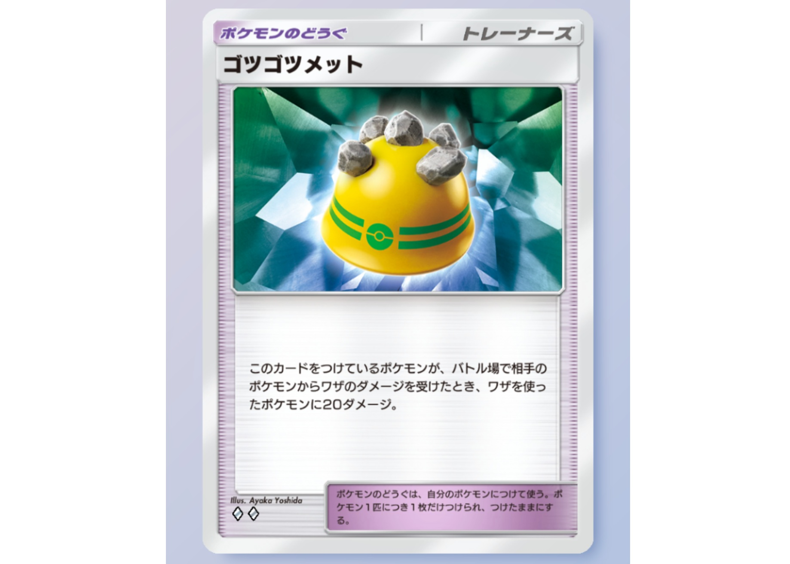

# メタデータ
- title=ポケポケブログ3：「時空の激闘」環境でもベトベトンデッキを使いたい
- description=ポケモントレーディングカードゲームポケット（ポケポケ）で新しいパック「時空の激闘」が出ましたが、まだまだベトベトンデッキが強いのでおすすめします。
- date=2025年2月16日（日）
- update=2025年2月16日（日）
- math=false
- tag=pokepoke

## はじめに

### 概要

ポケモントレーディングカードゲームポケット（以下、ポケポケ）においてずっとベトベトンデッキを使っています。

新しいパックである「時空の激闘」が登場して、
ディアルガexやパルキアex、
ダークライex、メガヤンマex、ジバコイルなどが猛威を振るっていますが、
まだまだベトベトンデッキも強いのでおすすめします。

ベトベトン

### 前回の記事：ベトベトンデッキの紹介
前回は「幻のいる島」環境におけるベトベトンデッキを紹介しました。

https://yusukekato.jp/html/2024/1222.html

ポケポケブログ2：「幻のいる島」環境でもベトベトンデッキが強いです

### 公式サイト

下記がポケポケ公式サイトのリンクです。

https://www.pokemontcgpocket.com/ja/

ポケポケ公式サイト

## デッキレシピ
ベトベトン+マタドガス+ダークライexのデッキレシピです。

- ベトベター x2
- ベトベトン x1
- ドガース x2
- マタドガス x2
- ダークライex x2
- キョウ x2
- 博士の研究 x2
- モンスターボール x2
- ゴツゴツメット x2
- ナツメ x1
- アカギ x2

以前まではベトベトンのベノムショックを主軸に戦っていたのですが、
「時空の激闘」環境では強いカードがたくさん出てきて、
ベトベトンだけでは勝てなくなってきました。

ベトベトン

そこで新しく取り入れたのがダークライexです。
現環境で最も使用されているカードの一つだと思います。
特性が強力でエネルギーを1つ付けると相手に20ダメージが入ります。
ベトベトンデッキの主力となります。

ダークライex

マタドガスは現環境でも強いです。
エネルギー1つでワザが撃てて、
ダークライexと組み合わせることで1ターンで60～70ダメージ与えられます。

マタドガス

ベトベトンとマタドガスが入っているのでキョウも使えます。
ベトベトンもマタドガスも逃げるエネルギーが3つなので、
キョウを使って手札に戻してダークライexを前に出します。

また、ベトベトンはHPが130あるので、
一度相手ポケモンのワザを受けてからキョウで手札に戻すことで、
壁として活用することも可能です
（ベトベトンには申し訳ないですが、壁戦法はそこそこ強いです）。

キョウ

あとはどのデッキに入れても強いゴツゴツメットも入れています。

ゴツゴツメット

そしてそれに加えて、強力なカードであるアカギも入れています。
ベトベトンデッキは相手ポケモンのHPを少しずつ削っていくため、
ベンチに逃げられてしまうとやっかいです。
アカギを使って倒し切りましょう。

アカギ

## 直近20戦の成績
ベトベトン+マタドガス+ダークライexデッキの強さを計測するために、
バトル「だれかと」の「イベントマッチ」で20戦行いました。
イベントは現在開催されている「時空の激闘 エンブレムイベント」（～2025/02/25）です。

相手が手札事故で何もせず勝ったり、逆に私がプレイングミスで負けたりなどいろいろあるので、参考程度にご参照ください。

結果：20戦14勝6敗

- 【勝】ルカリオ：マタドガス+ダークライexでルカリオを倒して勝ち
- 【勝】ルカリオ：相手が手札事故で勝ち
- 【勝】パチリスex：パチリスexを倒し切って勝ち
- 【勝】パチリスex：パチリスexを倒し切って勝ち
- 【勝】セレビィex：セレビィexとの運勝負に勝った
- 【勝】ダークライex：ダークライexを先に倒して勝ち
- 【負】ダークライex+ジバコイル+クリムガン：ジバコイルにマタドガスがワンパンされて負け
- 【勝】リザードンex：リザードンexが出てくる前に倒し切って勝ち
- 【勝】ダークライex+マニューラex：マタドガスでマニューラexのHPを削り切って勝ち
- 【勝】ダークライex+ジバコイル+クリムガン：相手がレアコイルを出すまでに時間がかかって勝ち
- 【勝】ダークライex+ペンドラー：ペンドラーがあまり機能していなかった
- 【負】ダークライex+ゲッコウガ：プレイングミス（ゲッコウガの特性を忘れてた）で負け
- 【負】ディアルガex+メガヤンマex：ダークライexがメガヤンマexとタイプ相性が悪くてワンパンされて負け
- 【負】セレビィex：3連続ワンパンで負け
- 【負】セレビィex：若干プレイングミスで負け
- 【勝】ダークライex+ジバコイル+クリムガン：相手が若干手札事故で勝ち
- 【負】エルレイドex：信じられないくらいプレイングミスして負け（エルレイドexを知らなかった）
- 【勝】セレビィex：相手の手札事故で勝ち
- 【勝】ディアルガex+メガヤンマex：マタドガスの立ち回りがうまくいって勝ち
- 【勝】ミュウツーex：相性が良いので勝ち

## 解説
「時空の激闘」のイベントバトルでは、これまでに強かったセレビィexデッキやギャラドスexデッキなどに加えて、ディアルガexやパルキアex、ダークライex、メガヤンマex、ジバコイルのデッキによく当たります。

正直なところ、あまり相性が良いデッキはなくて、
楽に勝ち切れることは少ないです。
しかし、ダークライexを取り入れたことでマタドガス+ダークライexの特性で火力が上がって、
先手を取って勝ち切ることができるようになりました。

このベトベトンデッキの強みは、マタドガスがエネルギー1つでワザが撃てることで、
先に相手ポケモンを1体倒して、
相手の戦略を崩せることです。
いわゆるアグロ戦法みたいな感じです。

基本的にはマタドガスを前に出して、
ダークライexがベンチにいる状況を作ります。
これで毎ターン60ダメージ（相手ターンに毒で+10ダメージ）与えられます。

バトル例

前のマタドガスにゴツゴツメットを付けるとより強力です。

あとはキョウやアカギ、ナツメを駆使して勝ち切るだけです。

懸念点としては、ベトベトンが活躍する機会がほとんどないことです。
ダークライexのほうが優秀な場面が多くて、
ベトベトンにエネルギーを回せていません。
もう少しベトベトンを使いこなせるようになりたいと思っています。

とはいえ、ベトベトンデッキは「時空の激闘」環境でも勝ち越せる力があると思いますので、ぜひ使ってみてください。

## おわりに

ベトベトンデッキを紹介しました。
新パック「時空の激闘」が出てもまだまだ強いので、
皆様もぜひ使ってみてください。
それでは、また。

## 次の記事
次は「超克の光」環境におけるベトベトンデッキを紹介しました。

https://yusukekato.jp/html/2025/0309.html

ポケポケブログ4：「超克の光」環境でもベトベトンデッキはまだ強い
