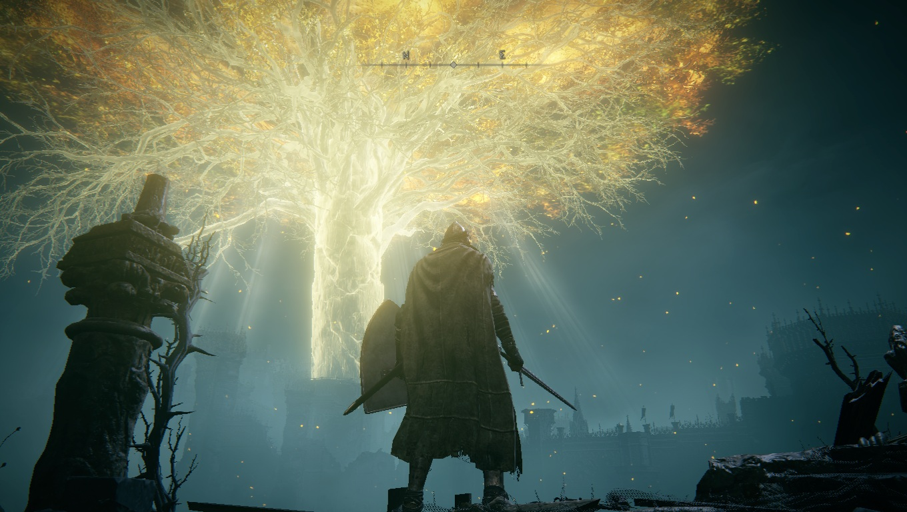
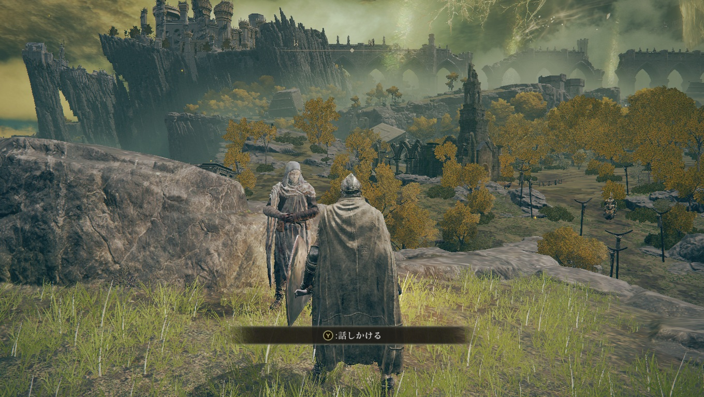
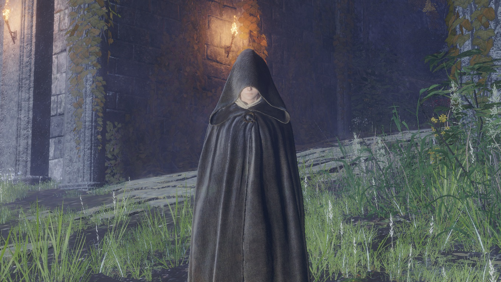
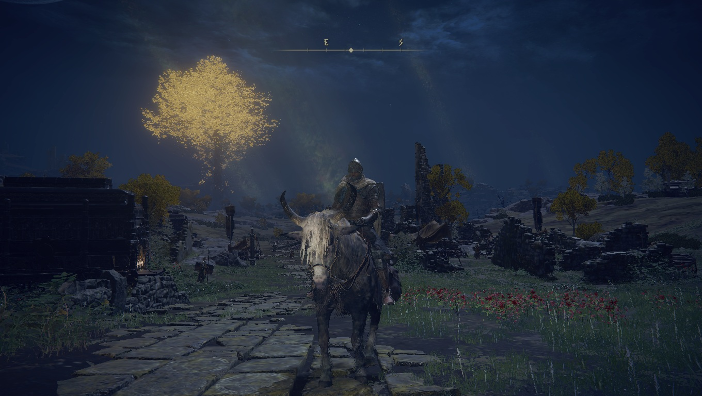
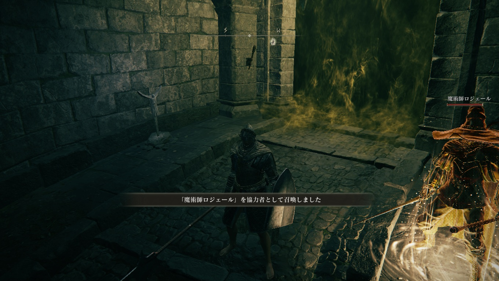
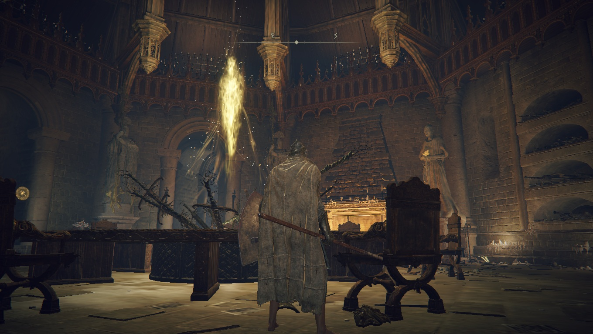

# メタデータ
- title=ELDEN RING BLOG 1: 今更ながら始める初見ELDEN RING冒険日記
- description=フロムソフトウェアのELDEN RINGを今更ながら初見プレイして記録を残そうと思います。
- date=2025年3月10日（月）
- update=2025年3月10日（月）
- math=false
- tag=elden-ring

## はじめに

### 概要

フロムソフトウェアが開発して2022年2月25日に発売された『ELDEN RING』（以下、今作）を今更ながら初見でプレイしてみようと思います。
ダークソウルは1と2と3をすべてプレイ済みです。
ちなみに、STEAMでDLCが全て含まれているものを購入しました。

ELDEN RING

### 公式サイト

下記が今作の公式サイトのリンクです。

https://www.eldenring.jp/index.html

ELDEN RINGの公式サイト

### 注意事項
まだELDEN RINGをプレイしていない方は、ネタバレになってしまうのでご注意ください。

## 本日の冒険の記録

### キャラクター作成

キャラクター作成はダークソウルシリーズと似たような感じでした。
ここでは無難に強そうな「放浪騎士」を選択します。
また、いつも通り初期アイテムを選べるようだったので、
ここも無難に強そうな最大HPが上がるアイテムを選択しました。

キャラクター作成

### ゲームスタート

ダークソウルシリーズでもそうですが、
ムービーが終わってから説明もなく薄暗い場所が始まるのがオシャレですね。
今作も何か意味ありげな場所から始まりました。
ここからチュートリアルまでの雰囲気はダークソウル2みたいでした。

ゲームスタート

### ゲームが処理落ちする【解決】

私は少し古めのゲーミングノートPCを使っているのですが、
デフォルトの設定だとゲームが処理落ちしていました。
解像度を落としたり、オフラインプレイに切り替えたりしてみたのですが、
結局はPC側の設定を変更して解決しました。

（私のガレリアのPCはゲームモードと通常使いモードを切り替えられるのですが、
なぜかゲームモードだと処理落ちして、
通常使いモードだと正常にプレイできました。謎です）

### 輝く金色の木

今作のトレーラー映像で唯一覚えていた金色に輝く木がありました。
めっちゃデカいです。かっこいいですね。

輝く金色の木

この後にチュートリアルがあって、
その後には負けイベント？のボスがいました。
ボス戦はスクショが撮れませんでしたが、蜘蛛みたいなボスでした。
後々ストーリーに関わってきそうですが、もうすでにどんな見た目だったか忘れ始めています。

### チュートリアル後の世界

さっそくダークソウル1でいうところの青ニートさんみたいなNPCがいました。
ちゃんと祝福（ダークソウルシリーズでいうところの篝火）のことを説明してくれました。
今作ではこの祝福から伸びる光が順路を教えてくれるようです。
ダークソウルシリーズとは異なり、明らかに親切なゲーム設計になっています。

あと、それぞれの祝福も簡単に行き来できます。

チュートリアル後の世界

### ヒロイン登場

今作のヒロイン的なNPCが登場しました。
名前は「メリナ」だったかと思います。
今作では順路も分かりやすくて、
勝手にストーリーも進んでいくので、
自分で探し回る必要はなさそうです。
かなりユーザに親切なゲームになっているようですね。

ヒロイン登場

### すぐ馬にも乗れる

一度訪れた祝福に瞬間移動できることに加えて、
馬も自由に呼び出せます。
かなり移動も楽な仕様になっていて驚きを隠せません。
ダークソウルシリーズを引きずっていてはいけないようです。

すぐに馬にも乗れる

### サブボスみたいなのを倒した

スクショすらありませんが、
洞窟の先にいたちょっとしたボスみたいな敵を倒しました。
初見で簡単に倒せたのでよかったです。
名前すら覚えていませんが。

### 初めてのストーリーボス

名前は忘れましたが、大きいおじいちゃんのボスが出てきました。
魔術師ロジェールを召喚して協力してもらいましたが、
3回やって勝てなかったので一旦武器強化とレベル上げをしようと思います。

あとボスのスクショを撮影するのが難しいです。

魔術師ロジェールを召喚

### 円卓

ボスに勝てなくて祝福に戻ったらメリナが円卓に連れてきてくれました。
主人公のような「褪せ人（あせびと）」が集まる異空間みたいなところのようです。
いろいろ強そうなNPCがいたり鍛冶屋がいたりで重要そうな場所です。

円卓

## 現状の感想

個人的な第一印象はダークソウルの1と2と3を合体させた感じです。
ゲームシステムやゲームの雰囲気がダークソウルシリーズを思い出させます。
その上で難易度はそのままにしながら、
ストーリーも分かりやすく、進行方法も分かりやすく、
ユーザにかなり親切な作りになっているように感じました。

具体的には下記が親切だと思った箇所です。

- マップシステムがあって現在位置を簡単に把握できる
- マップから各祝福へ移動できる
- 馬で移動できる
- 祝福から伸びる光で順路が分かる
- 祝福でできることがあれば教えてくれる
- 武器やアイテム、ルーンの表示が自動で見えなくなる

つまり、アクションゲームに慣れていない人でもプレイしやすいゲームになっていると思います。

## おわりに

この記事ではELDEN RINGの初見プレイの記録を残しました。
現在は3時間ほどプレイして、
最初のボスに勝つために武器の強化やレベル上げをしているところです。

ゲームシステムや雰囲気はダークソウルに似ていながら、
ストーリーもしっかり作りこまれていそうなので、
かなり楽しくプレイできています。
このままクリアまで突っ走っていきたいと思います。
それでは、また。