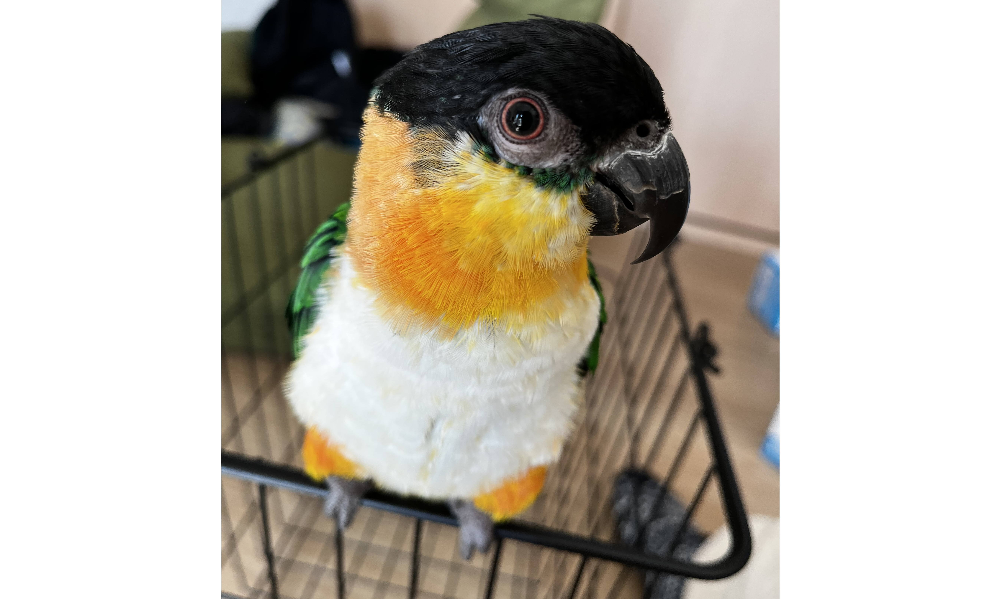
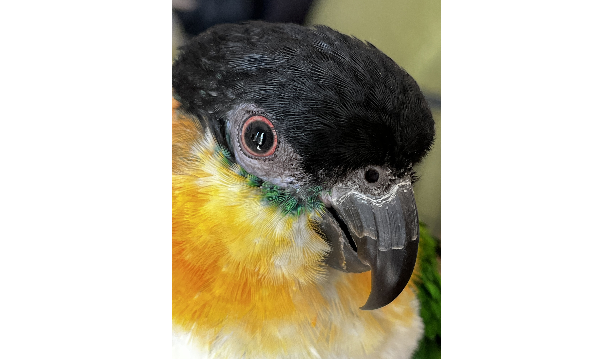
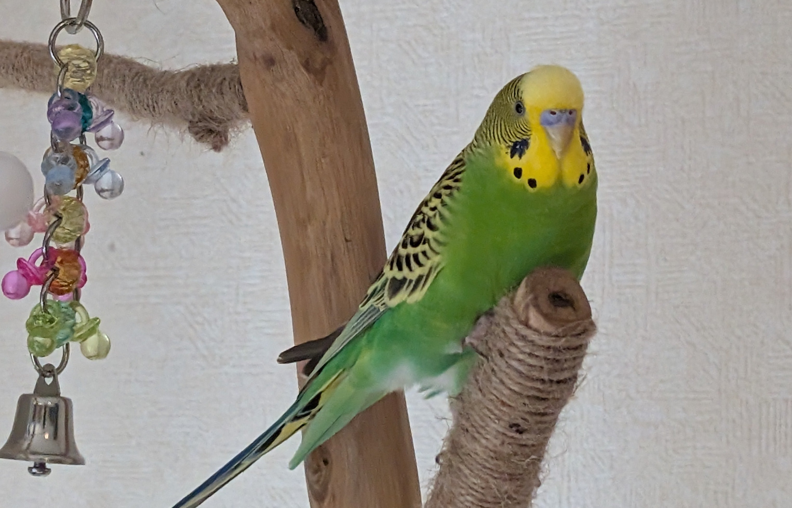

# メタデータ
- title=我が家のインコ「れもん&ぽぽ&ぐぐ」の日記20 : 久しぶりのインコ日記
- description=2025年3月12日（水）までのセキセイインコ「れもん」とズグロシロハラインコ「ぐぐ」の様子を記録しておきます。
- date=2025年3月12日（水）
- update=2025年3月12日（水）
- math=false
- tag=lemon

## はじめに

特に理由はありませんが、最近はインコ日記を更新できていなかったので、
久しぶりのインコ日記となります。
セキセイインコのれもんとズグロシロハラインコのぐぐは、
相変わらず元気に暮らしています。
今回もいつものように記録を残しておきます。

二羽が睨み合う様子↓

二匹の邂逅

## 関連記事

### 前回の日記

2025年1月26日の日記です。

https://yusukekato.jp/html/2025/0126.html

我が家のインコ「れもん&ぽぽ&ぐぐ」の日記19 : 鳥フェス浅草2025に行ってきました！

### 我が家におけるインコの飼育方法

2024年の我が家でのインコの飼育方法をまとめました。

https://yusukekato.jp/html/2024/1025.html

インコの飼い方と注意点（2024年版）

## 注意点
私たちは鳥を初めて飼うため飼育方法に誤りがあるかもしれません。
これからセキセイインコやズグロシロハラインコなどを飼うという方はこのブログの情報を鵜呑みにせず、参考程度に読んでいただけますと幸いです。
いかなる場合でも責任は負えませんのでご了承ください。

## 今週のインコ

れもんはいつも通り元気です。
もうすぐで1歳になるため、子供から大人へと成長していっているようです。

れもん

れもんは夢中になると逆さまになっていても気にしません。

れもんのおしり

ぐぐも相変わらず目がクリクリで甘えん坊です。

ぐぐ

ドアップのぐぐ↓

ドアップのぐぐ

おすましのれもん↓

おすましのれもん

モデルのような写真↓

モデルのような写真

## おわりに

今回は短いですがこれで終了です。
れもんもぐぐも元気に暮らしています。
この調子で末永く元気に成長していってほしいですね。
人間側も楽しく生活できるように頑張っていきたいです。
それでは、また。

## 次回の日記

2025年5月6日の日記です。

https://yusukekato.jp/html/2025/0506.html

我が家のインコ「れもん&ぽぽ&ぐぐ」の日記21 : 2ヶ月ぶりのインコ日記
