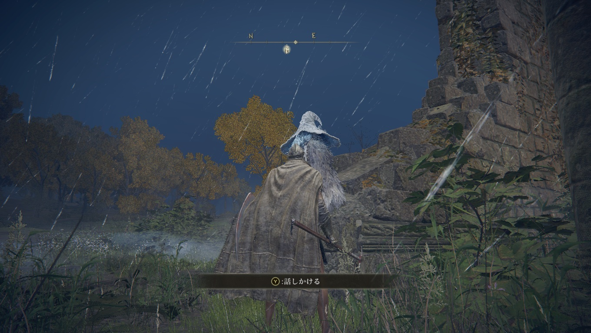
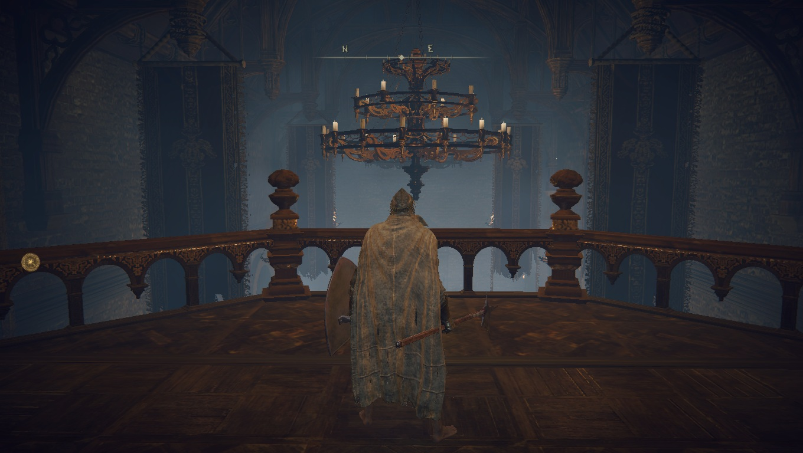
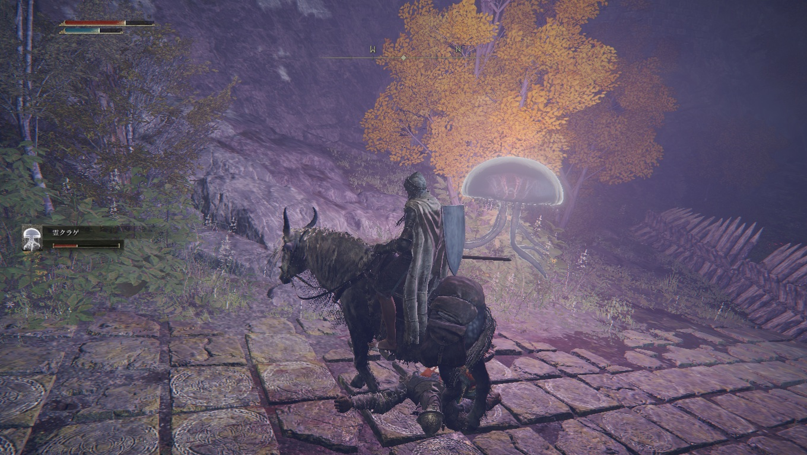
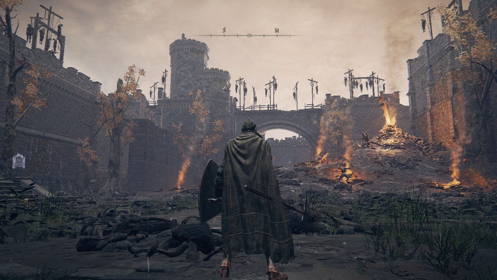
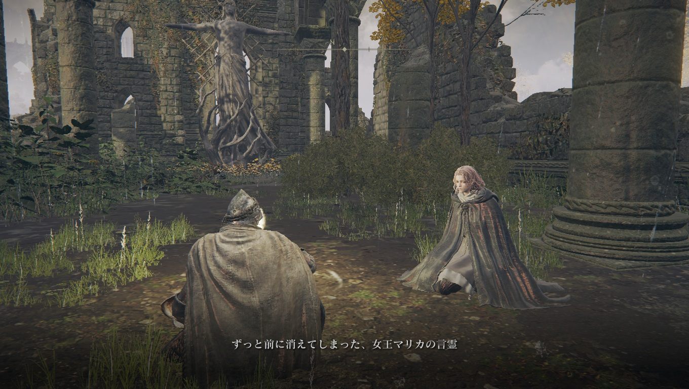
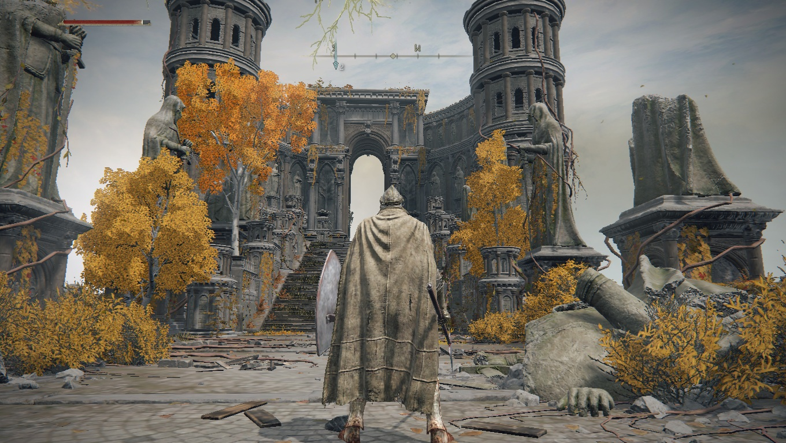

# メタデータ
- title=ELDEN RING BLOG 2: レベル上げと武器強化の旅
- description=フロムソフトウェアのELDEN RINGを今更ながら初見プレイして記録を残そうと思います。今回はレベル上げと武器強化の旅です。
- date=2025年3月15日（土）
- update=2025年3月15日（土）
- math=false
- tag=elden-ring

## はじめに

### 概要

2022年2月25日に発売されたフロムソフトウェアの『ELDEN RING』（以下、今作）を今更ながら初見でプレイしています。
今はストーリー上の一体目のボスが倒せないので、
レベル上げと武器強化のためにいろいろ旅をしています。

ELDEN RING

### 公式サイト

下記が今作の公式サイトのリンクです。

https://www.eldenring.jp/index.html

ELDEN RINGの公式サイト

### 前回の記事

2025年3月10日の日記です。

https://yusukekato.jp/html/2025/0310.html

ELDEN RING BLOG 1: 今更ながら始める初見ELDEN RING冒険日記

### 注意事項

まだELDEN RINGをプレイしていない方は、ネタバレになってしまうのでご注意ください。

## 本日の冒険の記録

### 魔女

一番最初の商人のところに戻ったら魔女がいました。
何やら昔の友人に褪せ人がいたらしくて、
その褪せ人から預かっていた狼の霊をくれました。
味方っぽいです。
名前は忘れました。

狼の霊は3体出てきて機動力も高くてかなり強いです。
ボス戦でもかなり活躍しそうです。

魔女

### 今作の地図

地図はこんな感じです。
行ける範囲をウロチョロしています。
開始地点から東側に行くと沼を舟で移動するボスがいて、
強そうだったので一旦保留です。
南側の半島がちょうどよさそうな難易度だったので、
そっちを先に行きます。

地図

### 円卓で侵入された

そういえば、
円卓の大広間みたいなところでNPCに侵入されたので、
倒しました。
名前は忘れましたが、強くはなかったです。
魔法を使ってくるので盾で受けるよりは、
ローリングでの回避がよさそうでした。
あと一撃で怯むので積極的に殴ったほうがよいです。

円卓の大広間

### 鍛冶師

円卓に鍛冶師がいました。
囚われているようですが、何やら訳ありのようです。
いい人そうではあります。

鍛冶師

### 鍵の仕掛け

今作では鍵を使って白い霧を開ける仕掛けがいろいろあります。
円卓にもあって開けてみたのですが、
何とも言えないアイテムがあるだけでした。
世界中にたくさんありそうなので、
ちゃんと開けて回りたいと思います。
鍵は拾ったり、商人から買えたりします。

鍵の仕掛け

### クラゲの霊

最初のほうで廃屋で憂いていた女性からもらったクラゲの霊はこんな感じです。
狼のほうが強いです。

廃屋の女性は仲間はたびたびストーリー上の会話で出てくる蜘蛛のボス？に望んで取り込まれたっぽいです。
女性も取り込まれに行くらしいですが、決心がつかないみたいです。
やっかいそうですね。

クラゲの霊

### 南の半島

開始地点から南のほうに進んで橋を渡ると半島があって、
女性が一人座っていました。
さらに南にある城の城主の娘さんらしく、
城から逃げてきたのですが、
追手に追われているようです。
女性を守っていたっぽい兵士たちはみんな死んでいました。

城に残っているお父さんへの手紙を託されました。

女性

### 城

先ほどの女性がいた城に到着しました。
どこかにお父さんがいるらしいので探してみたいと思います。
ちなみに兵士はみんな死んでいるようでした。
荒れまくっています。

城

### ボス

海にいたこの城のボスっぽいのは倒しました。
あまり強くはなくて初見で倒せました。

また、お父さんはかなり分かりづらいところにいました。
手紙は届けられましたが、
女性はすでに殺されていました。

ボス

### 南側の地図

南のほうの地図はこんな感じです。
祝福がたくさんあって優しかったです。

地図

### 南の半島の西側

南の半島の西側も行ってみました。
マリカの教会が2つくらいありました。
回復アイテムの回復量を増加できるアイテムが2つ入手できました。
マリカがこの世界の重要な神みたいな感じっぽいです。

教会

### 宝箱の転移トラップ

宝箱トラップに引っかかって王都に飛ばされました。
転移トラップらしくて、
今時の異世界転生アニメみたいでした。
転移先の王都には巨人がいて、
転ばして落とせたりできそうですが、
現状はまだ倒せていません。

王都

### 小黄金樹のボス

さきほどの南の半島に戻って、
小黄金樹のボスを倒しました。
HPは多いですが、動きがシンプルなのでそこまで苦戦はしませんでした。
回復アイテムの強化アイテムみたいなものが入手できました。

ボス

## おわりに

まだストーリーのボスは倒せていませんが、
オープンワールドをいろいろ旅ができて楽しいです。
レベル上げと武器強化もいい感じに進んでいるので、
そろそろボスにも再挑戦していきたいと思います。
それでは、また。