# メタデータ
- title=ELDEN RING BLOG 3: 一体目の大ボスを倒した
- description=フロムソフトウェアのELDEN RINGを今更ながら初見プレイして記録を残そうと思います。今回は最初の大ルーンを持ったボスを倒した記録です。
- date=2025年3月22日（土）
- update=2025年3月22日（土）
- math=false
- tag=elden-ring

## はじめに

### 概要

2022年2月25日に発売されたフロムソフトウェアの『ELDEN RING』（以下、今作）を今更ながら初見でプレイしています。
最近ようやく最初のストーリーボスを倒せました。
レベル上げや武器強化の影響もありますが、
私がエルデンリングに慣れてきた感じもあります。

ELDEN RING

### 公式サイト

下記が今作の公式サイトのリンクです。

https://www.eldenring.jp/index.html

ELDEN RINGの公式サイト

### 前回の記事

2025年3月15日の日記です。

https://yusukekato.jp/html/2025/0315.html

ELDEN RING BLOG 2: レベル上げと武器強化の旅

### 注意事項

まだELDEN RINGをプレイしていない方は、ネタバレになってしまうのでご注意ください。

## 本日の冒険の記録

### 初めての洞窟

最初のチュートリアルの洞窟を除けば、
初めての洞窟です。
ネズミがたくさんいました。
アイテムをいろいろ落ちていました。

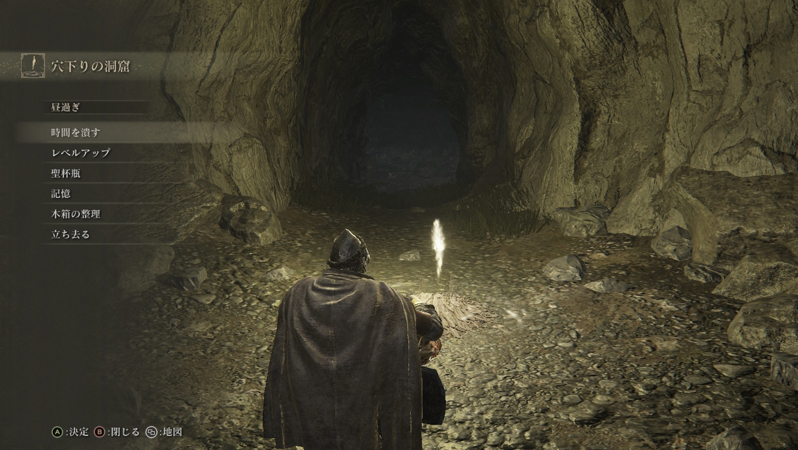

初めての洞窟

洞窟はランタンがあると便利です。
手に持つ必要はなく、
アイテムを使用するだけで明るくなります。
南の半島の商人で購入しました。

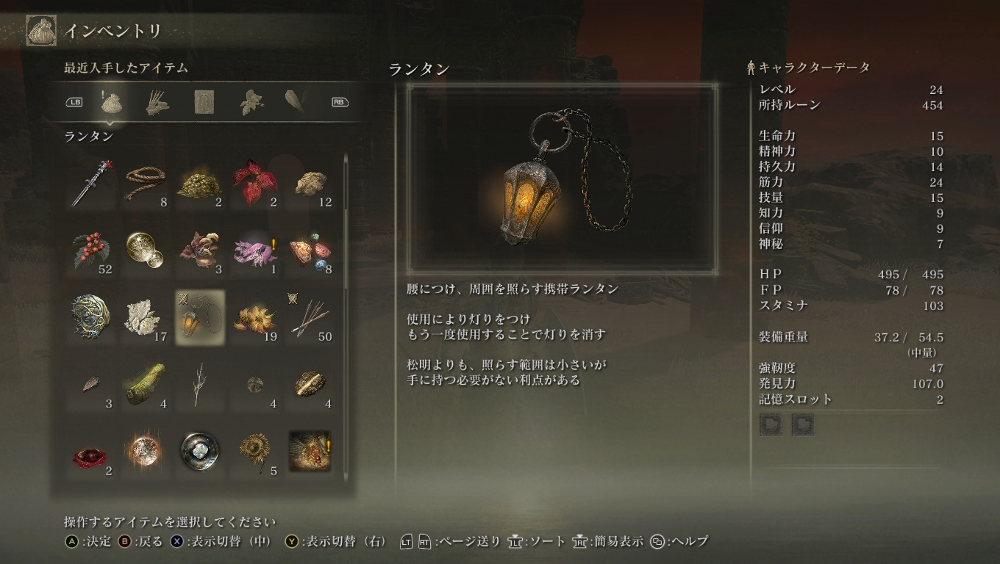

ランタン

洞窟の奥には熊がいました。
狼の霊に協力してもらって倒しました。

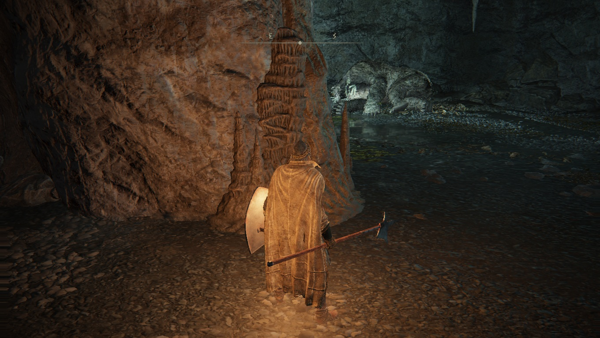

熊

### 歩くお墓

歩くお墓がいました。
足の汚れを落としてあげると止まってくれます。
止める方法は商人から購入しました。

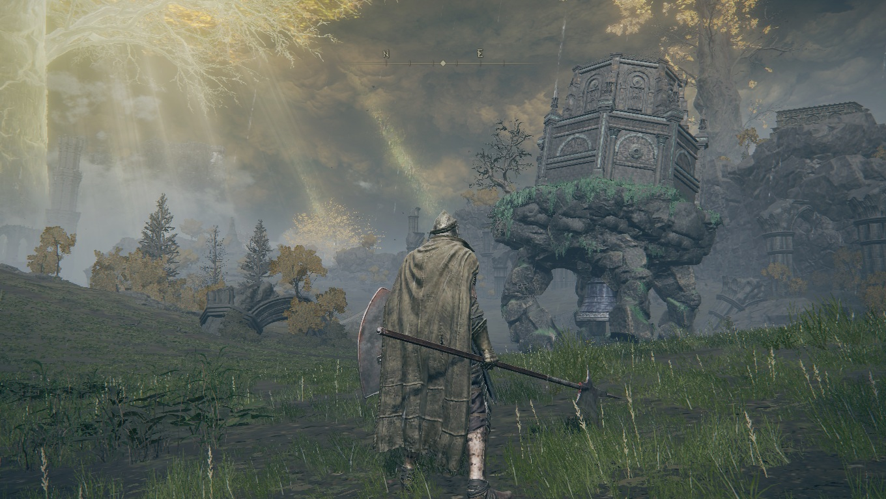

歩く墓

大ルーンを持つボスを倒した時に手に入る追憶を複製できるみたいです。

追憶の複製

### 東のほうを探索

腐敗した大地を探索しました。
雑魚敵が強くて、レベルが合っていない気がします。

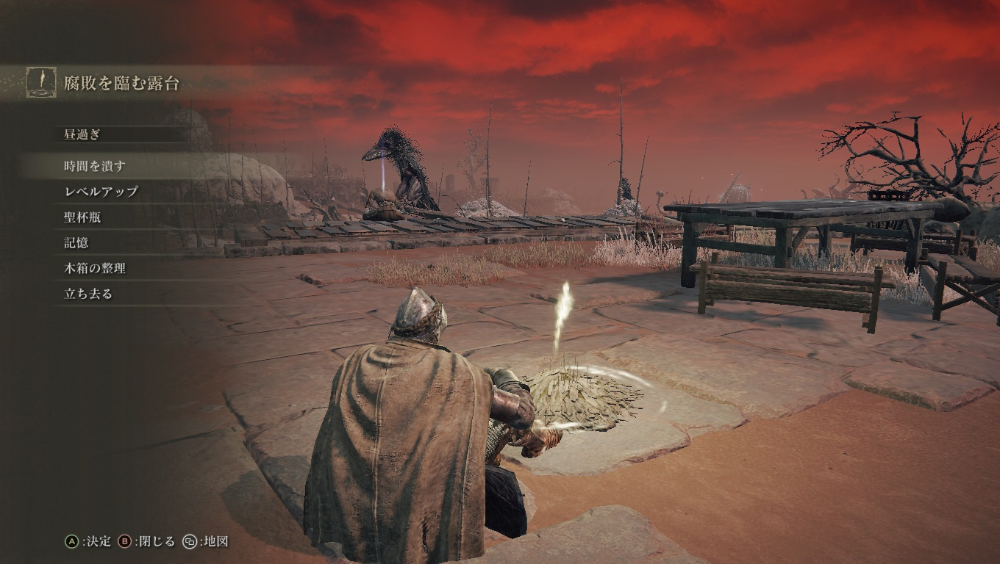

腐敗した大地

### 地下を探索

エレベータで地下深くまで降りました。
地下空間（井戸）は大地全体に広がっているっぽいです。
めっちゃ広いです。

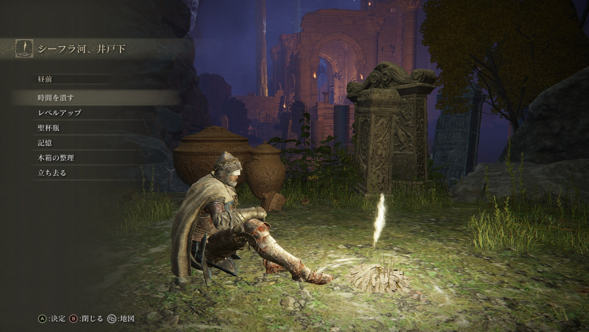

井戸

天井は星空っぽくなっています。

星空

### マルギットを倒した

ようやくマルギットを倒しました。
強かったです。
レベル上げと武器強化、そして私の戦いの慣れが勝因かと思います。

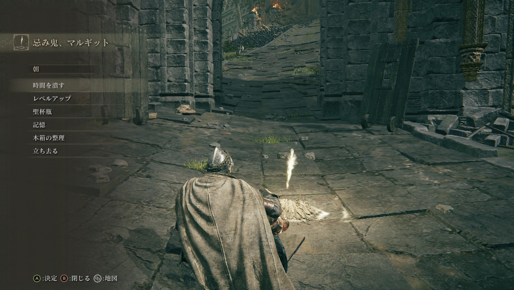

マルギット

### ロジェールに会った

マルギット戦で協力してくれたロジェールがいました。
魔法を売っているらしいです。

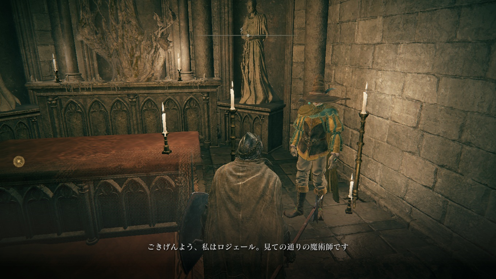

ロジェール

### 開始地点の白い霧

鍵を使って開始地点にあった白い霧を解除しました。
ギミックが難しくてまだ突破できていません。

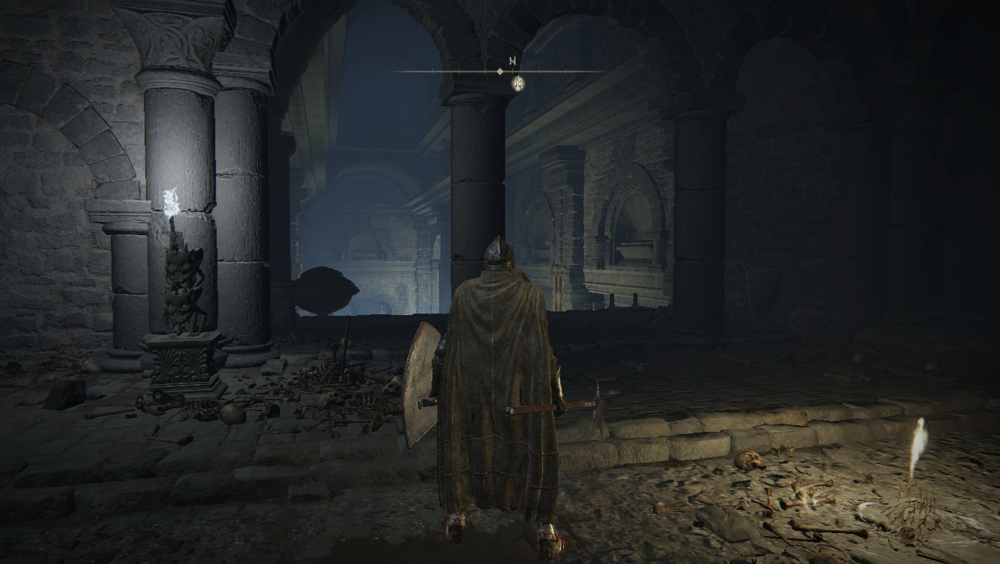

開始地点の白い霧

### 砦

砦を見つけましたが、特に何もありませんでした。
探索不足か、タイミングがまだなのか分かりません。

砦

### 舟を倒した

強そうだから保留にしていた舟を倒しました。
弱かったです。

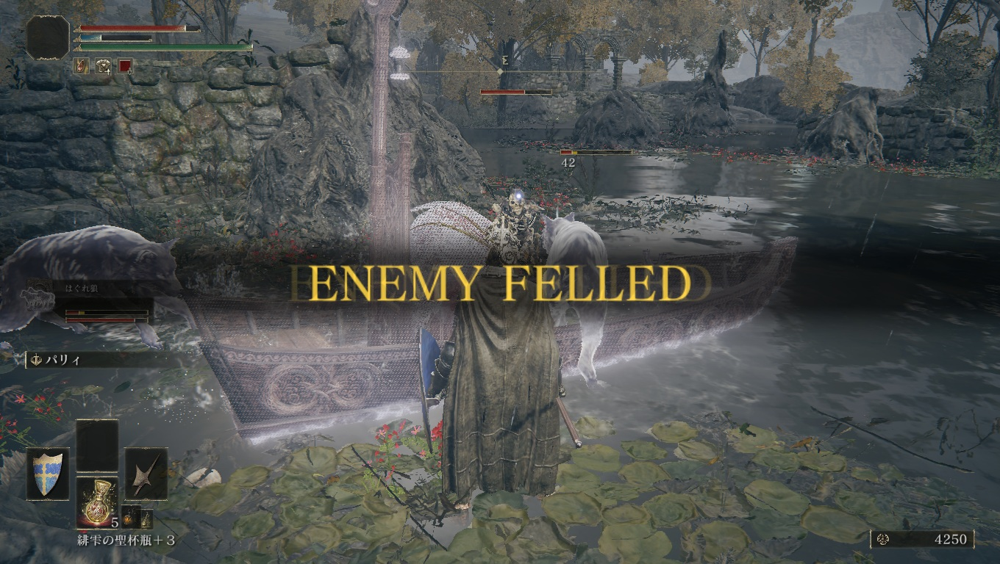

舟

### 魔法使い

どこかの跡地の地下に魔法使いがいました。
たしか商人から情報を購入した気がします。
今作の魔法の師匠っぽいです。

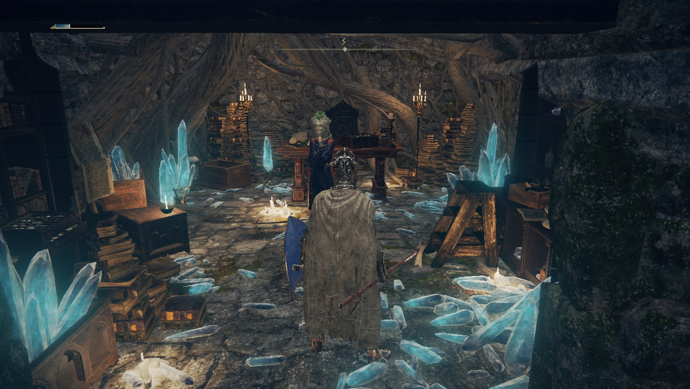

魔法使い

### フェリ・ルーでレベル上げ

大ボス戦で協力してくれるフェリ・ルーがめっちゃ強いです。
雑魚敵とも一緒に戦ってくれるのでレベル上げしました。
ボス前から正門前まで敵を倒すと10分くらいで8000ルーンくらい稼げます。
コスパがめっちゃいいです。

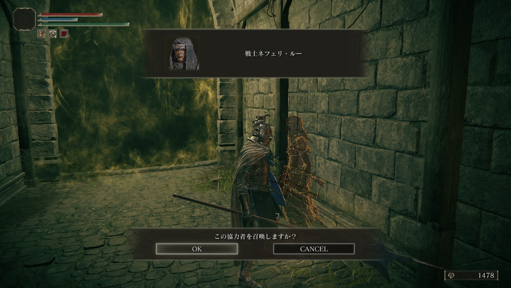

レベル上げ

### ゴドリックを倒した

ゴドリックを倒しました。
たしか初見で倒せたと思います。
フェリ・ルーが強かったです。
あと私のレベルを上げ過ぎたかもしれません。
とりあえずストーリーが進みました。

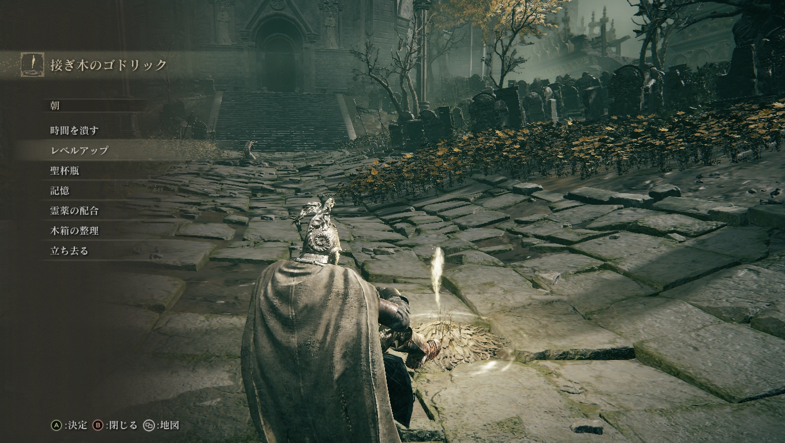

ゴドリック

## おわりに

ようやく最初の大ボスであるゴドリックを倒せました。
しかし、ゴドリックはマリカの遠い親戚みたいな感じで、
大ボスの中でも最弱らしいです（当然ながら）。
今後の大ボスはマリカの子孫しかいないっぽいので、
期待大ですね。
これからも楽しんで攻略していきます。
それでは、また。