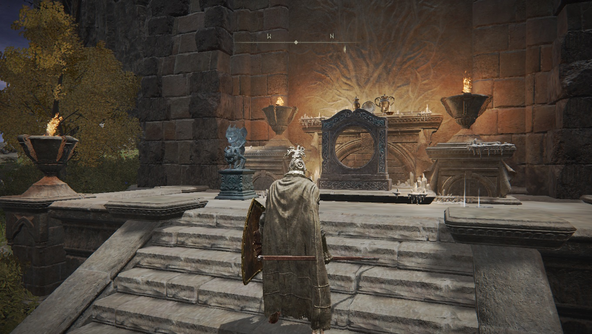
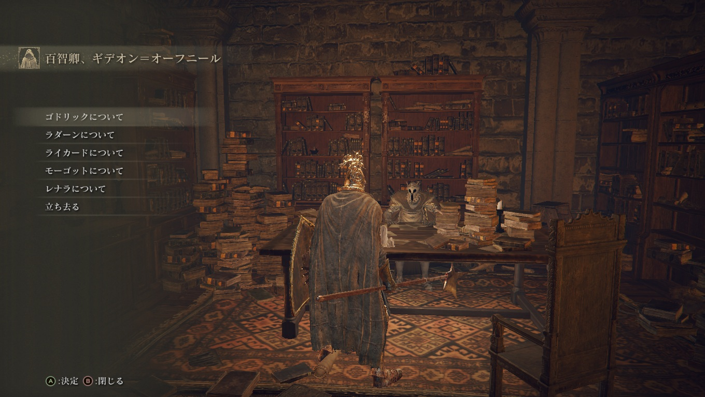
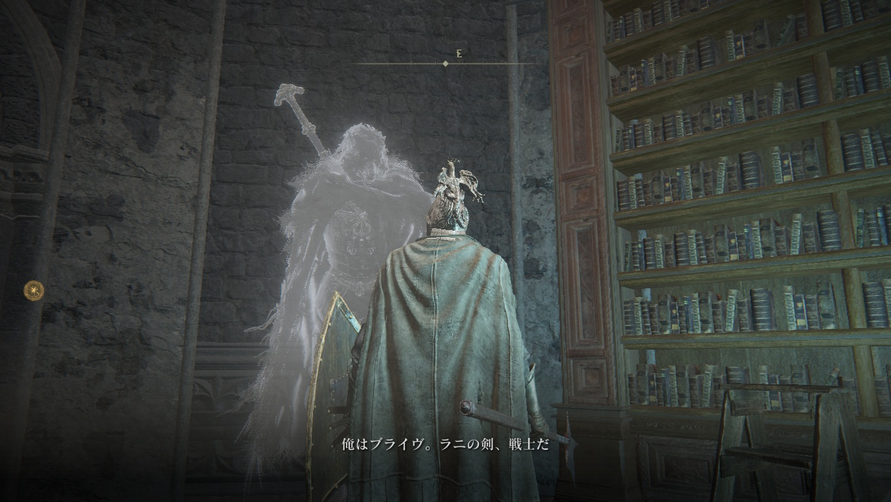
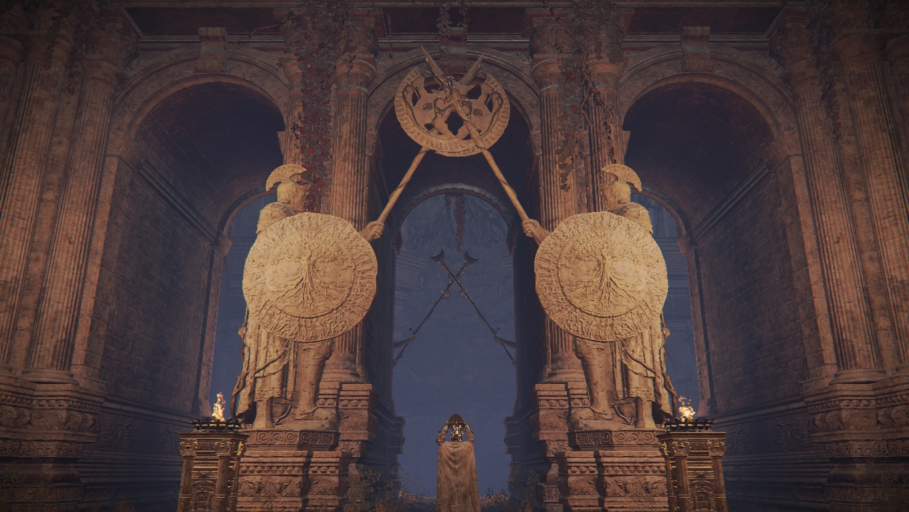
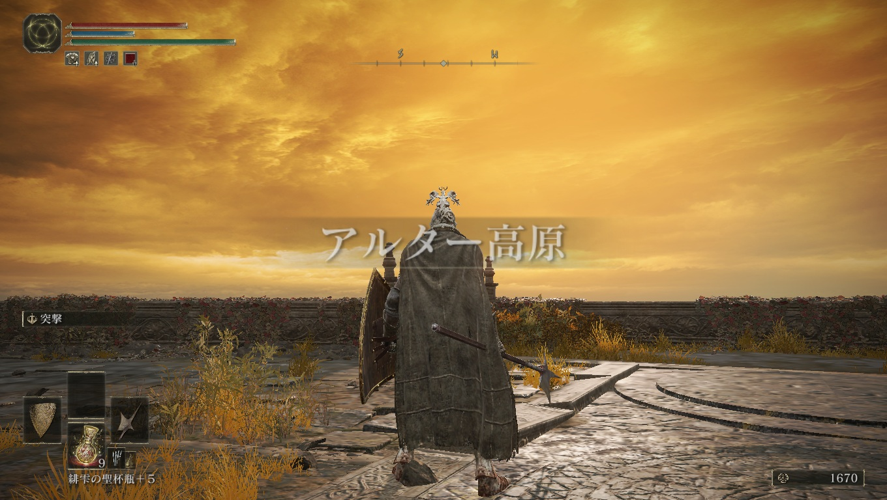

# メタデータ
- title=ELDEN RING BLOG 4: 二体目の大ボスを倒した
- description=フロムソフトウェアのELDEN RINGを今更ながら初見プレイして記録を残そうと思います。今回は二体目の大ルーンを持ったボスを倒した記録です。
- date=2025年3月31日（月）
- update=2025年3月31日（月）
- math=false
- tag=elden-ring

## はじめに

### 概要

2022年2月25日に発売されたフロムソフトウェアの『ELDEN RING』（以下、今作）を今更ながら初見でプレイしています。
現在は順調に進んでいて、大ルーンを持った二体目のボスも倒せました。
レベルもどんどん上げているので、そこまでどん詰まりすることは今のところありません。
この調子でクリアまで楽しんでいきたいですね。

ELDEN RING

### 公式サイト

下記が今作の公式サイトのリンクです。

https://www.eldenring.jp/index.html

ELDEN RINGの公式サイト

### 前回の記事

2025年3月22日の日記です。

https://yusukekato.jp/html/2025/0322.html

ELDEN RING BLOG 3: 一体目の大ボスを倒した

### 注意事項

まだELDEN RINGをプレイしていない方は、ネタバレになってしまうのでご注意ください。

## 本日の冒険の記録

### 3つのワープ装置

鍵を持っているとワープ装置が使えるようになる場所を見つけました。
ワープ装置は3つあって、それぞれよく分からない場所に飛びます。
2つの場所はアイテムがあって、残り1つはゲーム冒頭で負けイベントだったボスと再戦できました。
弱かったです。

ワープ装置

いずれ行くことになりそうな場所

崩れる世界

### 二体目の大ボスを倒した

苦戦しましたが二体目の大ボスを倒せました。
おそらく20回くらいは戦いました。
ちなみに、大ルーンはボスではなく、ボスが抱えている卵みたいなものに宿っているらしいです。

二体目の大ボス

### 円卓

円卓の人が大ルーンを持っているボスたちの情報をくれました。
今のところはゴドリックとレナラを倒したことになります。
ラダーンも見つけましたが、かなり強くてまだ倒せていません。

円卓の人

円卓の奥の扉が開いて急に闇霊みたいな人が現れました。
最初のムービーにも出てきた糞食いと呼ばれている人っぽいです。
明らかに敵っぽいですが、よく分かりません。
ちなみに、この後鍵をくれて「俺を牢屋から出せ」みたいに言ってきたので、
一応助けてあげました（王都についてからの話です）。

糞食い

### 病気の人

魔術街みたいなところの上にある教会で女性が倒れていました。
病気みたいです。
下の小屋にいる賢人にアイテムがあれば助けられると言われたので、
ボスを倒してアイテムを手に入れて助けてあげました。

病気の人

助けるアイテム

### 左上の城のボスを倒した

左上の城（名前は忘れました）の馬に乗ったボスを倒しました。
ほどほどの強さでした。
そこから先に進むと魔法の塔が3つ立っていました。

ボス

魔女に会いました。
おそらく最初に狼の霊をくれた人だと思います。
お使いを頼まれたので進めようと思います。

魔女

魔女の部下がお使いを手伝ってくれるようです。
魔女はラニという名前らしいです。
最初に会った時には違う名前を名乗っていたっぽいのですが忘れました。

部下

### 井戸のボスを倒した

井戸の奥にいた鹿のボスを倒しました。
弱くはないですが、強くもなかったです。

ボス

### 大きなエレベータでアルター高原へ

砦で手に入る二つの割符を使ってエレベータを動かしました。
前回砦では何も手に入らなかったと書いたのですが、この割符が重要だったみたいです。

エレベータ

アルター高原に到着し、王都へ向かいます。

アルター高原

## おわりに

ストーリーも順調に進んでいます。
今は王都を攻略中なので、次回はその記録をまとめられたらと思います。
本当は全部記録したいのですが、
思った以上にエルデンリングはボリュームがあるので、
重要なところだけ抜粋して記録を残せたらと思います。
それでは、また。

## 次回の記事

2025年4月5日の日記です。

https://yusukekato.jp/html/2025/0405.html

ELDEN RING BLOG 5: 三体目の大ボスを倒した