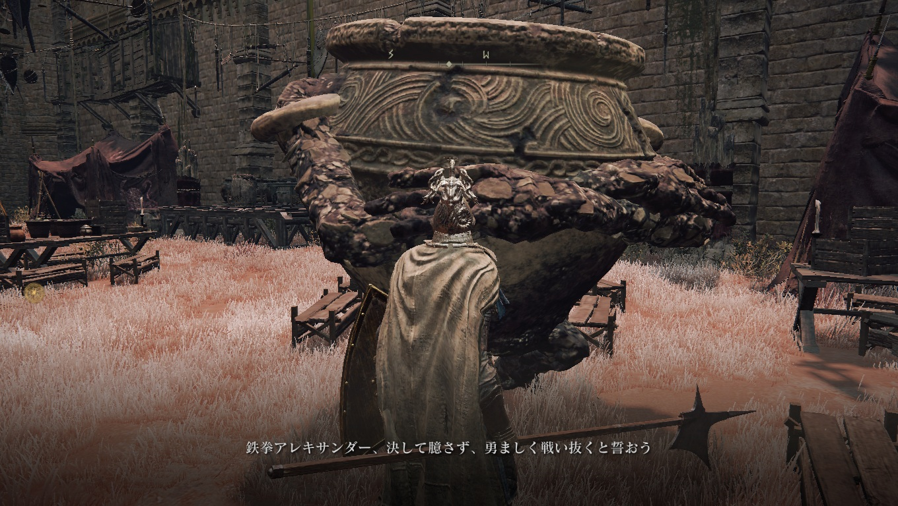
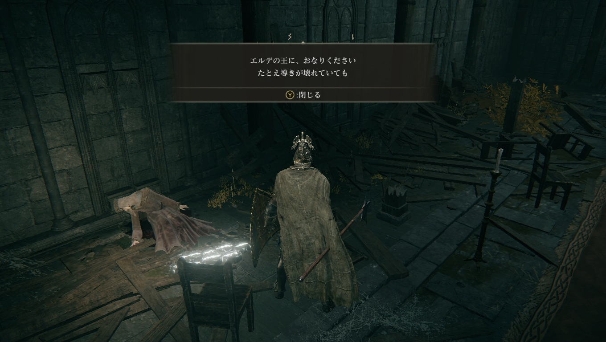
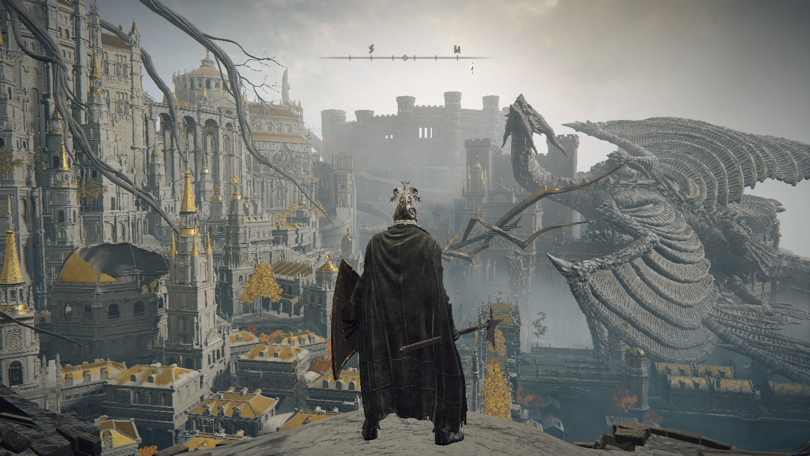
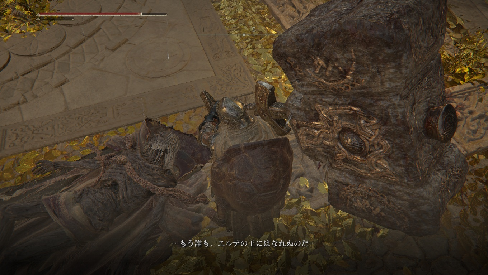
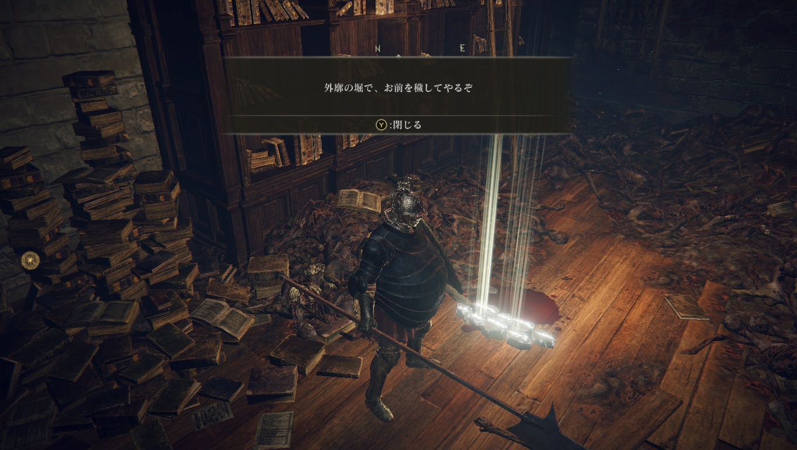
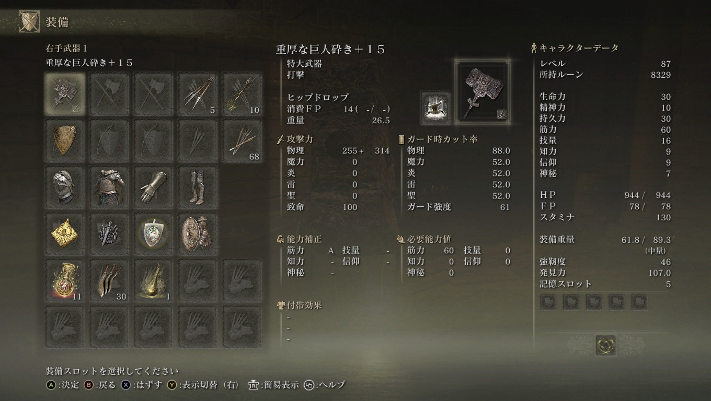

# メタデータ
- title=ELDEN RING BLOG 5: 三体目の大ボスを倒した
- description=フロムソフトウェアのELDEN RINGを今更ながら初見プレイして記録を残そうと思います。今回は三体目の大ルーンを持ったボスを倒した記録です。
- date=2025年4月5日（土）
- update=2025年4月5日（土）
- math=false
- tag=elden-ring

## はじめに

### 概要

2022年2月25日に発売されたフロムソフトウェアの『ELDEN RING』（以下、今作）を今更ながら初見でプレイしています。
かなり苦戦しましたが、大ルーンを持った三体目のボスをようやく倒せました。
武器強化やレベル上げなどいろいろやりました。

ELDEN RING

### 公式サイト

下記が今作の公式サイトのリンクです。

https://www.eldenring.jp/index.html

ELDEN RINGの公式サイト

### 前回の記事

2025年3月31日の日記です。

https://yusukekato.jp/html/2025/0331.html

ELDEN RING BLOG 4: 二体目の大ボスを倒した

### 注意事項

まだELDEN RINGをプレイしていない方は、ネタバレになってしまうのでご注意ください。

## 本日の冒険の記録

### 将軍との戦い

アレキサンダーさんが戦いの祭りみたいなものに参加するという話をしていたのですが、
大ルーンを持った将軍との戦いのことだったようです。
10回くらい一緒に挑んでみたのですが、まだ倒せていません。
一旦後回しにしておきます。

アレキサンダー

### 開始地点に戻ってきた

ワープ装置を使って開始地点に戻ってきました。
エルデの王になってほしいそうです。

エルデの王になる

### 王都前のツリーガードを倒した

王都に入る入口をツリーガードが守っていました。
馬に乗った大きい騎士です。
15回くらいは戦ったと思います。
そこそこ強かったです。

王都前

### メリナとのお別れ

メリナは王都の黄金樹に行くのが目的だったとのことで、
主人公とはここでお別れのようです。
黄金樹で使命を果たすそうです。

メリナとのお別れ

### 王都の様子

王都はかなり王都な感じがあります。

王都の様子

### 円卓と同じ場所があった

王都に円卓と同じ場所がありました。
こちらがオリジナルで、
いつもの円卓はここの真似をしているのかもしれません。

円卓と同じ場所

### 霊体のボス

黄金樹に向かう前に霊体のボスがいました。
そこまで強くはなかったです。
名前は忘れましたが、王様みたいな感じでした。

霊体のボス

### 三体目の大ボス

大ルーンを持つ三体目の大ボス「モーゴット」と戦いました。
おそらくこれまでで一番苦戦したと思います。
30回くらいは戦いました。
また、途中で10レベルくらいは上げました。
なかなか強かったです。

モーゴット

モーゴットのルーンを手に入れました。

ルーン

世界の理が崩れていて、黄金樹も例外ではなく、
もう誰もエルデの王にはなれないらしいです。

モーゴットの言葉

### 糞食い

糞食いを牢屋から助けてあげたら宣戦布告されました。

宣戦布告

糞食いの霊体を倒しました。
弱かったです。

糞食い

肉体を助けてほしいみたいです。

糞食いの肉体を助ける

また糞食いのいるところまで行って助けてあげました。

糞食いを助けた

特に何かあったわけではありませんが、
おそらく糞食いは救われたのだと思います。
霊を強化してくれる女性がそう言っていました。

### 円卓の様子

この前再会した魔女「ラニ」はどうやら大ルーンを持っていたらしいです。
現在は大ルーンは捨てたらしくて、
円卓も彼女を探してはいないとのこと。
味方っぽいのでできれば戦いたくはないですね。

ラニの話

円卓の人が禁忌の先のエレベータへ向かえと教えてくれました。
一応地図にもマークは付いているので迷いはしなさそうです。

円卓の人

二本指様が直立不動になっていました。
さすがにおもしろかったです。
ネットミームになりそうな見た目をしています。

二本指

### 巨人砕き

そういえば巨人砕きという大きいハンマーを手に入れました。
これでモーゴットも倒しました。
火力がかなり高いです。
何かしらのボスを倒した時（王都の霊体のボス？）に貰った気がします。
愛用しています。

巨人砕き

### メリナとの旅を再開

結局メリナも黄金樹に入れなかったらしく、
一緒に旅をするらしいです。
黄金樹がどうにもならないので焼くらしいです。
そのために死のルーンと呼ばれている火を見つける必要があるとか。
物騒ですね。

## おわりに

ようやくモーゴットを倒すことができました。
かなり苦戦したので、倒した時もほどよい達成感がありました。
この後もまだまだ続きそうなので、最後まで楽しんでいきたいと思います。
それでは、また。

## 次回の記事

2025年4月12日の日記です。

https://yusukekato.jp/html/2025/0412.html

ELDEN RING BLOG 5: 四体目と五体目の大ボスを倒した