# メタデータ
- title=ELDEN RING BLOG 6: 四体目と五体目の大ボスを倒した
- description=フロムソフトウェアのELDEN RINGを今更ながら初見プレイして記録を残そうと思います。今回は四体目と五体目の大ルーンを持ったボスを倒した記録です。
- date=2025年4月12日（土）
- update=2025年4月12日（土）
- math=false
- tag=elden-ring

## はじめに

### 概要

2022年2月25日に発売されたフロムソフトウェアの『ELDEN RING』（以下、今作）を今更ながら初見でプレイしています。
レベル上げも武器強化もどんどん行っているので、
そこそこ順調に進んでいる状態ですが、
エルデンリングのボリュームが大きすぎて終わりが見えません。
とりあえず大ボスを2体倒しました。

ELDEN RING

### 公式サイト

下記が今作の公式サイトのリンクです。

https://www.eldenring.jp/index.html

ELDEN RINGの公式サイト

### 前回の記事

2025年4月5日の日記です。

https://yusukekato.jp/html/2025/0405.html

ELDEN RING BLOG 5: 三体目の大ボスを倒した

### 注意事項

まだELDEN RINGをプレイしていない方は、ネタバレになってしまうのでご注意ください。

## 本日の冒険の記録

### 黄金樹を燃やす旅

黄金樹を燃やすために特別な火を探しています。
巨人たちの山嶺にその火があるらしいですが、かなり広いです。

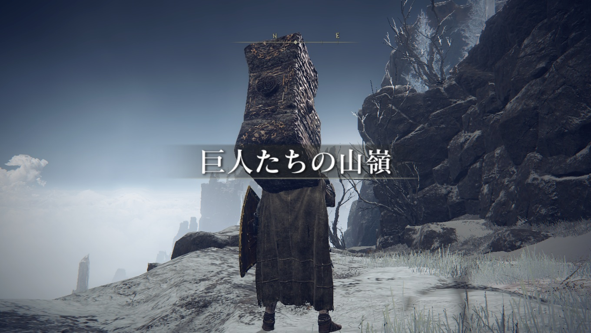

巨人

細い道とかあっておもしろいです。

細い道

砦にいた将軍みたいなボスは倒したのですが、
その後の燃える巨人がまだ倒せていません。
かなりHPが高いです。

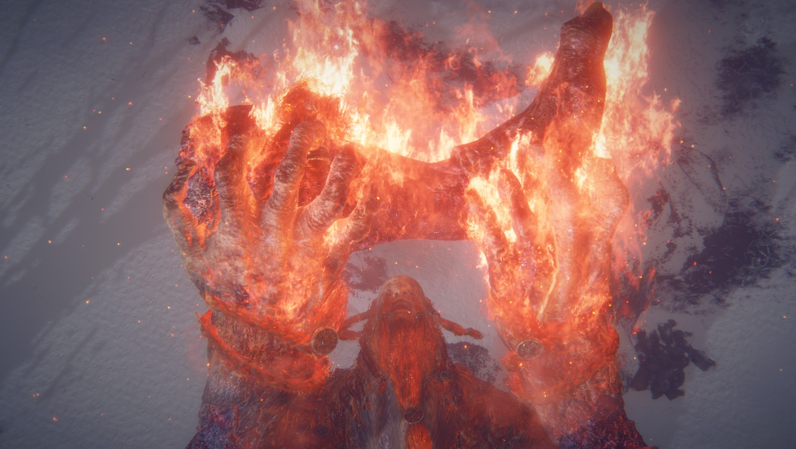

燃える巨人

### 火山館を攻略

山頂のボスをまず倒しました。
普通に強かったです。
どうやら倒さなくても先に進めたようですが、
とりあえず頑張って倒しました。

山頂のボス

火山館の主みたいな人がいました。
ローディング画面でよく出てくる人でようやく会えて感動しました。
火山館では他人から略奪して強くなるという信念があるようで、
私もタスクを割り振られたので何人か倒しました。

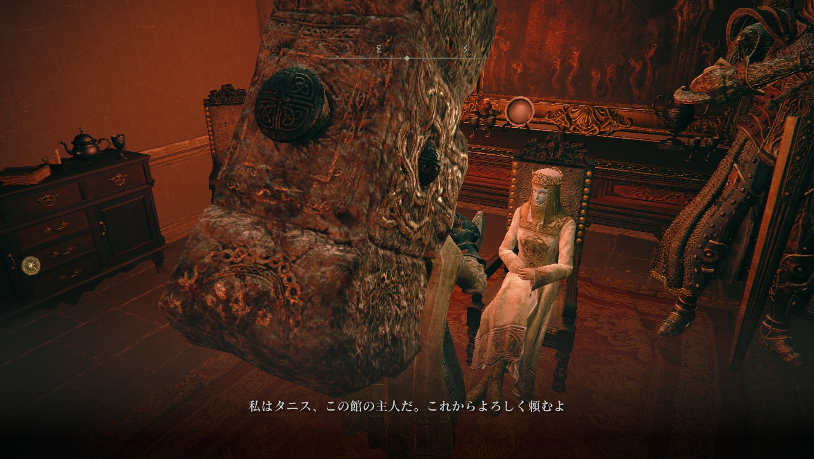

主

ローディング画面

ローディング画面

私以外にも客人みたいな方がいました。
この方は世界の理に歯向かうタイプのようです。
ストーリーが進むごとに二本指様が正義なのか悪なのか、
分からなくなってきます。
大ルーンを持っているボスたちはだいたい狂っていますが、
二本指様側も狂っている気がします。

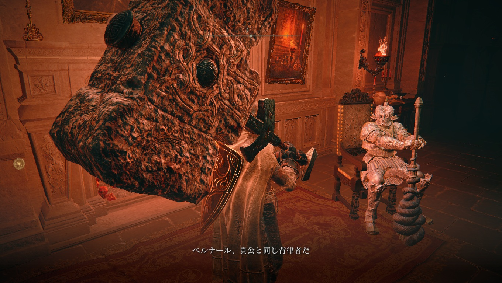

ベルナール

主の娘さんはヘビらしいです。
ボスもヘビらしいのでそういうことです。

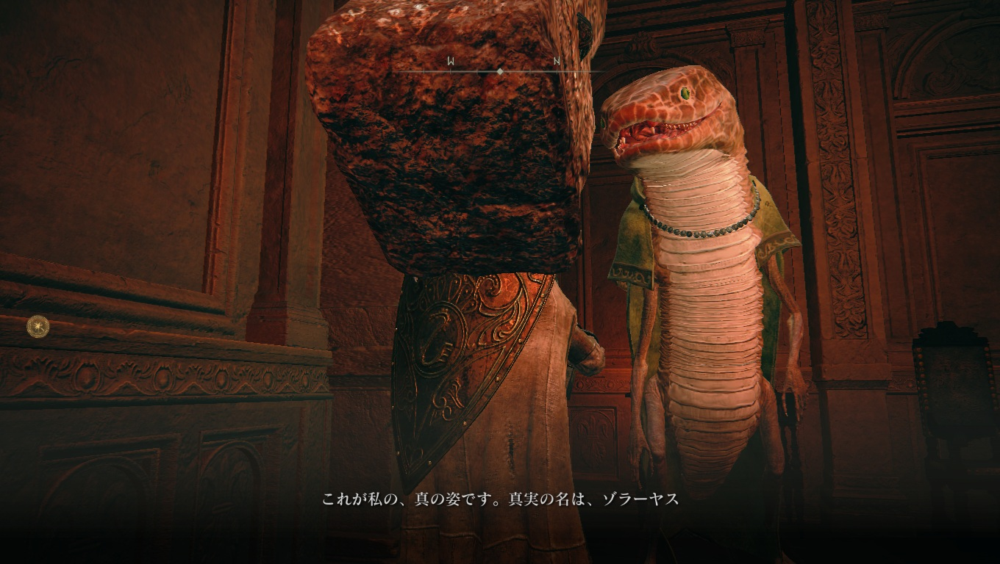

娘

ボスは特別な槍ではないと倒せないようです。
ダークソウル3を思い出しますね。

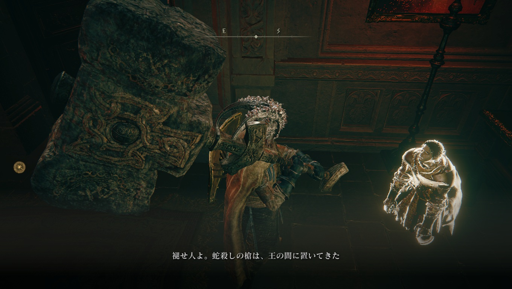

槍

火山館から裏に抜けると街がありました。

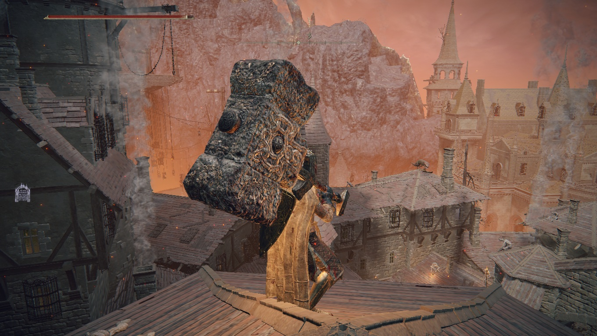

街

大ボスはやっぱりヘビでした。
正直弱いです。
というか指定された槍を強化したらかなりダメージが出せて強いです。

ヘビ

二段階目のボスは人面ヘビでした。
弱かったです。
初見で倒せました。

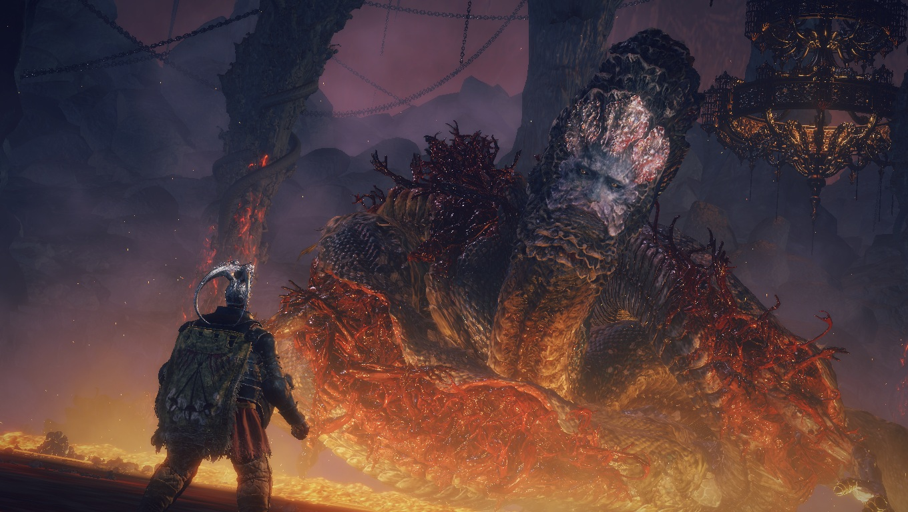

ヘビ

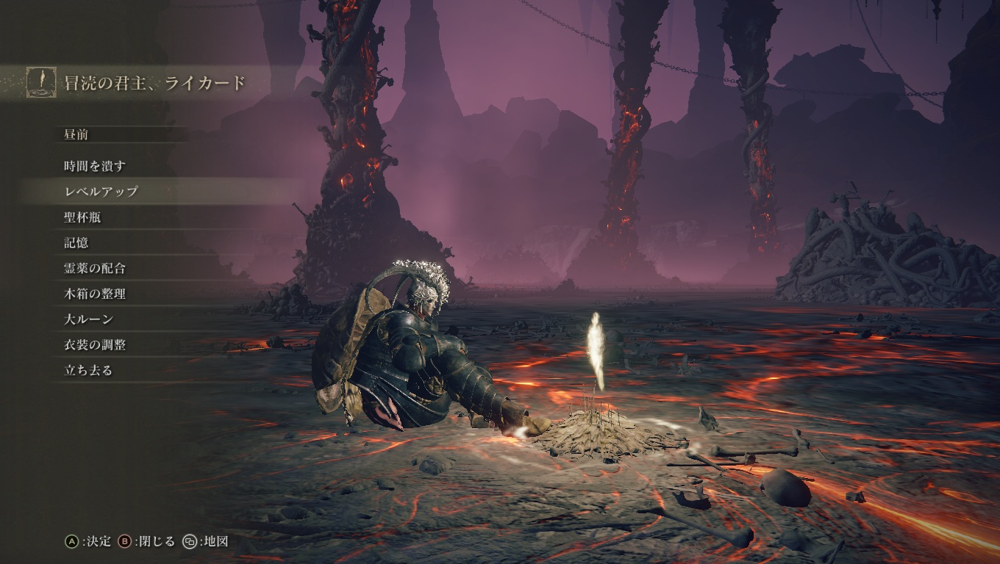

ボス

### ラダーンも倒した

五体目の大ボスであるラダーンもようやく倒しました。
レベルが上がったおかげでかなり余裕をもって倒せたのでよかったです。

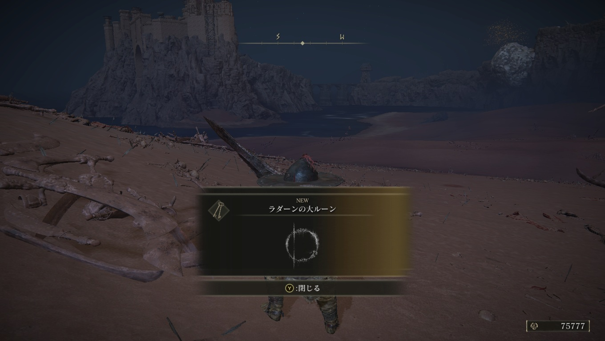

ラダーン

ラダーンを倒したら星が降って、どこかに落ちたらしいです。
綺麗ですね。

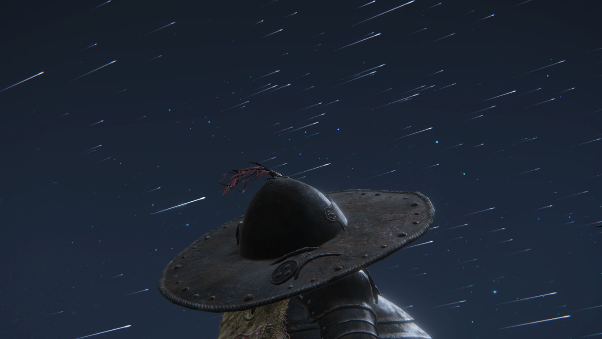

星

魔女ラニの部下がラダーンと一緒に戦ってくれていました。
星が落ちたことで、ラニのストーリーが進んだようです。

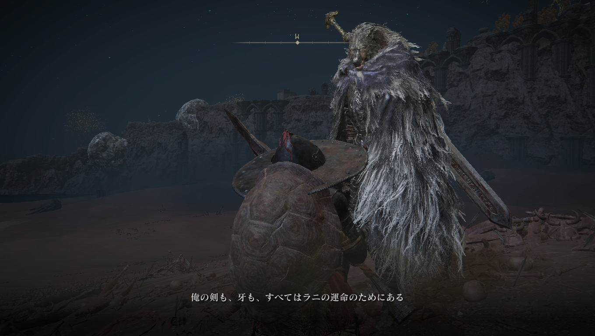

ラニ

アレキサンダーさんは戦士の死体を壺に入れることで強くなれるらしいです。
変わっていますね。

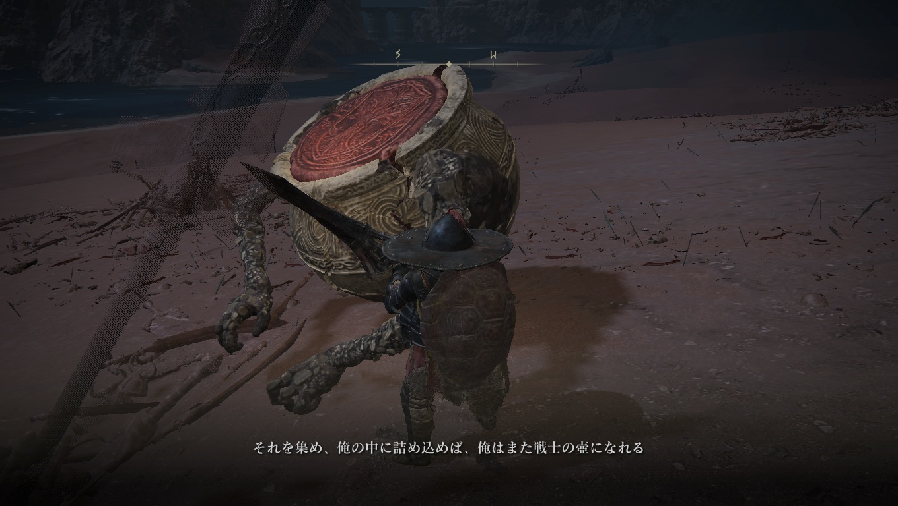

アレキサンダー

## おわりに

サクサク進行して、四体目と五体目の大ボスも倒せました。
ただエルデンリングのボリュームが凄まじくて、
まだまだ続きそうです。
最後まで楽しんでいきたいと思います。
それでは、また。