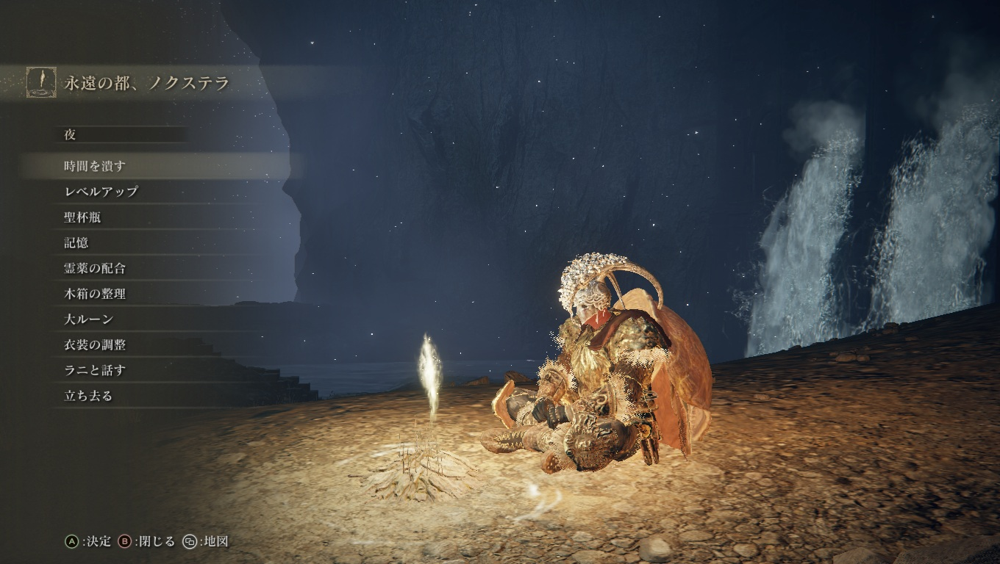
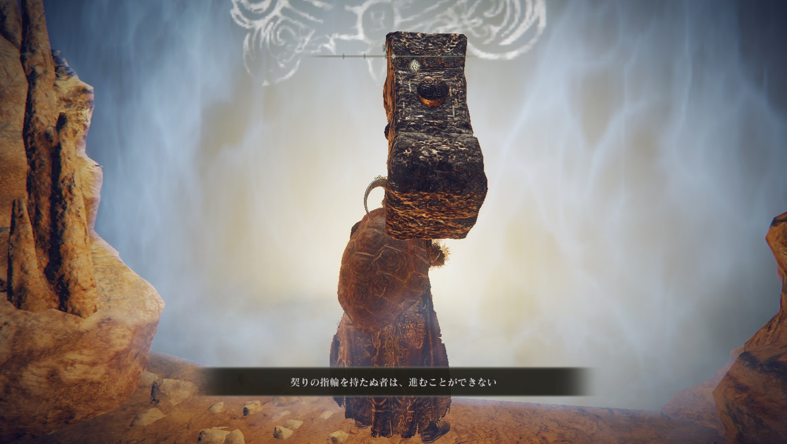

# メタデータ
- title=ELDEN RING BLOG 7: ラニのストーリーを進めた
- description=フロムソフトウェアのELDEN RINGを今更ながら初見プレイして記録を残そうと思います。今回はおそらくサブストーリーであるラニのストーリーを進めました。
- date=2025年4月13日（日）
- update=2025年4月13日（日）
- math=false
- tag=elden-ring

## はじめに

### 概要

2022年2月25日に発売されたフロムソフトウェアの『ELDEN RING』（以下、今作）を今更ながら初見でプレイしています。
今回は以前フラグが立った魔女（王女？）ラニのストーリーを進めました。

ELDEN RING

### 公式サイト

下記が今作の公式サイトのリンクです。

https://www.eldenring.jp/index.html

ELDEN RINGの公式サイト

### 前回の記事

2025年4月12日の日記です。

https://yusukekato.jp/html/2025/0412.html

ELDEN RING BLOG 6: 四体目と五体目の大ボスを倒した

### 注意事項

まだELDEN RINGをプレイしていない方は、ネタバレになってしまうのでご注意ください。

## 本日の冒険の記録

### 永遠の都ノクローン

ラダーンが落とした星が地面をえぐって、
永遠の都ノクローンに行けるようになりました。
地下の井戸を探索していた時に、
地図上では確認できるけど行けないエリアがあって困っていたのですが、
そこが永遠の都ノクローンだったようです。

ラニの部下がここに向かえと言っていたので、
ラニのストーリーも進めてみます。

永遠の都ノクローン

綺麗なエリアです。

永遠の都ノクローン

「同じ武器を持っているボスだ！」と思ったら、
「写し身の雫」という主人公をコピーしたボスでした。
ボスを倒したら写し身の霊体を貰えたのでさっそく使っています。

写し身

他の地下の井戸で見つけた大きい人の死体がここにもありました。

大きい人

奥まで行くと指のおばあさんがここにもいました。
どうやら黄金の王子様が闇落ちしたらしいです。

おばあさん

### 永遠の都ノクステラ

ノクローンで手に入れた秘宝をラニに渡したところ、
ラニはどこかに行けるようになったらしいです。
私もついていこうと思います。

ラニ

ワープ装置で永遠の都ノクステラに到着しました。
ここも地図上では確認できるけど、
ずっと行けなかった場所なので感動です。

永遠の都ノクステラ

ラニの過去を教えてもらいました。
ラニは大ルーンを持った神側の人だったらしいですが、
二本指様に操られるのが嫌で大ルーンを捨てたらしいです。
しかし、二本指様が怒ってラニに刺客を送ってきているらしいです。
とりあえず刺客は倒しました。

ラニ

さらに奥へ進んで、別のエリアなども抜けて、
暗黒の落とし子を倒しました。
大ルーンは持っていませんでしたが、
追憶は貰えたので、大ボスだとは思います。
あまり強くなくて、初見で倒せました。

暗黒の落とし子

先に進むには契りの指輪が必要らしいです。

契りの指輪

### ラニのストーリー

ラニのお母さん（二体目の大ボス）がいる場所に契りの指輪がありました。

契りの指輪

ラニは王女らしいです。

ラニ

さらに進んで（どうやって進んだかは忘れました）、
月光の祭壇？みたいなところの穴に落ちたところで、
ラニがいました。

ラニ

ラニに契りの指輪をつけてあげました。

ラニ

ラニが王女ということで、
主人公が王になるらしいです。
つまり、これがエルデの王ということでしょうか。
ラニは夜空へ向かうらしいです。
すべてが終わったら後で会えるらしいです。
おそらくラニのストーリーは終わりっぽいです。
サブストーリーを一つ完了できて良かったです（たくさん見逃していそうなので）。

ラニ

## おわりに

今回は永遠の都の探索とラニのイベントを完了しました。
エルデンリングではサブストーリーも豊富にありそうなので、
二周目をやる余裕があればいろいろ遊んでみたいですね。
それでは、また。

### 次回の記事

2025年4月15日の日記です。

https://yusukekato.jp/html/2025/0415.html

ELDEN RING BLOG 8: 最後のボスを倒した