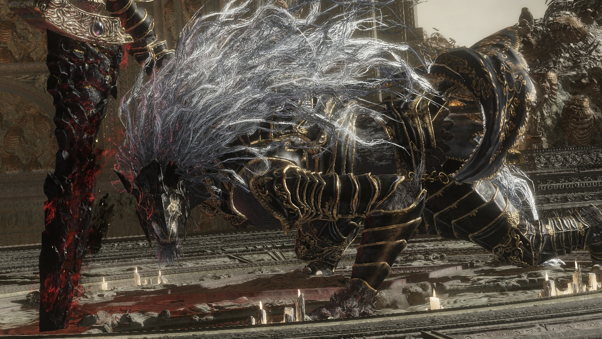
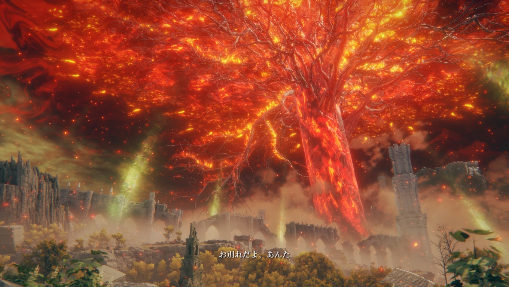
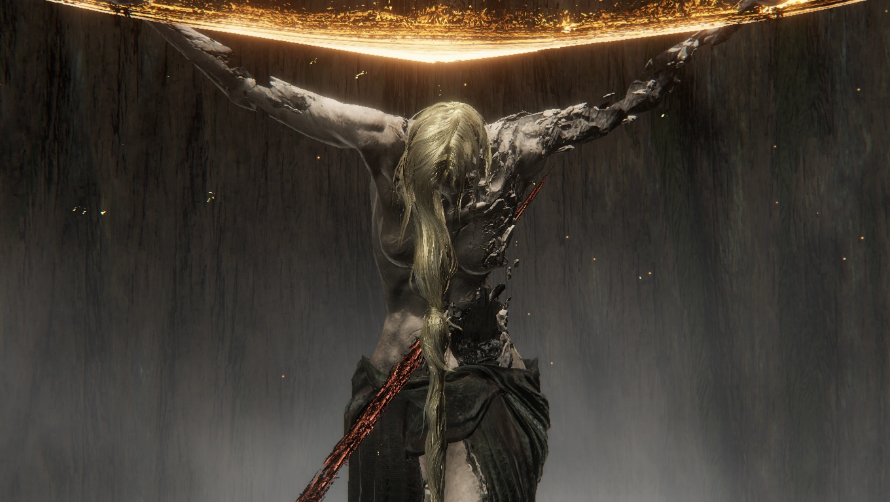
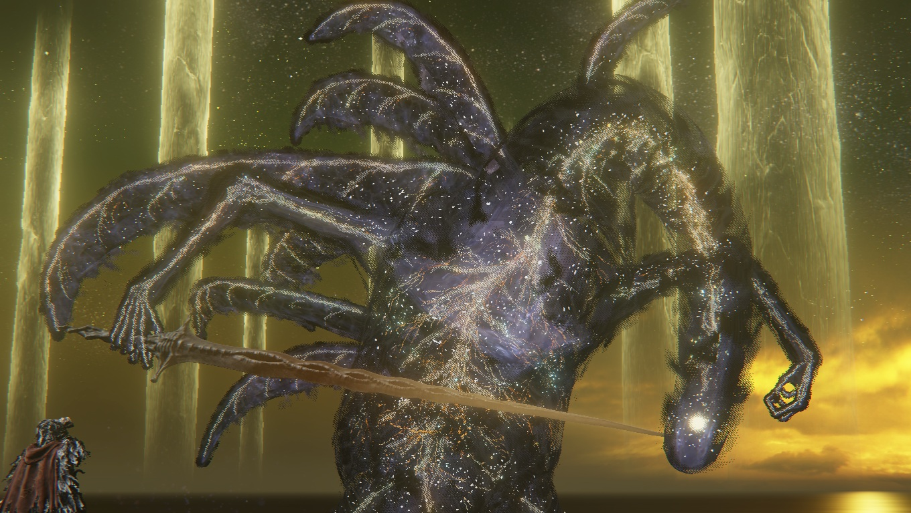
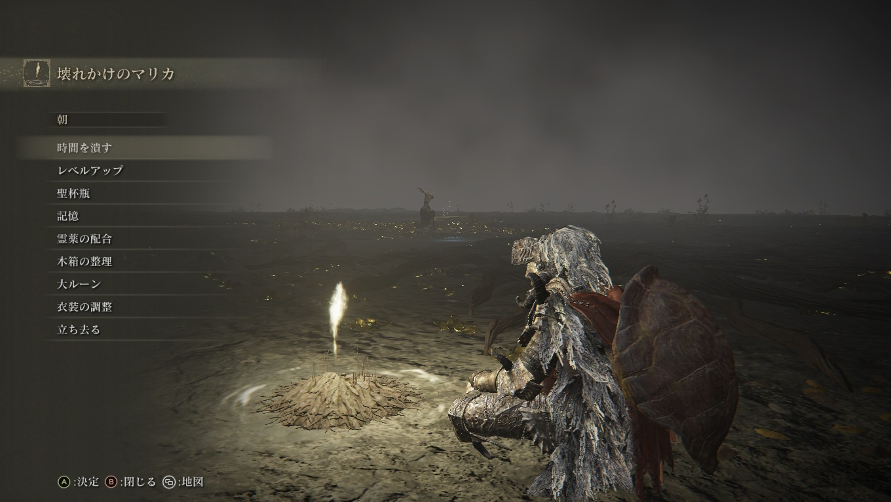
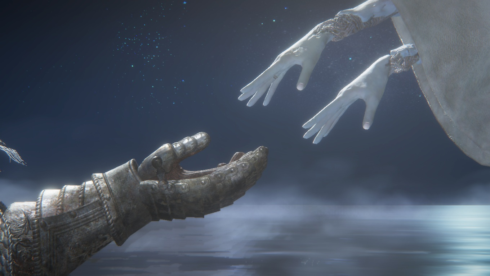

# メタデータ
- title=ELDEN RING BLOG 8: 最後のボスを倒した
- description=フロムソフトウェアのELDEN RINGを今更ながら初見プレイして記録を残そうと思います。今回は最後のボスを倒してとりあえずエルデンリングをクリアしました。
- date=2025年4月15日（火）
- update=2025年4月15日（火）
- math=false
- tag=elden-ring

## はじめに

### 概要

2022年2月25日に発売されたフロムソフトウェアの『ELDEN RING』（以下、エルデンリング）を今更ながら初見でプレイしています。
今回は最後のボスを倒して、
一旦エルデンリングをクリアするところまで進めました。
まだ倒していないボスがいるので、
いずれまた遊びたいと思います。

ELDEN RING

### 公式サイト

下記が今作の公式サイトのリンクです。

https://www.eldenring.jp/index.html

ELDEN RINGの公式サイト

### 前回の記事

2025年4月13日の日記です。

https://yusukekato.jp/html/2025/0413.html

ELDEN RING BLOG 7: ラニのストーリーを進めた

### 注意事項

まだELDEN RINGをプレイしていない方は、ネタバレになってしまうのでご注意ください。

## 本日の冒険の記録

### マレニアが倒せない

割符を集めてエレベータから特殊エリアみたいなところへ進みました。
そのエリアの最後のボスとして大ルーンを持ったマレニア
（円卓の人がたしか双子と言っていたはず）がいました。
第一形態は簡単に倒せるのですが、
第二形態がかなり強いです。
回復する暇がなく慣れが必要なので後回しにしようと思います。

マレニア

第二形態のマレニアです。
フロムソフトウェアのゲームを通して、
かなりカッコいいタイプのボスだと思います。

第二形態

### 火の巨人を倒した

メインストーリーのほうを進めるため、
火の巨人を倒しました。
火力でゴリ押しでした。
倒せてよかったです。

巨人

### 黄金樹を燃やす

巨人サイズの大きい杯の中に火があって、
メリナがそれを使って黄金樹をもやしてくれました。
しかし、どうやらメリナは自分の命を犠牲にしてしまったらしいです。
メリナとはここでお別れでした。

メリナ

### 気がつくと知らないエリア

ワープ装置で一回だけ来たことがあるファルム・アズラにきました。
なぜ崩れているのかは分かりません。

ファルム・アズラ

ここのボスは別のエリアにいた「死」を欲している獣でした。
本当の姿はかなりカッコよかったです。

獣

獣を倒すと死のルーンが解き放たれて、
黄金樹がさらに燃えました。

燃える黄金樹

### 気がつくと灰都

王都が灰になっていました。
敵はおらず、黄金樹のところまで走り抜けました。
途中に円卓の人がボスとして現れました。
「人は王にはなれない」みたいなことを言っていました。

灰都

ボスは最初の王ゴッドフレイでした。
最初のムービーで暗殺されたみたいな話があったと思いますが、
どうやら帰ってきたらしいです。

ゴッドフレイ

ホーラ・ルーでもあるらしいです。

ホーラ・ルー

### 黄金樹の中にマリカ？

黄金樹の中に入ると崩れかけの王女マリカ？っぽい人が浮かんでいました。
ボスの名前はラダゴンだったので、マリカではないのかもしれません。
ストーリーを追い切れていませんでした。
マリカとラダゴンの関係性が分かりません。

マリカ

最後のボスはエルデの獣でした。
エルデンリングが実体化したボスみたいな感じでしょうか。
強かったです。

獣

### 壊れかけのマリカとラニ

最後に残ったものはやはりマリカのようです。

マリカ

マリカの前でラニを召喚できました。
約束通りすべてが終わったので来てくれたようです。

ラニ

ラニがすべてを終わらせてくれるようです。

ラニ

約束通り主人公と一緒にどこかしらに行ってくれるようです。

ラニ

ハッピーエンドなのかバッドエンドなのかは分かりませんが、
とりあえず主人公は一人ではないっぽいので、
悲しくはないでしょう。
永遠の時を一人で過ごすのは辛いと思います。
ラニがいてくれて良かったです。

ラニと一緒に

## 感想

感想としては、圧倒的なボリュームに感動しました。
ダークソウル1と2と3を合わせたくらいのボリュームがありそうです。
かなりお腹いっぱいで満足度が高いです。

ラニのサブストーリーなど、メインストーリー以外のコンテンツもかなりボリュームがありそうなので、普通にプレイするだけで100～200時間は当たり前のように遊べそうです。

いつも通りストーリーの説明は特になく、
私の中で何も理解はできていませんが、
ストーリーは少しずつ補っていけたらと思います。
ダークソウルの世界観が大好きなので、
エルデンリングの世界観も存分に楽しめました。
まだまだ私の知らないキャラクターもいそうなので、
そのあたりもいずれ出会えたらと思います。

## おわりに

エルデンリングをクリアしました。
まだ倒していないボスがたくさんいそうですが、
とりあえずはここで一区切りになるかと思います。
ここまでお付き合いいただきありがとうございました。
続きをやったらまた記録を残します。
それでは、また。