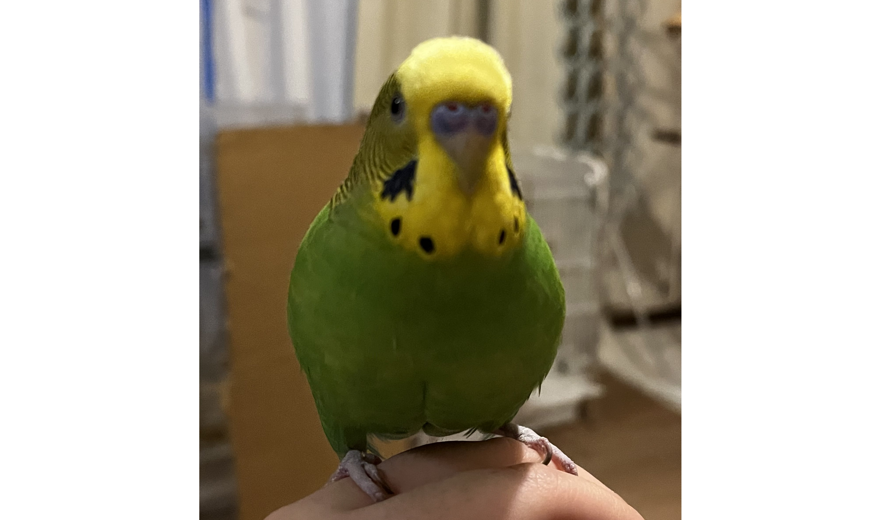
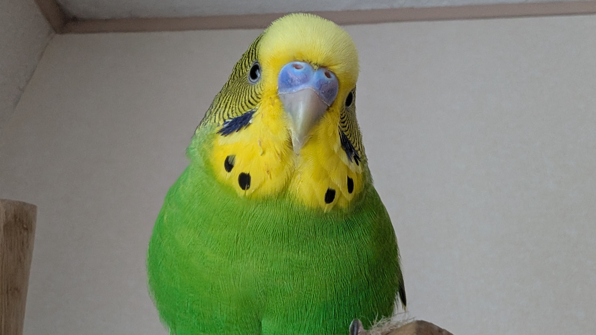
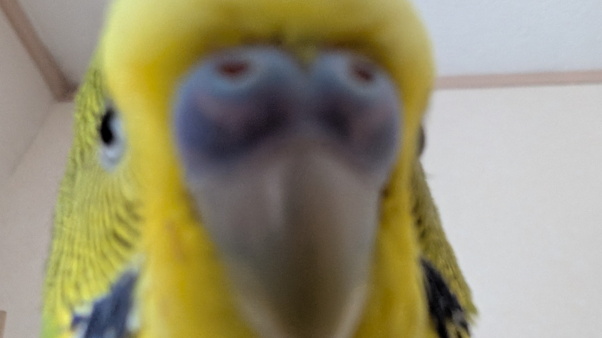
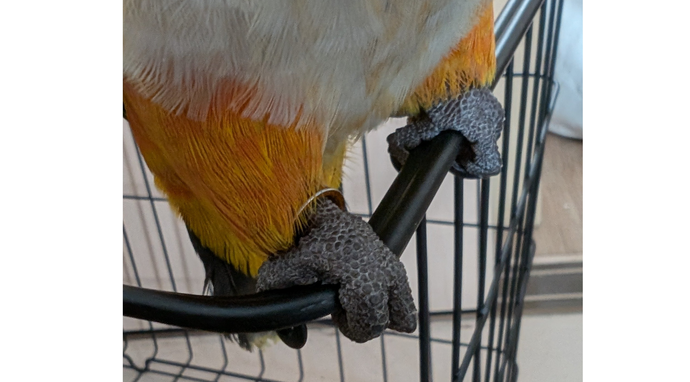
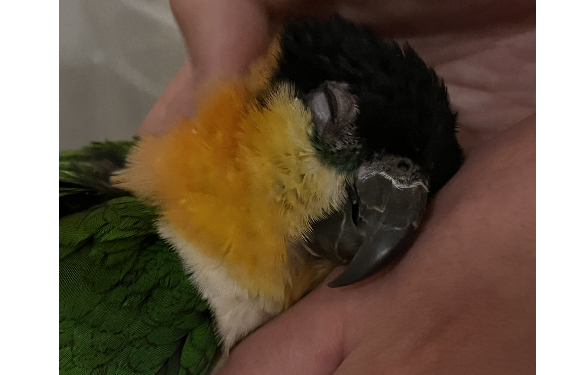
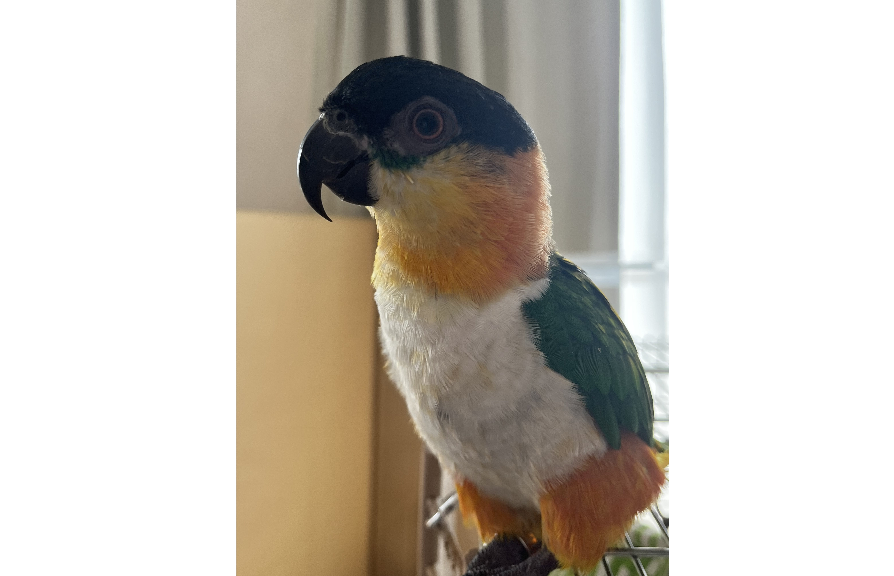
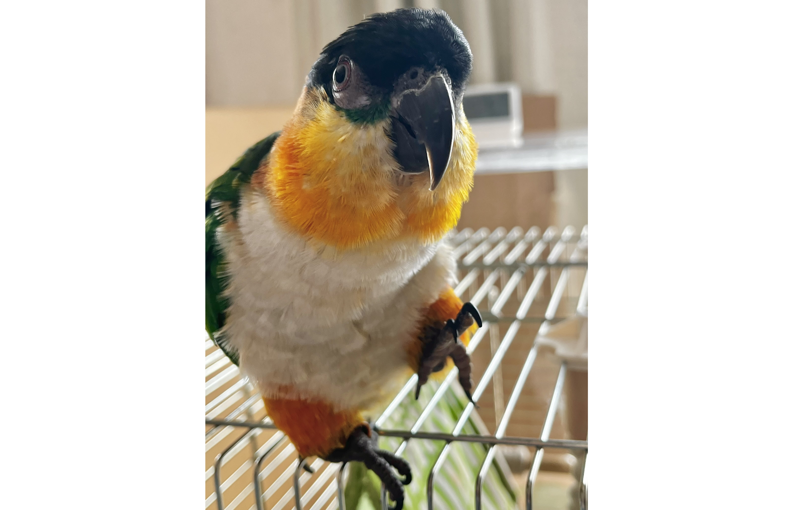
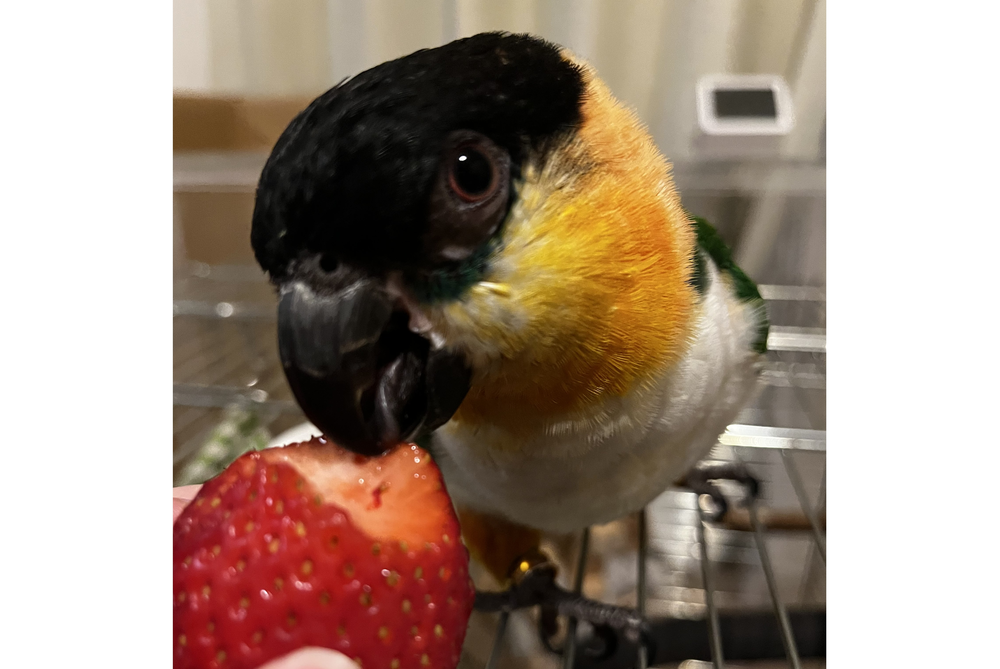

# メタデータ
- title=我が家のインコ「れもん&ぽぽ&ぐぐ」の日記21 : 2ヶ月ぶりのインコ日記
- description=2025年5月6日（火）までのセキセイインコ「れもん」とズグロシロハラインコ「ぐぐ」の様子を記録しておきます。
- date=2025年5月6日（火）
- update=2025年5月6日（火）
- math=false
- tag=lemon

## はじめに

お久しぶりのインコ日記です。
相変わらずれもんもぐぐも元気にやっています。
れもんは我が家に来てもうすぐ一年、
立派な大人へと成長を遂げています。
ぐぐも甘えん坊ながら強く育っています。
今回もいつも通り記録を残していこうと思います。

れもんの影↓

れもんの影

## 関連記事

### 前回の日記

2025年3月12日の日記です。

https://yusukekato.jp/html/2025/0312.html

我が家のインコ「れもん&ぽぽ&ぐぐ」の日記20 : 久しぶりのインコ日記

### 我が家におけるインコの飼育方法

2024年の我が家でのインコの飼育方法をまとめました。

https://yusukekato.jp/html/2024/1025.html

インコの飼い方と注意点（2024年版）

## 注意点
私たちは鳥を初めて飼うため飼育方法に誤りがあるかもしれません。
これからセキセイインコやズグロシロハラインコなどを飼うという方はこのブログの情報を鵜呑みにせず、参考程度に読んでいただけますと幸いです。
いかなる場合でも責任は負えませんのでご了承ください。

## 今週のインコ

### 大人びたれもん

写真でこうして見てみるとれもんは大人びてきている気がします。
もう小さな子供ではなく立派な大人になったようです。

大人びたれもん

人間の手に乗っていても堂々としています。

堂々のれもん

### モデルのれもん

大人びていても可愛らしい姿を見せることもあります。
モデルとしてやっていける素質があると思います。

モデルのれもん

### ドアップのれもん

カメラにも慣れてきて興味津々です。

ドアップのれもん

### 振り向き美人のれもん

振り向く姿も素敵です。

振り向きのれもん

### ぐぐの足

ぐぐの足はかなり恐竜です。
普通に生活していたら見かけない足なので、
ありがたく撫でさせてもらっています。

ぐぐの足

### 撫でられるぐぐ

ぐぐは仰向けになって撫でられるのが好きです。
鳥としてそれでいいのかは疑問ですが、
ぐぐがそれで良しとしているのなら、
私たちが何か言うべきではないのかもしれませんね。

撫でられのぐぐ

仰向けのぐぐ

仰向けのぐぐ

### やはり恐竜っぽいぐぐ

ぐぐはたまに祖先の恐竜を覗かせてきます。

恐竜のぐぐ

### 陽気なぐぐ

陽気におどけるような様子を見せるぐぐです。

陽気なぐぐ

### いちごを食べるぐぐ

いちごもたまに食べます。

いちごを食べるぐぐ

## おわりに

今週はこんな感じでした。
特に大きな変化などはなく平和に暮らしています。
このまま元気に生活していけたらと思います。
今回もありがとうございました。
今後もよろしくお願いいたします。
それでは、また。

## 次回の日記

2025年7月27日の日記です。

https://yusukekato.jp/html/2025/0727.html

我が家のインコ「れもん&ぽぽ&ぐぐ&さん」の日記22 : 我が家にさんちゃんがやってきた