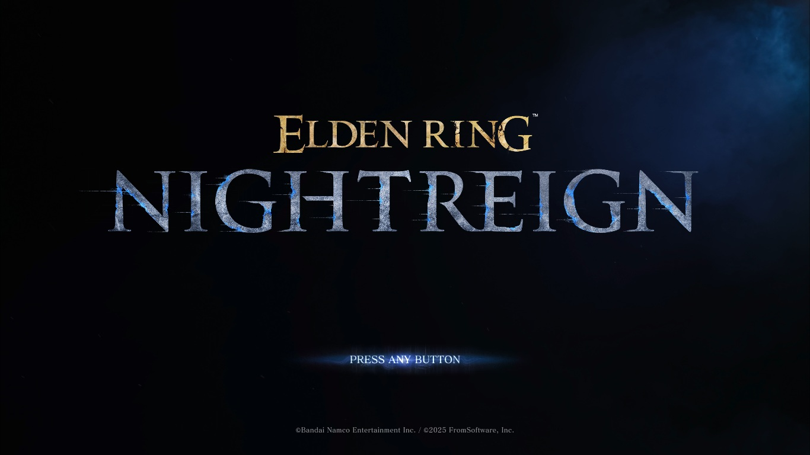
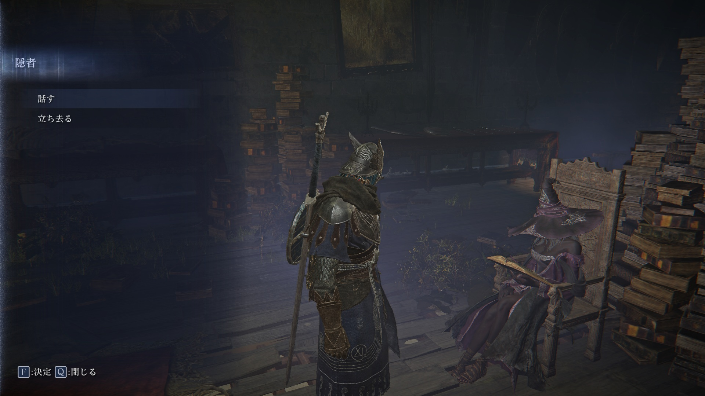
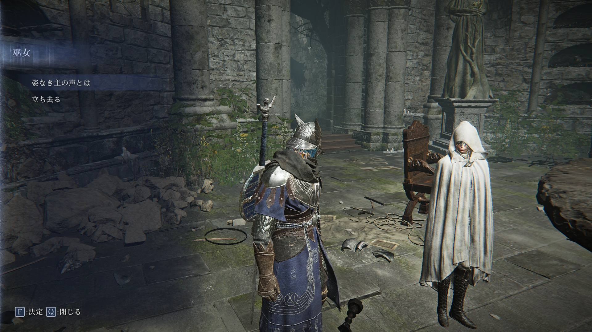
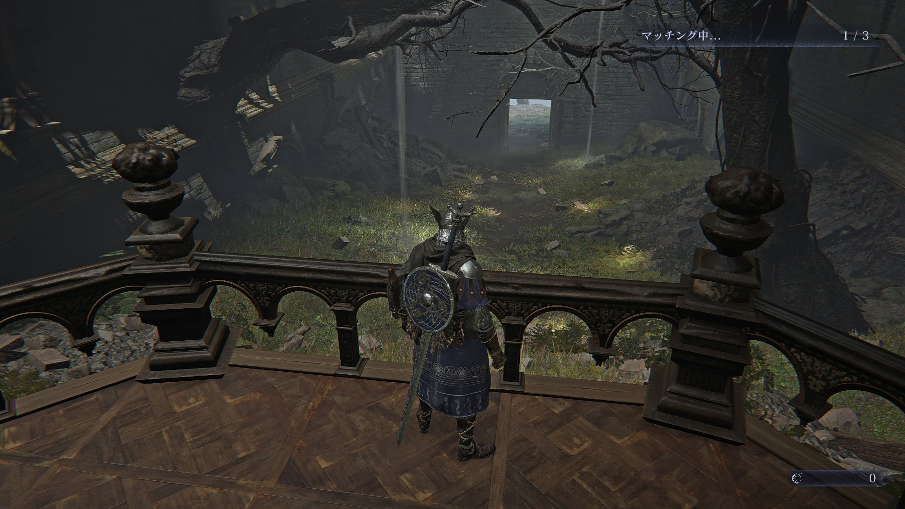
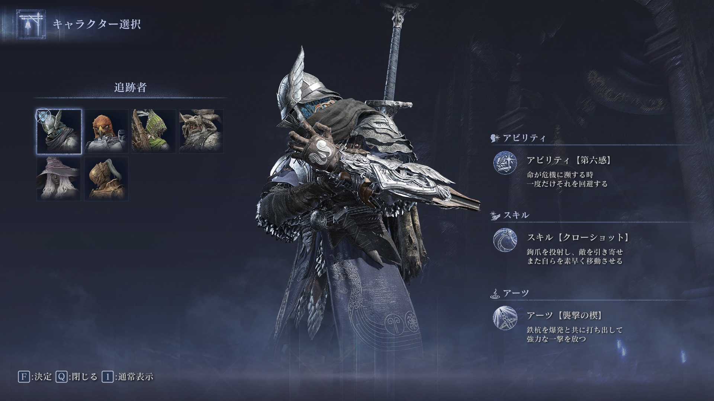
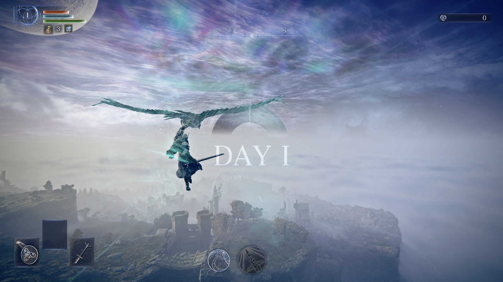

# メタデータ
- title=ELDEN RING NIGHTREIGN BLOG 1: マルチプレイ初戦
- description=フロムソフトウェアのELDEN RING NIGHTREIGNをさっそくプレイして記録を残していこうと思います。今回は初見マルチプレイの出撃までの記録です。
- date=2025年5月31日（土）
- update=2025年5月31日（土）
- math=false
- tag=nightreign

## はじめに

### 概要

2025年5月30日に発売されたフロムソフトウェアの『ELDEN RING NIGHTREIGN』（以下、ナイトレイン）を初見でプレイしていきます。
今回はとりあえず初戦の記録です。

ELDEN RING NIGHTREIGN

### 公式サイト

下記がナイトレインの公式サイトのリンクです。

https://nightreign.eldenring.jp/index.html

ナイトレインの公式サイト

### 公式のTips
公式がナイトレインのプレイするためのTipsを紹介してくれています。

https://nightreign.eldenring.jp/article/250531_1.html

ナイトレインのTips

### 注意事項

まだナイトレインをプレイしていない方は、ネタバレになってしまうのでご注意ください。

## 本日の闘いの記録

### チュートリアル

ゲームスタートするとさっそくチュートリアルが始まります。
画面構成はエルデンリングとは少し異なっています。
右上がルーン、左上の数字がレベル、あとはHPやFP、スタミナのゲージ、その下に回復する瓶の個数の数字があります。
左下には武器や盾、アイテムの選択欄があります。

操作性はエルデンリングとはほとんど変わらない、あるいはエルデンリングよりもスピード感がありそうです。
壁もジャンプできます。
また、落下ダメージはなさそうです。
あと普通のダッシュのほかに、めっちゃダッシュみたいなこともできます。
フィールドが広いので速度を出せるようになっていそうです。

チュートリアル

### ストーリームービー

チュートリアルが終わるとムービーが入ります。
ストーリーはエルデンリングと同じようで、
エルデンリングとは別の世界線か、
エルデンリングより後の世界という感じっぽいです。

主人公たちは「夜の王」を倒すために集まって一緒に戦っているようです。

ムービー

### 円卓

円卓につきました。
ここが活動の拠点です。
ここで準備してキャラクター選択して出撃します。

円卓

円卓には他のキャラクターがいました。
この「隠者」も選択可能なキャラクターです。
ナイトレインでは選択できるキャラクターひとりひとりにストーリーがあるようです。
今は追跡者を選んでいますが、他のキャラクターを選択すると追跡者とも会話できます。

隠者

巫女もいます。
いろいろ教えてくれそうな人です。

巫女

円卓はエルデンリングと同じ形をしていますが、崩れていたり土に埋もれていたり草が生えていたりで、かなりの時間が経過しているような印象を受けました。
そもそもエルデンリングの円卓と同じかも分かりません。

円卓の様子

### キャラクター選択

キャラクターは6体から選べます。
おそらくゲームを進めていくと選べるキャラクターが増えるのかと思います。

キャラクター選択

### 出撃

初めての出撃を行いました。
スクリーンショットを撮る暇がなかった（というか忘れていた）ので、
文章だけでの説明となります。
結果としては一つ目の夜は超えましたが、「DAY2」で負けました。
基本的には仲間と協力しながら敵をどんどん倒して、
装備を拾ったりルーンを稼いでレベルアップして強くなっていきます。
そしてボスを倒せばクリアです。

マッチングは1～2分程度でできました。
知り合いとプレイする場合は待つことはないかと思います。

出撃

### ナイトレインのルール

現状、私が把握できたルールをまとめておきます。
どこかしらにちゃんとまとまっているとは思うので、自分用のメモです。

- 3回夜を越せるとクリア
- 強敵のボスを倒すと夜を越せる
- 3人チームで挑む（友達と一緒に参加も可能）
- HPを失うと「瀕死」状態になる
- 「瀕死」状態の仲間を攻撃すると復活させられる
- 「瀕死」状態のまま一定時間が経つと死ぬ
- 死ぬとレベル1つとルーンを失って復活する
- ルーンは拾うと回収できる。レベルは戻ってこない
- 祝福でルーンを使ってレベルアップできる（ステータスは勝手に割り振られる。キャラクター依存）
- 3人とも「瀕死」になるとゲームオーバー
- フィールドは広いが活動できる範囲がどんどん狭くなっていく。活動不可の範囲は「夜」となり、そこにいるだけでダメージを受けるのですぐに抜ける必要がある（よくあるマルチプレイのFPSゲームみたいなやつ）
- ドロップアイテムなどは仲間で共有っぽい（誰かが取得したら他の人は取れないはず。要確認）
- ボスを倒した後の報酬みたいなものはひとりひとり別っぽい

### 現状の感想

まだ一度しかプレイしていませんが、現状の感想をまとめておきます。
基本的にはたくさんプレイしてゲームに慣れてくればもっと楽しめそうです。

楽しいところ

- 操作性が良くてアクションが楽しい。基本はエルデンリングでSEKIROみたいな部分もある。
- 宝箱などから武器やアイテムがランダムでドロップするゲーム性が楽しい。
- ルーンもレベルアップだけではなくアイテム購入にも使えるので良い。
- レベルアップでちゃんと強くなる。ステータスは勝手に上がるので悩む必要がなくて良い。
- 現状難易度はちょうどよさそう（かなり難しいが、それを求めてプレイしている）。
- この難易度でマルチプレイのゲームは珍しい気がするのでワクワク感がすごい。

難しいところ

- チュートリアルが必要最低限の説明しかなくて初見出撃時は分からないことがたくさんある。
- 知らない人とプレイすること自体は問題ないが、ちゃんと連携を取るためにはそこそこの慣れが必要。ピンで行きたいところを教えるくらいしか情報を伝える手段がない。
- 地図の読み方が分からない。地図にいろいろ書いてあって難しい。慣れが必要。
- 仲間がどこにいるか分からない。地図にも載っているし、方角も教えてくれるが、焦っていると分からなくなる。慣れが必要。
- 「向こうに行きたいけどどこから行けるのか分からない」みたいなことが起こりがち。そこそこ地形が複雑そう。慣れが必要。
- 仲間がピンを打ってくれるが、あんまりよく分からない。慣れが必要。

その他

- おそらく開発者はユーザがどんなプレイをしているか、どこまでクリアできたか、どこで死にがちかなど、ゲームの調整などのためにいろいろデータ収集していると思うが、そういうデータ見るの楽しそう。見てみたい。
- すでに更新パッチも出ているみたいなので、発売からしばらくは調整がそこそこ入りそう。こういう発売当初の雰囲気も楽しんでおきたい。

地図

## おわりに

発売したばかりのナイトレインをプレイしてみました。
まだ一度だけ遊んだだけですが、かなりおもしろいと思うので少しずつプレイしていけたらと思います。
知り合いと一緒にプレイするのも楽しそうですが、現状知らない人と気ままにプレイするのが性に合っていそうなので、このまま遊んでいこうと思います。
とりあえず最初の任務？をクリア目指して頑張ります。
それでは、また。

## 次回の記事

2025年6月7日の日記です。

https://yusukekato.jp/html/2025/0607.html

ELDEN RING NIGHTREIGN BLOG 2: 最初の標的を倒した