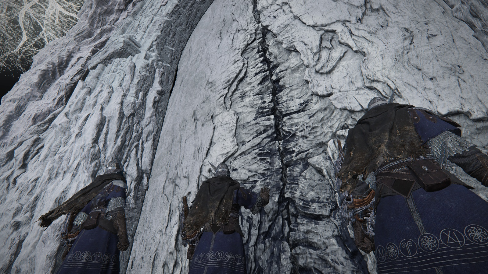
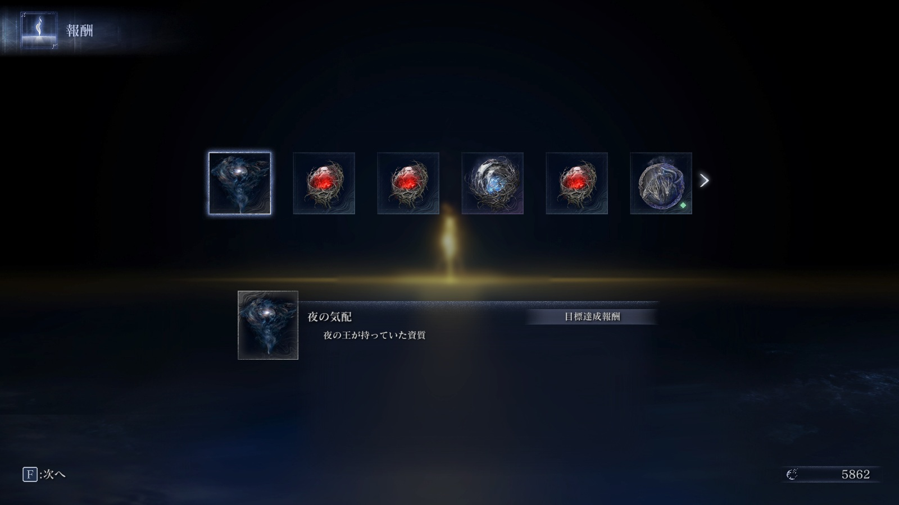
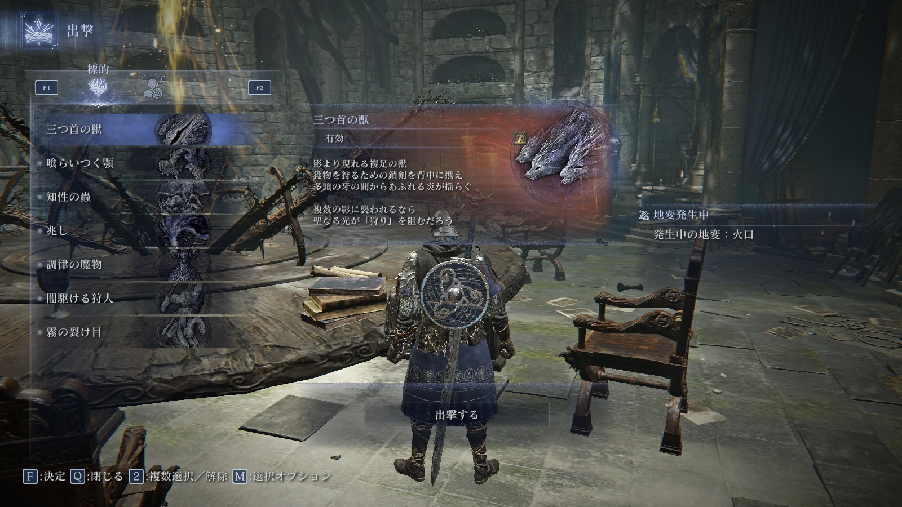

# メタデータ
- title=ELDEN RING NIGHTREIGN BLOG 2: 最初の標的を倒した
- description=2025年5月30日に発売したフロムソフトウェアのELDEN RING NIGHTREIGNをプレイして記録を残していこうと思います。今回は最初の標的である「三つ首の獣」を倒したところまでです。
- date=2025年6月7日（土）
- update=2025年6月7日（土）
- math=false
- tag=nightreign

## はじめに

### 概要

2025年5月30日に発売されたフロムソフトウェアの『ELDEN RING NIGHTREIGN』（以下、ナイトレイン）を初見でプレイしていきます。
今回は最初の標的である「三つ首の獣」を倒したところまでです。

ELDEN RING NIGHTREIGN

### 前回の記事

2025年5月31日の日記です。

https://yusukekato.jp/html/2025/0531.html

ELDEN RING NIGHTREIGN BLOG 1: マルチプレイ初戦

### 公式サイト

下記がナイトレインの公式サイトのリンクです。

https://nightreign.eldenring.jp/index.html

ナイトレインの公式サイト

### 公式のTips
公式がナイトレインのプレイするためのTipsを紹介してくれています。

https://nightreign.eldenring.jp/article/250531_1.html

ナイトレインのTips

### 注意事項

まだナイトレインをプレイしていない方は、ネタバレになってしまうのでご注意ください。

## 本日の闘いの記録

### シングルプレイも試してみる

3人プレイだけかと思っていたのですが、1人でもプレイできるということでやってみました。
気ままに遊べるので良さげではあるかと思います。
しかし、やっぱりボスは3人で戦ったほうが簡単なので、
私はマルチプレイで遊んでいこうと思います。

シングルプレイ

### 地図

地図はこんな感じです。
最初見た時は情報量が多くて何が何やら分からなかったのですが、
慣れてくると少しずつ読めるようになってきます。
降りる場所は毎回ランダムっぽいので、
地図はちゃんと確認できると良さそうです。

地図

### 3日目のボス

三回目のマルチプレイで3日目まで辿り着きました。
3日目はレベルアップと買い物、武器強化以外には他に何もなくて、
いきなりボス戦になります。
知らない人同士のマッチングでも強い人はちらほらいて、
3日目まで結構余裕を持って行けました。
しかし、初見のボスは攻撃パターンを覚えるだけで精一杯でボコボコに負けました。
特に3体に分かれるのがやっかいで、かなり丁寧に戦う必要がありそうです。

3日目のボス

### その後

その後、3日目のボスまでは安定して辿り着けますが、
回復が足りなくて倒し切れない戦いが2～3回続きました。
やはり回復が大事なので教会に積極的に寄って聖杯瓶を集めるとよさそうだと思いました。
また、仲間同士で連携さえ取れたらもっと戦いやすいのになぁ～と思うことも多々あって、
知り合いとプレイするのも楽しそうです。

### ようやく三つ首の獣を倒した

マルチプレイ7～8回目でようやく三つ首の獣を倒しました。
仲間がかなり強かったのもありますが、
ボス戦に慣れて攻撃パターンを見切れたのも大きかったです。
教会に寄って聖杯瓶を7つまで増やしていたのですが、
結局最後の戦いでは聖杯瓶を一つも使わずに勝つことができました。

報酬

### 巫女はレディだった

巫女の正体はレディということが判明して、
新しいキャラクタが増えました。
新キャラは楽しいのでさっそく使ってみたいですね。

レディ

### 新しい標的

三つ首の獣を倒すと新しい標的がたくさん増えました。
チュートリアルは終了でここからが本番という感じがします。
どんどんボスが強くなっていきそうなので、
じっくり倒していきたいですね。

三つ首の獣

次の標的↓

次の標的

## おわりに

ようやく最初の標的を倒せました。
まだまだたくさんボスがいるようですし、
今後アップデートも予定されているようです。
楽しみは続くのでじっくり遊んでいきたいと思います。
それでは、また。