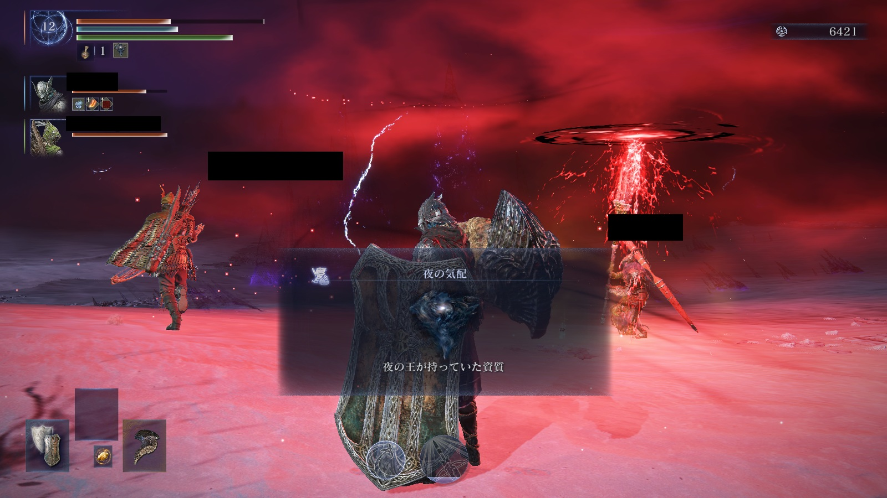
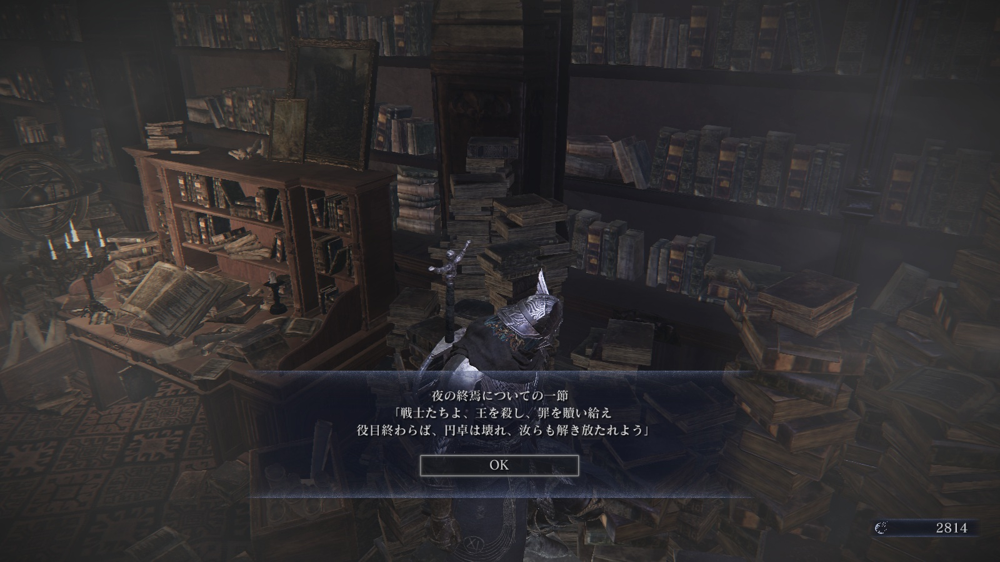
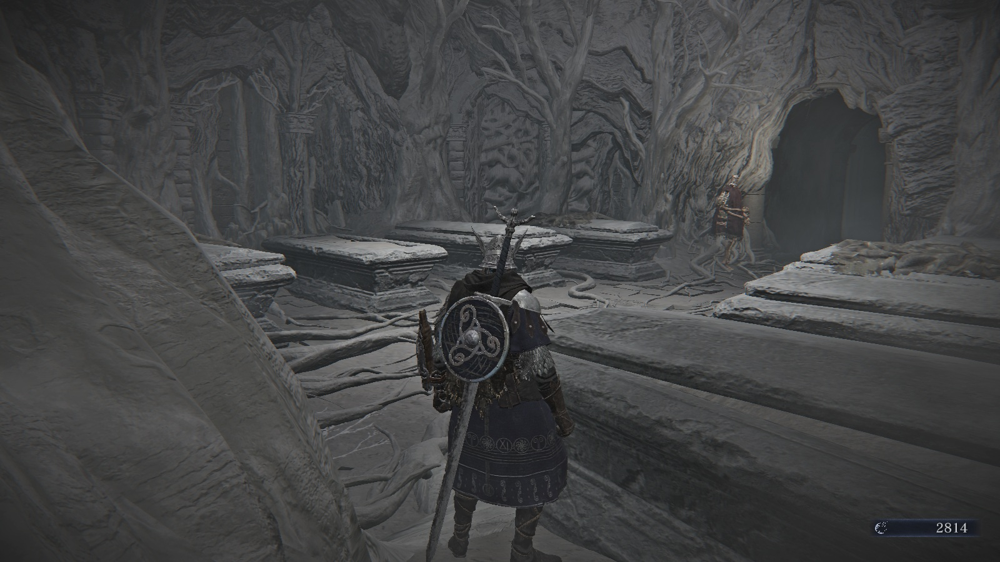
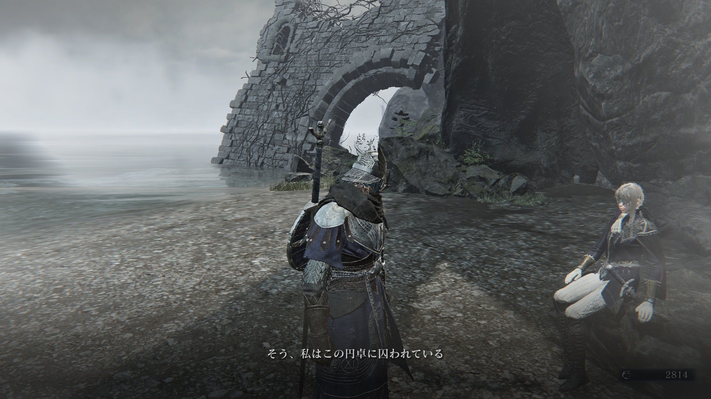
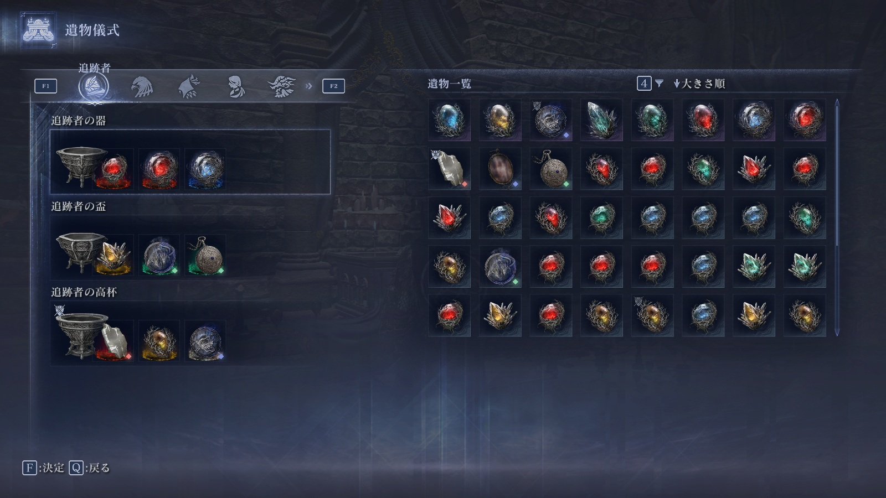

# メタデータ
- title=ELDEN RING NIGHTREIGN BLOG 3: 喰らいつく顎を倒した
- description=2025年5月30日に発売したフロムソフトウェアのELDEN RING NIGHTREIGNをプレイして記録を残していこうと思います。今回は標的の1体「喰らいつく顎」を倒したところまでです。
- date=2025年6月14日（土）
- update=2025年6月14日（土）
- math=false
- tag=nightreign

## はじめに

### 概要

2025年5月30日に発売されたフロムソフトウェアの『ELDEN RING NIGHTREIGN』（以下、ナイトレイン）を初見でプレイしていきます。
今回は標的の1体「喰らいつく顎」を倒したところまでです。

ELDEN RING NIGHTREIGN

### 前回の記事

2025年6月7日の日記です。

https://yusukekato.jp/html/2025/0607.html

ELDEN RING NIGHTREIGN BLOG 2: 最初の標的を倒した

### 公式サイト

下記がナイトレインの公式サイトのリンクです。

https://nightreign.eldenring.jp/index.html

ナイトレインの公式サイト

### 公式のTips

公式がナイトレインのプレイするためのTipsを紹介してくれています。

https://nightreign.eldenring.jp/article/250531_1.html

ナイトレインのTips

### 注意事項

まだナイトレインをプレイしていない方は、ネタバレになってしまうのでご注意ください。

## 本日の闘いの記録

### 次の標的

先週最初の標的である「三つ首の獣」を倒したので、
上から順番で次の標的は「喰らいつく顎」です。
標的がたくさんいるので少しずつ倒していきます。

次の標的

### シングルプレイでお試し

いきなりマルチプレイだと分からないことが多そうだったので、
一旦シングルプレイでお試ししました。
ダークソウルの貪食ドラゴンがボスとして出てきてテンション上がりました。
あとやはりシングルプレイだと難しいですね。

貪食ドラゴン

### 喰らいつく顎を倒した

マルチプレイの1戦目で喰らいつく顎を倒せました。
仲間が強くて率先して聖杯瓶を取りに行ってくれたりしていたので、
かなり余裕を持って倒せました。
武器の引きも良くて火力もかなり出せました。

標的を倒した

報酬↓

報酬

### 衣装変更

衣装変更ができるようになりました。
仲間の装備がデフォルトとは違うなとは思っていたので納得です。
ダークソウルDLCのアルトリウスみたいな装備があってカッコいいです。
いずれ余裕が出てきたら衣装変更したいです。

衣装変更

### 復讐者

絵画の前に幻影がいることをたまたま見つけました。
話しかけると別のフィールドに飛ばされました。

幻影

そこで復讐者と戦いました。
敵が多かったのですが、ゴリ押しで倒し切れました。

復讐者戦

復讐者が新キャラとして使用可能になりました。
今は追跡者ばっかり使っていますが、
いずれ他のキャラも使っていきたいですね。
キャラによっていろいろ戦い方が違うようです。

新キャラ

### 追憶

ジャーナルというシステムで各キャラクターのストーリーが確認できます。
さらにそこから追憶という各キャラごとのイベントも発生しました。
出撃中に「砥石」を拾ってくるイベントがありました。

追憶

追跡者の追憶に挑戦してみました。
追跡者に関する情報や世界の過去についての情報などが入手できました。

戦士たちは夜の王を倒せば円卓から解き放たれるようです。
それはそうだなという感じです。

情報

しかし、夜の始まりを招いた大罪人は末代まで夜が終わるまで円卓に縛られるようです。
そして円卓と共に死にそうな感じがします。

大罪人

### 巫女

ジャーナルや耳飾りのアイテムのテキストを読む限り、
追跡者と巫女は双子っぽいですが、
実際あまりよく分かっていません。
巫女が大罪人なら追跡者も大罪人な気がしますがどうなのでしょうか。

円卓の地下にお墓がありました。
8人くらいが眠りについているようです。
夜の王を倒すためにここに眠っているらしいです。
使用可能キャラも8人ですが関係あるでしょうか。

お墓

巫女は他のキャラよりも先に円卓にいたようです。

巫女

そして円卓に囚われているようです。

巫女

エルデンリングでは円卓は聖域のような存在でしたが、
やはり檻でもあるようです。

巫女

巫女にも話を聞きました。
やはり円卓に囚われているようです。

巫女

そしてやはり巫女が夜がはじまったきっかけの大罪人らしいです。
つまり夜の王を倒しても巫女は円卓から解放されずに消えてしまうっぽい感じがします。

巫女

とりあえず現状の追憶イベントをクリアすると追跡者の高杯がもらえました。
もっとたくさん遺物を装備できるようになりました。
やっておいて損はなさそうです。

## おわりに

今回は標的を一体倒せました。
仲間が強かったのもありますが、
私も少しずつゲームに慣れてきた気がします。
ストーリーのほうもしっかり作りこまれているっぽいので、
楽しんでいけたらと思います。
他のキャラクターのストーリーも追っていきたいですね。
それでは、また。