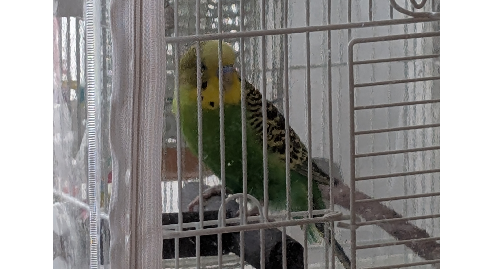
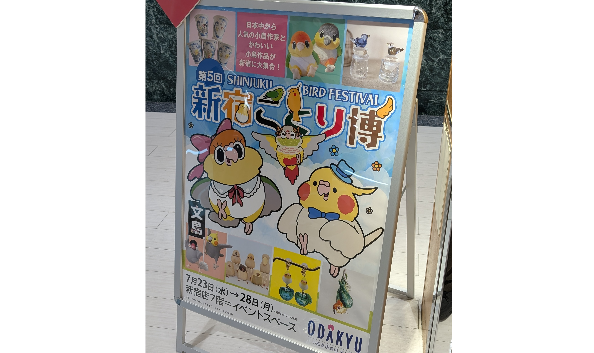

# メタデータ
- title=我が家のインコ「れもん&ぽぽ&ぐぐ&さん」の日記22 : 我が家にさんちゃんがやってきた
- description=2025年7月27日（日）までのセキセイインコ「れもん」とズグロシロハラインコ「ぐぐ」、オカメインコの「さん」の様子を記録しておきます。
- date=2025年7月27日（日）
- update=2025年7月27日（日）
- math=false
- tag=lemon

## はじめに

我が家に新しくオカメインコのさんちゃんがやってきました。
れもんとぐぐも相変わらず元気でかなり賑やかになりました。
今回も我が家のインコたちの記録を残しておきます。

さんちゃん

## 関連記事

### 前回の日記

2025年5月6日の日記です。

https://yusukekato.jp/html/2025/0506.html

我が家のインコ「れもん&ぽぽ&ぐぐ」の日記21 : 2ヶ月ぶりのインコ日記

### 我が家におけるインコの飼育方法

2024年の我が家でのインコの飼育方法をまとめました。

https://yusukekato.jp/html/2024/1025.html

インコの飼い方と注意点（2024年版）

## 注意点
私たちは鳥を初めて飼うため飼育方法に誤りがあるかもしれません。
これからセキセイインコやズグロシロハラインコなどを飼うという方はこのブログの情報を鵜呑みにせず、参考程度に読んでいただけますと幸いです。
いかなる場合でも責任は負えませんのでご了承ください。

## 今週のインコ

### 我が家にさんちゃんがやってきた

さんちゃんが我が家にやってきました。
生後3か月くらいで、れもんやぐぐと比べるとおとなしめで上品な子です。
とはいえ好奇心は旺盛で人間にも積極的に寄り添ってくれます。
まだオスかメスかは分かっていませんが、一応お店ではオスっぽいと教えていただきました。

オカメインコは環境が変わると体重が落ちてしまうことが多いらしく、
さんちゃんもお店では85g程度ありましたが、
我が家に来てからは少しずつ体重が落ちて75g程度になってしまいました。
今は我が家に慣れてきて体重減少は止まったように見えます。
ここから少しずつ体重が増えてくれるように気をつけていきたいです。

さんちゃん

さんちゃんはまだ子供で保温も難しく、ちゃんと飛べないので、
鳥籠ではなくプラスチックケースで過ごしてもらっています。
写真はお昼寝中です。

鳥籠

### 今週のれもん

れもんは放鳥中は写真をあまり撮らせてくれないので、
今回は鳥籠の外からの写真です。
おもちゃで遊んだり、毛づくろいしたり忙しそうです。
ごはんをモリモリ食べています。

鳥籠のれもん

### 今週のぐぐ

ぐぐも変わらず元気そうです。
噛み応えのあるおもちゃを鳥籠内に取り付けてあげたら、
噛む力がどんどん鍛えられて、
人間の指に穴を開ける勢いになってきました。
この調子で元気に過ごしていってほしいですね。

ぐぐ

ぐぐのうんちやおしっこが赤い時があって血が混じっているのかと心配したのですが、
赤色のペレットを食べていると排泄物が赤くなることがあるようです。
試しに現在三日間ほど赤色ペレットをはぶいてぐぐにあげてみているのですが、
今のところぐぐの排泄物は赤くなくなりました。
もう少し続けて血が混じっていないことをちゃんと確認しようと思います。

赤色ペレットをはぶく

### 新宿ことり博に行ってきた

毎年恒例の新宿ことり博に行ってきました。
鳥グッズや鳥たちのおもちゃをいろいろ買って、
あとはさんちゃんの鳥籠や鳥籠カバーを購入しました。
さんちゃんはまだ鳥籠は必要ないのですがいずれ必要になるので、
今のうちに買っておこうという感じです。

鳥に関するグッズがたくさんあってとてもよいイベントだと思います。

新宿ことり博

## おわりに

新しくオカメインコのさんちゃんを我が家に迎えました。
環境の変化で体重は落ちてしまいましたが、
我が家に慣れてきてごはんも食べてくれるようになってきているので、
この調子で元気になってほしいですね。
れもんもぐぐも元気に過ごしてくれています。
人間も鳥たちも元気に過ごせるように祈っています。
それでは、また。