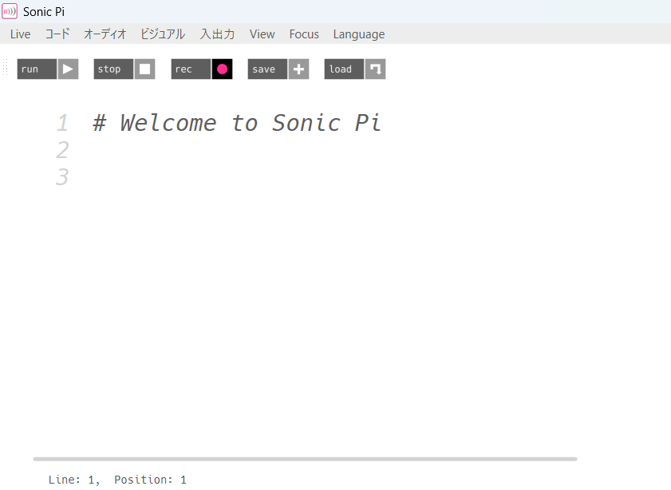
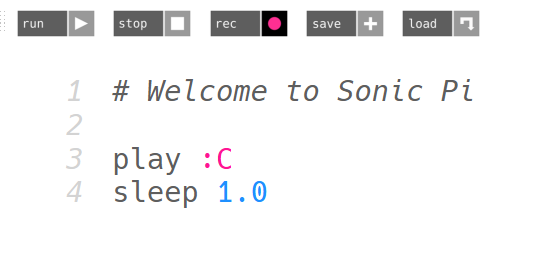

# メタデータ
- title=Sonic Piで作曲してみる
- description=オープンソースの音楽作成ソフトであるSonic Piを使ってみます。
- date=2025年9月20日（土）
- update=2025年9月20日（土）
- math=false
- tag=tech

## はじめに

作曲にチャレンジしてみようと思ってオープンソースの音楽作成ソフトであるSonic Piを触ってみました。
作曲の知識はあまりないのですが、プログラミングで作曲できるということで興味があって始めてみようと思い立ちました。

## インストール

下記リンクが公式サイトで、ここからインストールできます。

https://sonic-pi.net/

Sonic Piの公式サイト

## 環境

私はWindows 11 Homeで試しました。

## Sonic Piの準備

Sonic Piを開くと画面の左上に下図のようにコードを書くエリアがあります。
ここにコードを書いて「run」ボタンを押すと曲が再生されます。
「rec」ボタンを押すと録音して音声ファイルとして曲を保存できます。



コードエリア

また、画面下にチュートリアルを表示できるので、コードの書き方はそこで確認できます。


チュートリアル

ちなみに、公式サイトにもチュートリアルページがあります。

https://sonic-pi.net/tutorial.html

Sonic Piのチュートリアルページ

## Sonic Piで音を出してみる

それではさっそく音を出してみます。

playで単音が出せます。sleepを入れると指定した時間だけその音が出続けます。

たとえば下記のようにコードを書くとCの音（ド）が1秒間出ます。



音を出す

簡単に音を出すことができてとても嬉しいです。

## Sonic Piで作曲してみる

それではチュートリアルを参考にしながら簡単な曲を作成してみます。

下記のようにコードを書きました。

```
use_bpm 68.0  # BPM指定

# ドラム
in_thread do  # threadを分けて音を出す
  loop do
    sample :bd_haus  # サンプル音源を指定
    sleep 0.5
  end
end

# ピアノ
in_thread do
  sleep 4.0  # 4秒後に開始する
  use_synth :piano  # ピアノを指定
  4.times do  # メロディのブロックを4回繰り返す
    # メロディのブロック：ここから
    3.times do
      play 72
      sleep 0.25
      play 76
      sleep 0.25
      play 79
      sleep 0.5
    end
    play 79
    sleep 0.125
    play 76
    sleep 0.125
    play 72
    sleep 0.25
    play 76
    sleep 0.25
    play 72
    sleep 0.25
    # メロディのブロック：ここまで
  end
  # 最後の音
  play 72
  sleep 4.0
end
```

## 解説

基本的にはチュートリアルを読めば知りたいことはすべて知ることができますが、簡単に解説もしておきます。

「use_bpm」を使うと曲のBPMを指定できます。
デフォルトでは60に設定されています。

「loop do」を使うと囲んだブロックを永遠に繰り返すことができます。
繰り返す回数を指定したい時は「times」を使って「8.times」のように書きます（この場合は8回繰り返します）。

「sample」でサンプル音源（音声ファイル）を指定して音を出せます。
デフォルトで用意されている音源はたくさんあっていろいろ試してみるとおもしろいかと思います。

同じように「use_synth」でシンセサイザーの音の種類を指定できます。
シンセサイザーはリアルタイムで生成される電子音です。

「in_thread do」を使うとブロックを分けて音を出せます。
特定のブロックを再生するタイミングを管理できて便利です。

## サンプルの曲を公開

作成した曲を録音してYouTubeに投稿しました。
サンプルとして参考になれば幸いです。

https://www.youtube.com/embed/nG6SjlNf4oc

## おわりに

Sonic Piを触ってみました。
簡単に作曲ができてとても嬉しいです。
作曲の知識がなくてもプログラミングでいい感じに作曲ができます。
これからも作曲欲が沸いた時に使っていきたいと思います。
皆さんもよかったらぜひ触ってみてください。
それでは、また。