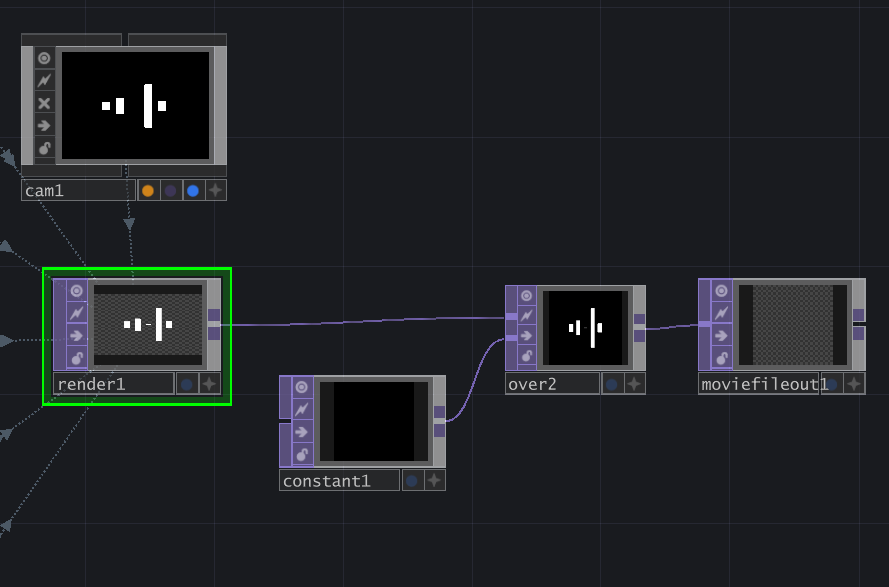

# メタデータ
- title=TouchDesignerを使って曲の音声に合わせた動画を作成してみる
- description=映像やデジタルアート作品を作成できるプログラミングツールであるTouchDesignerを使って曲の音声に合わせた動画を作成してみます
- date=2025年9月21日（日）
- update=2025年9月21日（日）
- math=false
- tag=tech

## はじめに

自分で作った楽曲に動画を付けたかったので、
TouchDesignerを使って曲の音声に合わせた動画を作成してみます。
TouchDesignerは映像やデジタルアート作品を作成できるソフトウェアです。

## インストール

下記リンクが公式サイトで、ここからインストールできます。

https://derivative.ca/

TouchDesignerの公式サイト

## 環境

私はWindows 11 Homeで試しました。

## TouchDesignerの使い方

Touch Designerでは音声や映像などに関するノード（オペレータ）の入出力を繋いで作品を作っていきます。

実際のTouchDesignerでノードを繋いでいる様子が下図です。

TouchDesignerの画面

## ノード（オペレータ）の種類

TouchDesignerの画面上でTABキーを押すとノード（オペレータ）の選択ウィンドウが表示されます。

ノード（オペレータ）のウィンドウ

ノード（オペレータ）の種類は下記です。

- COMP(Component Operators)：コンポーネントとして扱うためのものなど
- TOP(Texture Operators)：画像や映像など（2D）
- CHOP(Channel Operators)：音声など
- SOP(Surface Operators)：立体など（3D）
- DAT(Data Operators)：テキストなど
- MAT(Material Operators)：3Dオブジェクトのマテリアルなど

## 曲の音声に合わせた動画を作成する

自分で作った楽曲の音声に合わせた動画を作成してみます。
下記のYouTubeの動画を参考にさせていただきました。
ありがとうございます。

https://youtu.be/ttwtkcGBa8U

参考動画

### 音声ファイルを入力していい感じの波形にする

まず対象の曲の音声ファイルを入力して波形を作ります。

CHOPのAudio File Inノードを使用して音声ファイルを取得します。
さらにこのノードをAudio Spectrumノードに繋いで周波数ごとに分けた波形を生成します。
しかしこのままだとサンプル数が多いので、
Resampleノードに繋いでサンプル数を減らします（今回は5に設定）。

また作業中に音を聴けたほうが便利なのでAudio Device Outノードにも繋いでPCから音声が流れるようにしています。

音声ファイルを入力

### 周波数ごとに取り出して出力する

次に周波数ごとに波形を取り出して出力できるようにします。

CHOPのTrimノードを使って各周波数のサンプルごとにチャンネルを分けます。
今回はサンプル数を5に設定してチャンネルを5つを分けます。
それをMathノードに繋いでチャンネルを統合します。
lagノードに繋ぐと変化が緩やかになります（なくても大丈夫です）。
最後にnullノードに繋いで出力します（nullノードで出力するのが慣習らしいです）。

周波数ごとに取り出す

### 3Dオブジェクトを作成して波形を反映させる

5つのチャンネルをそれぞれ5つの3Dオブジェクトに対応させます。

CHOPのnullを5つのSOPのBoxノードに繋ぎます。
それぞれのBoxノードのsizeのy軸方向に「op('null1')['chan1']」と入力してnullの出力をそれぞれのチャンネルに対応させます。
x軸方向とz軸方向のsizeは適当に決めます。
また位置も被らないようにそれぞれ適当にずらしておきます。

次にBoxノードをMaterialノードに繋いで色を設定します。
色はMATのConstantノードで設定できます。今回は白色に設定しています。

次にそれぞれを一旦nullに繋いだ後、COMPのGeometryノードに繋ぎます。GeometryのScaleを適当にいじって大きさを調整するとよいです。

最後にTopのRenderノードに5つすべてを繋いで動画を描画します。RenderにはCameraノードが必要なので適当に作成して繋いでおきます。

3Dオブジェクト作成

### 動画をファイルに出力

描画した動画をファイルとして保存します。
その前にOverノードととconstantノードを使用して背景を黒色にしておきます。
最後にMovie File Outノードに繋いで「Record」ボタンを押すと録画してファイルとして保存できます。
動画と一緒に曲の音声も録音したかったので、Movie File OutのCHOPの項目にAudio File Inノードを指定しました。

ファイルとして動画を保存

## 完成した動画

完成した動画はYouTubeで公開しました。
参考になれば幸いです。

https://www.youtube.com/embed/yzqfjK355N8

## おわりに

今回はTouchDesignerを使って自分で作った曲に合わせた動画を作成しました。
直感的に操作して動画を作成できるとてもよいソフトウェアだと思います。
使いこなすためにはまだまだ時間がかかりそうですが、いろいろできそうなのでこれからも使っていきたいと思います。
それでは、また。