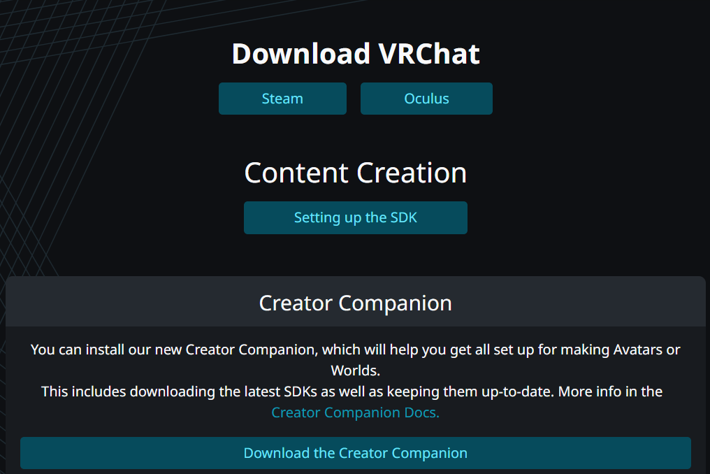
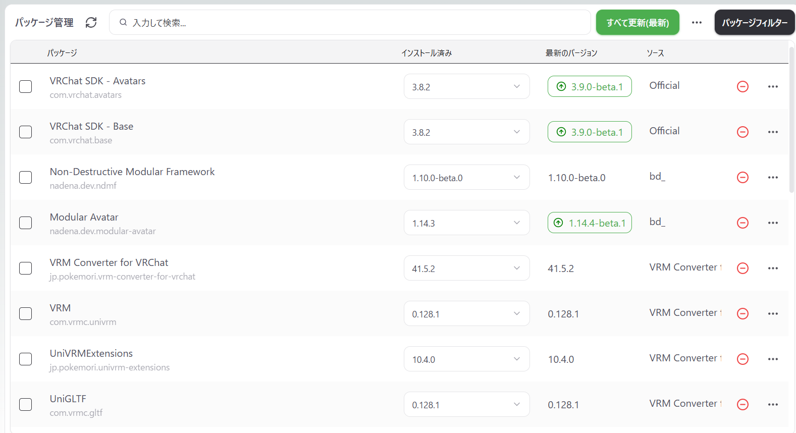
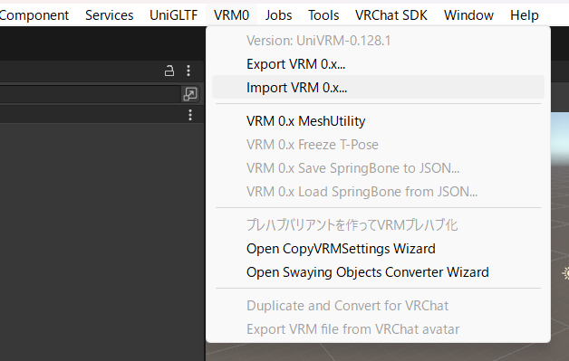
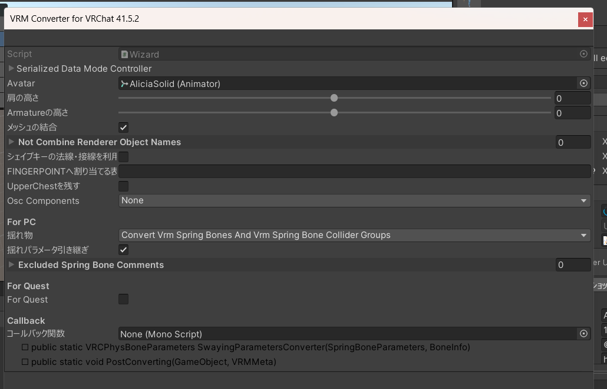
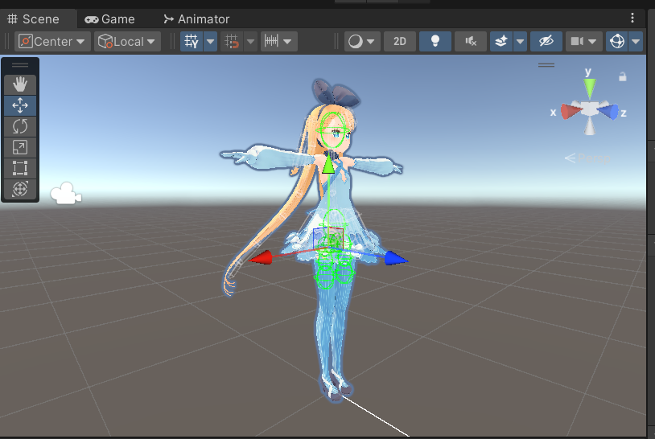
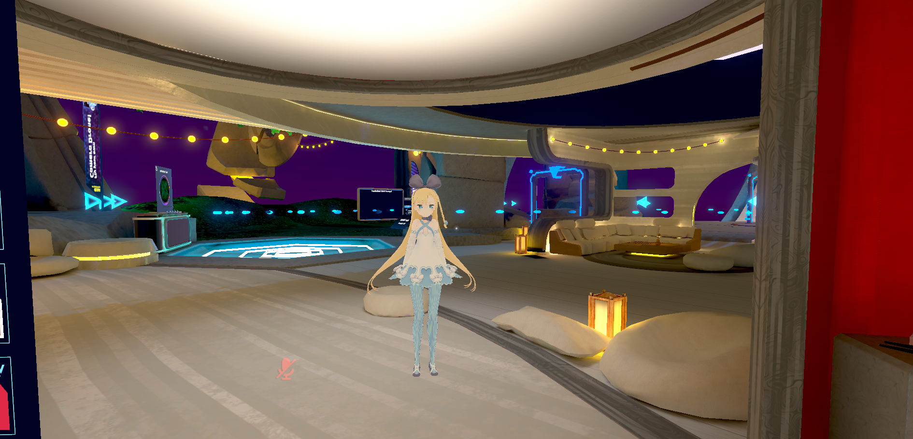

# メタデータ
- title=【VRChat】公開されているVRMモデルをVRChatで動かす
- description=株式会社ドワンゴが配布しているアリシア・ソリッドのVRMモデルをVRChatで動かすまでの手順を紹介します。
- date=2025年9月27日（土）
- update=2025年9月27日（土）
- math=false
- tag=vrchat

## はじめに

最近VRChatを始めました。
自由に使用できる3Dモデルがあるとブログも書きやすいと思って探してみたところ、株式会社ドワンゴから「アリシア・ソリッド（ニコニコ立体ちゃん）」の3Dモデルが配布されていました。
ということで、このブログのVRChat記事ではアリシア・ソリッドの3Dモデルを使わせていただこうと思います。

## アリシア・ソリッド（ニコニコ立体ちゃん）

アリシア・ソリッドの3Dモデルはこちらのサイトから入手できます。
今回はVRMモデルを使用します。
また、モデルをダウンロードするためにはニコニコのアカウントおよびログインが必要です。

https://3d.nicovideo.jp/alicia/

アリシア・ソリッドの配布ページ

## VRChatへのアバターのアップロード方法

この記事ではVRMモデルをVRChatで動かすための手順を説明するため、基本的なアバターのアップロード方法については省略します。
インターネットで検索すればアップロード方法の情報はたくさん出てきますので、そちらを参照していただければと思います。

参考情報としては下記があります。

https://www.moguravr.com/vrchat-introduce-commercial-avatars-explanation/

MoguLive - VRChatで市販のアバターを導入してみよう！ 事前準備からアップロード、「色変え改変」まで解説

## VRChatの準備

先にVRChatへアバターをアップロードするための準備方法を書いておきます。

まず当然のことながらVRChatが起動できることと、VRChatのアカウントが必要です。
私はSteamでVRChatをインストールしています。
VRChatのアカウントは下記の公式サイトで作成できます。

https://hello.vrchat.com/

VRChatの公式サイト

注意事項としてVRChatにアバターをアップロードするためには、アカウントの状態が「new user」以上になっている必要があります。
つまり、VRChatを数時間程度はプレイしてnew userへ昇格しておかなければいけません。
このあたりの情報は検索すればたくさん出てくるので、調べていただけたらと思います。

また、アバターをアップロードするためにはUnityも必要になります。
さらにUnityはバージョンが指定されているため注意が必要です。
Unityの指定バージョンについては下記のVRChat公式情報を確認ください。

https://creators.vrchat.com/sdk/upgrade/current-unity-version/

VRChat公式のUnityバージョン情報

## VCCの準備

VRChatでアバターやワールドをアップロードするためには「VRChat Creator Companion（VCC）」というソフトが必要です。
これはVRChat公式サイトにログインするとダウンロードできます。
VCCをダウンロードしておきましょう。



VCCのダウンロード

ちなみに私はVCCのオープンソースな非公式代替ツールである「ALCOM」を使っています。基本的にはVCCもALCOMも同じことができますが、ALCOMのほうが使いやすいかと思います。

https://vrc-get.anatawa12.com/ja/alcom/

ALCOMのサイト

## VRMモデルをVRChat向けに変換

それでは本題のVRMモデルをVRChatで使う方法を紹介します。

VRMモデルをVRChat向けの形式に変換するために「VRM Converter for VRChat」というリポジトリを使用します。
VRM Converter for VRChatのダウンロード方法は下記のページの情報に従います。

ALCOM（またはVCC）でアバターをアップロードするためのパッケージを作成後、下記のURLを入力してパッケージにVRM Converter for VRChatのVPMリポジトリを追加します。

```
https://esperecyan.github.io/VRMConverterForVRChat/registry.json
```


VPMリポジトリの追加

VPMリポジトリを追加できるとパッケージの管理ページで「VRM Converter for VRChat」を選択してインストールできるようになります。



VRM Converter for VRChatのインストール

次にUntiyプロジェクトを開いたら用意したVRMモデルのファイルをインポートします。
上部のタブにある「VRM0」を選択して「Import VRM 0.x...」をクリックするとインポートできます。



VRMモデルをインポート

VRMモデルをインポートできたら、VRChat向けに形式を変換します。
インポートしたVRMモデル（アセット）を選択してから「VRM0」の「Duplicate and Covert for VRChat」をクリックします。
すると下記の画像のように変換のウィンドウが出てくるので、デフォルトの状態のままボタンを押して実行します。



コンバート画面

変換が完了すると下記の画像のようなウィンドウが表示されます。
これでOKです。


完了画面

Unityのシーンビューを見るとアリシア・ソリッドの3Dモデルが表示されています。



アリシア・ソリッドの3Dモデル

## VRChatへアバターをアップロード

ここまで来たら準備は完了です。
VRChatSDKを使った通常のアバターアップロード方法でVRChatへアバターをアップロードできます。

実際にアップロードしてVRChatで動かしている様子が下記です。



VRChat上のアリシア・ソリッド

以上となります。

## おわりに

今回はVRMモデルをVRChatで動かす方法について紹介しました。
手順としては簡単ですが、そもそもVRChatへアバターをアップロードする方法が複雑なので、そのあたりも含めて整理できて良かったかなと思っています。
他にもVRChatの記事をいくつか書きたいと思っていますので、引き続きよろしくお願いいたします。
それでは、また。