# メタデータ
- title=ELDEN RING BLOG 9: DLCに挑戦した
- description=フロムソフトウェアのELDEN RINGを今更ながら初見プレイして記録を残そうと思います。今回はDLCの世界を進めました。
- date=2025年9月28日（日）
- update=2025年9月28日（日）
- math=false
- tag=elden-ring

## はじめに

### 概要

2022年2月25日に発売されたフロムソフトウェアの『ELDEN RING』（以下、エルデンリング）を今更ながら初見でプレイしています。
しばらく前にDLCに挑戦していて、最後のボスを倒したら記事を書こうと思っていたのですが、そのまま放置をしてしまっていたので、一旦記事を書こうと思います。

ELDEN RING

### 公式サイト

下記が今作の公式サイトのリンクです。

https://www.eldenring.jp/index.html

ELDEN RINGの公式サイト

### 前回の記事

2025年4月15日の日記です。

https://yusukekato.jp/html/2025/0415.html

ELDEN RING BLOG 8: 最後のボスを倒した

### 注意事項

まだELDEN RINGをプレイしていない方は、ネタバレになってしまうのでご注意ください。

## 本日の冒険の記録

### DLCの世界に入る

DLCの世界に入るためにはモーグウィン王朝へ行ってモーグを倒す必要があるということで倒しました。

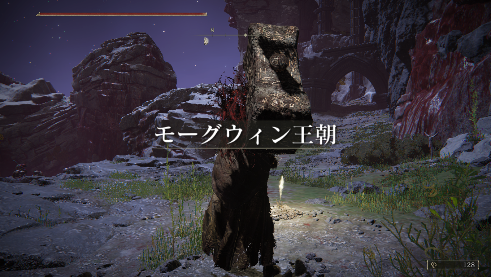

モーグウィン王朝

モーグを倒しました。

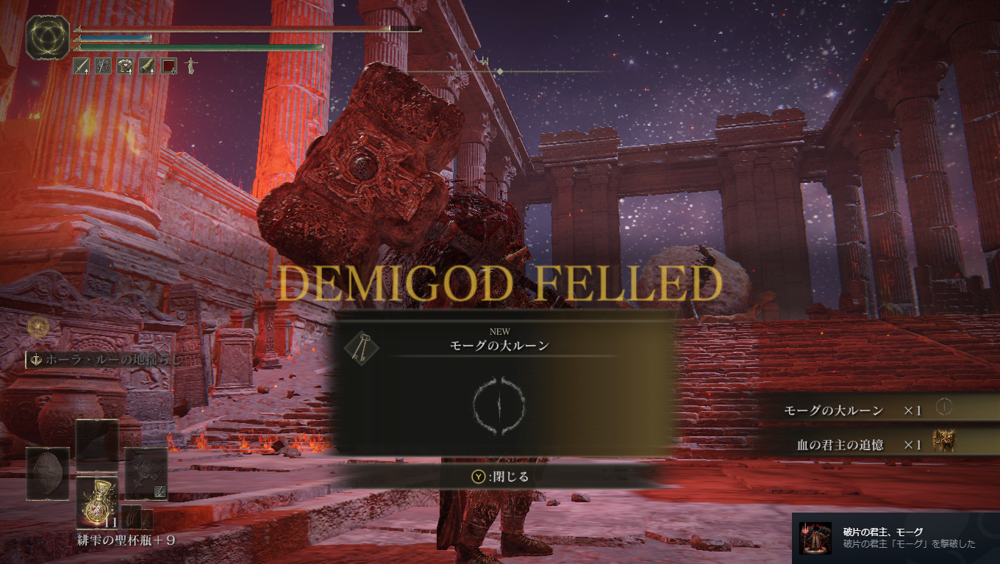

モーグを倒した

この腕がDLCに連れて行ってくれました。
ダークソウルのマヌスと同じシステムです。

DLCに入る

### DLCを探索してボスを倒して回る

DLCに入るとそこそこ大きいフィールドになっていました。
NPCもたくさんいて、ボスもたくさんいました。

DLCに入った

獅子舞のボスを倒しました。弱かったです。

獅子舞

獅子舞みたいだなと思っていたら本当に獅子舞でした。

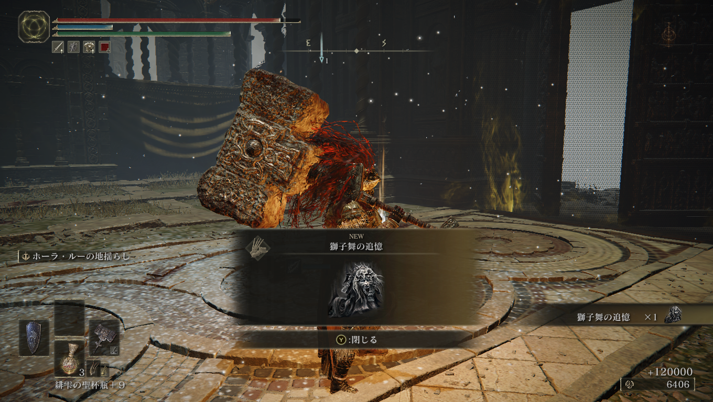

獅子舞

影の王子みたいなやつを倒しました。
NPCのサポートがあってようやく倒せました。
強かったです。

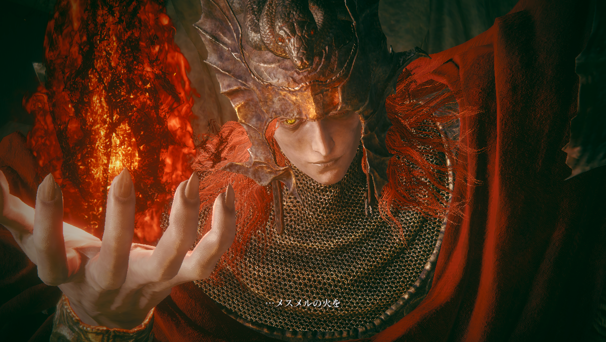

王子

そういえば串刺し公という名前でした。

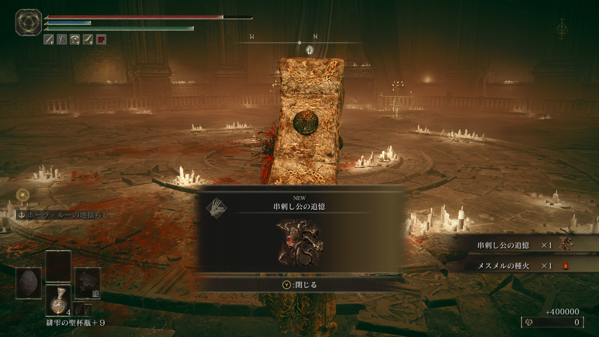

王子を倒した

蜘蛛女みたいなボスを倒しました。弱かった気がします。

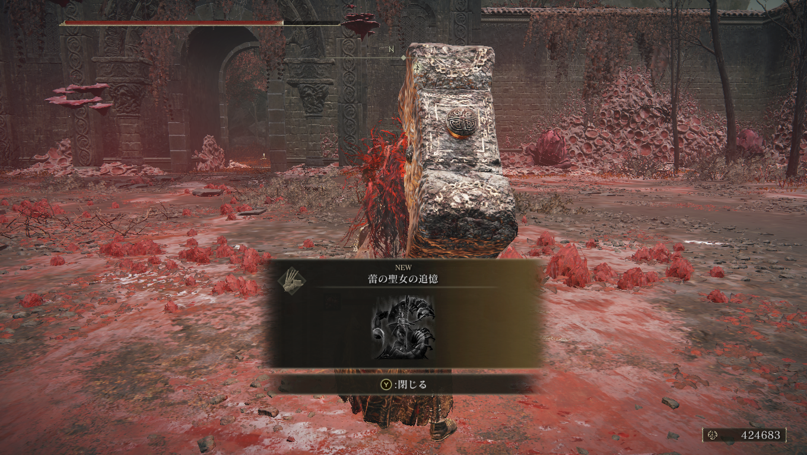

蜘蛛女のボス

意味ありげなNPCがいたのですがイベントは回収できていないです。

NPC

森を進むと頭が狂い火になっている敵がいました。危ないらしいです。

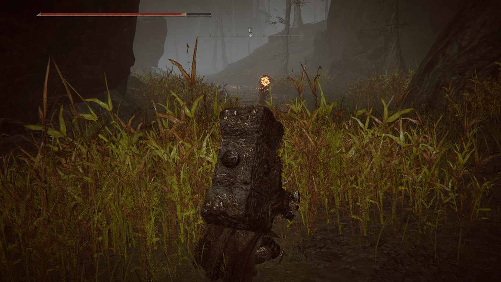

狂い火頭

森の奥には館がありました。狂い火関連のエリアらしいです。

館

館には狂い火のボスがいました。弱かった気がします。

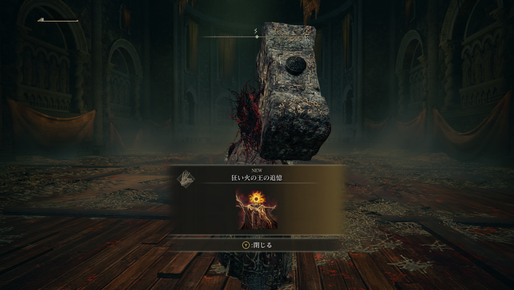

狂い火のボス

あとはツリーガードみたいなボスを倒した気がします。弱かったと思います。

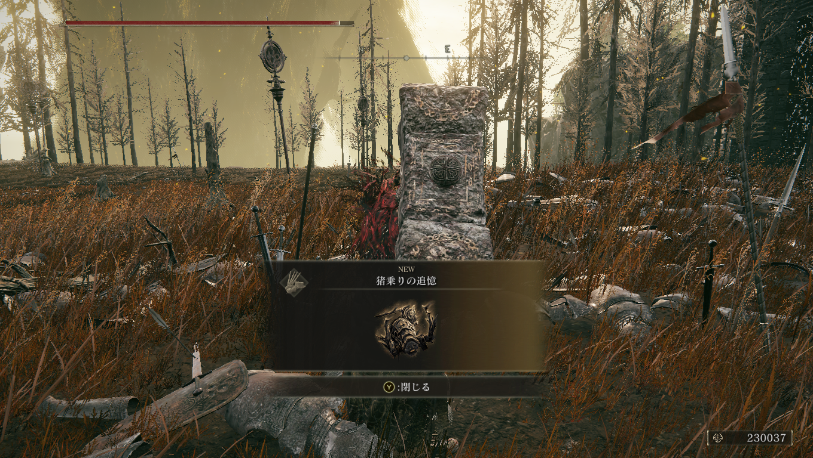

ツリーガードみたいなボス

最終エリアではこれまでのNPCと戦いました。
仲間側のNPCもいました。
火力でゴリ押しでサクッと倒せたと思います。

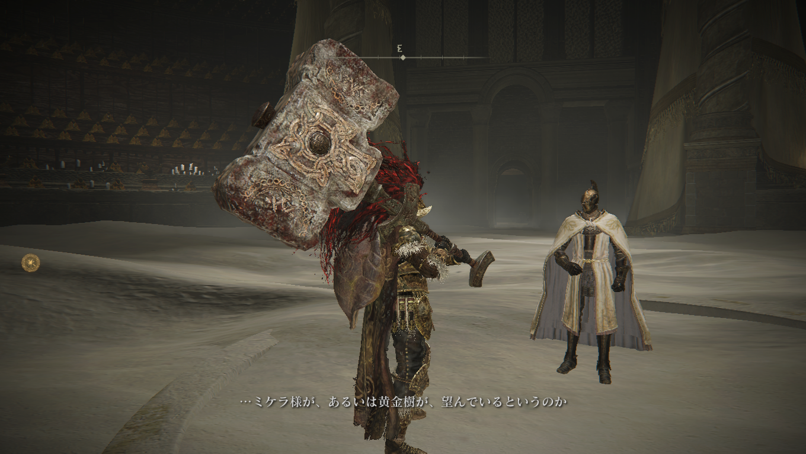

NPCボス

### 最後のボス

DLCにはいろいろNPCやボスがいましたがスクショを撮れていなかったので網羅は全然できていないと思います。

最後のボスはラダーンでした。本編でもかなり苦戦した敵で、このDLCでもまだ倒せていません。めっちゃ強いです。

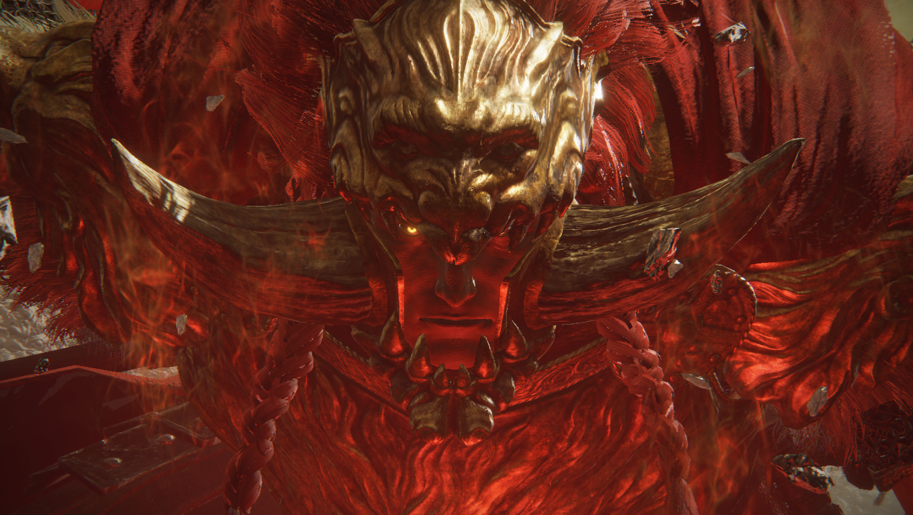

ラダーン

ラダーンの二段階目ではミケラも出てきてハチャメチャに強くなります。
まだ倒せていません。

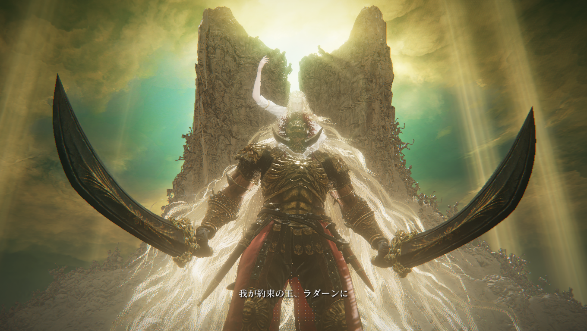

ラダーンとミケラ

DLCのラスボスはいつも強くて歯ごたえがあり過ぎます。

## おわりに

今回はDLCについてまとめました。
DLCのラスボスもいつか倒したいですね。
エルデンリングは完成度も高くてずっとおもしろい最高の作品だと思います。
それでは、また。