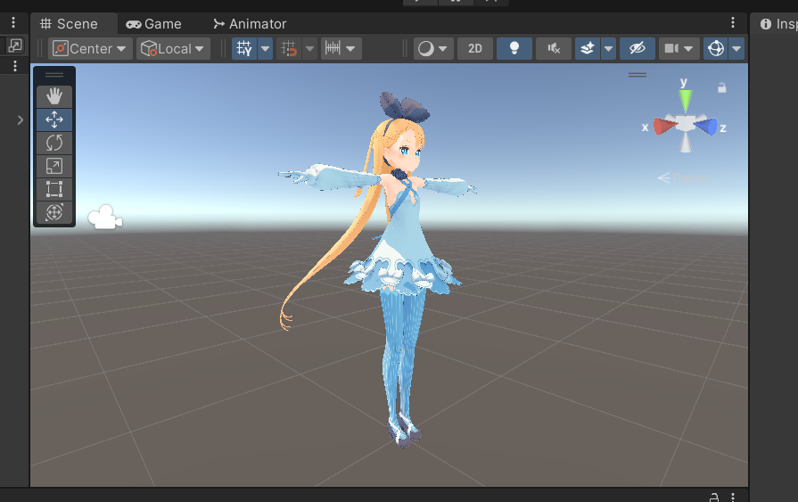
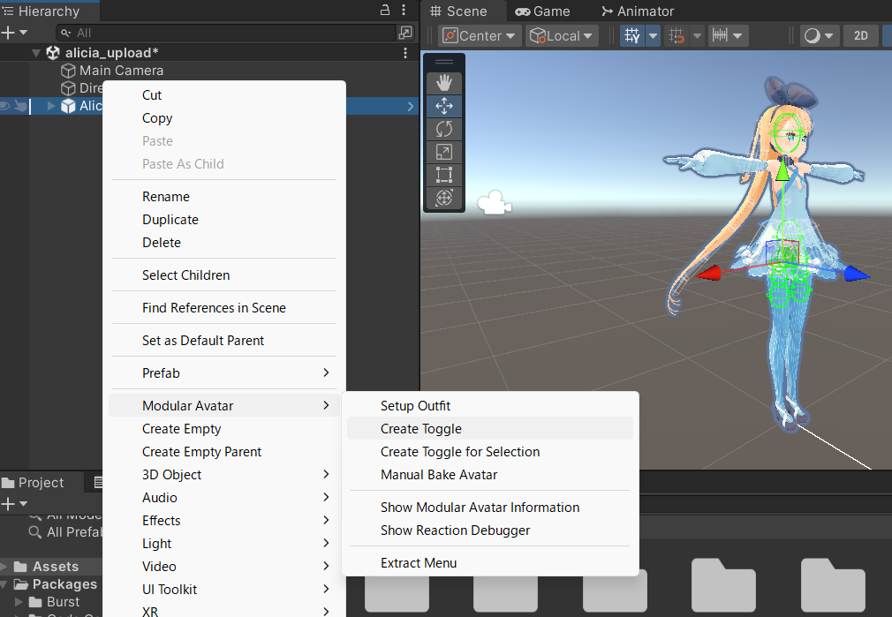
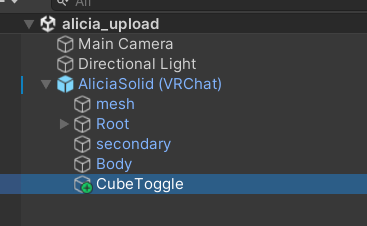
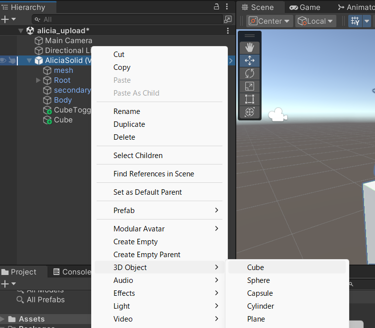
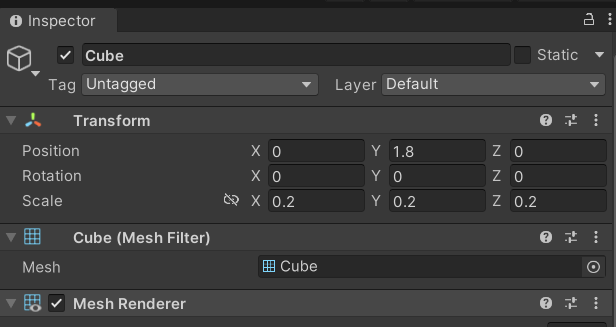
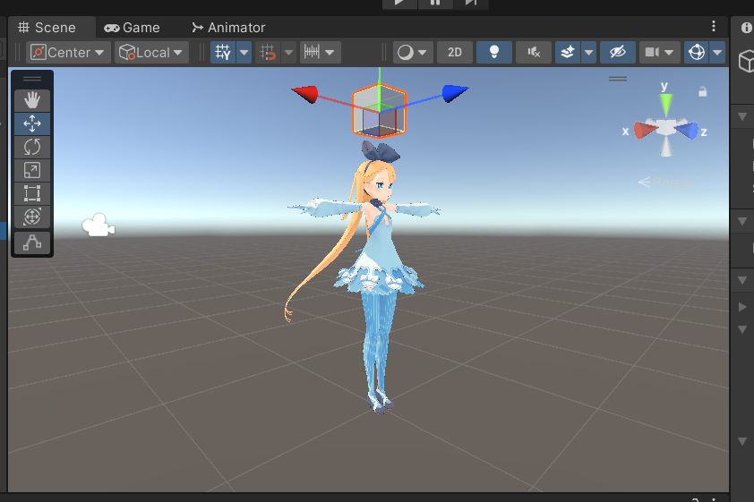
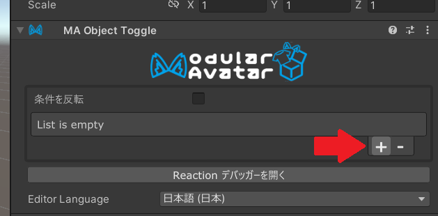
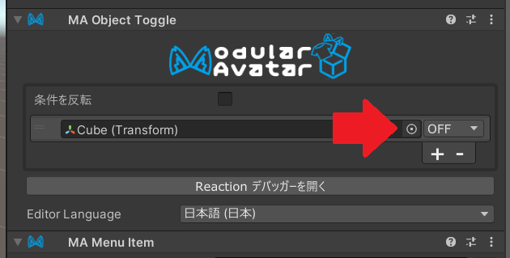
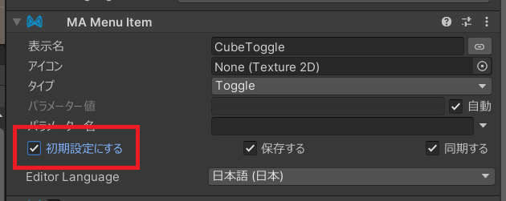
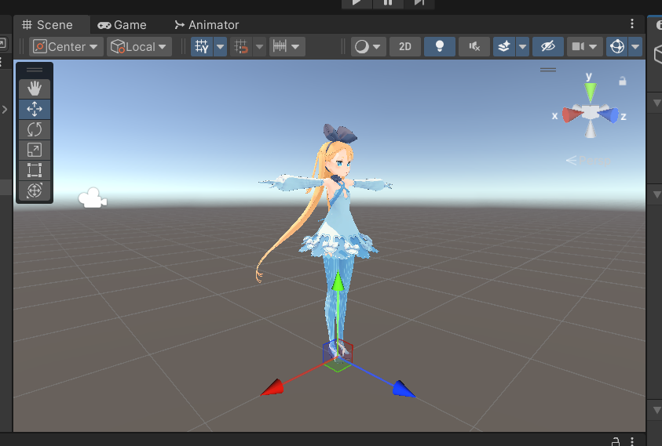

# メタデータ
- title=【VRChat】Modular Avatarを使ってアバターのオブジェクトの表示と非表示を切り替える
- description=VRChatのアバターの改変をしやすくするためのModular Avatarを使ってアバターに取り付けたオブジェクトの表示と非表示を切り替えます。
- date=2025年9月29日（月）
- update=2025年9月29日（月）
- math=false
- tag=vrchat

## はじめに

VRChatで動かすアバターに取り付けたオブジェクトを出したり消したりします（表示と非表示を切り替えます）。
Modular Avatarを使うと簡単にできるので今回はこちらを使用したいと思います。

Cubeのオンオフ

## Modular Avatarについて

Modular AvatarはVRChatのアバターの製作を簡単に行うためのツール（モジュール）の集まりです。
VCC（VRChat Creator Companion）やALCOMでインストールしてUnity上で使用できます。
Modular AvatarではALCOMが推奨されているのでALCOMを使うと良いかと思います。

Modular Avatarのインストール方法や使い方は公式サイトをご参照ください。

https://modular-avatar.nadena.dev/ja/docs/intro

Modular Avatarの公式サイト

## Modular Avatarを使う前の準備

それではModular Avatarを使ってアバターに取り付けたオブジェクトの表示と非表示を切り替えられるように設定していきます。

ちなみにオブジェクトを出したり消したりする方法（トグルする方法）は公式サイトでチュートリアルとして説明がありますので、下記のページを参考に進めていきます。

https://modular-avatar.nadena.dev/ja/docs/tutorials/object_toggle

Modular Avatar - 簡単なON/OFFトグル設定

まずVCCかALCOMでUnityプロジェクトにModular Avatorをインストールされていることを確認してからプロジェクトを開きます。
インストール方法は一つ前の項目（Modular Avatorについて）から公式サイトの説明をご参照ください。

ALCOMのパッケージインストール画面

Unityプロジェクトを開いたら自分のアバターをシーンビューに表示しておきます（ヒエラルキービューにアバターのプレハブを追加する）。

アバターを表示

私は前回の記事で説明したニコニコのアリシア・ソリッドの3Dモデルを使用しています。

https://yusukekato.jp/html/2025/0927.html

公開されているVRMモデルをVRChatで動かす

## Modular Avatarのトグルを作成する

ヒエラルキービューのアバターを右クリックして「Modular Avatar」の「Create Toggle」を選択します。
するとアバターの中に「New Toggle」というオブジェクトが作成されます。

トグルを作成

オブジェクトの名前は何でも良いですが今回はCubeを出したり消したりしようと思うので「CubeToggle」としました。
すでに存在するオブジェクトを出したり消したりする場合は別の名前を付けると良いです。

ちなみに補足としてUnityやその他のプログラミング環境などではファイル名やオブジェクト名などに日本語が入っていると不具合の原因になることがあるため、基本的には英語表記（半角のアルファベッド表記）にしておくと安心です。

CubeToggleに名称変更

## 出したり消したりするオブジェクトを用意する

今回は新しくCubeオブジェクトを作成して出したり消したりしようと思います。
すでにアバターについている服や装飾品などを出したり消したりしたい場合はCubeを作成する必要はありません。

まずアバターで右クリックして「3D Object」の「Cube」を選択します。
するとアバターの中にCubeが作成されます。

Cubeを作成する

次に作成したCubeを選択してインスペクタービューで大きさと位置を変更します。
ScaleはXYZすべて0.2メートルに、PositionはYを1.8メートルにしておきます。
このあたりの数字はご自身のアバターに合わせて調整してください。

大きさと位置を調整

以上で頭の上にCubeが作成できました。
今回はこれを出したり消したりします。

頭の上にCube

## オブジェクトを出したり消したりできるように設定する

ヒエラルキービューのCubeToggleを選択してインスペクタービューのMA Object Toggleのプラスボタンを押します（下記の画像の矢印を参照）。
するとリストが追加されます。

リスト追加

追加されたリストに出したり消したりしたいオブジェクト（私の場合はCube）を選択します。
選択の方法はオブジェクトをヒエラルキービューからドラッグ&ドロップするか、リストの右にある二重丸（◎みたいなマーク、下記の画像の矢印を参照）を押して選択できます。

オブジェクト選択

次に同じくインスペクタービューにあるMA Menu Itemの「初期設定にする」にチェックを入れます。
チェックを入れるとシーンビューのCubeオブジェクトが消えたかと思います。
また、もう一度チェックを外すとまたCubeオブジェクトが現れます。
確認できたらチェックは入れた状態にしてください。

初期設定にする

Cubeオブジェクトが非表示になった↓

非表示の様子

以上で設定は完了です。

## VRChatへアップロード

設定は完了したのでいつも通りVRChatSDKを使ってアバターをアップロードします。

VRChatでRキーを押してメニューを開いて「CubeToggle」をクリックすると、下記のGIF画像のようにCubeオブジェクトの表示と非表示が切り替えられることが確認できます。

Cubeのオンオフ

以上です。

## おわりに

今回はModular Avatarを使ってアバターのオブジェクトを出したり消したりできるように設定してみました。
もちろんUnityとVRChatの標準機能でもできることではあると思いますが、Modular Avatorを使うとかなり簡単に設定できるようになります。
ぜひ皆さまも遊んでみてください。
また、VRChatで他にも試してみたいことがあるのでまた記事を書こうと思っています。引き続きよろしくお願いいたします。
それでは、また。