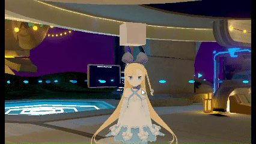
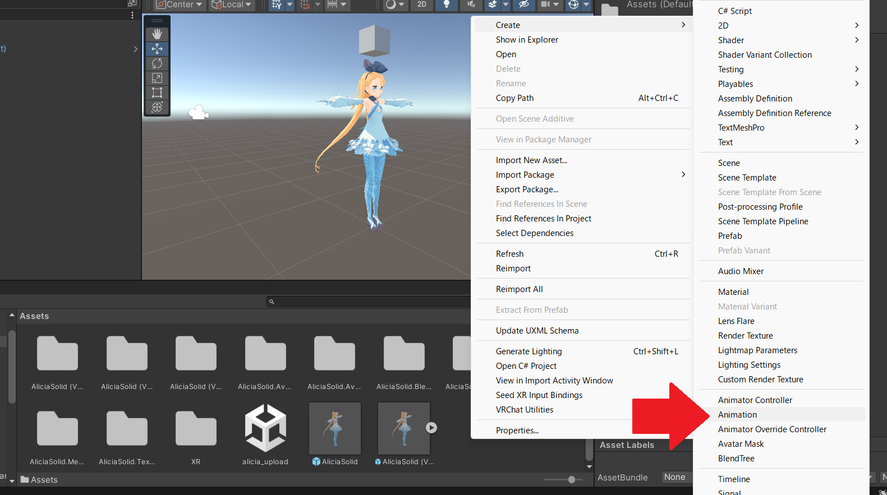
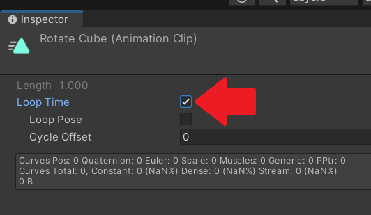
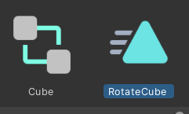
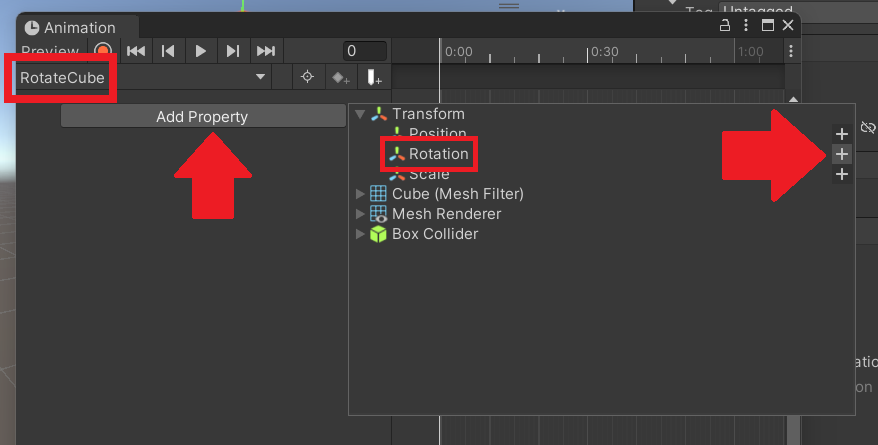
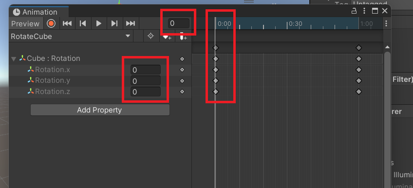
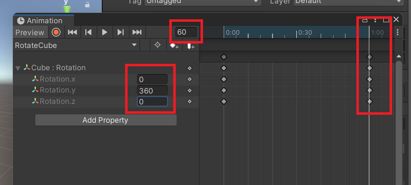
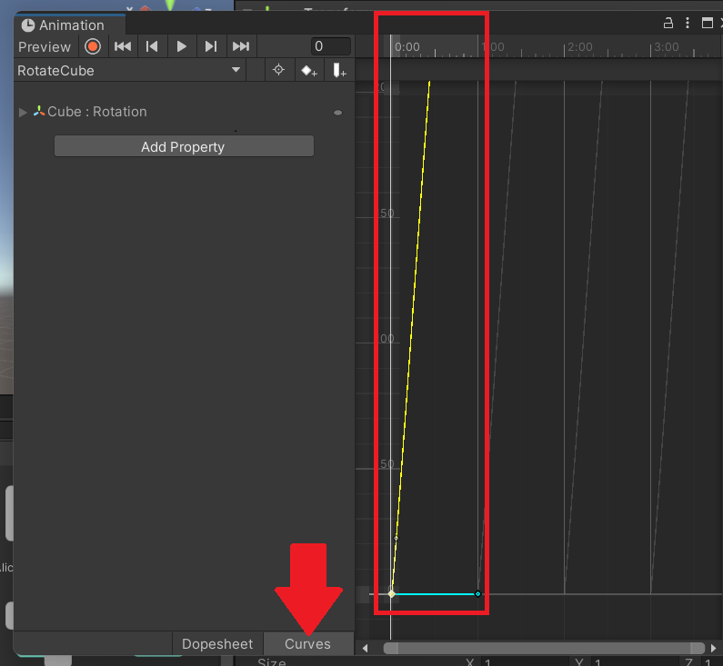

# メタデータ
- title=VRChatのアバターのオブジェクトにアニメーションを設定する
- description=VRChatで動かすアバターのオブジェクトにアニメーションを設定してみます。
- date=2025年9月30日（火）
- update=2025年9月30日（火）
- math=false
- tag=vrchat

## はじめに

今回はVRChatのアバターに取り付けたオブジェクトにアニメーションを設定します。
前回作成したCubeを回転させるアニメーションを作成してみます。

Cubeを回転

## 前回の記事

前回はModular Avatarを使ってオブジェクトの表示と非表示を切り替えました。

https://yusukekato.jp/html/2025/0929.html

【VRChat】Modular Avatarを使ってアバターのオブジェクトの表示と非表示を切り替える

また、アバターはニコニコのアリシア・ソリッドの3Dモデルを使用しています。

https://yusukekato.jp/html/2025/0927.html

公開されているVRMモデルをVRChatで動かす

## アニメーションを作成

プロジェクトのAssetsフォルダ（任意の場所）で右クリックして「Create」から「Animation」を選択してアニメーションを作成します。

アニメーション作成

作成したアニメーションに名前を付けておきます。
何でもよいですが私は「RotateCube」にします。

名前を付けた

RotateCubeアニメーションをクリックしてインスペクター画面で「Loop Time」にチェックを入れておきます。これでアニメーションがループします。

ループ設定

次にRotateCubeアニメーションを自分のアバターにドラッグ＆ドロップして、アニメーションをアタッチします（適応させる）。
この時自動的にCube用のアニメーションコントローラが作成されます。

アニメーションコントローラ

## アニメーションの設定

RotateCubeアニメーションをダブルクリックしてAnimationウィンドウを開きます。
そこで選択中のアニメーションが「RotateCube」になっていることを確認してから、
「Add Property」をクリックして、
Cubeの「Transform」の「Rotation」の「＋」（プラスマーク）をクリックします。
これでCubeを回転（Rotation）させるアニメーションを設定できます。

Rotationを設定

このアニメーションでは0.0秒～1.0秒の間のCubeの回転を設定してループさせます。
「Cube：Rotation」をクリックするとRotation.x、Rotation.y、Rotation.zの値を入力できるので、0.0秒の時と1.0秒の時の回転角度を入力します。

まず0.0秒（0フレーム目）の時はxyzの値はそれぞれ0とします。
つまりCubeの回転角度はすべて0度です。

0秒の回転角度

次に右側のタイムラインの白い線を1.0秒（60フレーム目）に移動させます。
1.0秒の時のRotation.yの値を360度（ちょうど一回転する角度）とします。
この設定によりCubeは1秒間でY軸まわりに一回転します。

1秒の回転角度

デフォルトの状態だと回転速度が等速ではないので、ウィンドウの下にある「Curves」を選択して、デフォルトのカーブを直線に修正します。
カーブの開始地点と終了地点をそれぞれクリックして曲がり具合を調整できます。

カーブを調整

## アニメーションの確認

アニメーションウィンドウで再生ボタン（三角マーク）を押すとアニメーションが再生されます。
Cubeがほぼ等速で回転していることが分かります。

アニメーション再生

## VRChatへアップロード

以上でアニメーション作成は完了したのでいつもの方法でVRChatへアバターをアップロードします。

VRChatでもアバターの頭上でCubeが回転していることが確認できました。

Cubeを回転

おまけとしてCubeの大きさを変えてみるとより回転具合が分かりやすいです。

大きいCubeで回転

以上です。

## おわりに

今回はUnityでアニメーションを作成してVRChatのアバターのオブジェクトに動きをつけてみました。
アニメーションの機能はあまりVRChatとは関係なくUnityの機能ではありますが、
VRChatでも使えるおもしろいギミックだと思うので使いこなしていけたら良いかなと思います。
それでは、また。